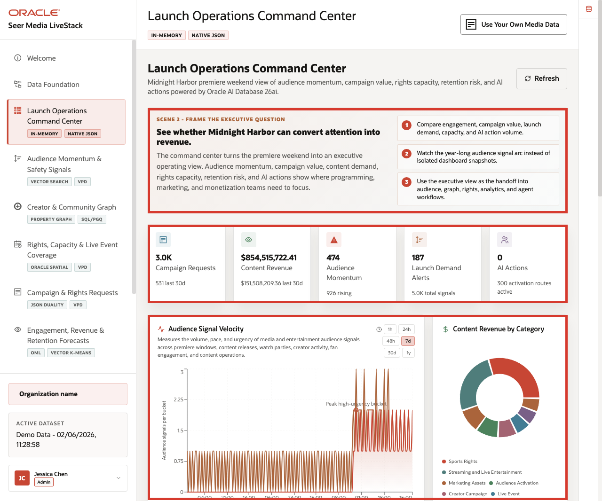
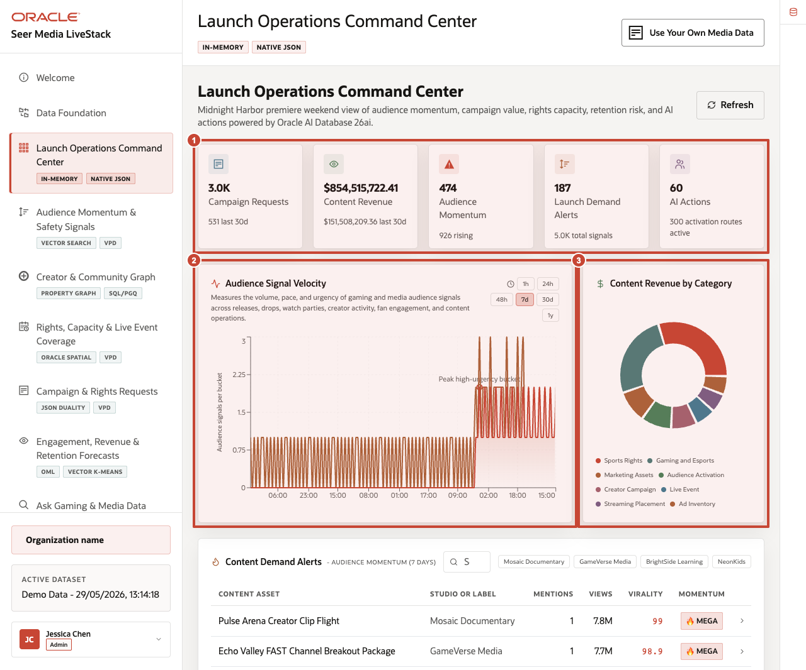
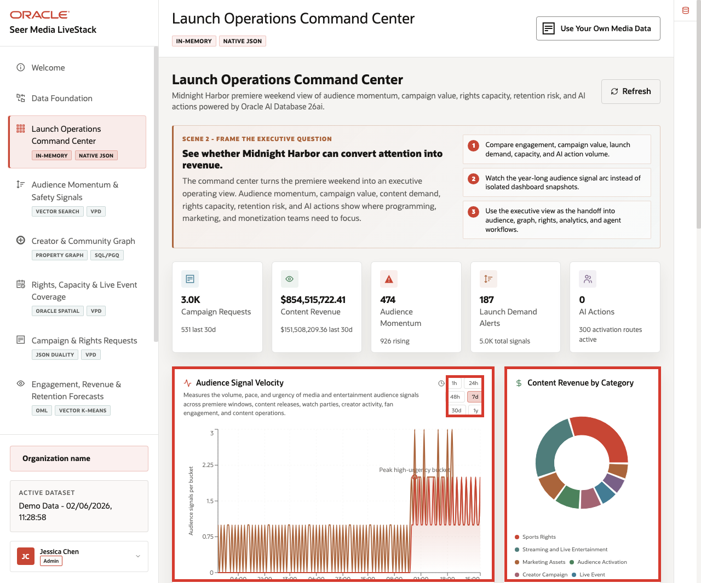
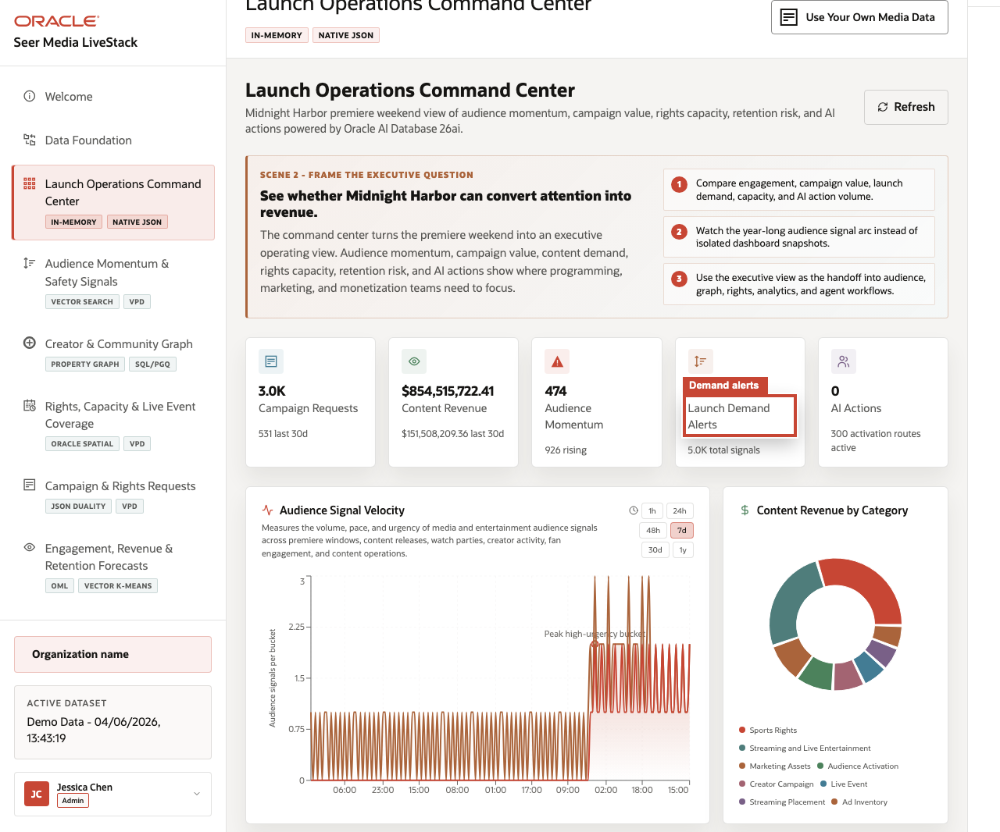

# Scene 3 Launch Operations Command Center

## Introduction

The **Launch Operations Command Center** helps media leaders answer a daily question: *What needs attention right now?*
The page brings together demand, revenue, audience momentum, rights capacity, retention pressure, and AI activity so teams can decide where to investigate first.

Dashboards like this are difficult to implement when content catalogs, audience signals, campaign orders, rights capacity, revenue data, and agent activity live in different systems. Teams often need copied extracts, separate BI models, and reconciliation logic before a dashboard can show a trustworthy view.

Oracle AI Database helps address that challenge by keeping operational, analytical, JSON, in-memory, and AI-ready data close to the same governed data foundation. In this scene, the dashboard brings together live media KPIs, audience signal velocity, content revenue by category, and content demand alerts without sending the user to another application.

Estimated Time: **10 minutes**

### Objectives

In this scene, you will learn what media decision the page supports, what evidence the user should inspect, and what action the business may take next.

## Task 1: Review the command center dashboard

Use the dashboard as a daily triage view. The goal is to identify where audience demand, revenue opportunity, rights pressure, retention risk, or AI activity suggests the business needs attention.

1. Click **Launch Operations Command Center** in the sidebar.
2. Review the KPI cards across the top of the page.
3. Review **Audience Signal Velocity**.
4. Review **Content Revenue by Category**.
5. Review **Content Demand Alerts - Audience Momentum**.

    

In the current seeded dataset, the page shows **3.0K** campaign requests, about **$854.5M** in tracked content revenue, **474** audience momentum signals, **187** launch demand alerts, and the current AI action count. Use those numbers to frame the command center as a triage surface: the user can see demand, value, signal pressure, rights capacity, and AI activity in one place.

**Note:** Sample values may change after data refreshes or rebuilds. Verify live output before presenting, then explain the business takeaway.

## Task 2: Interpret signal velocity and content revenue

Perform the following set of steps to understand where operational importance and risk are moving at the same time. This helps leaders decide which categories may need review, staffing, supply action, or follow-up.

1. Click a signal velocity time range such as **24h**, **48h**, **7d**, or **30d**.
2. Review how the signal chart changes by time bucket.
3. Review the content revenue chart by category.
4. Focus on visible categories such as **Sports Rights**, **Gaming and Esports**, **Marketing Assets**, **Audience Activation**, **Creator Campaign**, **Live Event**, **Streaming Placement**, and **Ad Inventory**.

    

The key business story is that media teams need to know where attention, revenue, and risk are moving together so they can choose the right operating response.

## Task 3: Review content demand alerts

Perform the following set of steps to move from dashboard-level momentum to the specific content asset, campaign, creator, partner, or audience segment that may need action.

1. Scroll to **Content Demand Alerts - Audience Momentum**.
2. Review the content asset, studio or label, mentions, views, virality, and momentum columns.
3. Focus on visible examples such as **Pulse Arena Creator Clip Flight**, **Echo Valley FAST Channel Breakout Package**, **WideAngle Matchday In-Game Purchase Offer**, and **Family Animation Premiere**.
4. Use the row data to connect audience behavior to programming, content recommendation, campaign, or rights-capacity decisions.

    

Use the demand alerts table to move from "audience momentum is rising" to the specific content asset, campaign, creator, or audience segment that requires attention.

*You can move to the next scene.*

## Credits & Build Notes
- **Author** - Oracle LiveLabs Team
- **Last Updated By/Date** - Oracle LiveLabs Team, 2026-05-29
