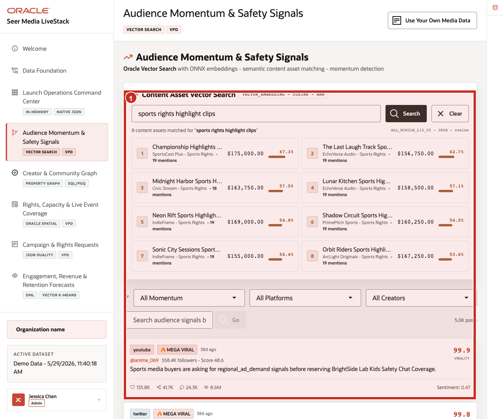
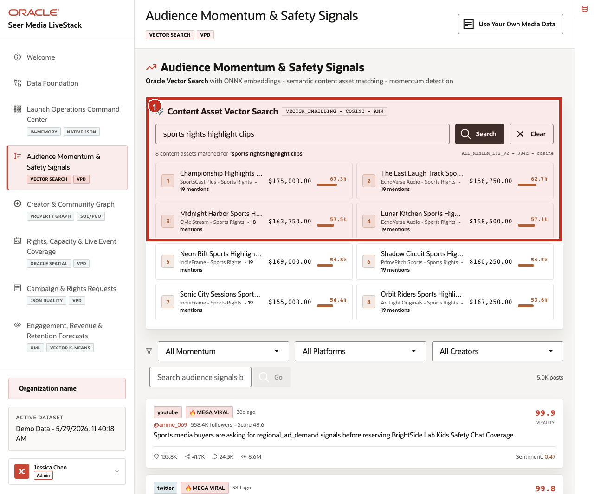
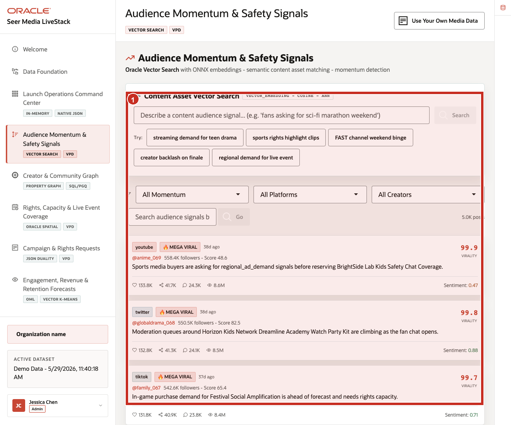

# Scene 4 Audience Momentum & Safety Signals

## Introduction

**Audience Momentum & Safety Signals** helps media teams understand what viewers, subscribers, fans, and players are signaling before demand, churn, or brand risk becomes obvious in campaign orders or viewing metrics alone.

Media teams struggle when audience conversations, creator activity, moderation signals, content catalogs, and recommendation workflows live in separate systems. That separation slows response time and makes it harder to understand what is actually driving audience behavior.

The persona is looking for patterns in watch-time comments, creator posts, moderation queues, social sentiment, churn risk, ARPU signals, content mentions, brand-safety concerns, piracy and leak discussions, spoilers, creator backlash, misinformation, and live-event trust signals.

**Oracle AI Database** helps turn audience conversations into actionable media intelligence while keeping search, governance, and operational context connected.

Estimated Time: **10 minutes**

### Objectives

In this scene, you will learn what audience decision the page supports, what evidence the user should inspect, and what action the business may take next.

## Task 1: Review the signal feed

Perform the following set of steps to understand how audience momentum, engagement, trust and safety concerns, creator activity, and retention signals are summarized for media teams.

1. Click **Audience Momentum & Safety Signals** in the sidebar.
2. Review **Content Asset Vector Search** at the top of the page.
3. Review the example query chips, including **streaming demand for teen drama**, **sports rights highlight clips**, **FAST channel weekend binge**, **creator backlash on finale**, and **regional demand for live event**.
4. Review the audience signal feed below the search area.

    

In the current seeded dataset, the feed contains **5.0K** posts across platforms such as YouTube, Twitter, TikTok, Instagram, and Threads. Visible examples include signals about sports media buyers, moderation queues, in-game purchase demand, ARPU lift, churn risk, creator momentum, watch time, and live-event planning.

**Note:** Sample values may change after data refreshes or rebuilds. Verify live output before presenting, then explain the business takeaway.

## Task 2: Run content asset vector search

Perform the following set of steps to show how media users can search by audience intent rather than exact asset names or metadata.

1. Click the **sports rights highlight clips** example query chip, or enter that phrase in the search field.
2. Click **Search**.
3. Review the matched content assets returned above the signal feed.

    

Use this moment to explain that the search is not simply matching a keyword. The key point is that users can describe what they are looking for in business language and still find related content, campaigns, rights opportunities, or audience segments.

## Task 3: Interpret audience signal cards

Perform the following set of steps to identify audience momentum, trust-and-safety concerns, retention opportunities, creator-impact signals, and campaign actions.

1. Scroll through the audience signal feed.
2. Review platform, virality, author, follower count, signal text, engagement metrics, views, and sentiment.
3. Connect specific signals to likely business actions: content recommendation, retention offer, moderation review, campaign optimization, or rights-capacity check.

    

The business value is that teams can make faster decisions from connected audience evidence. Oracle AI Database provides the foundation that keeps audience signals, content assets, analytics, and AI workflows aligned.

*You can move to the next scene.*

## Credits & Build Notes
- **Author** - Oracle LiveLabs Team
- **Last Updated By/Date** - Oracle LiveLabs Team, 2026-05-29
