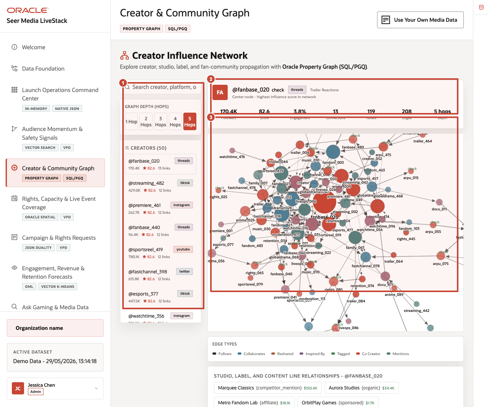
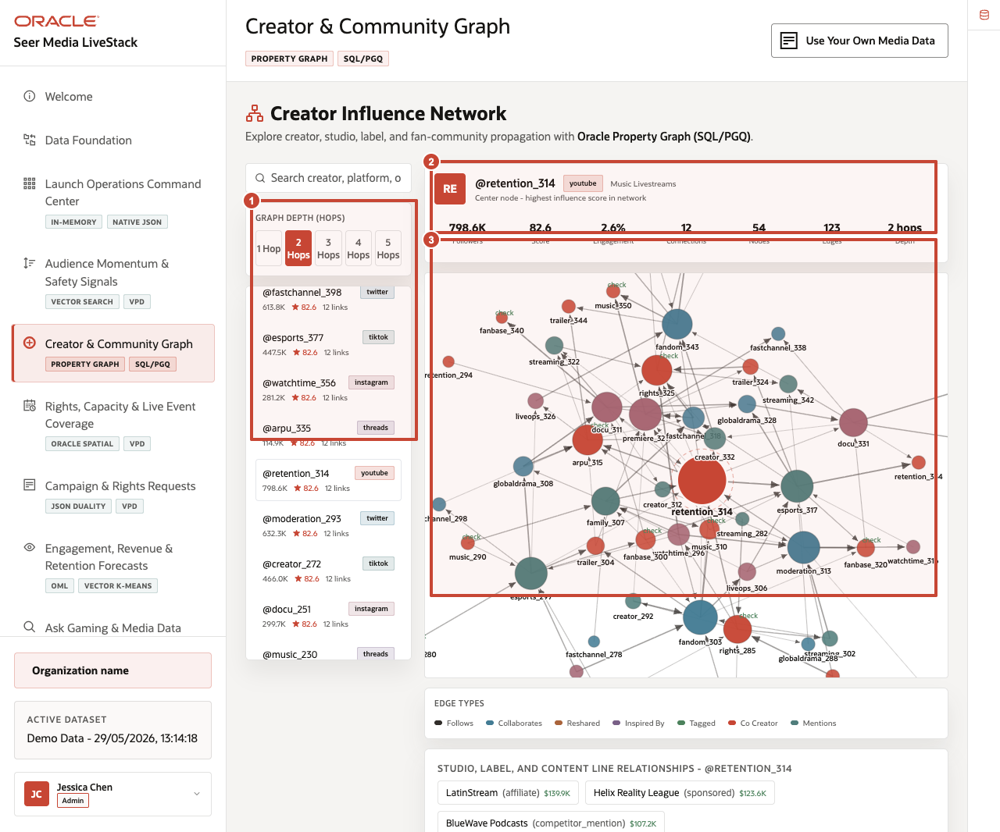
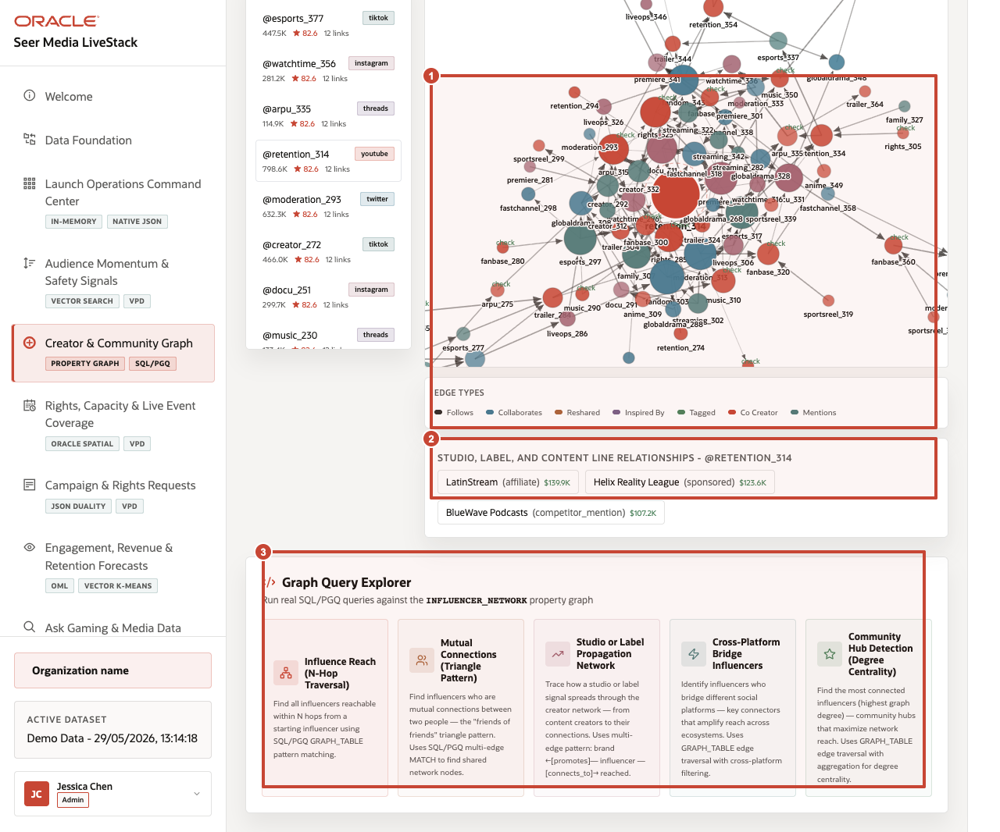

# Scene 5 Creator Influence Network

## Introduction

A creator partnership lead, social programming manager, campaign strategist, or data architect uses this page to understand media relationships that are hard to see in isolated rows. The persona needs to reason across creators, fan communities, studios, labels, platforms, content assets, reposts, collaborations, mentions, and campaign influence paths.

This is difficult when relationship analysis requires data movement into a separate graph database or offline notebook. Media users may know there is a creator or community opportunity, but they need to see how influence connects to content propagation, creator partnerships, and audience reach without losing governance.

Oracle AI Database helps address these challenges by supporting graph analysis over the operational media schema. In this scene, the application exposes creator and community relationships while the implementation reference explains the Oracle Property Graph and SQL/PGQ pattern behind the view.

Estimated Time: 10 minutes

### Objectives

In this scene, you will:
- Review the **Creator & Community Graph** workspace.
- Inspect graph depth controls and the creator node list.
- Focus on a concrete creator-influence example.
- Explain how graph relationships help identify connected audience reach.
- Connect the user-facing graph to Oracle Property Graph and SQL/PGQ.

## Task 1: Review the graph workspace

1. Click **Creator & Community Graph** in the sidebar.
2. Review the graph depth controls: **1 Hop**, **2 Hops**, **3 Hops**, **4 Hops**, and **5 Hops**.
3. Review the creator list and influence metrics.
4. Review the selected creator summary and graph canvas.

    

Callout 1 highlights the search, graph-depth controls, and creator list. Callout 2 highlights the selected creator metrics. Callout 3 highlights the rendered creator relationship graph.

In the current seeded dataset, the page shows **50** visible creators in the list. Visible examples include **@fanbase_020**, **@streaming_482**, **@premiere_461**, **@fanbase_440**, **@sportsreel_419**, and **@fastchannel_398**. The selected creator **@fanbase_020** has about **170.4K** followers, an influence score around **82.6**, **13** connections, and a connected creator neighborhood.

## Task 2: Explore a creator-network example

1. Select a creator such as **@retention_314**.
2. Review the platform, niche, follower count, influence score, engagement, and connection count.
3. Change graph depth from **1 Hop** to **2 Hops** or **3 Hops**.
4. Review how the visible neighborhood changes as the relationship scope expands.

    

Callout 1 highlights the selected **@retention_314** creator row and hop control. Callout 2 highlights the selected creator metrics. Callout 3 highlights the recalculated creator network for that selection.

Use this example to explain why graph context matters. A creator, platform, studio, label, fan community, and content campaign are more informative together than as independent records. The graph view helps the operator see influence as connected evidence.

## Task 3: Explain the Oracle graph pattern

1. Scroll to **Graph Query Explorer**.
2. Review the edge-type legend, graph query area, and SQL/PGQ reference.
3. Explain that the graph is an analysis view over governed media data rather than a disconnected copy.

    

Callout 1 highlights relationship evidence and edge context for the selected creator. Callout 2 highlights studio, label, and content-line relationship evidence. Callout 3 highlights the SQL/PGQ query templates in **Graph Query Explorer**.

The value of Oracle AI Database is that media teams can ask relationship-aware questions inside the same governed platform that stores the operational data. That reduces data movement and keeps the graph story connected to the rest of the demo.

You can move to the next scene.

## Credits & Build Notes
- **Author** - Oracle LiveLabs Team
- **Last Updated By/Date** - Oracle LiveLabs Team, 2026-05-29
