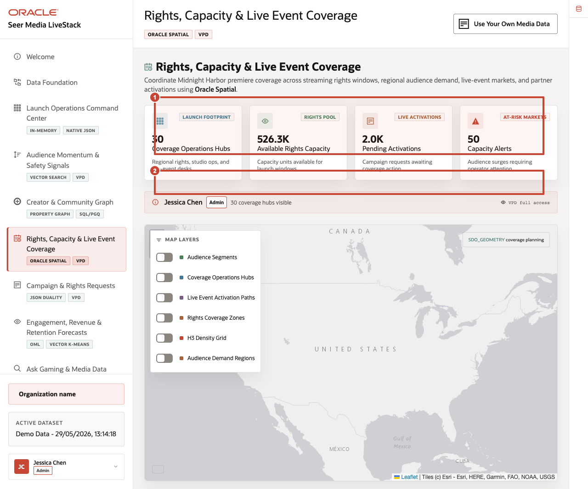
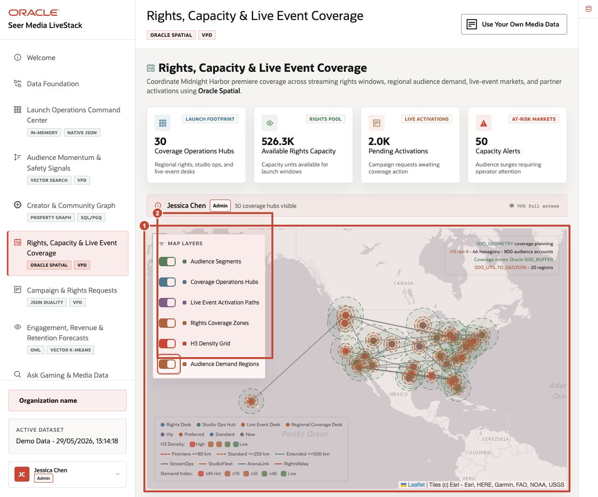
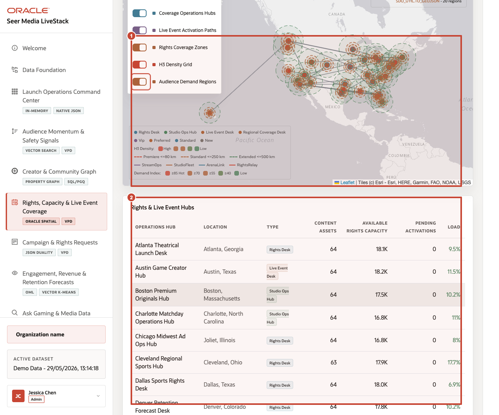
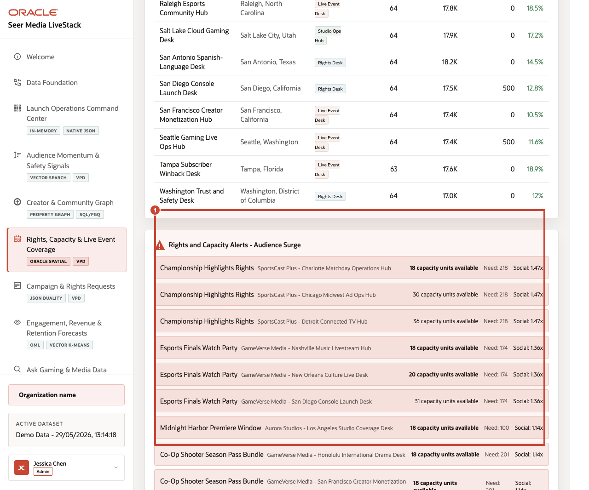

# Scene 6 Rights and Distribution Coverage

## Introduction

A rights operations manager, live-event coordinator, streaming distribution lead, regional programming planner, or capacity analyst uses this page to understand where audience demand, content rights, partner activations, and coverage capacity intersect. This persona needs a geographic operating view, not just a list of content assets or campaign orders.

Location-aware media decisions are difficult when rights windows, coverage desks, live-event hubs, audience regions, routing paths, density grids, and access policies live outside the operational data platform. Teams may export to a GIS tool, but then lose the connection to current campaign requests, rights capacity, VPD policy, and operational status.

Oracle AI Database helps address these challenges by keeping spatial geometry and operating records together. In this scene, Oracle Spatial powers coverage hubs, rights zones, activation paths, H3 density grids, and demand regions in the same application that manages the rest of the media data.

Estimated Time: 10 minutes

### Objectives

In this scene, you will:
- Review the **Rights, Capacity & Live Event Coverage** page as a geographic operating view.
- Interpret the launch footprint, rights pool, live activations, and at-risk market cards.
- Toggle map layers for audience segments, coverage hubs, activation paths, rights zones, density, and demand regions.
- Compare map evidence with the rights and live event hub table.
- Explain how Oracle Spatial supports location-aware media decisions.

## Task 1: Review coverage priorities

1. Click **Rights, Capacity & Live Event Coverage** in the sidebar.
2. Review the stat cards across the top of the page.
3. Review the active user and VPD banner.
4. Connect the cards to the Midnight Harbor launch weekend story.

    

Callout 1 highlights the coverage, rights-capacity, activation, and market-risk cards. Callout 2 highlights the VPD-aware operating context for the current media user.

In the current seeded dataset, the page shows **30** coverage operations hubs visible to the current user, about **526.3K** available rights capacity units, **2.0K** pending activations, and **50** at-risk markets. Use these numbers to explain how rights operations, live-event readiness, and audience demand can be reviewed in one place.

## Task 2: Toggle spatial layers

1. Review the map and its layer controls.
2. Toggle **Audience Segments**.
3. Toggle **Coverage Operations Hubs** and **Live Event Activation Paths**.
4. Toggle **Rights Coverage Zones**, **H3 Density Grid**, and **Audience Demand Regions**.
5. Review how the map changes as layers are added or removed.

    

Callout 1 highlights the spatial map and active layers. Callout 2 highlights the layer controls used to switch between audience, coverage, rights, density, and demand views.

The layer controls make the same map useful for different questions. A regional programmer may start with audience demand regions. A rights manager may compare rights coverage zones and at-risk markets. A live-event coordinator may focus on coverage hubs and activation paths.

## Task 3: Compare hub data with the map

1. Scroll to **Rights & Live Event Hubs**.
2. Review columns for operations hub, location, type, content assets, available rights capacity, pending activations, and load.
3. Focus on visible hubs such as **Atlanta Theatrical Launch Desk**, **Austin Game Creator Hub**, **Boston Premium Originals Hub**, **Charlotte Matchday Operations Hub**, and **Chicago Midwest Ad Ops Hub**.
4. Use the table to connect map markers to concrete operating records.

    

## Task 4: Review rights and capacity alerts

1. Scroll to **Rights and Capacity Alerts - Audience Surge**.
2. Review the content asset, studio or label, coverage hub, available capacity, required capacity, and social multiplier.
3. Use examples such as **Championship Highlights Rights** or **Esports Finals Watch Party** to discuss how demand can exceed available rights or activation capacity.

    

The value of Oracle AI Database is that location intelligence is not detached from the operational data. Oracle Spatial can support rights coverage, proximity, and regional demand analysis while the application still shows capacity, pending activations, alerts, and VPD-aware access from the same data foundation.

You can move to the next scene.

## Credits & Build Notes
- **Author** - Oracle LiveLabs Team
- **Last Updated By/Date** - Oracle LiveLabs Team, 2026-05-29
