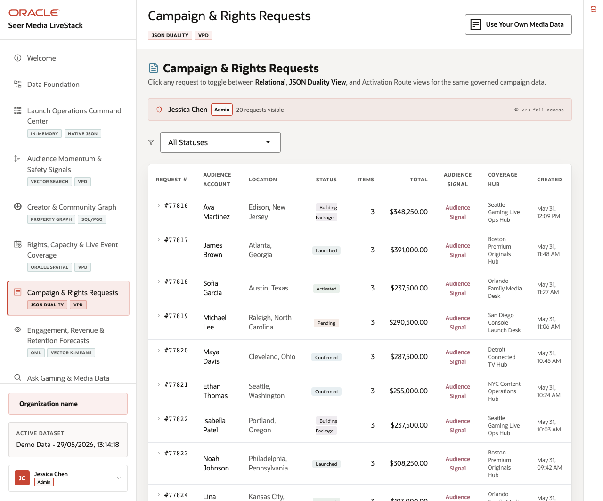
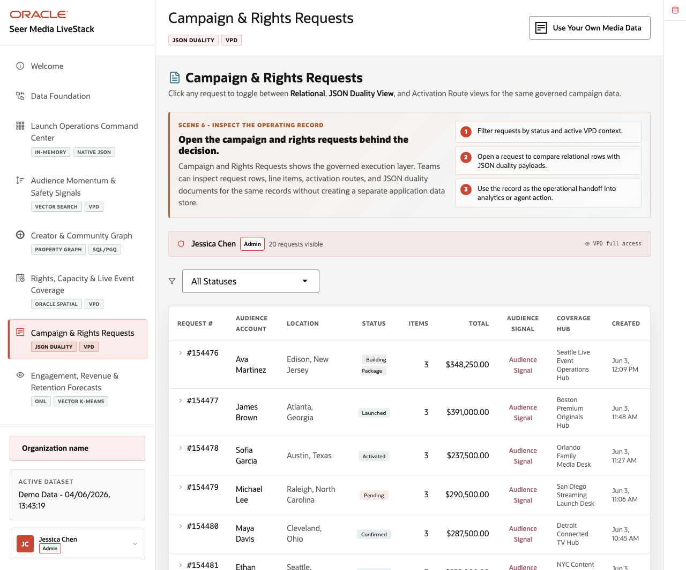
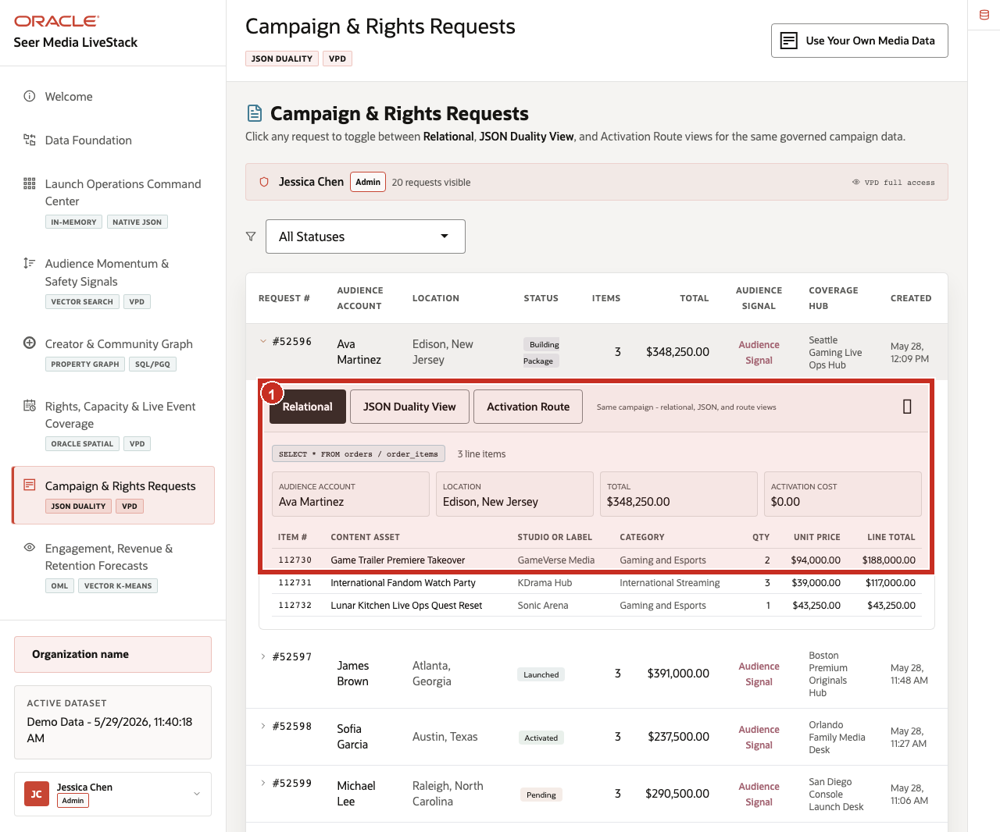
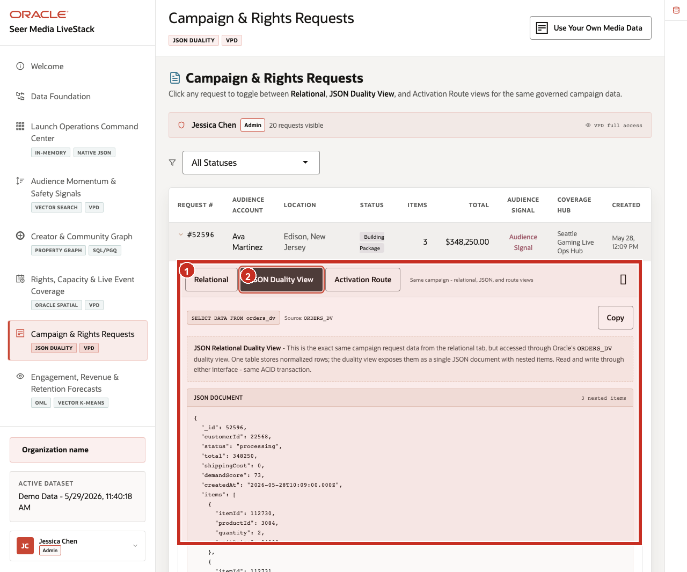
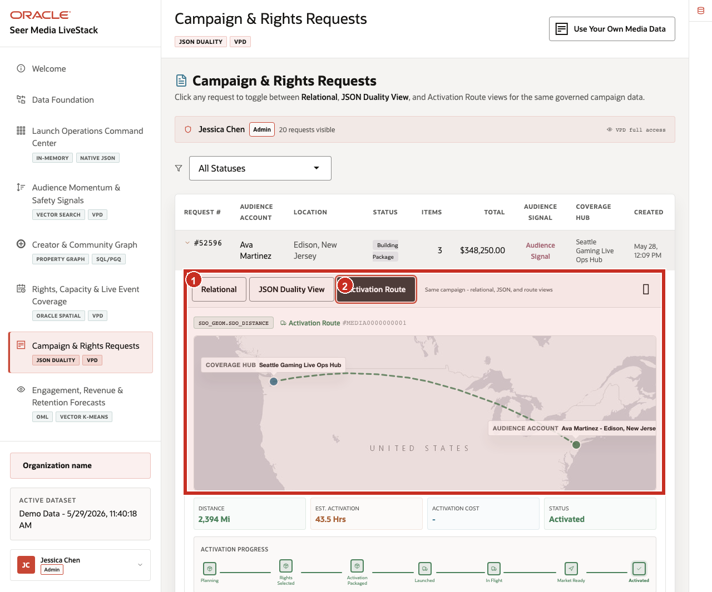

# Scene 7 Campaign & Rights Requests

## Introduction

**Campaign & Rights Requests** shows how one governed campaign request can support several workflows at once. Operations teams need request and fulfillment detail, rights teams need activation context, application teams need document-shaped access, and coverage teams need geographic activation visibility. The persona needs a reliable operational list, relational line-item detail, API-friendly JSON document access, and spatial activation context.

Media teams struggle when the information needed for one decision lives in separate tools. That separation slows response time, increases reconciliation effort, and makes it harder to trust the result. Each copy creates synchronization risk and extra engineering work when the request model changes.

**Oracle AI Database** helps keep the same governed campaign request available to operations users, application developers, activation teams, and analysts without creating separate copies of the record. Relational tables provide transactional detail. JSON Relational Duality Views expose the same request as a nested JSON document. Oracle Spatial adds activation route and distance context.

Estimated Time: **10 minutes**

### Objectives

In this scene, you will learn what operational decision the page supports, what evidence the user should inspect, and what action the business may take next.

## Task 1: Review the campaign request workspace

Perform the following set of steps to establish the operational context: who requested activation, what status the request is in, what value is involved, and which coverage hub is responsible.

1. Click **Campaign & Rights Requests** in the sidebar.
2. Review the active user banner. The current demo user is **Jessica Chen**, with 8*Admin*8 access and **20** visible requests on the page.
3. Review the status filter.
4. Review the request table columns: request id, audience account, location, status, line items, total, audience signal, coverage hub, and created time.
5. Focus on request **#77816**.

    

**Notes:**
- **Callout 1** highlights the governed user and VPD access banner.
- **Callout 2** highlights the status filter used to narrow the operations queue. 
- **Callout 3** highlights the request row that will be inspected through the rest of the scene.

In the current seeded dataset, request **#77816** is for **Ava Martinez** in **Edison, New Jersey**. It is in **Building Package** status, has **3** line items, totals **$348,250.00**, and uses **Seattle Gaming Live Ops Hub** as the coverage hub. This request will be the data point used through the rest of the scene.

**Note:** Sample values may change after data refreshes or rebuilds. Verify live output before presenting, then explain the business takeaway.

## Task 2: Inspect the relational request detail

Perform the following set of steps to validate the campaign request header, content assets, activation cost, audience account, and operational status needed for fulfillment and support workflows.

1. Click request **#77816**.

    

2. Confirm the **Relational** tab is selected.
3. Review audience account, location, total, activation cost, and line items.
4. Review content assets such as **Game Trailer Premiere Takeover**, **International Fandom Watch Party**, and **Lunar Kitchen Live Ops Quest Reset**.

This view helps operations teams answer campaign, activation, and support questions quickly because request, audience, content, and fulfillment details remain connected and easy to validate.

## Task 3: Compare the JSON Duality View

Perform the following set of steps to show how the same campaign request can support both operational workflows and application or partner integrations without creating duplicate records.

1. Click **JSON Duality View** in the expanded request panel.

    

2. Review the source label **ORDERS_DV**.
3. Review the JSON document for request **77816**.
4. Notice that the document contains `_id`, `customerId`, `status`, `total`, `demandScore`, `createdAt`, and nested `items`.

**Notes:**
- **Callout 1** highlights the **JSON Duality View** selection.
- **Callout 2** highlights the `ORDERS_DV` source query.
- **Callout 3** highlights the document-shaped JSON view of the same campaign request.

The key point is that the campaign request is not copied into a separate document store. The same governed request can appear as operational detail for business users or as a document shape for applications.

## Task 4: Review activation route context

Perform the following set of steps to connect the campaign request to the coverage hub, audience location, activation effort, timing, and operational status.

1. Click **Activation Route** in the expanded request panel.

    
2. Review the coverage hub and audience account.
3. Review distance, estimated activation time, activation cost, route status, and activation progress.
4. Review the Oracle Spatial SQL example.

**Notes:**
- **Callout 1** highlights the route map from the coverage hub to the audience account.
- **Callout 2** highlights the activation status and progress indicators.
- **Callout 3** highlights the Oracle Spatial SQL used to calculate distance from governed location data.

For request **#77816**, the page shows an activation route from **Seattle Gaming Live Ops Hub** to **Ava Martinez - Edison, New Jersey**. The route distance is about **2,394 miles** and the estimated activation time is about **43.5 hours**. The page explains that Oracle Spatial calculates distance between governed `SDO_GEOMETRY` points.

**Note:** Sample values may change after data refreshes or rebuilds. Verify live output before presenting, then explain the business takeaway.

The workflow value is that one governed campaign request can support operations, applications, rights workflows, and activation planning without splitting the story across separate systems.

*You can move to the next scene.*

## Credits & Build Notes
- **Author** - Oracle LiveLabs Team
- **Last Updated By/Date** - Oracle LiveLabs Team, 2026-05-29
