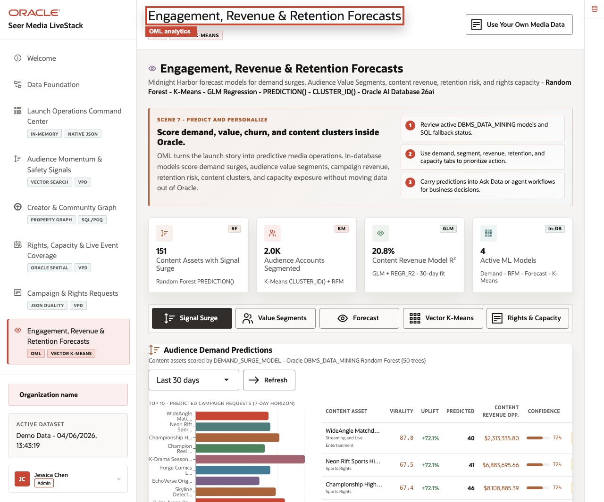
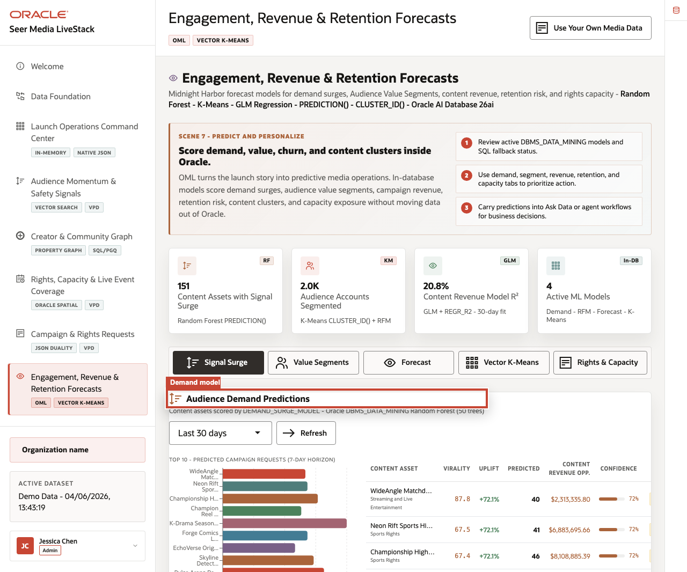
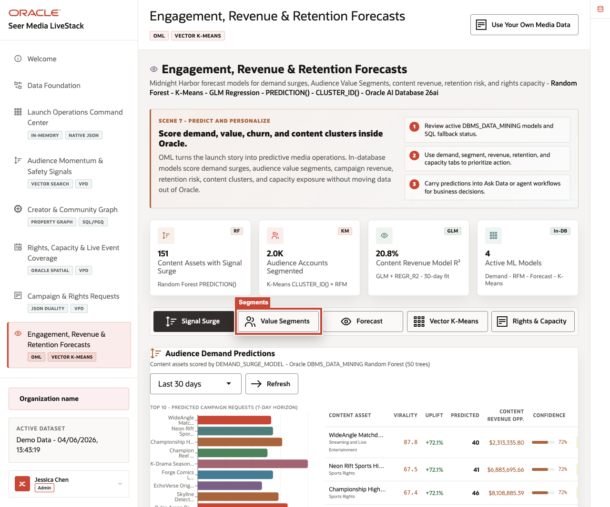
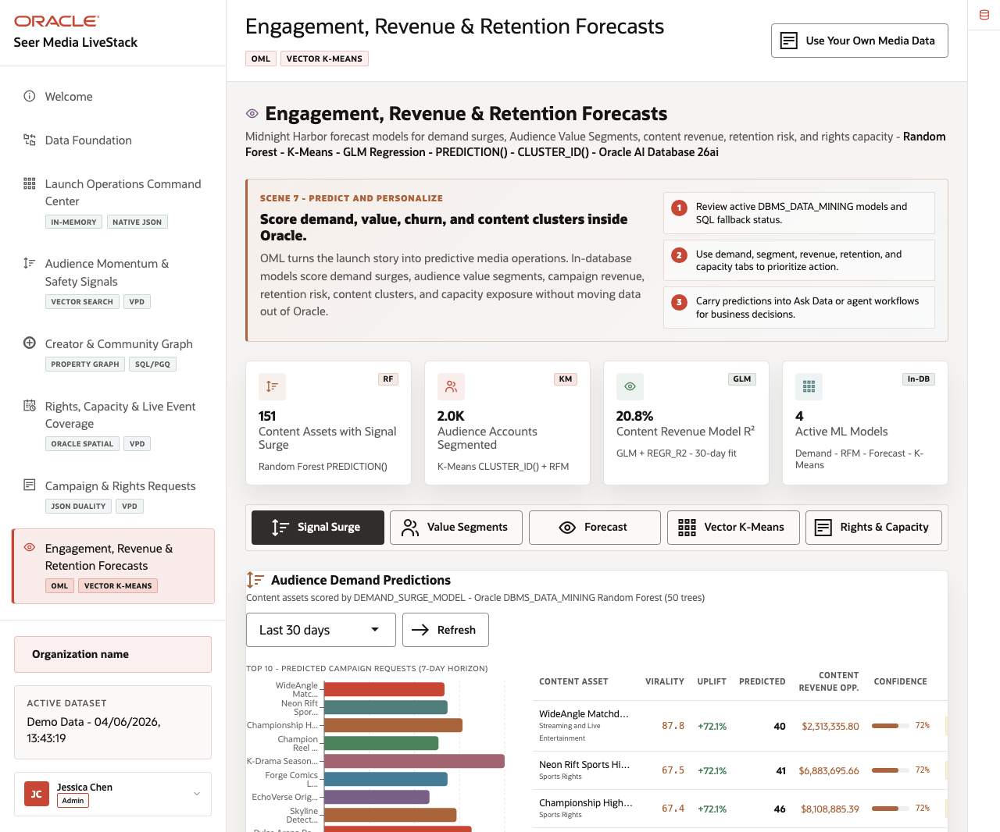
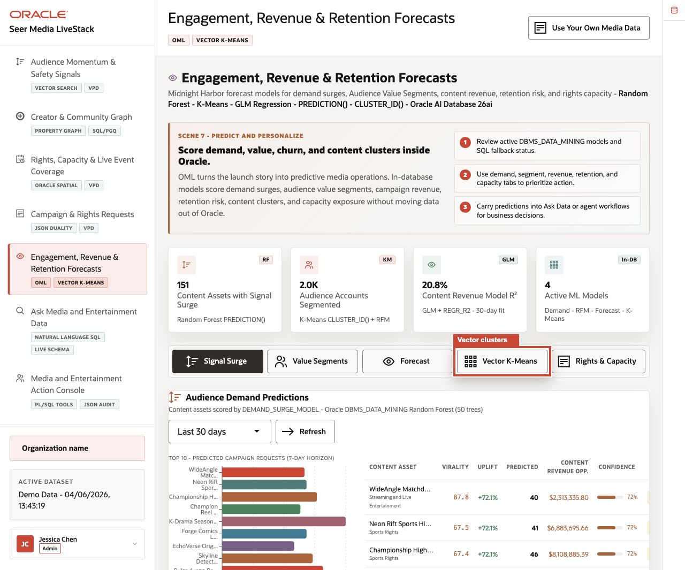
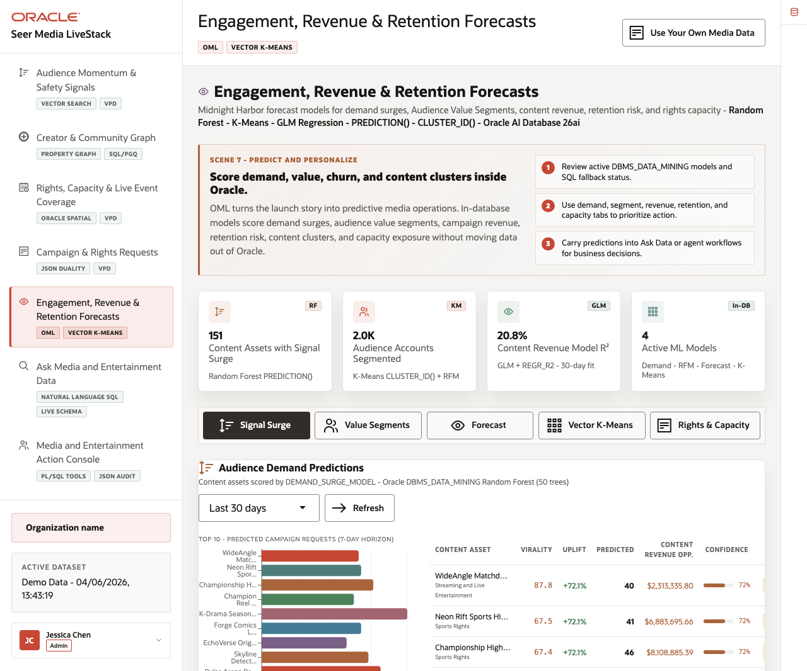

# Scene 8 Engagement, Revenue, & Retention Forecasts

## Introduction

**Engagement, Revenue, & Retention Forecasts** helps media teams decide which predictive signals should become action. The page brings together demand forecasts, audience value, revenue trends, affinity clusters, and rights-capacity risk so teams can plan with better evidence.

This persona needs to know which content assets have demand-surge risk, how audience accounts segment by value, whether content revenue is trending, which assets cluster semantically, and where rights or capacity risk needs attention.

Media teams struggle when forecasting, segmentation, monetization analysis, and operational decisions live in separate tools. That separation slows action and reduces trust in predictions.

**Oracle AI Database** keeps machine learning close to governed media data so predictions remain connected to operational workflows rather than becoming disconnected analytics artifacts.

Estimated Time: **12 minutes**

### Objectives

In this scene, you will learn what planning decision the page supports, what evidence the user should inspect, and what action the business may take next.

## Task 1: Inspect Audience Demand Predictions

Perform the following set of steps to review the predictive analytics workspace as a collection of decision tools supporting audience growth, monetization, retention, programming, and rights planning.

1. Click **Engagement, Revenue & Retention Forecasts** in the sidebar.
2. Review the four KPI cards at the top of the page: **Content Assets with Signal Surge**, **Audience Accounts Segmented**, **Content Revenue Model R-squared**, and **Active ML Models**.
3. Review the analytics tabs: **Signal Surge**, **Value Segments**, **Forecast**, **Vector K-Means**, and **Rights & Capacity**.
4. Confirm that **Signal Surge** is selected.
5. Review the scoring control, chart, and prediction table.

    

**Notes:**
- **Callout 1** highlights the KPI cards.
- **Callout 2** highlights the analytics tabs.
- **Callout 3** highlights the signal-surge scoring output and prediction table.

In the current seeded dataset, the page shows **151** content assets with signal surge, **2.0K** audience accounts segmented, a **20.5%** content revenue model R-squared, and **4** active ML models. Use this opening view to set the scene: this page is not a separate data science notebook. It is a business-facing analytics surface backed by in-database analytics.

In the prediction table, focus on rows such as **Echo Valley FAST Channel Breakout Package**, **Family Animation Premiere**, **Beta Realm FAST Channel Breakout Package**, **Mosaic Crimes Live Ops Quest Reset**, and **Championship Highlights Rights**. These predictions become business questions about campaign timing, recommendation strategy, audience activation, retention action, and rights planning.

**Note:** Sample values may change after data refreshes or rebuilds. Verify live output before presenting, then explain the business takeaway.

## Task 2: Review Audience Value Segments

Perform the following set of steps to turn model output into actionable audience groups for retention, personalization, campaign planning, and subscriber growth.

1. Click **Value Segments**.
2. Review the segment distribution chart.
3. Review the segment summary and top audience accounts by value score.
4. Use the segment filters to focus on high-value or at-risk audiences.

    

**Notes:**
- **Callout 1** highlights the active **Value Segments** tab.
- **Callout 2** highlights the segment distribution and segment summary.
- **Callout 3** highlights audience-account score detail.

Segmentation becomes operational when teams can move directly from a model result to a retention campaign, recommendation strategy, subscriber offer, or audience-engagement action.

## Task 3: Interpret Content Revenue Forecast

Perform the following set of steps so planners understand both the projection and how much confidence to place in it.

1. Click **Forecast**.
2. Review the forecast horizon selector and **Refresh** control.
3. Review the model quality cards.
4. Review the content revenue trend chart and forecast band.

    

**Notes:**
- **Callout 1** highlights the active **Forecast** tab.
- **Callout 2** highlights the forecast controls.
- **Callout 3** highlights the quality cards and revenue trend chart.

Use this tab to explain that forecast quality is visible to the user. Showing forecast quality helps users treat weak forecasts as directional guidance rather than certainty, increasing trust in the analytics experience.

## Task 4: Explore Vector K-Means clusters

Perform the following set of steps to understand which assets and audience signals behave similarly and may support recommendation, packaging, promotion, or programming decisions.

1. Click **Vector K-Means**.
2. Review the cluster controls.
3. Review cluster count, clustered assets, embedding dimensions, and distance metric.
4. Review cluster cards and related content assets.

    

**Notes:**
- **Callout 1** highlights the active **Vector K-Means** tab.
- **Callout 2** highlights the vector clustering controls and model summary.
- **Callout 3** highlights content-affinity cluster results.

This view helps users understand how vector similarity can group content and audience signals without leaving the governed data platform. These clusters help teams discover content relationships that may support recommendation strategies, audience growth, campaign targeting, or monetization opportunities.

## Task 5: Review Rights and Capacity intelligence

Perform the following set of steps to connect predicted audience demand with rights availability, activation readiness, and capacity constraints.

1. Click **Rights & Capacity**.
2. Review summary cards for capacity risk and at-risk media assets.
3. Scan the highest-priority rows for content assets that need rights or activation attention.
4. Connect the prediction back to the coverage scene.

    

**Notes:**
- **Callout 1** highlights the active **Rights & Capacity** tab.
- **Callout 2** highlights the capacity-risk indicators.
- **Callout 3** highlights the ranked media assets that need rights or activation attention.

Analytics become most valuable when forecasts, segments, and risk indicators appear directly in the workflows where business users already make decisions.

*You can move to the next scene.*

## Credits & Build Notes
- **Author** - Oracle LiveLabs Team
- **Last Updated By/Date** - Oracle LiveLabs Team, 2026-06-04
