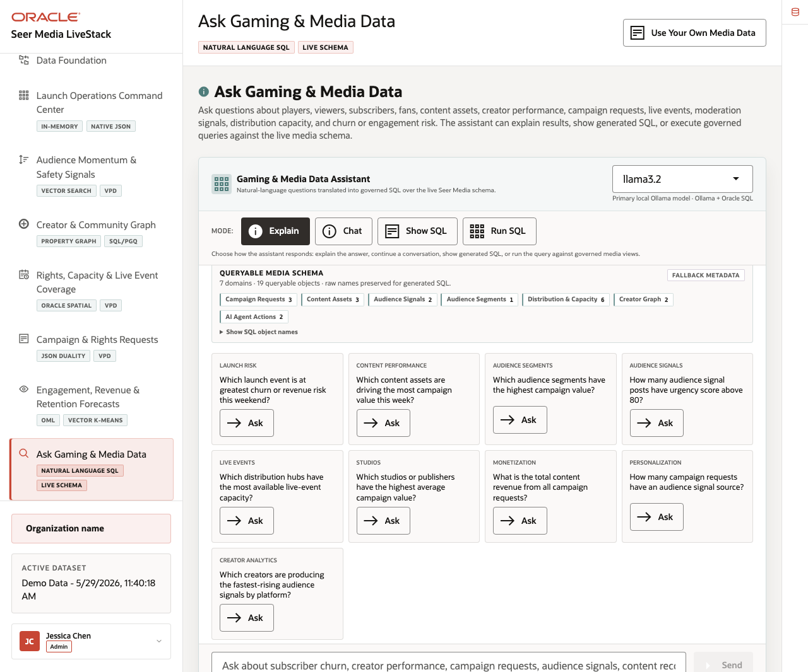
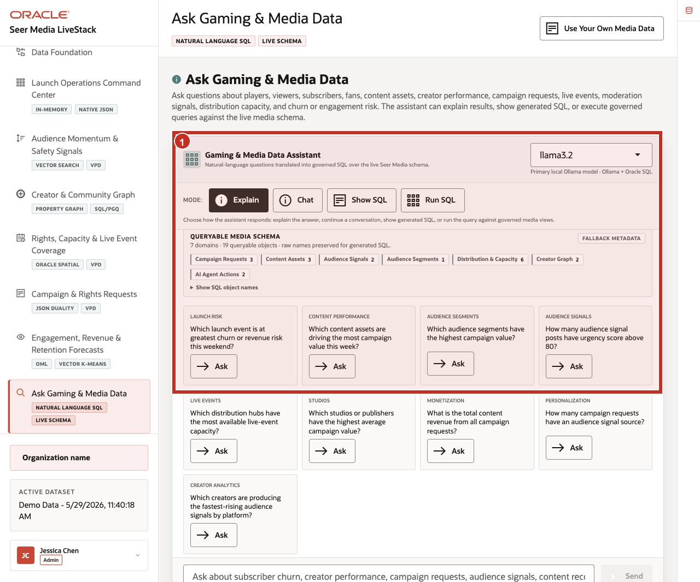
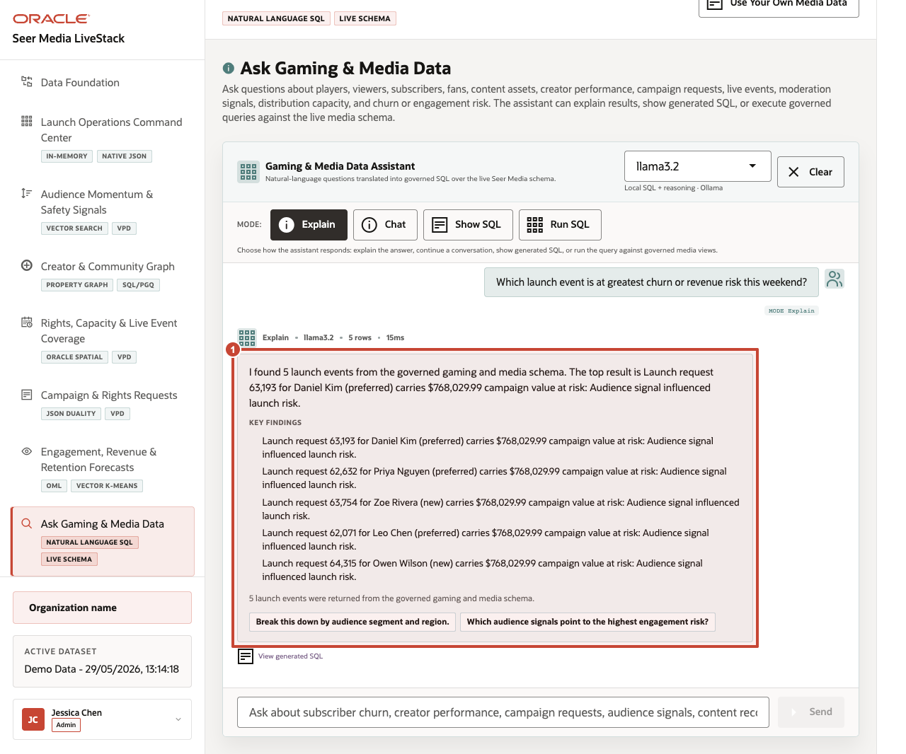
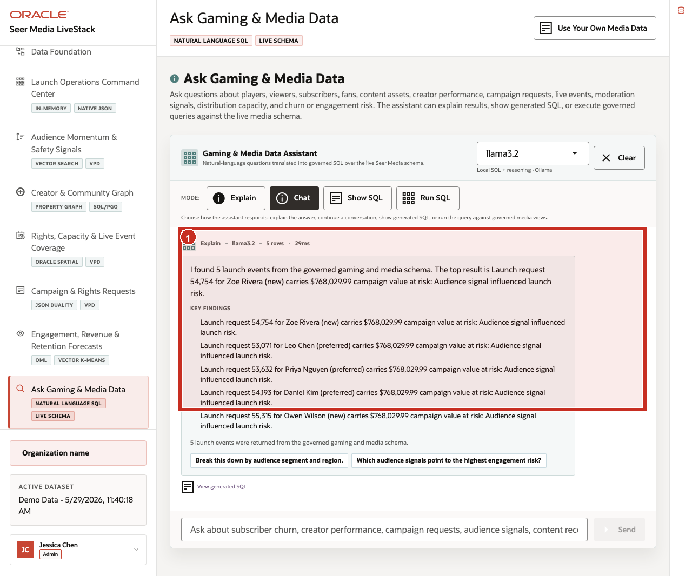
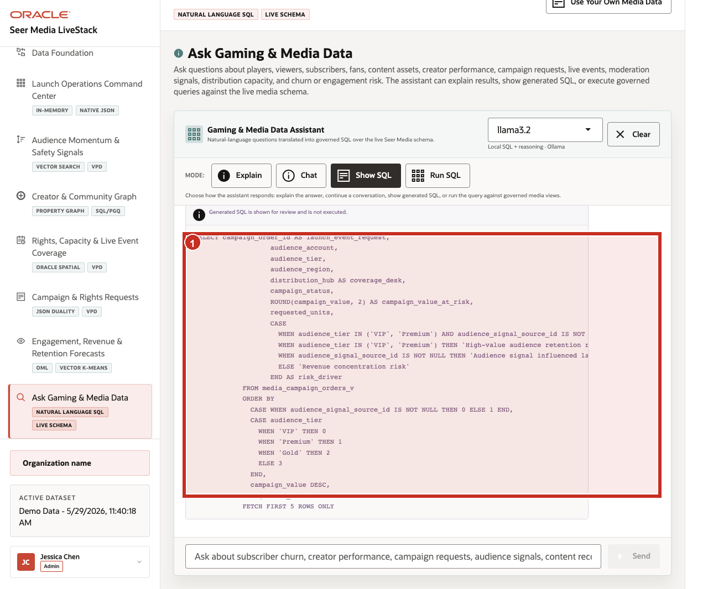
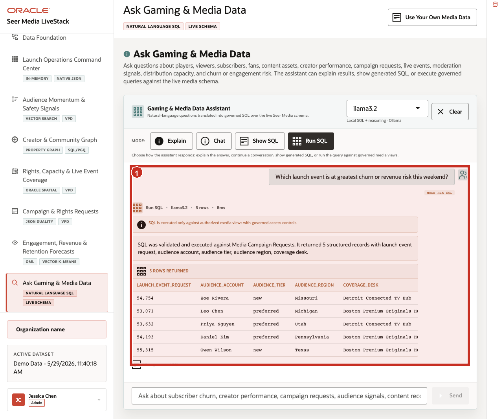

# Scene 9 Ask Seer Media Data

## Introduction

A media business analyst, programming leader, ad-sales analyst, retention manager, or data steward uses this page when they need an answer before a custom report can be built. The persona may understand the question clearly but not know the exact schema, joins, filters, or SQL required to answer it.

Natural-language data access can create governance risk if the language model generates invalid SQL, references the wrong tables, hides the query path, or exposes more data than the user should see. Media teams need self-service analytics, but data teams still need traceability, read-only execution, and a clear source of truth.

Oracle AI Database helps address these challenges by keeping query execution grounded in the live media schema. In this LiveStack Demo, the app sends the question and schema context to the local Ollama runtime, validates the generated SQL path, and uses Oracle AI Database 26ai as the execution authority.

Estimated Time: 10 minutes

### Objectives

In this scene, you will:
- Review the **Ask Gaming & Media Data** workspace, runtime profile, and modes.
- Compare **Explain**, **Chat**, **Show SQL**, and **Run SQL** against the same media question.
- Use **Explain** to return a plain-English answer without foregrounding SQL.
- Use **Chat** to return a conversational answer with follow-up prompts.
- Use **Show SQL** to inspect generated SQL before execution.
- Use **Run SQL** to return live rows from Oracle AI Database.
- Explore a launch-risk question grounded in campaign requests and audience accounts.
- Understand how natural-language analytics can remain transparent and database-governed.

## Task 1: Review the assistant workspace

1. Click **Ask Gaming & Media Data** in the sidebar.
2. Review the runtime profile in the top right of the assistant card. The current demo uses **llama3.2** through the local Ollama runtime.
3. Review the queryable schema summary. The current page shows **7** domains and **16** queryable objects.
4. Review example question categories such as **Launch Risk**, **Content Performance**, **Audience Segments**, **Audience Signals**, **Live Events**, **Studios**, **Monetization**, **Personalization**, and **Creator Analytics**.

    

Use this opening view to explain the governance pattern. The user asks a media question in plain English, but Oracle remains the execution layer for authorized SQL over the governed schema.

## Task 2: Use Explain mode for a narrated answer

1. Click **Explain**.
2. Click **Ask** on the **Launch Risk** question: **Which launch event is at greatest churn or revenue risk this weekend?**

    

Expected result: The assistant returns a narrated answer and key findings without making the generated SQL the main artifact.

Use this mode when the user wants a business-readable answer first. The system still uses governed SQL behind the scenes, but the presentation is optimized for a media analyst, programming lead, or retention manager.

## Task 3: Use Chat mode for a conversational answer

1. Click **Clear** if the Explain result is still visible.
2. Click **Chat**.
3. Click **Ask** on the same **Launch Risk** question.

    

Expected result: The assistant returns a conversational response and follow-up prompts. Chat mode keeps the answer grounded in the live media schema, but it is shaped for exploration, such as breaking risk down by audience region, coverage desk, or audience tier.

## Task 4: Use Show SQL mode to inspect the query path

1. Click **Clear** if the Chat result is still visible.
2. Click **Show SQL**.
3. Click **Ask** on the same **Launch Risk** question.

    

4. Review the generated SQL.

This is the governance moment in the scene: the user can inspect the query path before asking the database to return rows. Use this mode when a data steward, solution engineer, or technical reviewer wants to verify what will run before rows are returned.

## Task 5: Use Run SQL mode to inspect returned rows

1. Click **Clear** if the generated SQL result is still visible.
2. Click **Run SQL**.
3. Click **Ask** on the same **Launch Risk** question.

    

4. Review the returned table.

In the current seeded dataset, the question returns **5** rows with launch event request, audience account, audience tier, audience region, and coverage desk. Visible rows include audience accounts such as **Zoe Rivera**, **Leo Chen**, **Priya Nguyen**, **Daniel Kim**, and **Owen Wilson**. This is the data point to emphasize: a plain-English question surfaces a specific operating risk while the SQL and database result remain visible for trust.

Use the four completed mode examples to explain the governance pattern behind the page:

1. The user asks a media question in plain English.
2. The app builds prompt and schema context for the selected runtime profile.
3. Ollama drafts SQL or a response plan.
4. Oracle AI Database executes authorized SQL against the live schema.
5. The UI returns visible SQL, rows, or a narrated answer depending on the selected mode.

This pattern matters because media users want faster answers, but they also need governed access. Ask Gaming & Media Data shows how natural-language analytics can support self-service exploration without hiding the query path or replacing the database as the trusted execution layer.

You can move to the next scene.

## Credits & Build Notes
- **Author** - Oracle LiveLabs Team
- **Last Updated By/Date** - Oracle LiveLabs Team, 2026-05-29
