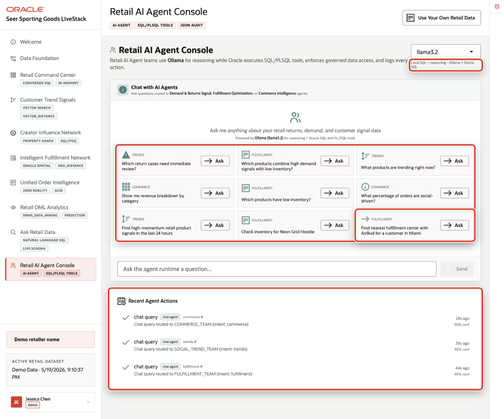
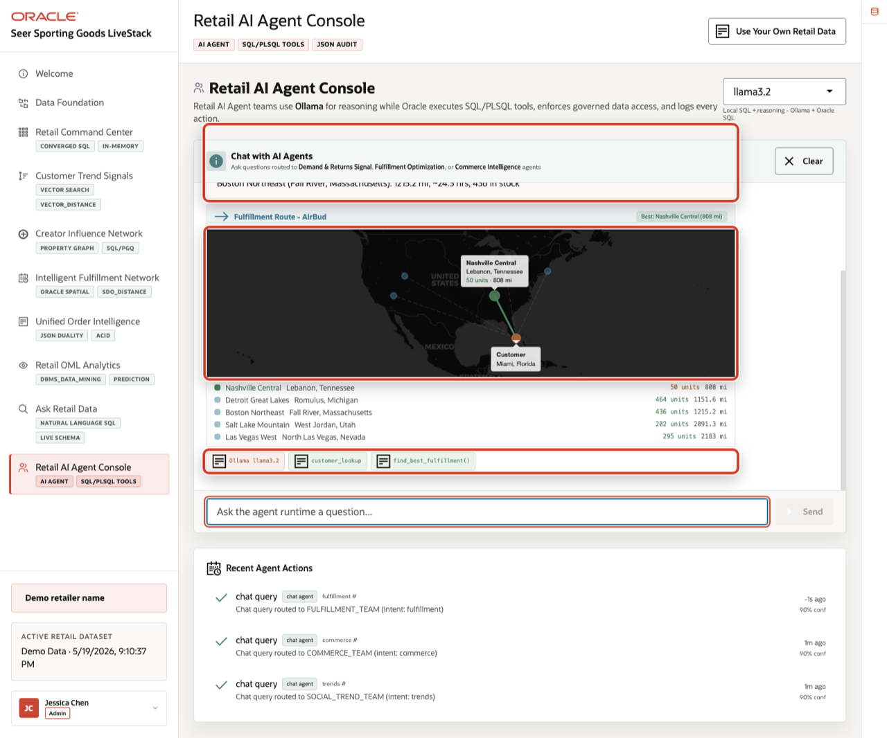
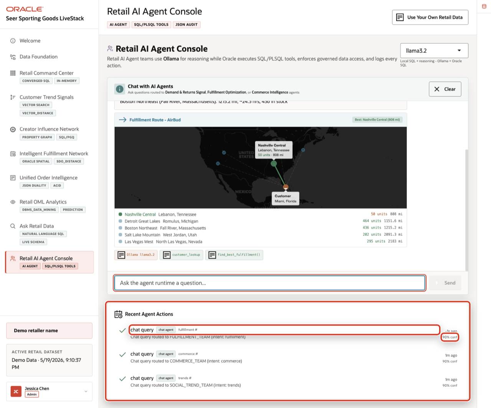

# Scene 10 Retail AI Agent Console

## Introduction

A retail operations leader, fulfillment manager, commerce analyst, or AI platform owner uses this page to see how agentic assistance can support day-to-day retail decisions. This persona is not only interested in whether an AI agent can answer a question. They need to know which team handled the request, which tools were called, what data was used, and whether the action was recorded for later review.

This is difficult to implement when AI agents operate as black boxes outside the operational data platform. Retail teams may get a recommendation, but not the routing decision, SQL or PL/SQL tool path, confidence, or audit record behind it. That makes it hard to trust agent output in fulfillment, demand, customer service, or commerce workflows.

Oracle AI Database helps address these challenges by keeping the source data, SQL execution, PL/SQL tools, and durable action logging in the database. In this LiveStack Demo, the app orchestrates the agent workflow, Ollama provides reasoning, and Oracle AI Database 26ai executes the governed data operations. Agent actions are written back to `agent_actions`, while the UI shows the response, tool badges, and recent audit trail.

Estimated Time: 10 minutes

### Objectives

In this scene, you will:
- Review the **Retail AI Agent Console** workspace and runtime profile.
- Select a concrete fulfillment-routing agent question.
- Inspect the agent response, route map, and SQL/PLSQL tool badges.
- Review the **Recent Agent Actions** audit trail.
- Understand why observable agent behavior matters for enterprise retail workflows.

## Task 1: Review the agent console workspace

1. Click **Retail AI Agent Console** in the sidebar.
2. Review the runtime profile selector in the top right. The current demo uses **llama3.2** through an Ollama-backed runtime profile.
3. Review the example questions in the chat panel.
4. Review **Recent Agent Actions** below the chat panel.
5. Focus on the fulfillment example: **Find nearest fulfillment center with AirBud for a customer in Miami**.

Use this opening view to explain the role of the page. The user is not looking at a generic chatbot. They are looking at an operational agent surface where retail questions are routed to specialist teams such as fulfillment, demand and returns signals, or commerce intelligence.

## Task 2: Run the fulfillment-routing agent question

1. Click **Ask** on **Find nearest fulfillment center with AirBud for a customer in Miami**.
2. Review the agent response at the top of the chat output.
3. Review the route map.
4. Review the tool badges below the map.

In the current demo dataset, the agent routes the request to the **Fulfillment Optimization** path and returns the top fulfillment options for **AirBud** near a customer in **Miami, Florida**. The best option shown is **Nashville Central** in **Lebanon, Tennessee**, with **50** units in stock, about **808** miles of distance, and an estimated transit time of about **16.2** hours. Other options include **Detroit Great Lakes** and **Boston Northeast** with larger inventory counts but longer routes.

This is the data point to emphasize during the demo. The agent did more than answer a text question. It looked up a customer in Miami, found fulfillment centers with available AirBud inventory, calculated route options, rendered the map, and exposed tool badges such as `customer_lookup` and `find_best_fulfillment()`.

## Task 3: Interpret the operational story

Use the fulfillment-routing result to explain the decision:

1. The customer location creates the demand point.
2. The product request narrows the inventory search to AirBud.
3. Oracle data identifies fulfillment centers with available stock.
4. Oracle Spatial distance logic supports the route comparison.
5. The agent response gives the business user a recommended path and alternatives.

The important story is tradeoff visibility. **Nashville Central** is the best route by distance and transit time, but the user can also see that farther centers may have more inventory. A fulfillment manager can use this to decide whether to ship from the closest viable center, reserve inventory elsewhere, or investigate why regional stock is not closer to the customer.

## Task 4: Review the agent action audit trail

1. Scroll to **Recent Agent Actions**.
2. Review the top action row.
3. Confirm that the row shows a **chat query** routed to the **fulfillment** agent path.
4. Review the confidence value.

In the current demo dataset, the completed chat action is logged with **90%** confidence. This is the governance point of the scene: agent decisions should be observable after the conversation. The page shows that agent interactions are not just transient chat messages. They are written into the action history so an operator, architect, or auditor can understand what happened.

The value of Oracle AI Database is that the agent workflow stays connected to governed operational data. The AI runtime can reason and orchestrate, while Oracle remains responsible for data access, SQL and PL/SQL execution, spatial calculations, and durable audit records.

You can move to the next scene.

## Credits & Build Notes
- **Author** - Oracle LiveLabs Team
- **Last Updated By/Date** - Oracle LiveLabs Team, 2026-05-20
