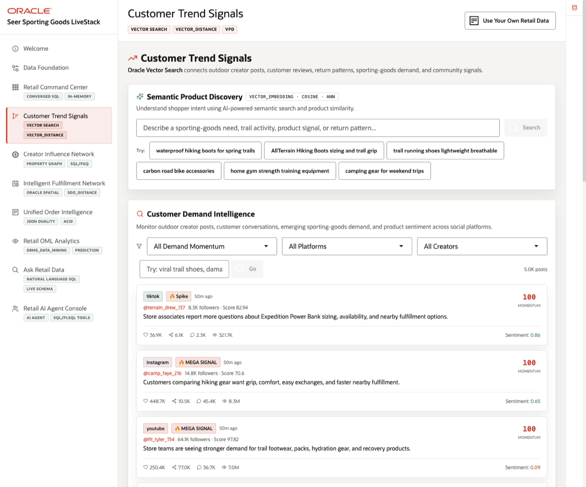
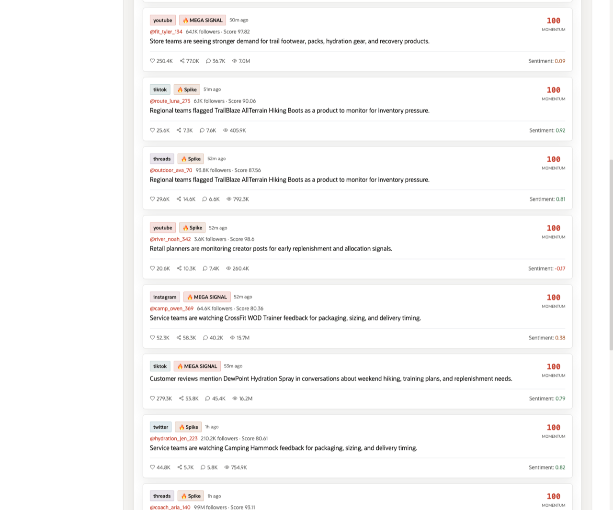
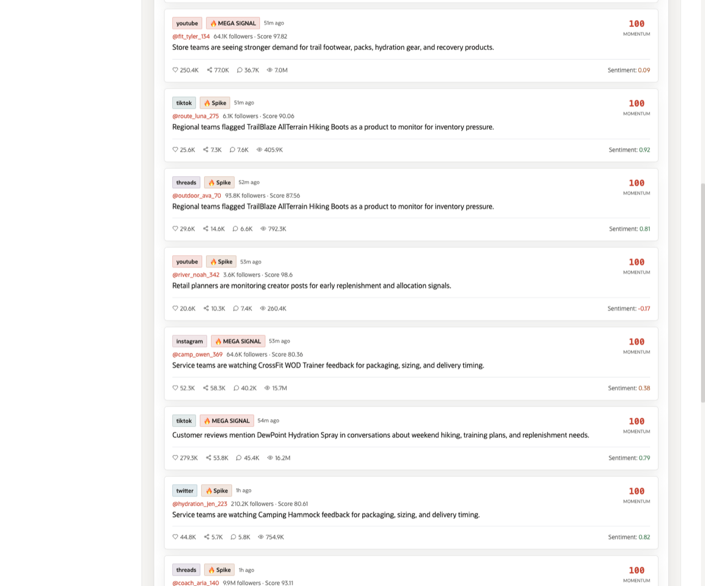

# Scene 4 Customer Trend Signals

## Introduction

A digital merchandising manager, customer insights analyst, or retail marketing strategist uses this page to understand what shoppers are saying before that demand is fully visible in sales reports. This persona is looking for patterns in product language, creator posts, customer conversations, reviews, sentiment, and social momentum. The goal is to connect shopper intent to products, categories, and emerging demand signals quickly enough to act.

Secure semantic search is difficult to implement when product data, customer conversations, social content, embeddings, search indexes, and security policies live in separate systems. Retail teams often have to move sensitive text into external AI services, synchronize vector indexes, duplicate product catalogs, and then rebuild access control outside the database.

Oracle AI Database helps address these challenges by keeping vector search, SQL, row-level security, and operational retail data together. In this scene, Oracle AI Database can create embeddings inside the database, so sensitive product and customer signal data does not need to be sent to external AI services or exposed through another processing layer. Oracle Vector Search can embed a business query, compare it against product or post embeddings, and return ranked matches while Oracle security policies continue to govern which data the user can see.

Estimated Time: 10 minutes

### Objectives

In this scene, you will:
- Review the two main areas of **Customer Trend Signals**: **Semantic Product Discovery** and **Customer Demand Intelligence**.
- Use a demo query in **Semantic Product Discovery** to see how shopper intent returns similar products.
- Use a demo query in **Customer Demand Intelligence** to see how customer and creator posts are ranked by semantic similarity.
- Review the **Oracle Internals** sidebar to connect the page to Oracle Vector Search, embeddings, cosine distance, ANN search, and VPD-based security.

## Task 1: Review the Customer Trend Signals page

1. Click **Customer Trend Signals** in the sidebar.
2. Review **Semantic Product Discovery** at the top of the page. This section searches the product catalog by meaning, not only by exact keywords.
3. Review **Customer Demand Intelligence** below it. This section searches creator posts, customer conversations, emerging demand, and sentiment across social platforms.
4. Review the **Oracle Internals** sidebar. It shows that the page uses `VECTOR_EMBEDDING`, `VECTOR_DISTANCE(COSINE)`, approximate nearest neighbor search, product embeddings, post embeddings, semantic matches, and VPD-based row-level security.

Pay attention to the data points in the sidebar: the demo has pre-embedded product vectors, post vectors, and semantic matches. This is the foundation that lets a retail user search by intent instead of relying only on product names or exact tags.

## Task 2: Run Semantic Product Discovery

1. In **Semantic Product Discovery**, click one of the demo query buttons, such as **AllTerrain Hiking Boots sizing and trail grip**.
2. Review the returned product matches.

The demo query is embedded at runtime and compared against product embeddings stored in Oracle AI Database. The results show ranked products, brand, category, price, mention count, and similarity percentage. In the current demo dataset, this query returns **AllTerrain Hiking Boots** first, followed by related footwear such as **TrailGrip Hiker** and **WinterGrip Boot**. This gives the seller a clean way to show semantic product discovery around the hero product.

This helps a merchandising user translate vague shopper language into concrete products that may need promotion, inventory attention, or further trend analysis.

## Task 3: Review Customer Demand Intelligence

1. Scroll to **Customer Demand Intelligence**.
2. Review the default feed. Each post shows platform, momentum label, creator handle, follower count, influence score, post text, engagement metrics, and sentiment.
3. Use the momentum, platform, or creator filters if you want to narrow the feed.

This section helps the user monitor where customer attention is building. A high-momentum post can indicate an emerging product story, creator-driven demand, a sentiment shift, or a category trend worth investigating.

## Task 4: Run a Customer Demand Intelligence query

1. In the Customer Demand Intelligence search field, enter a demo query such as **damaged packaging complaints hiking footwear**.
2. Click **Go**.
3. Review the ranked post matches.

The result view changes from the default feed to vector search results for the query. Each result shows a match rank and similarity percentage, platform, momentum label, creator context, post text, engagement metrics, and sentiment. In the current demo dataset, the search returns AllTerrain-related customer conversation posts near the top of the ranked list. This shows how Oracle AI Database can search unstructured customer and creator language semantically while still keeping the search tied to governed retail data.

You can move to the next scene.

## Credits & Build Notes
- **Author** - Oracle LiveLabs Team
- **Last Updated By/Date** - Oracle LiveLabs Team, 2026-05-28
