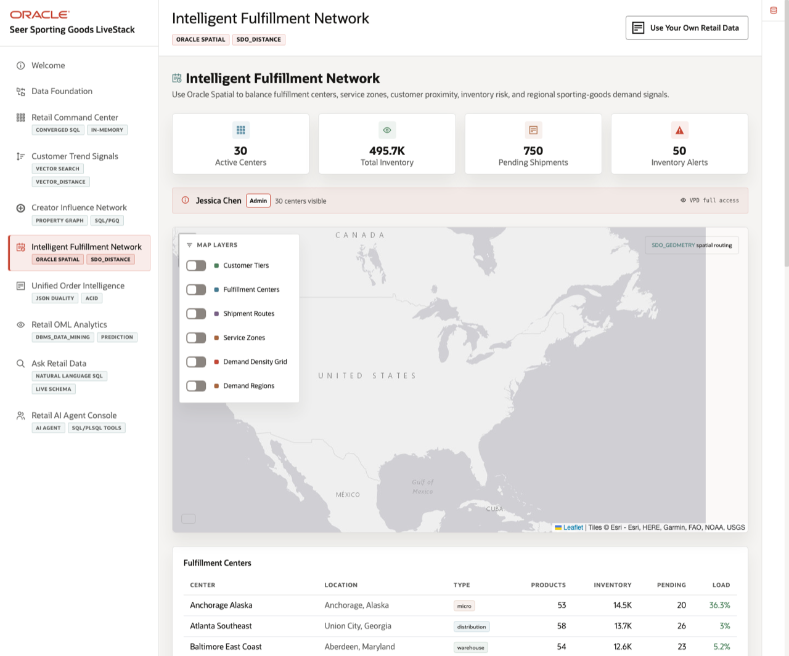
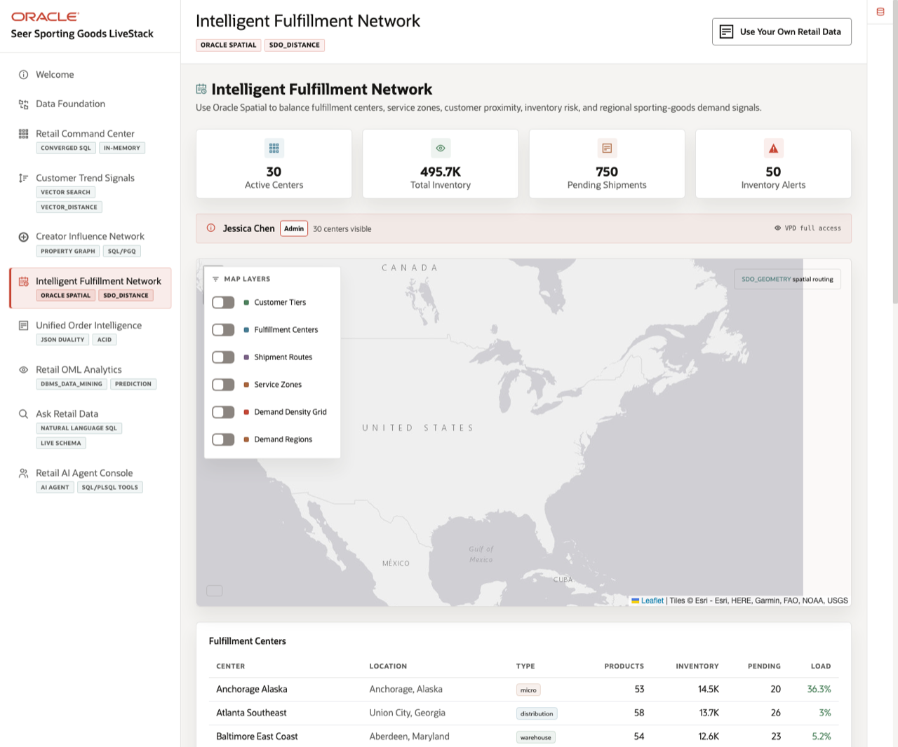
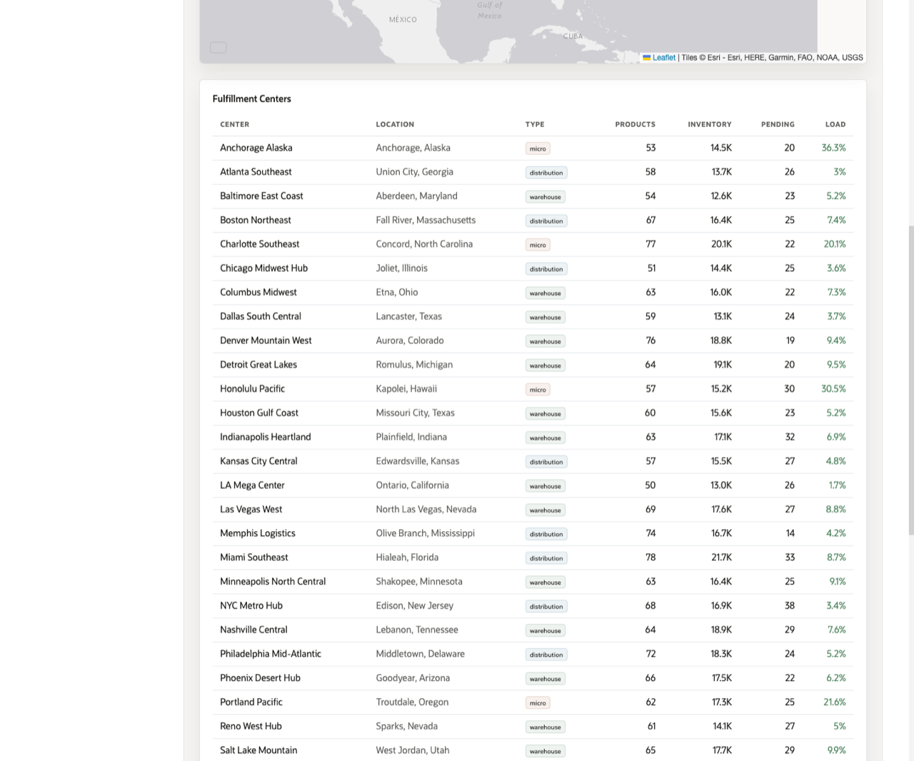
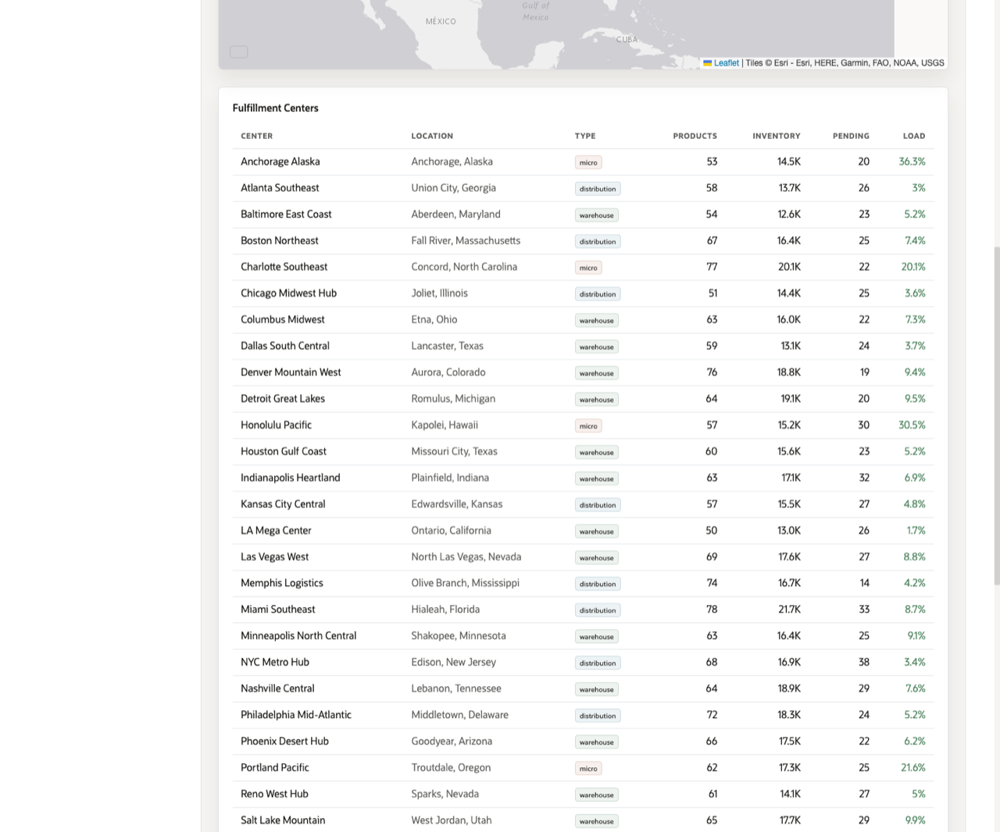

# Scene 6 Intelligent Fulfillment Network

## Introduction

A fulfillment operations manager, supply chain planner, or omnichannel operations lead uses this page to understand where customer demand, inventory, shipment activity, and service coverage are putting pressure on the retail network. This persona needs to answer practical questions quickly: which regions are heating up, which centers have capacity, where orders are already pending, and which products may need replenishment before customer experience is affected.

This is difficult to implement when warehouse systems, ecommerce orders, customer geography, carrier data, social demand signals, and forecasting models live in separate applications. Teams may have a dashboard for inventory, a different tool for maps, another report for shipment status, and a separate forecast file. That separation makes it hard to explain why a fulfillment action should be taken now.

Oracle AI Database helps address these challenges by keeping spatial, relational, inventory, shipment, demand forecast, and security-governed data together. Oracle Spatial stores fulfillment centers, service zones, customers, and demand regions as `SDO_GEOMETRY`. SQL can use distance, buffered zones, and GeoJSON conversion to power the map and operational tables without moving the data into a separate GIS platform. The Oracle Internals sidebar shows the SQL evidence behind the page, including `SDO_GEOM.SDO_DISTANCE`, `SDO_BUFFER`, `SDO_UTIL.TO_GEOJSON`, and the VPD policy that controls fulfillment-center visibility.

Estimated Time: 10 minutes

### Objectives

In this scene, you will:
- Review the **Intelligent Fulfillment Network** page and the main fulfillment KPIs.
- Explore spatial demand and service-zone layers on the map.
- Inspect fulfillment-center load and pending shipment context.
- Investigate an inventory alert that combines stock position, predicted demand, and social demand momentum.
- Understand how Oracle Spatial and governed operational data support location-aware retail decisions.

## Task 1: Review the fulfillment network context

1. Click **Intelligent Fulfillment Network** in the sidebar.
2. Review the KPI tiles at the top of the page. They summarize active fulfillment centers, total inventory, pending shipments, and inventory alerts.
3. Review the VPD banner below the tiles. It shows which demo user is active and whether the page is using full access or a region-filtered fulfillment view.
4. Review the map workspace. This is where fulfillment centers, service zones, customer geography, routes, density, and demand regions can be layered together.

In the current demo dataset, the page shows **30** active centers, about **495.7K** units of inventory, **750** pending shipments, and a live set of inventory alerts. Use those numbers to set the operational scene: this is not a single warehouse decision, but a network decision across inventory, geography, and active demand.

## Task 2: Explore spatial demand and service coverage

1. In **Map Layers**, turn on **Service Zones** and **Demand Regions** if they are not already active.
2. Review the dashed service-zone rings around fulfillment locations. These show how delivery coverage changes by service tier.
3. Review the demand-region polygons. The demand index color scale helps identify regions where demand pressure is higher.
4. Open the collapsed **Oracle Internals** sidebar if you want to inspect the spatial SQL behind the map.

Use the map to explain how the same database can serve operational and spatial questions. Fulfillment teams can look at inventory centers and service coverage together with regional demand signals. The Oracle Internals sidebar connects the visual layer back to Oracle Spatial functions such as `SDO_BUFFER` for zones and `SDO_UTIL.TO_GEOJSON` for rendering demand-region polygons in the browser.

## Task 3: Inspect fulfillment-center load

1. Scroll to **Fulfillment Centers**.
2. Review the center name, location, type, products stocked, total inventory, pending shipments, and load percentage.
3. Focus on **Charlotte Southeast** as one example. In the current dataset, it carries **77** stocked products, about **20.1K** inventory units, **22** pending shipments, and **20.1%** load.
4. Compare this row with other centers to understand where there may be available capacity or regional pressure.

This table helps the user move from a map-level network view to a center-level operating view. A fulfillment manager can see which centers have inventory depth, where shipment activity is already queued, and whether load levels leave room to absorb demand.

## Task 4: Investigate an inventory alert

1. Scroll to **Inventory Alerts - Social Demand Surge**.
2. Review the top alert rows. Red rows indicate products with a demand signal, while yellow rows indicate low-stock items without the same projected demand pressure.
3. Focus on **Summit Graphic Training Tee** at **Portland Pacific**.
4. Interpret the row: **23** units are in stock, predicted demand is **104** units, and the social demand factor is **1.6x**.

This is the data point to emphasize during the demo. The story is that a sporting-goods apparel product is receiving amplified demand signals while one fulfillment center has limited available stock. The operational response could be to replenish Portland Pacific, reroute fulfillment from another center, adjust promotion timing, or alert the merchandising team before the shortage becomes visible to customers.

The value of Oracle AI Database is that the alert is not calculated in isolation. It combines product, brand, inventory, fulfillment center, forecast, and social signal data in one governed data platform, then presents the result in the same interface as spatial coverage and center load.

You can move to the next scene.

## Credits & Build Notes
- **Author** - Oracle LiveLabs Team
- **Last Updated By/Date** - Oracle LiveLabs Team, 2026-05-28
