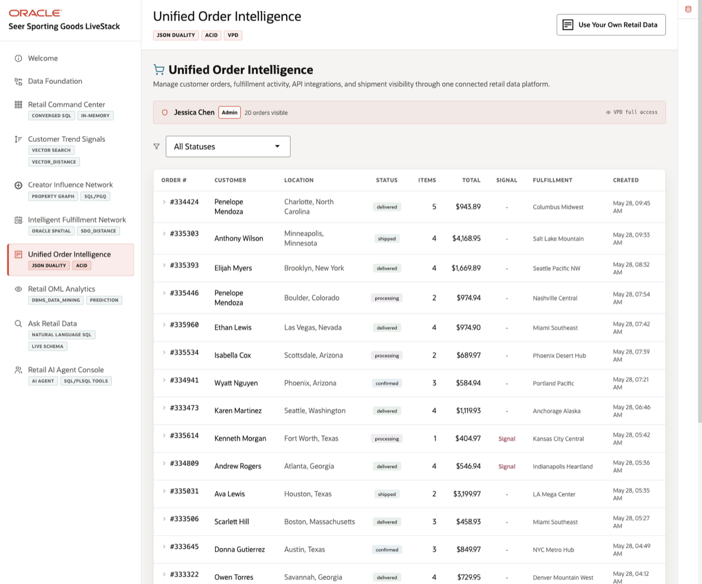
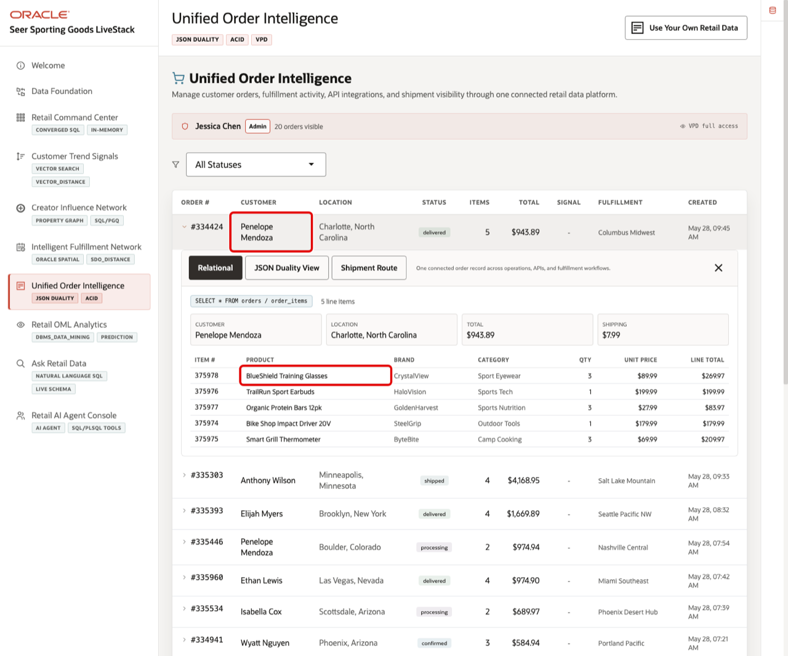
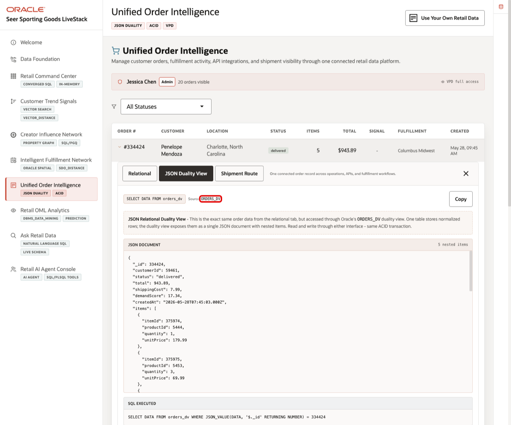
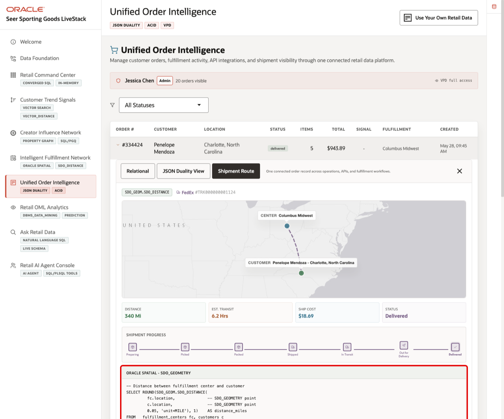

# Scene 7 Unified Order Intelligence

## Introduction

An ecommerce operations manager, customer service lead, order platform owner, or partner integration architect uses this page to understand an order from multiple angles. This persona needs a reliable operational view for customer support, a transactional view for order management, an API-friendly document view for applications and partners, and fulfillment visibility for shipment follow-up.

This is difficult to implement when order headers, line items, customer data, fulfillment centers, shipment records, and API payloads are handled in separate systems. Retail teams often duplicate the same order data into a relational database, a document store, a search index, and integration payloads. Each copy creates synchronization risk, stale customer service answers, and extra engineering work whenever the order model changes.

Oracle AI Database helps address these challenges by keeping the order record in one governed data platform while exposing it through the shape each workflow needs. Relational tables provide ACID transactions, foreign keys, and operational SQL. JSON Relational Duality Views expose the same order as a nested JSON document for application and API use cases. Oracle Spatial adds route and distance context for fulfillment visibility, and VPD policies can control which orders each user can see.

Estimated Time: 10 minutes

### Objectives

In this scene, you will:
- Review the **Unified Order Intelligence** page and the active order workspace.
- Inspect a specific order row in the table.
- Open the same order as relational operational detail.
- Compare that same order with the JSON document returned by `ORDERS_DV`.
- Review the shipment route and fulfillment context for the order.

## Task 1: Review the order workspace

1. Click **Unified Order Intelligence** in the sidebar.
2. Review the VPD banner below the page subtitle. It shows the active demo user and whether the user has full access or a region-filtered order view.
3. Review the status filter and the order table.
4. Focus on order **#334424**.

In the current demo dataset, order **#334424** is for **Penelope Mendoza** in **Charlotte, North Carolina**. It is marked **delivered**, contains **5** line items, totals **$943.89**, and is fulfilled by **Columbus Midwest**. This order will be the data point used through the rest of the scene.

## Task 2: Inspect the relational order detail

1. Click order **#334424**.
2. Confirm the **Relational** tab is selected.
3. Review the customer, location, total, shipping cost, and line-item table.
4. Review the products in the order, such as **BlueShield Training Glasses**, **TrailRun Sport Earbuds**, **Organic Protein Bars 12pk**, **Bike Shop Impact Driver 20V**, and **Smart Grill Thermometer**.

This view is useful for order operations and customer service because it shows normalized transactional data in a format that is easy to validate. The order header, customer, product, brand, category, quantity, unit price, and line total are connected through relational joins while preserving ACID consistency.

## Task 3: Compare the JSON Duality View

1. Click **JSON Duality View** in the expanded order panel.
2. Review the source label **ORDERS_DV**.
3. Review the JSON document for order **334424**.
4. Notice that the document contains the order id, customer id, status, total, shipping cost, demand score, created date, and nested line items.

This is the key point of the page. The JSON document is not a separate copy of the order. It is the same order data exposed through an Oracle JSON Relational Duality View. Application teams and partner APIs can work with an order-shaped JSON document, while operations teams can continue to use relational tables and SQL. Both interfaces read from the same governed transaction model.

## Task 4: Review shipment and fulfillment context

1. Click **Shipment Route** in the expanded order panel.
2. Review the fulfillment center and customer locations on the map.
3. Review the shipment context below the map: distance, estimated transit time, ship cost, and shipment status.
4. Review the shipment progress timeline.

For order **#334424**, the page shows a route from **Columbus Midwest** to **Penelope Mendoza** in **Charlotte, North Carolina**. The shipment is delivered, the straight-line spatial distance is about **340 miles**, the estimated transit time is about **6.2 hours**, and the ship cost is **$18.69**. This connects the order record to fulfillment visibility, not just API payloads or order totals.

The value of Oracle AI Database is that the same order can support customer service, order operations, partner integration, and fulfillment analysis without splitting the story across separate persistence layers. Relational data, JSON Duality documents, spatial distance, shipment state, and row-level access controls all work from the same connected retail data foundation.

You can move to the next scene.

## Credits & Build Notes
- **Author** - Oracle LiveLabs Team
- **Last Updated By/Date** - Oracle LiveLabs Team, 2026-05-28
