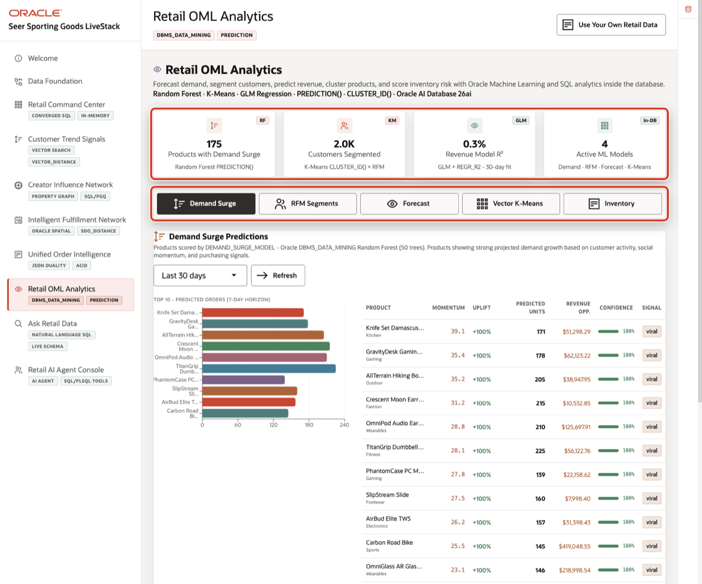
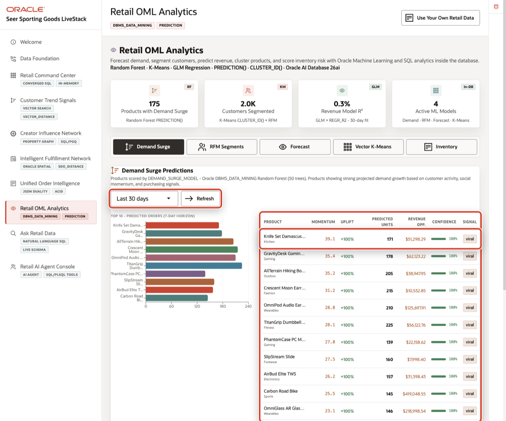
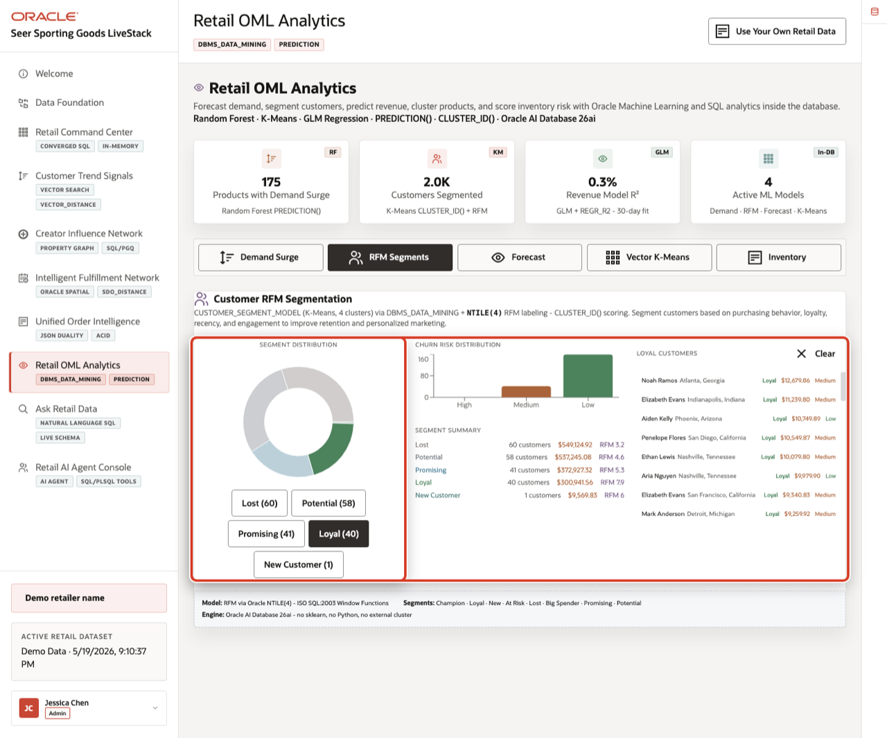
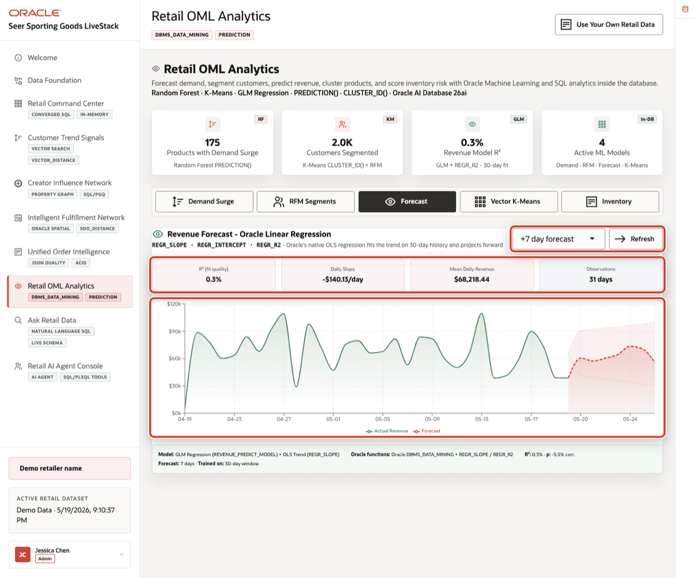
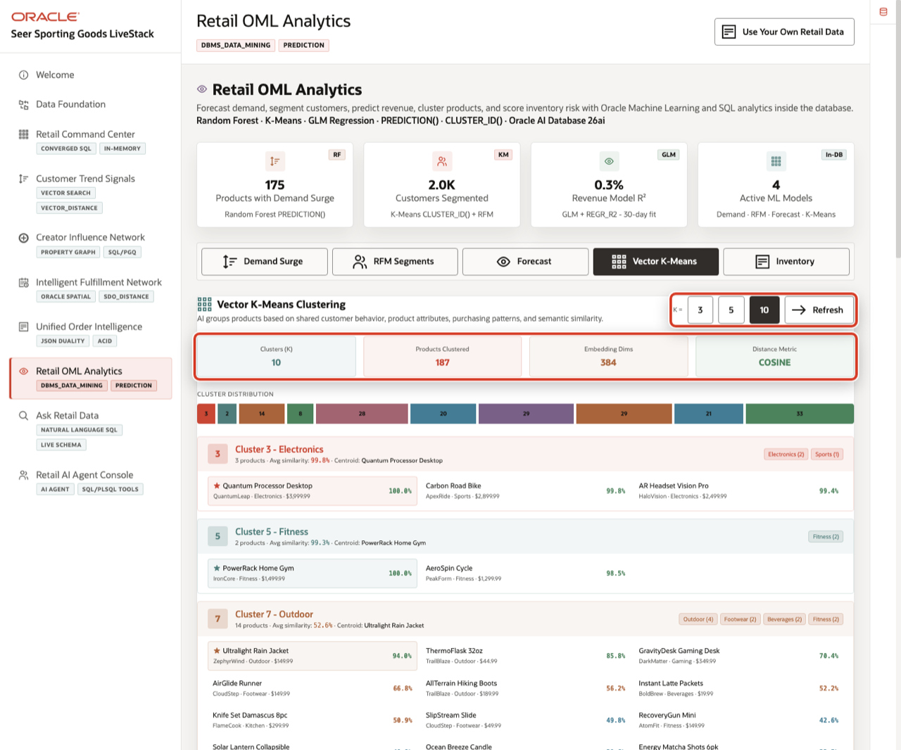
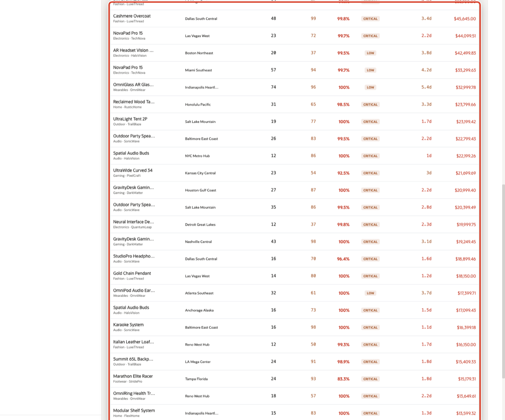

# Scene 8 Retail OML Analytics

## Introduction

A merchandising analytics manager, demand planner, loyalty analyst, inventory planner, or retail data science lead uses this page to understand which predictive signals should drive action. This persona needs to know which products are surging, which customer groups need different engagement, how revenue is trending, which products behave alike, and where forecasted demand may create stock risk.

This is difficult to implement when predictive work is split across notebooks, exported CSV files, BI extracts, external ML services, and separate operational systems. Retail teams can lose trust in predictions when model features are stale, scoring jobs run away from the live data, or the explanation behind a forecast is disconnected from the order, customer, product, and inventory records that business users rely on.

Oracle AI Database helps address these challenges by keeping machine learning close to governed retail data. Oracle Machine Learning models can be trained, persisted, and scored in the database with `DBMS_DATA_MINING`, `PREDICTION()`, `PREDICTION_PROBABILITY()`, and `CLUSTER_ID()`. SQL regression, RFM segmentation, vector-based product grouping, and inventory risk scoring can run from the same connected data foundation that powers the rest of the LiveStack Demo.

Estimated Time: 10 minutes

### Objectives

In this scene, you will:
- Review the **Retail OML Analytics** workspace and summary cards.
- Inspect the **Demand Surge** results and interpret the demand surge percentage for a product.
- Filter **RFM Segments** and review the customers behind a selected segment.
- Change the **Forecast** horizon and interpret the model quality cards and chart.
- Change the **Vector K-Means** cluster count and review product cluster assignments.
- Review **Inventory Intelligence** and connect predicted demand to stock risk.

## Task 1: Review the OML analytics workspace

1. Click **Retail OML Analytics** in the sidebar.
2. Review the four summary cards at the top of the page: products with demand surge, customers segmented, revenue model R2, and active ML models.
3. Review the mode tabs: **Demand Surge**, **RFM Segments**, **Forecast**, **Vector K-Means**, and **Inventory**.

In the current demo dataset, the page shows **175** products with demand surge signals, **2.0K** customers segmented, a **0.3%** revenue model R2 for the 30-day fit, and **4** active in-database ML patterns. Use this opening view to set the scene: this page is not a separate data science notebook. It is a business-facing analytics surface backed by in-database scoring and SQL.

## Task 2: Inspect Demand Surge %

1. Stay on the **Demand Surge** tab.
2. Use the scoring window selector if you want to change the time window, then click **Refresh**.
3. Review the bar chart and product table.
4. Focus on the first row, such as **Knife Set Damascus 8pc**.

In the current demo dataset, **Knife Set Damascus 8pc** shows a virality momentum score of **39.1**, a **+100%** uplift, **171** predicted units, a revenue opportunity of about **$51.3K**, and **100%** confidence. This gives the merchandising user a concrete question to answer: should the retailer increase inventory, adjust promotion timing, or brief customer service before demand pressure turns into a stock issue?

The important point is that the demand surge percentage is not only a chart decoration. It is a scored signal coming from product, sales, social activity, and momentum features. Oracle AI Database keeps those features and the model score inside the same governed retail data platform.

## Task 3: Filter RFM Segments

1. Click **RFM Segments**.
2. Review the segment distribution and segment summary.
3. Click **Loyal (40)** or another segment button.
4. Review the filtered customer list on the right.

In the current demo dataset, the segment distribution includes **Lost (60)**, **Potential (58)**, **Promising (41)**, **Loyal (40)**, and **New Customer (1)**. Selecting **Loyal (40)** filters the customer list so the user can inspect the people behind that segment, including spend, location, and churn risk.

This is useful for loyalty and marketing teams because segmentation becomes operational. The team can move from a model result to the customer records that need a campaign, retention action, or service follow-up without exporting the data to another tool.

## Task 4: Change the Forecast horizon

1. Click **Forecast**.
2. Change the forecast horizon to **+14 day forecast**.
3. Click **Refresh** if the page does not update automatically.
4. Review the model quality cards and the forecast chart.

In the current demo dataset, the 14-day forecast view shows **0.3%** R2, a daily slope of about **-$140.13/day**, mean daily revenue of about **$68.2K**, and **31** observations. The low R2 is an important demo talking point: the page is not hiding model quality. It shows when a simple 30-day revenue trend is weak, so a planner can treat the forecast as directional context instead of over-trusting it.

The chart separates actual revenue, forecast revenue, trend, moving average, and confidence bands. This helps a retail planner explain the difference between observed revenue history and projected revenue instead of presenting a single unexplained number.

## Task 5: Change Vector K-Means clusters

1. Click **Vector K-Means**.
2. Click **10** in the **K =** control.
3. Review the cluster summary cards and distribution bar.
4. Review one cluster card and its product assignments.

In the current demo dataset, switching to **K = 10** clusters groups **187** products. One visible example is an electronics cluster with **3** products, high average similarity, and **Quantum Processor Desktop** as the centroid product. The cluster card then shows related products and similarity percentages.

This helps a merchandising user understand how AI-assisted grouping can support product discovery, recommendations, assortment analysis, and lookalike product exploration. Oracle AI Database can combine vector similarity and SQL analytics without copying product data into a separate vector-only system.

## Task 6: Review Inventory Intelligence

1. Click **Inventory**.
2. Review the inventory summary cards.
3. Scroll to **Inventory Alerts - Sorted by OML Surge Probability**.
4. Focus on a high-risk row, such as **Cashmere Overcoat**.

In the current demo dataset, **Cashmere Overcoat** shows **48** units on hand, **99** predicted units, **99.8%** surge probability, **critical** status, about **3.4** days of supply, and about **$45.6K** revenue at risk. This turns the model output into an operational action: the user can identify where demand is stronger than available supply and prioritize replenishment or transfer decisions.

The value of Oracle AI Database is that this inventory signal combines the `DEMAND_SURGE_MODEL`, `demand_forecasts`, inventory, products, and fulfillment centers in one governed system. The same data foundation supports predictive scoring, operational joins, and business-facing workflow decisions.

You can move to the next scene.

## Credits & Build Notes
- **Author** - Oracle LiveLabs Team
- **Last Updated By/Date** - Oracle LiveLabs Team, 2026-05-19
