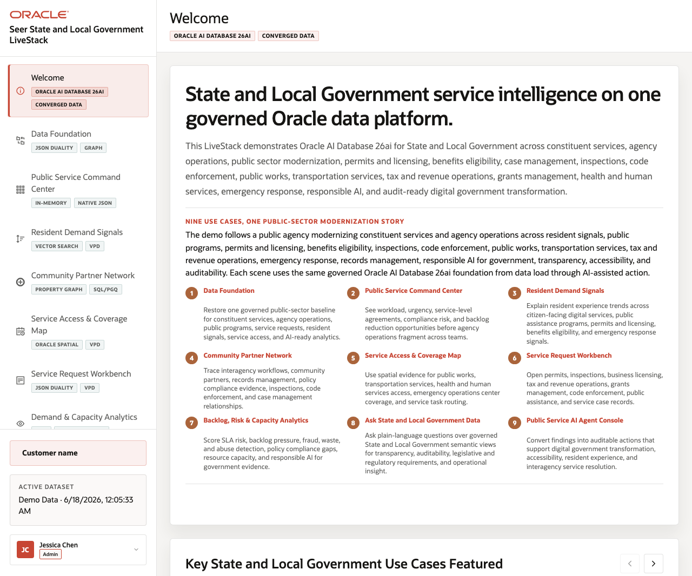

# State and Local Government Service Operations LiveStack Guide

## Introduction

State and local agencies must coordinate constituent services, permits, benefits, inspections, public works, service requests, emergency response, and transparency obligations while keeping data governed. The **Seer State and Local Government LiveStack** shows how those signals can come together so agency leaders can understand service pressure earlier, see the evidence behind a response, and act with more confidence.

This runbook tells the story of the final application before go-live. It focuses on practical outcomes: better service delivery visibility, clearer public transparency, stronger compliance posture, faster responsiveness, and more efficient operations without moving sensitive data into disconnected tools.

This runbook supports the **Seer State and Local Government LiveStack Demo**. The demo shows how Oracle AI Database 26ai can bring public-sector operational workloads together on one connected data platform. Instead of splitting relational transactions, JSON documents, graph relationships, spatial analysis, vector search, in-database machine learning, natural-language SQL, and AI agent workflows across different systems, the LiveStack shows how those capabilities can work against the same governed Oracle data model.

In the demo, Jessica Chen, a state digital services lead, is preparing a go-live operations briefing. She uses the application to follow constituent demand from resident signals into service requests, partner coordination, access geography, capacity forecasts, conversational data access, and audited AI-assisted action.

Each scene connects a public-sector operations challenge to a visible decision path and the Oracle capability supporting it.

Estimated Demo Time: **90 minutes**

Each scene is designed to take between 5 and 10 minutes.

## Application Story

The story follows a state digital services team preparing for a service operations briefing. The team starts with a governed data foundation, then follows resident demand through service pressure, community partner relationships, access geography, service request detail, predictive analytics, natural-language data access, and audited AI-assisted action.

The application is designed to show a complete public-sector operating pattern: agency leaders see where service pressure is building, program teams inspect the evidence behind a response, analysts use predictive signals to plan capacity, and AI-assisted workflows remain tied to governed data and audit history.

## Go-Live Outcome Map

- **Service delivery:** Leaders can see urgent demand, service value, access constraints, and request detail in one flow.
- **Transparency:** Each major screen connects the visible business outcome to source data, SQL, graph, spatial, vector, OML, or agent evidence.
- **Compliance:** Governed access, VPD, JSON Duality, ORDS APIs, and action history keep sensitive workflows controlled and explainable.
- **Responsiveness:** Staff can move from resident signal to service request, partner coordination, capacity view, or agent recommendation without switching systems.
- **Operational efficiency:** The same Oracle AI Database foundation supports dashboards, search, maps, graph analysis, machine learning, natural-language SQL, and AI agents.

### Objectives

In this LiveStack demo, you will see how connected public-sector data can help teams:

- Monitor service delivery pressure, urgent demand, and operational value.
- Identify resident signals, access gaps, partner relationships, and capacity constraints.
- Use predictive analytics and natural-language data access to support faster decisions.
- Apply AI-assisted recommendations with auditability, security controls, and governed evidence.

### Scenario

The application opens with a State and Local Government service operations briefing, then moves through the data foundation, public service command center, resident demand signals, partner graph, service access map, request workbench, predictive analytics, conversational data access, AI agent console, and data onboarding workflow. By the end of the story, the same governed data foundation supports executive visibility, staff action, transparent evidence, and operational readiness.

### Prerequisites

Before you begin, confirm that you can open the running Seer State and Local Government LiveStack in a modern browser. No coding or database administration knowledge is required for the guided demo scenes.

**Podman** and **Podman Compose** are required only if you plan to run the portable LiveStack locally in the download lab.

## Demo Flow

- **Scene 1:** Welcome and Demo Orientation.
- **Scene 2:** Data Foundation.
- **Scene 3:** Public Service Command Center.
- **Scene 4:** Resident Demand Signals.
- **Scene 5:** Community Partner Network.
- **Scene 6:** Service Access and Coverage Map.
- **Scene 7:** Service Request Workbench.
- **Scene 8:** Demand and Capacity Analytics.
- **Scene 9:** Ask State and Local Government Data.
- **Scene 10:** Public Service AI Agent Console.
- **Scene 11:** Use Your Own Public Service Data.
- Download and run the portable State and Local Government LiveStack.

## Learn More

- [Oracle AI Database 26ai documentation](https://docs.oracle.com/en/database/oracle/oracle-database/26/index.html)
- [Oracle AI Agent Memory](https://www.oracle.com/database/ai-agent-memory/)
- [Oracle AI Vector Search](https://www.oracle.com/database/ai-vector-search/)
- Oracle Spatial and Graph documentation: [Oracle Spatial](https://docs.oracle.com/en/database/oracle/oracle-database/26/spatl/toc.htm) and [Oracle Property Graph](https://docs.oracle.com/en/database/property-graph/26.2/index.html)
- [Oracle Machine Learning for SQL documentation](https://docs.oracle.com/en/database/oracle/machine-learning/oml4sql/tasks.html)
- [Oracle REST Data Services documentation](https://docs.oracle.com/en/database/oracle/oracle-rest-data-services/25.4/orddg/index.html)
- [Oracle LiveLabs catalog](https://livelabs.oracle.com/)

## Credits & Build Notes
- **Author** - Oracle LiveLabs Team
- **Last Updated By/Date** - Oracle LiveLabs Team, 2026-06-18
