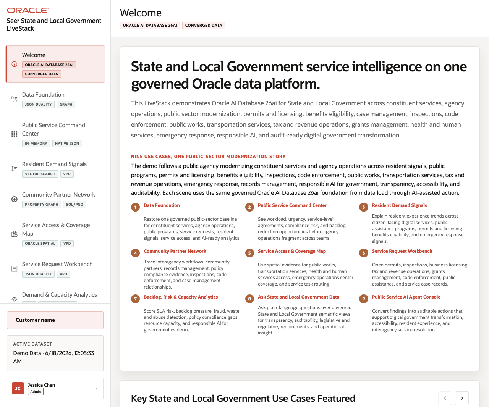

# Colorado State and Local Government Service Operations LiveStack Guide

## Introduction

**Colorado** agencies coordinate benefits, permits, inspections, public works, emergency response, and other resident services through one statewide operating model. The **Seer State and Local Government LiveStack** shows how leaders can detect service pressure, inspect the evidence behind it, coordinate response, and preserve an accountable action trail.

**Jessica Chen**, Colorado's statewide digital services lead, is preparing an operations briefing. The command center reports a **Medicaid Eligibility Error Rate of 2.7%** against the stakeholder-provided **3.0% demo threshold**. The rate is still within threshold, but its **Approaching Threshold** status gives Jessica a reason to investigate resident demand, service pressure, partner handoffs, request details, and regional capacity before potential exposure increases.

This is not a Medicaid-only application or a federal legal explainer. The eligibility metric is the initiating business signal in a broader **Colorado** resident-services workflow, and every operational resident, request, service center, county, and regional comparison should stay anchored to that broader scope.

The demo also proves governed access. **Jessica Chen** has statewide visibility, a regional manager sees only the assigned service region, and the restricted viewer sees no protected operational rows. **Oracle Virtual Private Database** enforces those perspectives in the database.

**Note:** Sample values may change after data refreshes or rebuilds. Verify live output before presenting, then explain the business takeaway.

Estimated Demo Time: **100 minutes**

Scenes range from 5 to 10 minutes.

## Application Story

**Jessica Chen** begins with statewide evidence, follows the eligibility-risk signal into resident demand and partner relationships, verifies geographic coverage and a specific request, compares regional capacity, and closes with a governed recommendation and audit trail.

The operating decision is: *Which **Colorado** service-demand*, partner-coordination, access, and capacity conditions require intervention now so resident requests are resolved accurately before eligibility-error risk crosses the demo threshold?

The runbook preserves the application's broader state-services scope. It uses the **Medicaid Eligibility Error Rate** as the early-warning trigger, while the remaining scenes show how the same operating model supports benefits, permits, inspections, public works, emergency response, and other resident services.

## Go-Live Outcome Map

- **Operating decision:** Determine where Colorado should intervene before eligibility accuracy or service responsiveness deteriorates.
- **Resident service:** Move from statewide pressure to one resident request and its active resolution path.
- **Compliance risk:** Interpret 2.7% as within the 3.0% demo threshold but close enough to monitor actively. Rates above the threshold may create potential federal matching-fund exposure under the stakeholder-provided demo rule.
- **Governed access:** Demonstrate global, regional, and restricted VPD perspectives over the same Colorado data.
- **Accountable action:** Connect analytics, Ask Data, and agents to visible Oracle evidence and audit history.

**Note:** Sample values may change after data refreshes or rebuilds. Verify live output before presenting, then explain the business takeaway.

### Objectives

In this **LiveStack** demo, you will learn how to interpret the eligibility-risk signal, trace one **Colorado** operating decision through resident demand and service capacity, verify **VPD**-scoped access, and use Oracle evidence, natural-language data access, and audited agents to support an accountable response.

### Scenario

The application opens with a **Colorado** resident-services orientation, confirms the governed data foundation, then moves through the command center, resident demand signals, partner graph, access map, request workbench, predictive analytics, **Ask Data**, agent console, and data onboarding workflow.

### Prerequisites

Before you begin, confirm that you can open the running **Seer State and Local Government LiveStack** in a modern browser. No coding or database administration knowledge is required for the guided demo scenes.

Use **Jessica Chen** for statewide scenes. The runbook should explicitly tell you when to switch to **Maria Santos** for the **Western Slope** regional view and **Sam Taylor** for the restricted view.

**Podman** and **Podman Compose** are required only if you plan to run the portable LiveStack locally in the download lab.

## Demo Flow

- **Scene 1:** Welcome and Demo Orientation.
- **Scene 2:** Data Foundation.
- **Scene 3:** Public Service Command Center.
- **Scene 4:** Resident Demand Signals.
- **Scene 5:** Community Partner Network.
- **Scene 6:** Service Access and Coverage Map.
- **Scene 7:** Service Request Workbench.
- **Scene 8:** Demand and Capacity Analytics.
- **Scene 9:** Ask State and Local Government Data.
- **Scene 10:** Public Service AI Agent Console.
- **Scene 11:** Use Your Own Public Service Data.
- Download and run the portable State and Local Government LiveStack.

## Learn More

- [Oracle AI Database 26ai documentation](https://docs.oracle.com/en/database/oracle/oracle-database/26/index.html)
- [Oracle AI Agent Memory](https://www.oracle.com/database/ai-agent-memory/)
- [Oracle AI Vector Search](https://www.oracle.com/database/ai-vector-search/)
- Oracle Spatial and Graph documentation: [Oracle Spatial](https://docs.oracle.com/en/database/oracle/oracle-database/26/spatl/toc.htm) and [Oracle Property Graph](https://docs.oracle.com/en/database/property-graph/26.2/index.html)
- [Oracle Machine Learning for SQL documentation](https://docs.oracle.com/en/database/oracle/machine-learning/oml4sql/tasks.html)
- [Oracle REST Data Services documentation](https://docs.oracle.com/en/database/oracle/oracle-rest-data-services/25.4/orddg/index.html)
- [Oracle LiveLabs catalog](https://livelabs.oracle.com/)

## Credits & Build Notes

- **Author** - Oracle LiveLabs Team
- **Last Updated By/Date** - Oracle LiveLabs Team, 2026-07-03
