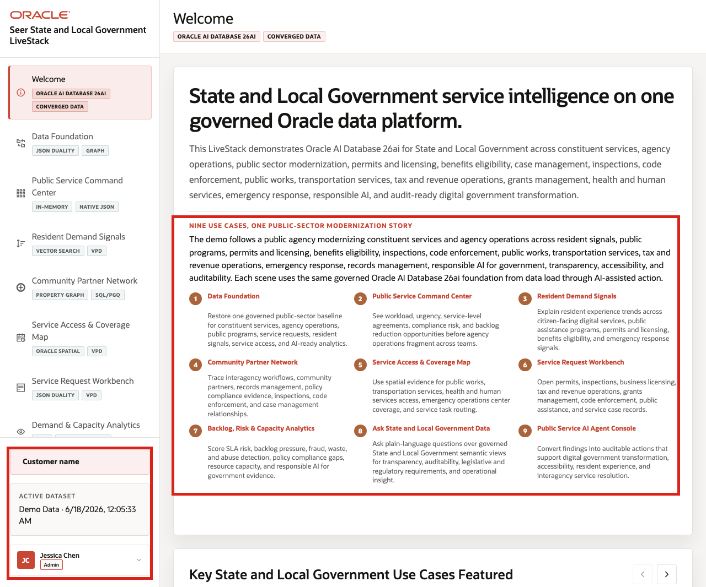
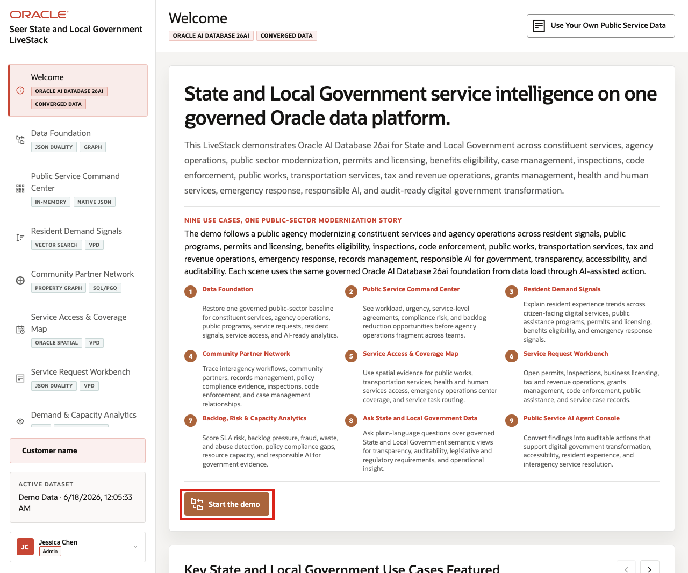

# Scene 1 Welcome and Demo Orientation

## Introduction

This opening scene gives users a quick roadmap for the State and Local Government demo. The page frames a public agency modernization story that starts with a governed data foundation and then moves through constituent demand, service pressure, community partner relationships, access geography, analytics, natural-language data access, and AI-assisted action.

Use this scene to orient the audience before showing any single feature. Jessica Chen, the agency digital services lead, needs a shared operating picture for programs that span resident services, permits and licensing, benefits, inspections, public works, and emergency response. The welcome page explains how the rest of the demo follows that story on one Oracle AI Database 26ai foundation.

Estimated Time: **5 minutes**

### Objectives

In this scene, you will learn how the demo is organized, what public-sector decisions the application supports, and how to move from orientation into the guided workflow.

## Task 1: Review the modernization story

Review the welcome page first so the audience understands the complete public-sector journey. The page introduces the agency scenario, the governed Oracle data platform, and the use cases that will be explored during the demo.

1. Click **Welcome** in the sidebar if the page is not already open.
2. Read the State and Local Government service intelligence statement.
3. Review the use-case tiles for data foundation, constituent services, agency operations, public programs, service access, analytics, Ask Data, and AI agent action.
4. Point out the active dataset and user context in the left navigation.

    

The welcome page frames the demo as service intelligence on one governed Oracle data platform. It prepares the audience to see public-sector operations as one connected workflow instead of a set of disconnected point tools.

## Task 2: Start the guided workflow

After the audience understands the demo themes, start the guided workflow. The application moves from the orientation page into the governed data foundation that powers every later public-sector scene.

1. Click **Start the demo**.
2. Confirm the demo moves to **Data Foundation**.
3. Return to **Welcome** if you want to show the orientation page again.

    

Use this transition to explain that the welcome page is the orientation layer. The next scenes use the same public-sector dataset to inspect service pressure, resident demand, partner coordination, and response options.

*You can move to the next scene.*

## Credits & Build Notes
- **Author** - Oracle LiveLabs Team
- **Last Updated By/Date** - Oracle LiveLabs Team, 2026-06-17
