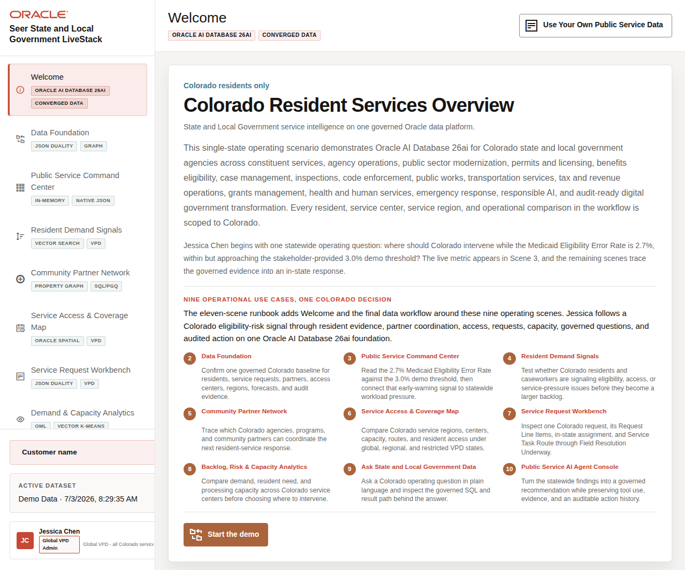
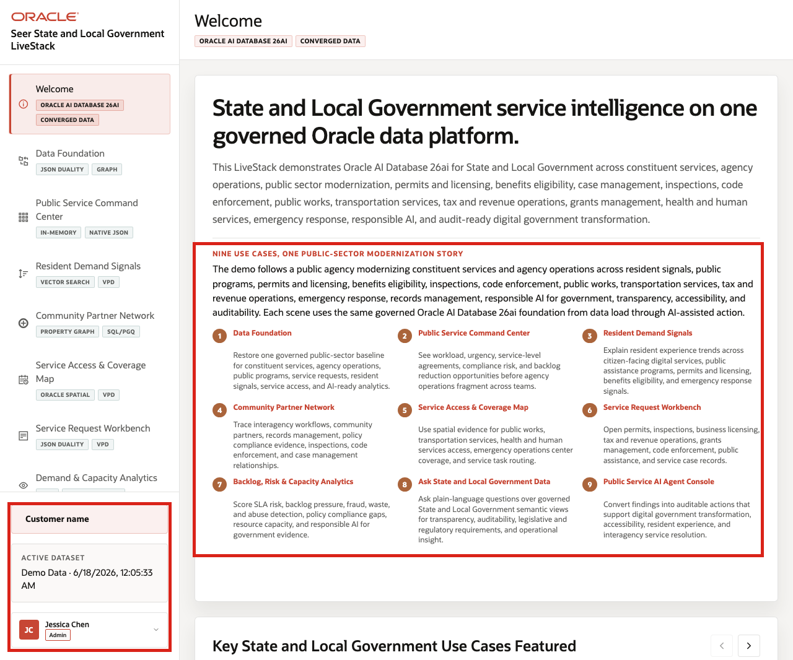
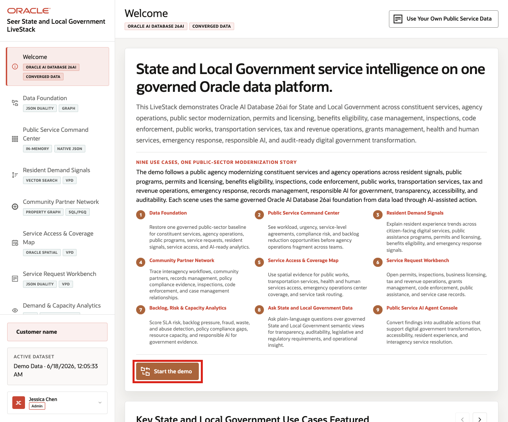

# Scene 1 Welcome and Demo Orientation

## Introduction

Jessica Chen is preparing a statewide Colorado resident-services briefing. A Medicaid Eligibility Error Rate of **2.7%** is approaching the stakeholder-provided **3.0%** demo threshold, so she needs to determine whether demand, regional capacity, or service coordination requires intervention. The Welcome page establishes the broader operating environment before the live metric appears in Scene 3.

The application covers more than Medicaid. The eligibility metric motivates one connected investigation across **Colorado**'s broader resident-service portfolio, so presenters should avoid framing the walkthrough as a Medicaid-only demo.

**Note:** Sample values may change after data refreshes or rebuilds. Verify live output before presenting, then explain the business takeaway.

Estimated Time: **5 minutes**

### Objectives

In this scene, you will establish **Jessica Chen**'s role, confirm the single-state **Colorado** scope, and understand how the eleven scenes resolve one operating decision.

## Task 1: Establish the Colorado operating decision

Perform the following set of steps to establish the **Colorado** operating decision and orient the audience to **Jessica Chen**'s role:

1. Click **Welcome** in the sidebar if the page is not already open.
2. Confirm **Colorado residents only** and **Colorado Resident Services Overview**.
3. Confirm that Jessica Chen is identified as the **Global VPD Admin** with access to all Colorado service regions.
4. Review the nine operational use-case groups with the carousel controls.
5. Explain that the eleven-scene runbook adds this Welcome orientation and the final data workflow around those nine operating scenes.

    

The audience now knows who is making the decision, which jurisdiction is in scope, and why the team is investigating. The 2.7% metric is the motivating signal; it does not make every workload a Medicaid case.

**Note:** Sample values may change after data refreshes or rebuilds. Verify live output before presenting, then explain the business takeaway.

## Task 2: Begin the governed investigation

Perform the following set of steps to begin the governed investigation and move from orientation into the shared data foundation:

1. Click **Start the demo**.
2. Confirm that **Data Foundation** opens.
3. Explain that every later result uses the same governed Colorado baseline.

    

Jessica starts with evidence integrity before interpreting risk. That keeps the remaining scenes connected to one operating decision rather than presenting them as independent feature demonstrations.

*You can move to the next scene.*

## Credits & Build Notes

- **Author** - Oracle LiveLabs Team
- **Last Updated By/Date** - Oracle LiveLabs Team, 2026-07-03
