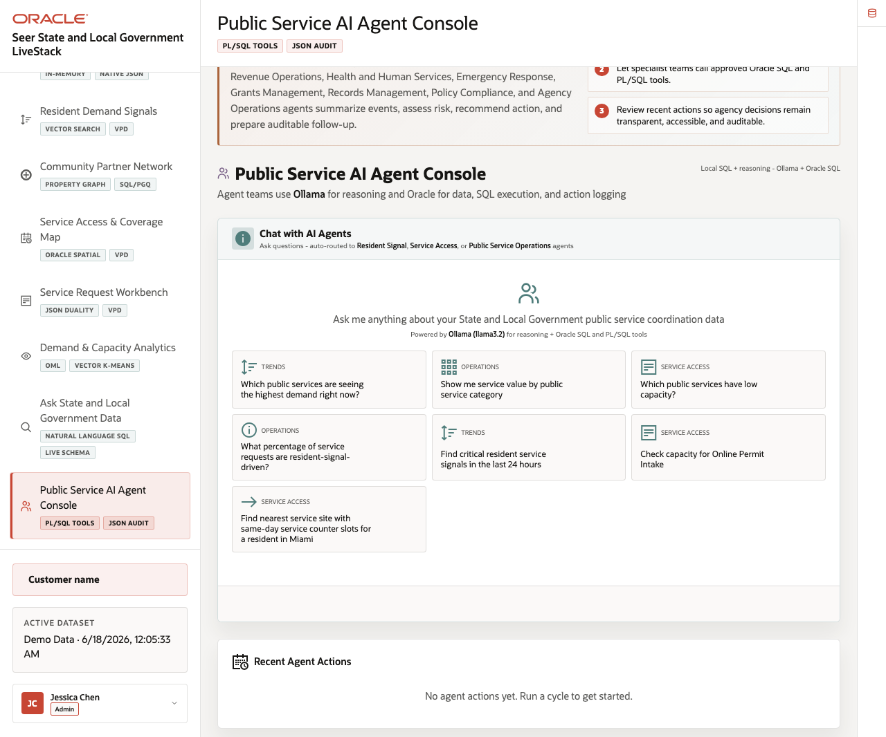
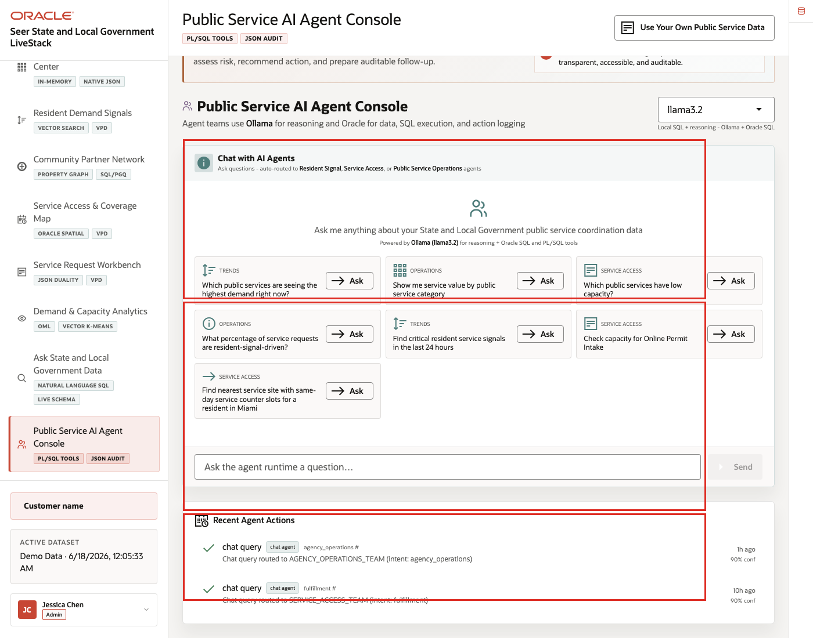
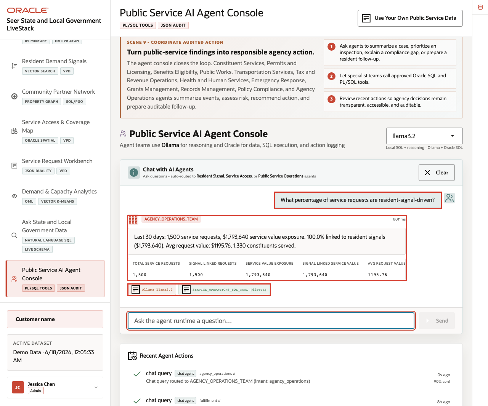
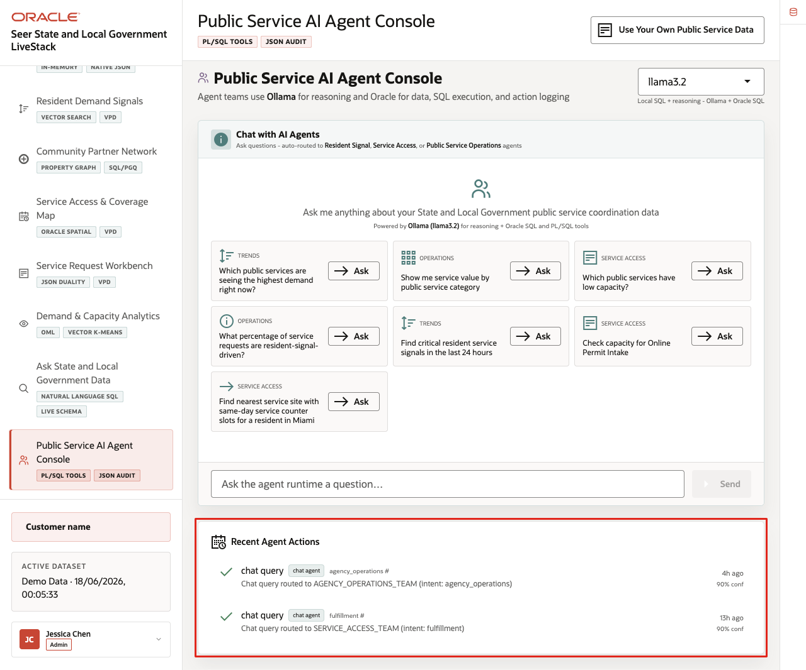

# Scene 10 Public Service AI Agent Console

## Introduction

The **Public Service AI Agent Console** shows how AI-assisted operations can remain grounded in governed public-sector data. A user can ask questions that route to resident signal, service access, or public service operations agents, while Oracle records tool use and action history.

This scene is the action checkpoint in the story. The agency has seen resident demand, services under pressure, partner relationships, access geography, service requests, and capacity forecasts. The agent console helps the team ask what to do next while keeping the evidence path and audit trail visible.

Estimated Time: **12 minutes**

### Objectives

In this scene, you will review the agent workspace, ask an example agent question, inspect the response, and review the action history that supports audit-ready AI operations.

## Task 1: Review the agent console workspace

Perform the following set of steps to orient the audience before running an agent question.

1. Click **Public Service AI Agent Console** in the sidebar.
2. Review the available agent teams for resident signals, service access, and public service operations.
3. Review the example prompt cards, input box, runtime profile, and recent action area.

    

The workspace shows that the agent experience is tied to public-sector operating tasks, not an open-ended chat surface.

## Task 2: Ask an agent question

Perform the following set of steps when the audience wants to see AI-assisted public-service operations.

1. Click an example question such as **What percentage of service requests are resident-signal-driven?**, or type your own question.
2. Click **Ask** or **Send**.

    

**Expected result:** The agent response references public-service evidence instead of generic model prose. Use the response to connect agent reasoning to the same service, signal, map, and capacity data shown in earlier scenes.

## Task 3: Inspect action history

Perform the following set of steps to show how AI activity remains reviewable.

1. Review the latest action history or event stream on the page.
2. Look for tool names, status badges, and agent action records.
3. Switch runtime profile if the control is available and explain what changes.

    

The audit trail is the governance story for this scene. The agency can show what was asked, which tools were used, and which records supported the response.

*You can move to the next scene.*

## Credits & Build Notes
- **Author** - Oracle LiveLabs Team
- **Last Updated By/Date** - Oracle LiveLabs Team, 2026-06-17
