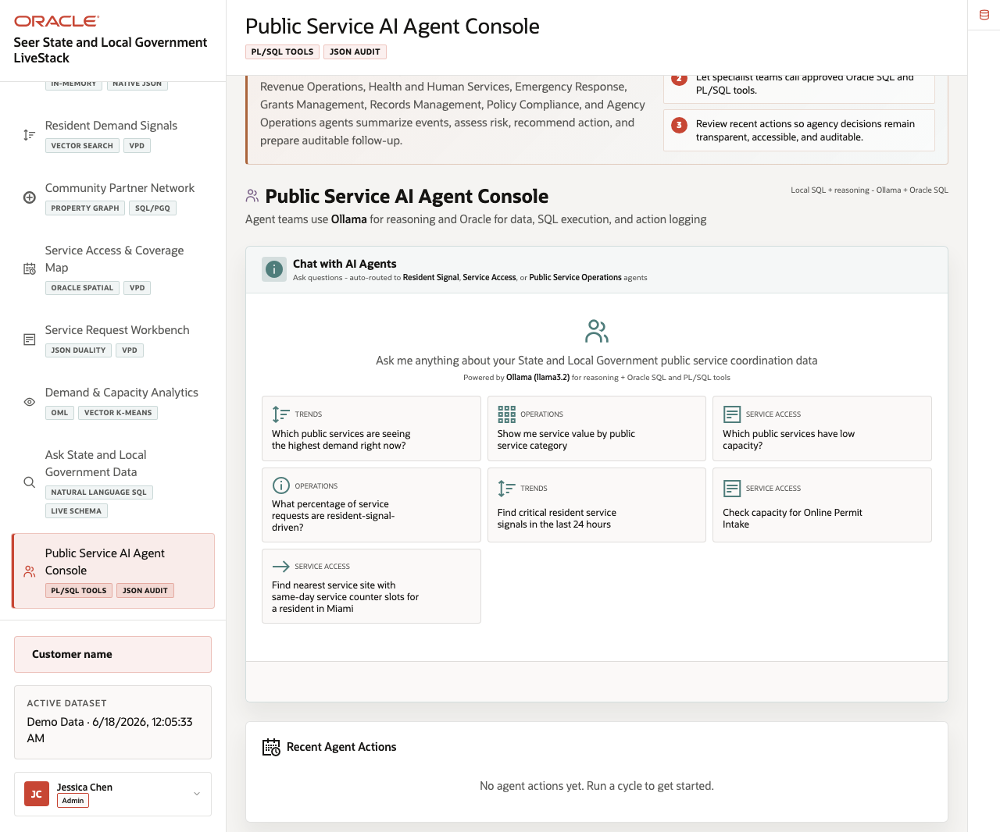
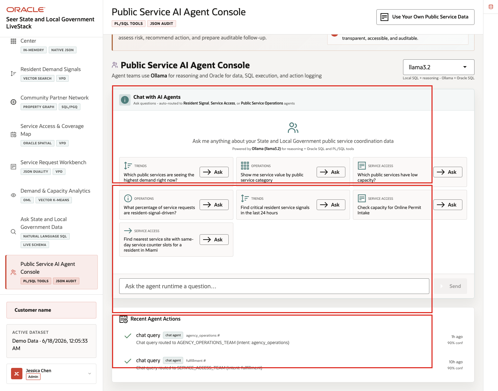
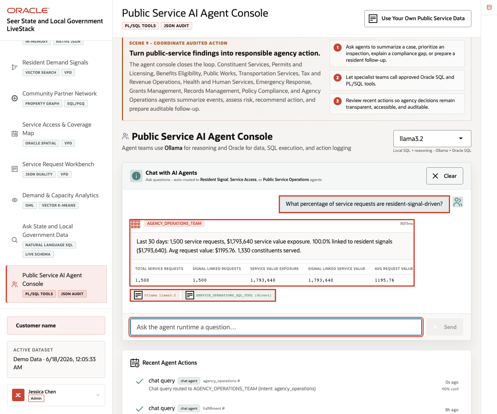
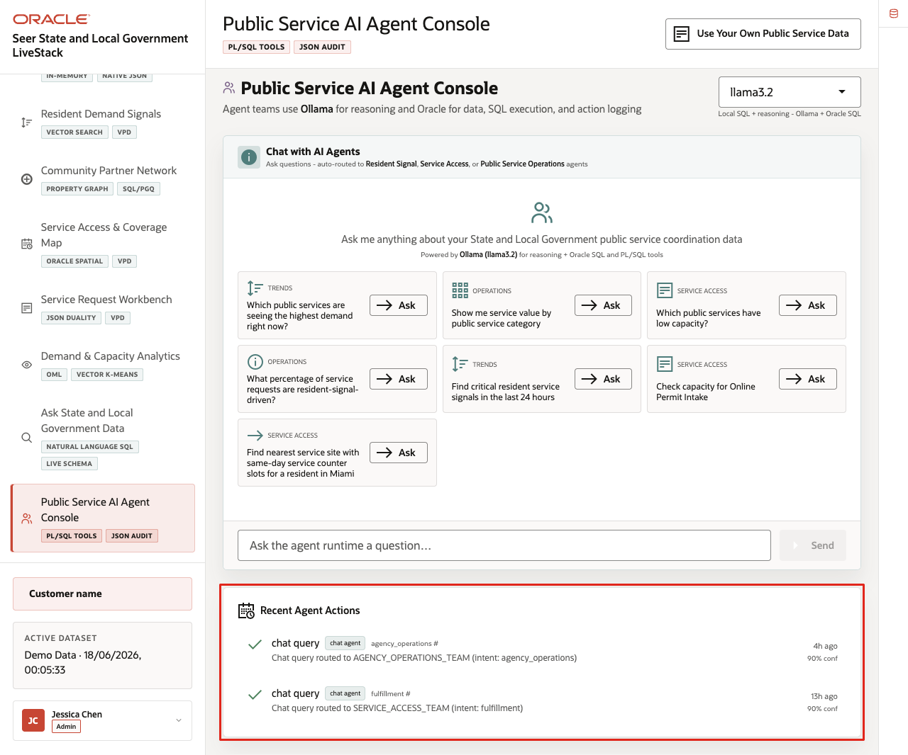

# Scene 10 Public Service AI Agent Console

## Introduction

The **Public Service AI Agent Console** closes the Colorado operating loop. Jessica asks for an in-state response to the identified service and capacity pressure, then verifies that the recommendation is grounded in authorized data and recorded in the action audit trail.

The agent proposes and explains an action. It does not silently reallocate capacity or make an eligibility determination.

Estimated Time: **10 minutes**

### Objectives

In this scene, you will review the specialist teams, ask a stable capacity question, inspect response evidence, and verify the Recent Agent Actions audit trail.

## Task 1: Review the governed agent workspace

1. Click **Public Service AI Agent Console** in the sidebar.
2. Review the Resident Signal, Service Access, and Public Service Operations teams.
3. Review the example prompts, input box, runtime profile, and Recent Agent Actions area.

    

The workspace is tied to Colorado resident-service operations and approved Oracle tools rather than acting as an unrestricted chat surface.

## Task 2: Ask for the constrained-service evidence

1. Select or enter: **Which public services have low capacity?**
2. Click **Ask** or **Send**.
3. Review the routed specialist team, response evidence, tool badges, statuses, and returned data.
4. Connect the answer to the capacity decision from Scene 8.

    

The response proposes where Jessica should investigate or coordinate. Human review remains responsible for any operational decision.

## Task 3: Inspect the action audit trail

1. Review **Recent Agent Actions**.
2. Identify the newly logged interaction by timestamp.
3. Inspect tool names, status, and action evidence.
4. Open **Oracle Internals** and connect the visible interaction to `agent_actions`.

    

The audit trail shows what was asked, which governed tools were used, and which data supported the response. This is the accountable-action endpoint of Jessica's investigation.

*You can move to the next scene.*

## Credits & Build Notes

- **Author** - Oracle LiveLabs Team
- **Last Updated By/Date** - Oracle LiveLabs Team, 2026-07-03
