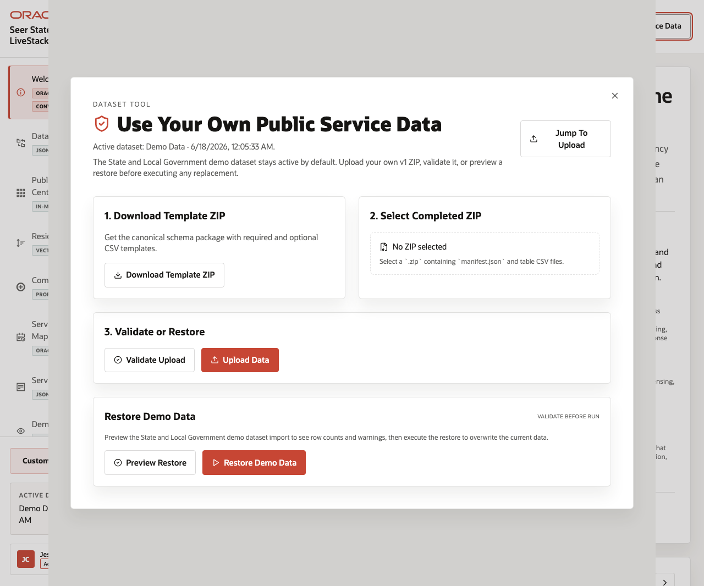
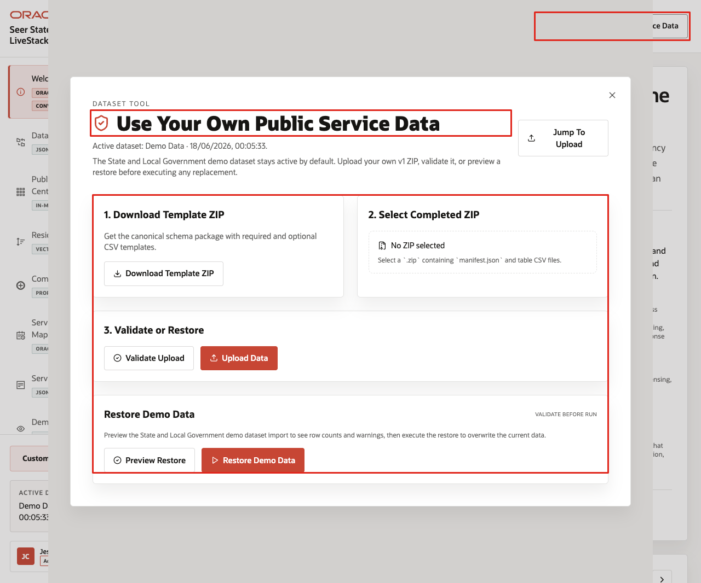
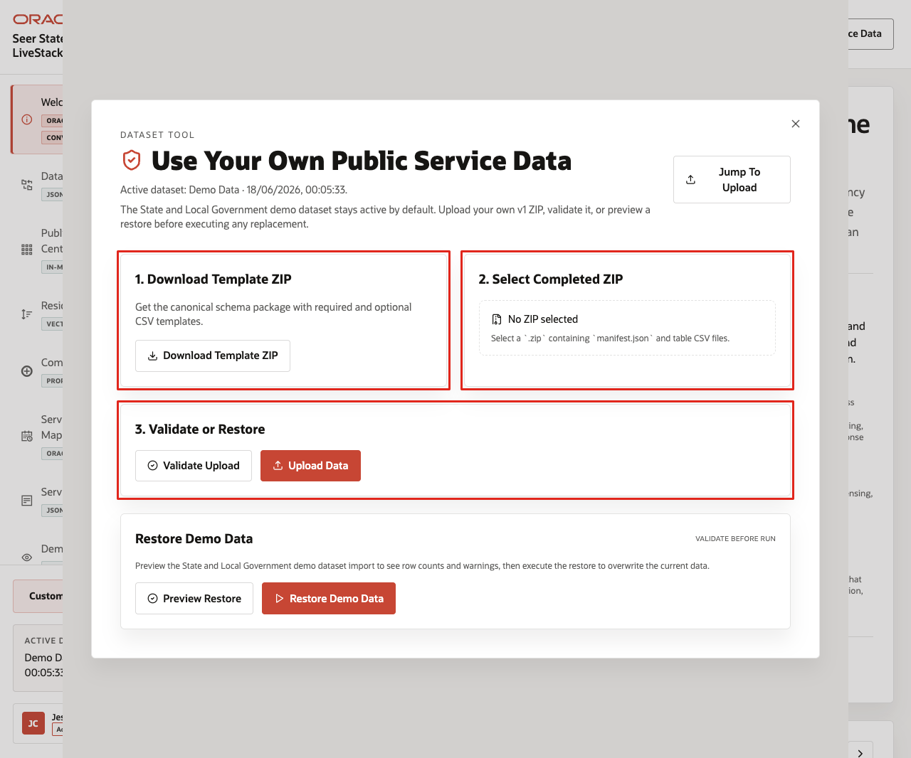
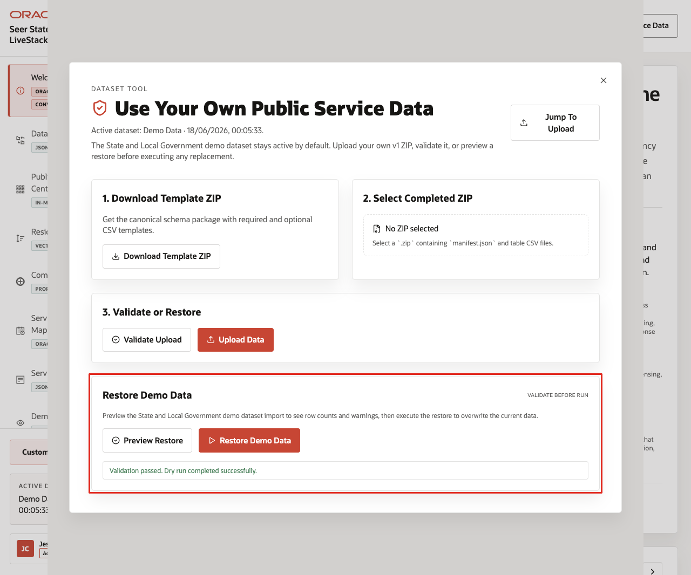

# Scene 11 Use Your Own Public Service Data

## Introduction

**Use Your Own Public Service Data** shows how users can replace or restore the dataset through the application while keeping the demo safe and repeatable.

The workflow supports template download, ZIP validation, upload, seeded-data restore, and the expectation that only synthetic or anonymized public-sector data is used.

This scene matters because a State and Local Government LiveStack is most useful when teams can map the demo pattern to their own terminology and sample data. The application makes that workflow explicit while keeping the seeded Seer public-sector data available as a known-good baseline.

Estimated Time: **10 minutes**

### Objectives

In this scene, you will learn how to open the dataset manager, review the template and upload workflow, and restore the seeded demo data when needed.

## Task 1: Open the dataset tool

Perform the following set of steps to show where users can manage datasets and to reinforce the key safety rule: use only synthetic or anonymized public-sector data.

1. From any application scene, click **Use Your Own Public Service Data** in the top bar.
2. Review the modal title and active dataset line.
3. Confirm that the modal explains the guided path for loading data or continuing with the current demo dataset.
4. Review the main sections for template download, completed ZIP selection, validation, upload, and restore demo data.

    

In the current demo, the modal shows the active dataset as **Demo Data** and provides a workflow for a ZIP package containing a manifest and table CSV files.

**Note:** Use only synthetic or anonymized public-sector data in a demo environment.

## Task 2: Review the template and upload workflow

Perform the following set of steps to show how custom datasets stay repeatable. The template defines the expected structure, validation checks the completed ZIP, and upload remains a deliberate action.

1. Click **Download Template ZIP** to download the canonical schema package.
2. Review **Select Completed ZIP**. The control expects a `.zip` containing a manifest and table CSV files.
3. Review the **Validate Upload** and **Upload Data** actions.
4. Explain that validation should run before data replacement.

    

This workflow keeps custom demos repeatable and safe: the template defines the structure, validation checks the package, upload is explicit, and seeded data remains available for reset.

## Task 3: Preview or restore the seeded dataset

Perform the following set of steps to return the demo to a known-good baseline after testing custom synthetic or anonymized data.

1. In the restore section, click **Preview Restore**.
2. Review the validation status shown by the preview.
3. If you need to return the demo to the seeded baseline, click **Restore Demo Data** after the successful preview.
4. Close the dataset manager when finished.

    

Use this scene to explain the operating guardrail: teams can bring synthetic or anonymized data into the LiveStack, but the seeded dataset remains available as a known baseline.

You can move to the download lab when you want to run the State and Local Government LiveStack locally.

## Credits & Build Notes
- **Author** - Oracle LiveLabs Team
- **Last Updated By/Date** - Oracle LiveLabs Team, 2026-06-17
