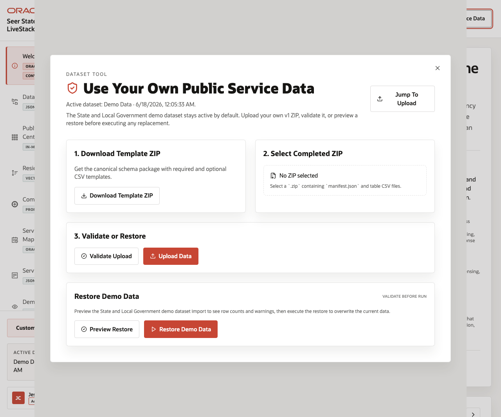
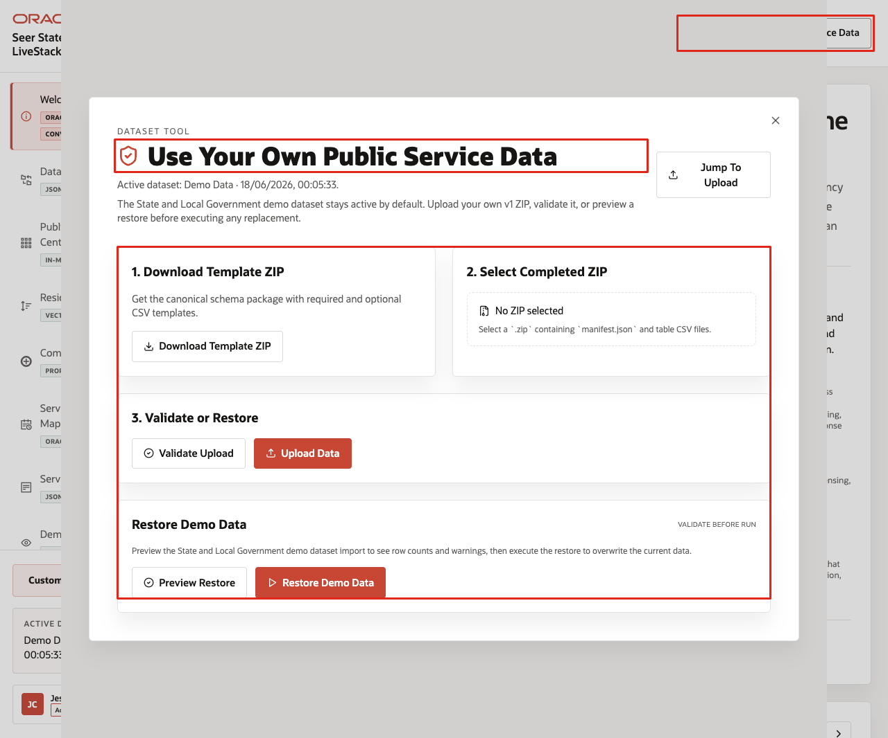
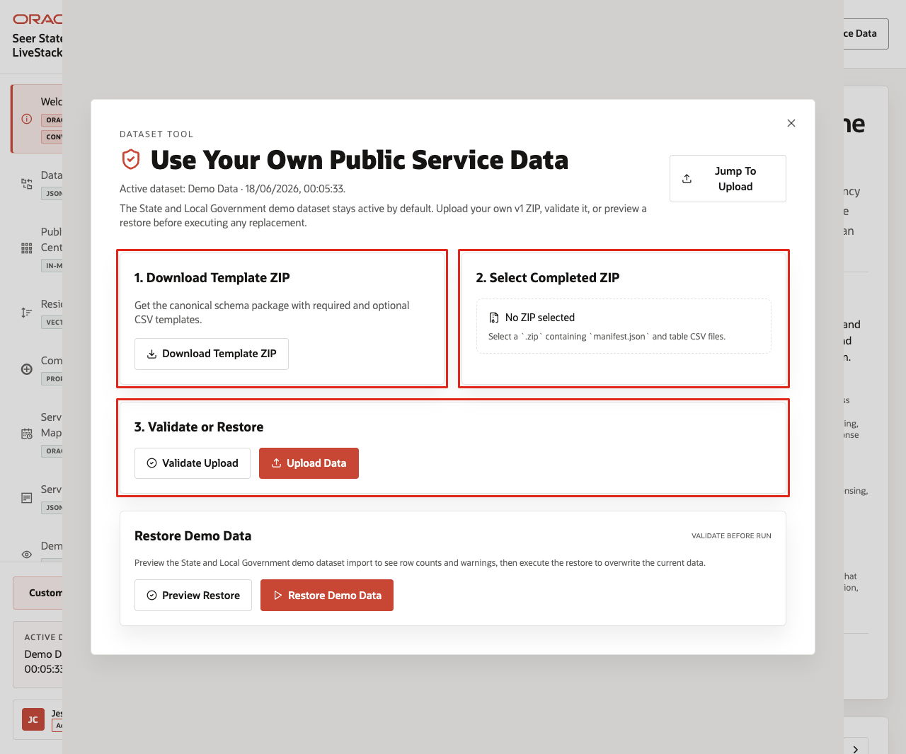
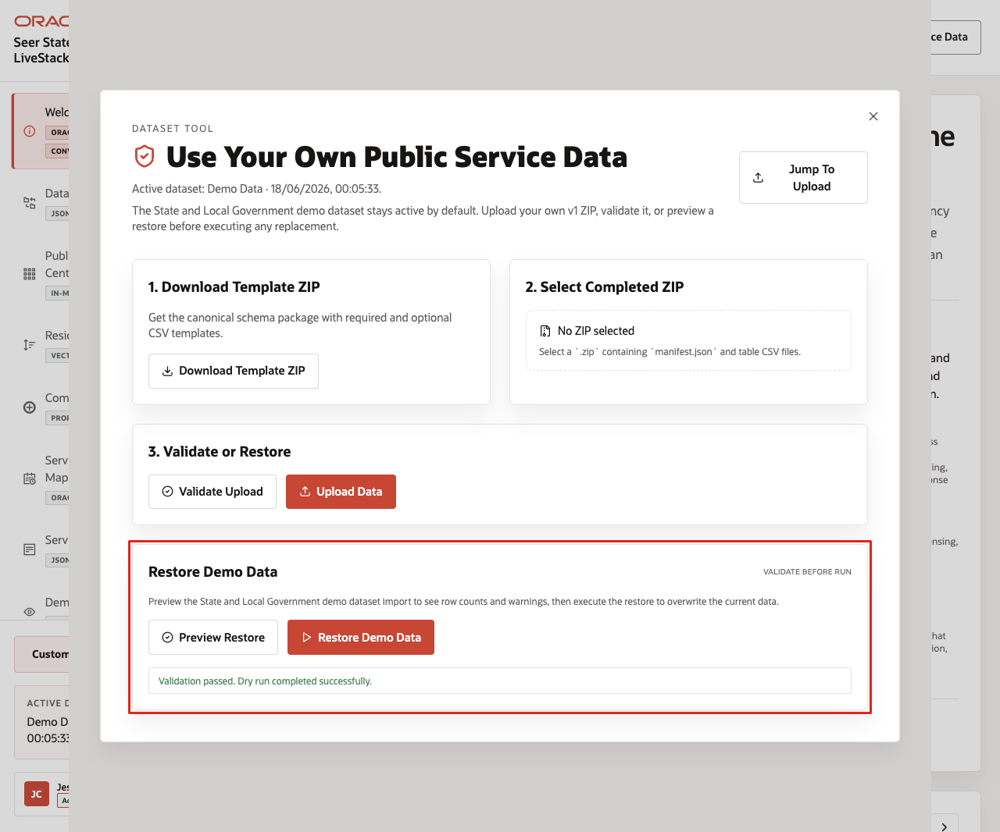

# Scene 11 Use Your Own Public Service Data

## Introduction

**Use Your Own Public Service Data** shows how teams can adapt the **LiveStack** pattern to their own resident-service data while preserving the seeded **Colorado** baseline as a repeatable demo state.

Dataset status, validation, upload, restore preview, restore, and job status require a Global VPD Admin. Use only synthetic, anonymized, or approved de-identified data. Never upload resident production data, credentials, wallets, or other secrets to this demo environment.

Estimated Time: **10 minutes**

### Objectives

In this scene, you will review template download, completed ZIP upload, validation, restore preview, and seeded-data restore controls while reinforcing safe data-handling expectations.

## Task 1: Open the dataset tool

Perform the following set of steps to open the dataset tool as the global administrator:

1. Confirm Jessica Chen is selected.
2. From any application scene, click **Use Your Own Public Service Data**.
3. Confirm **Demo Data** is the active dataset.
4. Review the global-access and safe-data guidance.

    

The global requirement prevents a regional or restricted identity from replacing the shared demonstration dataset.

## Task 2: Review the template and validation workflow

Perform the following set of steps to review the template and validation workflow for customer-provided public-service data:

1. Click **Download Template ZIP**. The canonical template filename is `sled-service-operations-import-template-v1.zip`.
2. Explain that the archive contains `manifest.json` plus required and optional CSV templates.
3. Review **Select Completed ZIP** and choose a completed package only when conducting an intentional data test.
4. Review **Validate Upload** and **Upload Data**.
5. Explain that validation must succeed before replacement and that upload validates again on the server.

    

The template and validation steps make custom demonstrations repeatable while keeping the seeded Colorado scenario available as a known baseline.

## Task 3: Preview the seeded-data restore

Perform the following set of steps to preview the seeded-data restore without disrupting a shared workshop environment:

1. Click **Preview Restore**.
2. Review expected row counts, validation messages, and warnings.
3. Do not click **Restore Demo Data** during the normal walkthrough.
4. If an intentional upload or restore is performed later, show the Job ID, progress, terminal state, and the refreshed operational pages.

    

The preview makes the reset impact visible before any replacement begins. **Restore Demo Data** should be used only when the operator intentionally wants to return the environment to its known seeded state.

You can move to the Take It Home lab when you want to run the State and Local Government LiveStack locally.

## Credits & Build Notes

- **Author** - Oracle LiveLabs Team
- **Last Updated By/Date** - Oracle LiveLabs Team, 2026-07-03
