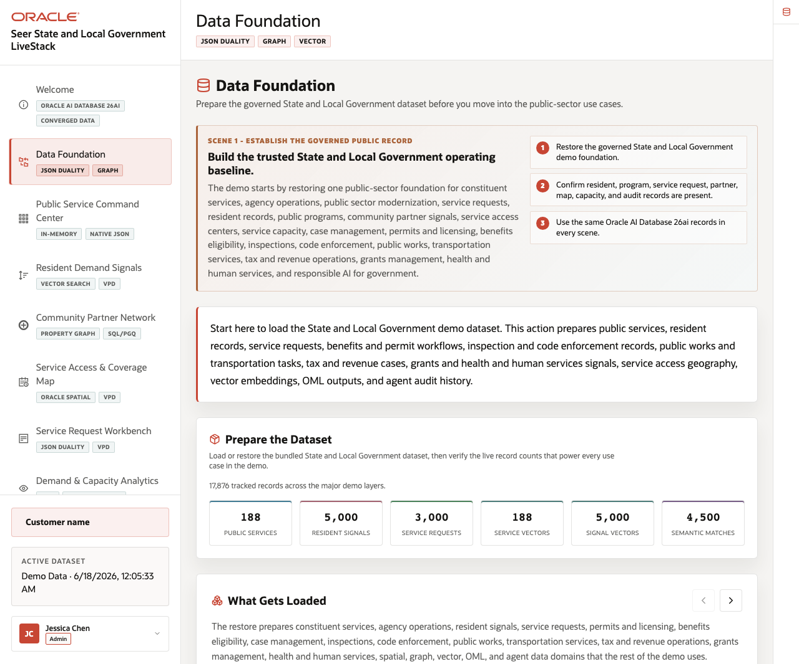
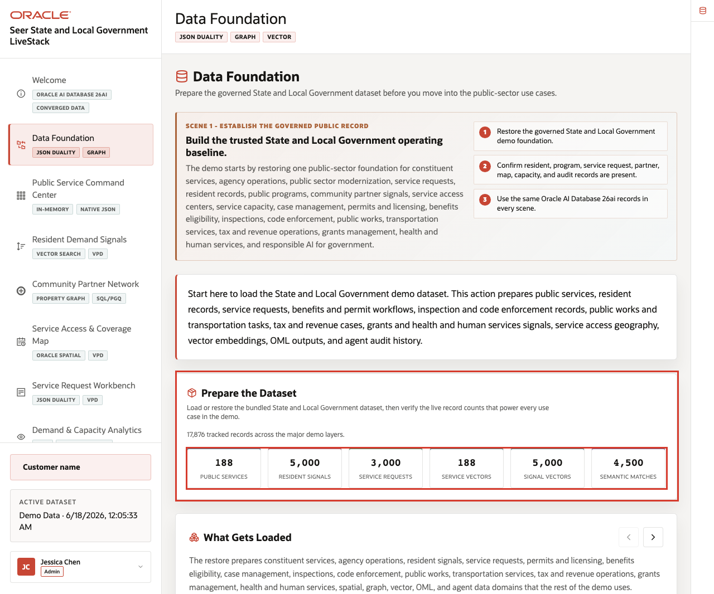
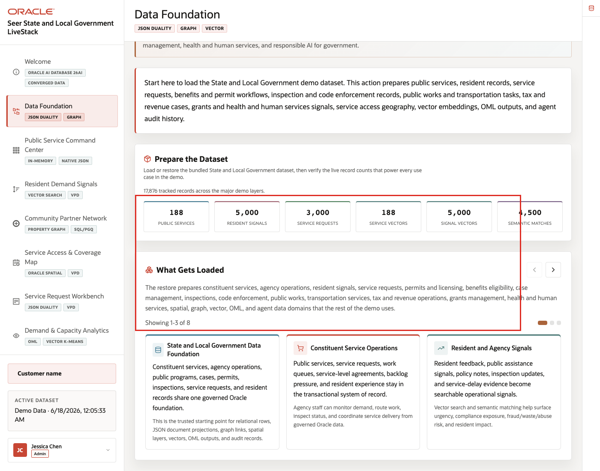
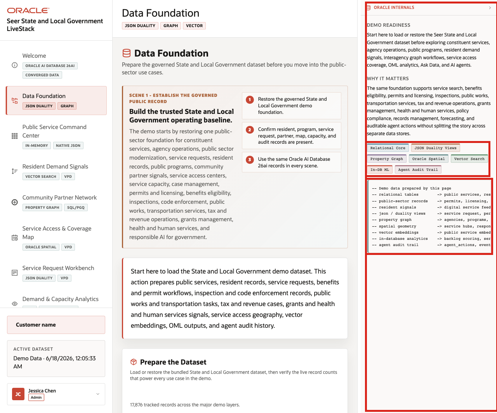

# Scene 2 Data Foundation

## Introduction

This scene prepares the trusted public-sector dataset used throughout the demo. Loading or restoring the data gives every later screen the same governed starting point, so dashboards, vector search, graph views, maps, service requests, analytics, Ask Data, and agent actions all reflect the same State and Local Government data foundation.

Use this scene to show that later pages are not separate demos. They are different agency workflows running on one governed Oracle AI Database 26ai foundation.

Estimated Time: **5 minutes**

### Objectives

In this scene, you will learn what public-sector decision the page supports, what evidence the user should inspect, and what action the team may take next.

**Note:** Review the Oracle Internals sidebar after the business flow is clear. Use it to connect the visible public-sector outcome to the database capabilities behind the page.

## Task 1: Prepare the dataset

Perform the following set of steps so every later scene starts from the same trusted agency baseline. This makes the command center, signal search, graph, map, service requests, analytics, Ask Data, and agent results easier to compare and trust.

1. Click **Data Foundation** in the sidebar.
2. Review the data foundation summary for constituent services, agency operations, public programs, service requests, resident signals, service access, and AI-ready analytics.
3. Review the **Prepare the Dataset** record counts for public services, resident signals, service requests, vectors, and semantic matches.
4. Use the dataset manager in Scene 11 when the environment needs a restore, upload, or validation workflow.

    

Use these counts to show that the dataset supports operational, analytical, spatial, graph, vector, machine learning, and audit workflows, not just a single dashboard.

**Note:** Sample values may change after data refreshes or rebuilds. Verify live output before presenting, then explain the business takeaway.

## Task 2: Review what gets loaded

Perform the following set of steps to show that the dataset is broad enough to support the full public-sector story.

1. Scroll to **What Gets Loaded**.
2. Review the visible data domains for constituent service operations, resident and agency signals, public programs, service requests, service sites, and related public-sector records.
3. Explain that later scenes use the same prepared data rather than separate, disconnected samples.

    

This step helps the audience understand why the rest of the runbook can move from dashboards to vectors, graphs, maps, service requests, machine learning, Ask Data, and agents without changing data foundations.

## Task 3: Connect the foundation to downstream scenes

Perform the following set of steps to show how the same agency data foundation powers the rest of the demo.

1. Review the capability groups for relational operations, JSON duality, property graph, spatial access, vector search, OML, natural-language SQL, and agent audit records.
2. Open the **Oracle Internals** rail if it is collapsed.
3. Connect each capability group to a later scene in the sidebar.

    

The business value is that teams can make the decision from connected, governed data. Oracle AI Database provides the shared foundation that keeps operational data, analytics, and AI workflows aligned.

*You can move to the next scene.*

## Credits & Build Notes
- **Author** - Oracle LiveLabs Team
- **Last Updated By/Date** - Oracle LiveLabs Team, 2026-06-17
