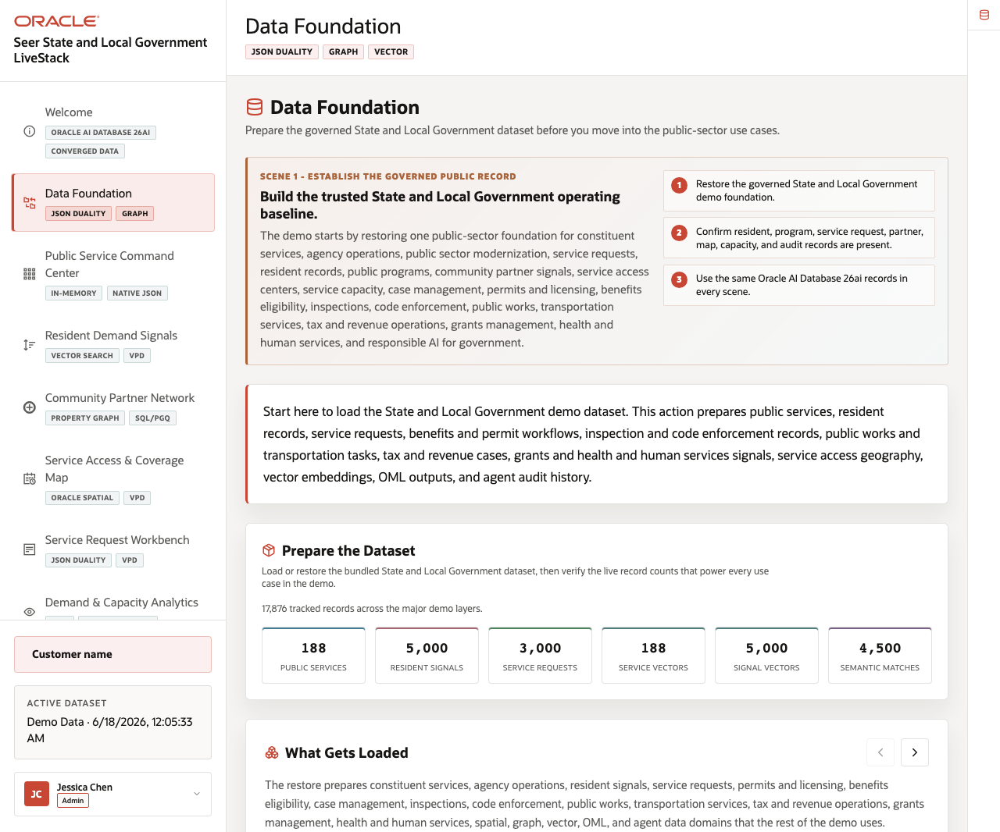
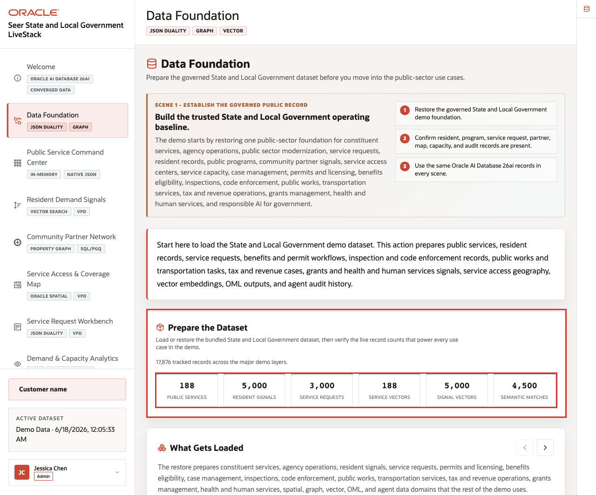
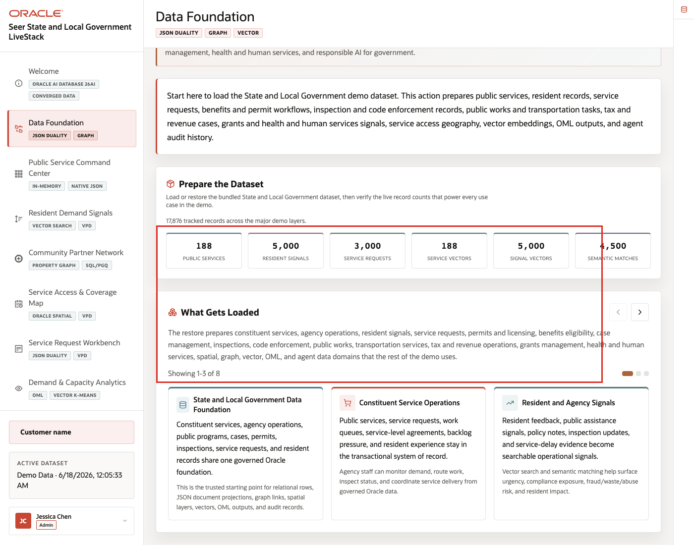
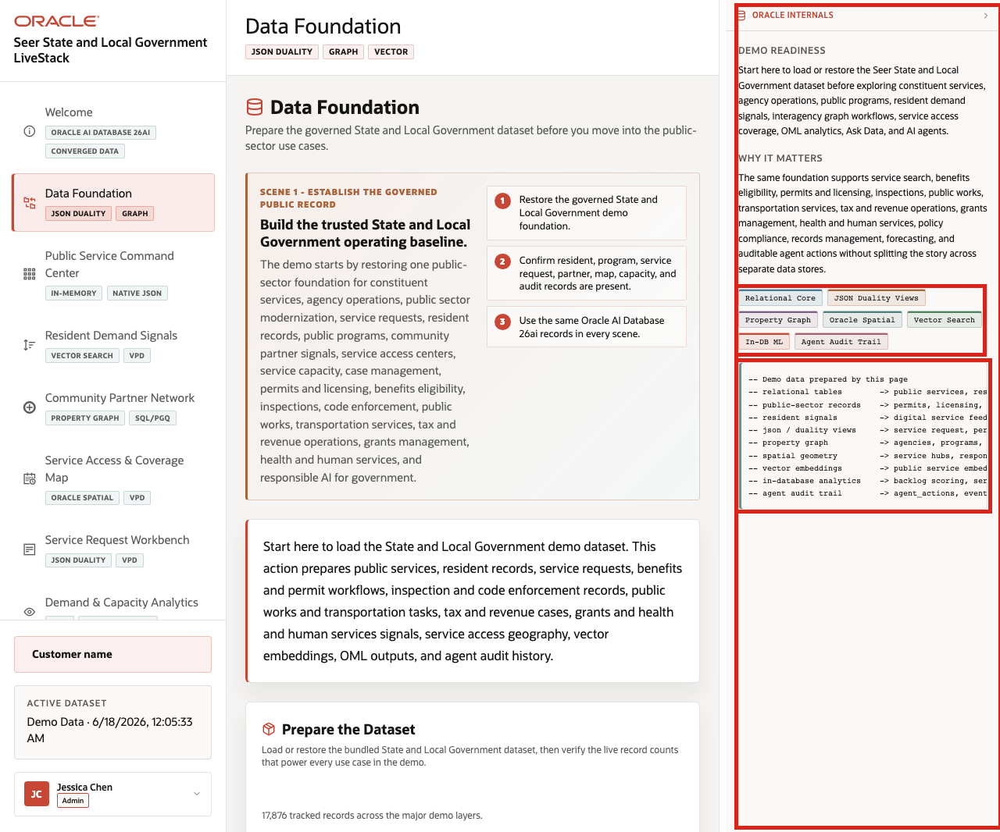

# Scene 2 Data Foundation

## Introduction

Before **Jessica Chen** acts on the eligibility-risk signal, she verifies that residents, service requests, service centers, partner relationships, geographic layers, forecasts, and audit records come from one governed **Colorado** dataset. This gives every later scene the same evidence baseline.

Estimated Time: **5 minutes**

### Objectives

In this scene, you will confirm that live records are populated, connect Oracle workloads to later business steps, and avoid changing the dataset during the normal presentation.

## Task 1: Confirm the governed Colorado baseline

Perform the following set of steps to confirm that the governed **Colorado** baseline is populated before presenting downstream scenes:

1. Click **Data Foundation** in the sidebar.
2. Review the live counts for Public Services, Resident Signals, Service Requests, Service Vectors, Signal Vectors, and Semantic Matches.
3. Confirm that the values are populated.
4. Do not click **Restore Demo Data** during the normal walkthrough. Use restoration only when intentionally resetting the seeded environment.

    

Use the counts to establish that later dashboards, vectors, graphs, maps, requests, and agents are different views of one prepared **Colorado** baseline.

## Task 2: Review the connected service domains

Perform the following set of steps to show that the foundation includes multiple connected public-service domains, not only the eligibility-risk signal:

1. Scroll to **What Gets Loaded**.
2. Use the carousel to inspect all capability groups.
3. Call out benefits eligibility as one governed domain alongside permits, inspections, public works, emergency response, and other state services.

    

The breadth of the foundation matters because the Medicaid metric is an early-warning signal inside a larger state-services operating model.

## Task 3: Trace the evidence into the operating workflow

Perform the following set of steps to trace the evidence foundation into the operating workflow and prepare the transition to the command center:

1. Open **Oracle Internals** after the business story is clear.
2. Link relational records to requests, vectors to resident signals, graph data to partner coordination, Spatial data to coverage, OML to capacity, and audit records to agent action.
3. Transition to the command center to interpret the risk signal.

    

Jessica has established data trust. She can now treat the **2.7%** rate and the surrounding workload indicators as connected operational evidence rather than isolated dashboard values.

**Note:** Sample values may change after data refreshes or rebuilds. Verify live output before presenting, then explain the business takeaway.

*You can move to the next scene.*

## Credits & Build Notes

- **Author** - Oracle LiveLabs Team
- **Last Updated By/Date** - Oracle LiveLabs Team, 2026-07-03
