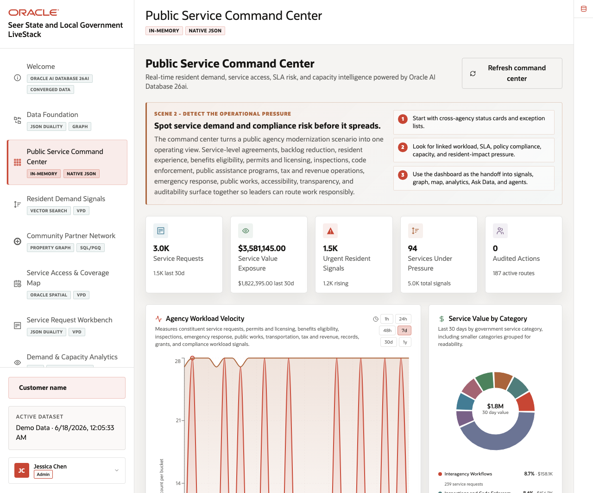
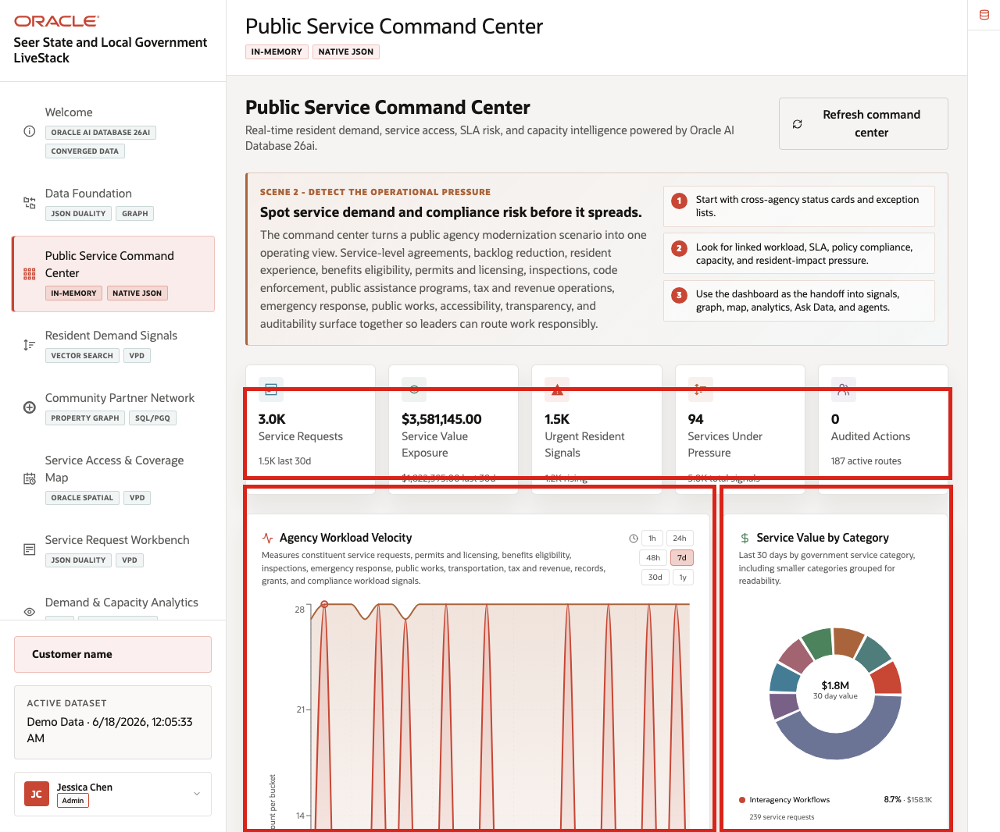
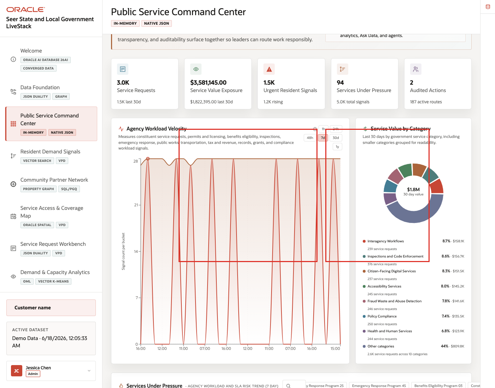
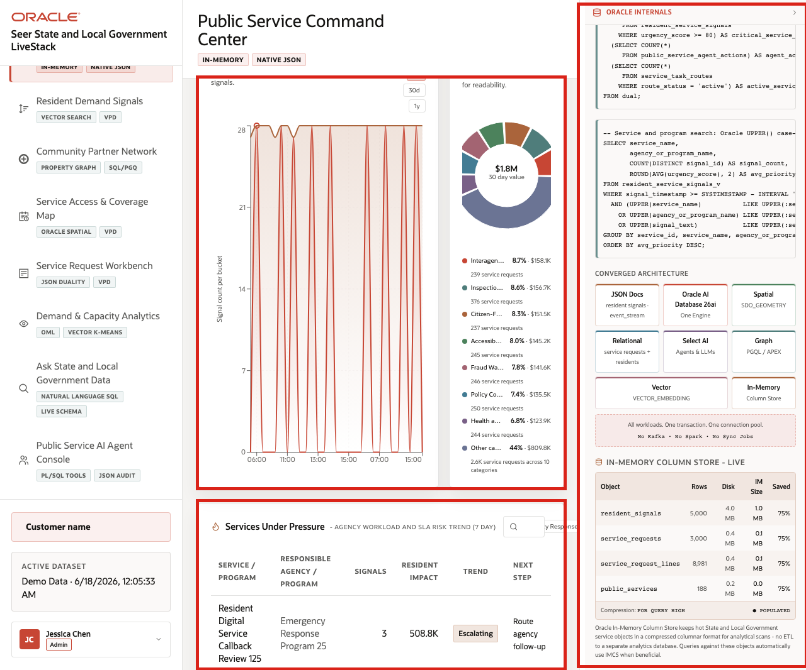

# Scene 3 Public Service Command Center

## Introduction

The **Public Service Command Center** helps agency leaders answer a daily operating question: *Which public services need attention right now?*

The page brings together service request volume, public service value, urgent resident signals, services under pressure, and AI activity so a state or local government team can decide where to investigate first.

Dashboards like this are difficult to implement when service requests, resident messages, program data, partner relationships, capacity information, and agent activity live in different systems. Teams often need copied extracts, separate BI models, and reconciliation logic before a dashboard can show a trustworthy view.

Oracle AI Database helps address that challenge by keeping operational, analytical, JSON, in-memory, and AI-ready data close to the same governed data foundation. In this scene, the dashboard brings together live public-sector KPIs, signal velocity, service category value, and services under pressure without sending the user to another application.

Estimated Time: **10 minutes**

### Objectives

In this scene, you will learn what public-sector decision the page supports, what evidence the user should inspect, and what action the team may take next.

**Note:** Review the Oracle Internals sidebar after the business flow is clear. Use it to connect the visible public-sector outcome to the database capabilities behind the page.

## Task 1: Review the command center dashboard

Use the dashboard as a daily triage view. The goal is to see where service demand, value, urgent resident signals, capacity pressure, or AI activity suggests the agency needs attention.

1. Click **Public Service Command Center** in the sidebar.
2. Review the KPI cards across the top of the page.
3. Note where the resident signal velocity and service value panels sit in the daily triage view.
4. Review the services-under-pressure table.

    

Use the KPI cards to frame the command center as a triage surface: the user can see request volume, service value, urgent signals, watched services, and AI activity in one place.

**Note:** Sample values may change after data refreshes or rebuilds. Verify live output before presenting, then explain the business takeaway.

## Task 2: Interpret signal velocity and service value

Perform the following set of steps when the audience needs to understand why the dashboard is more than a set of counters.

1. Review **Agency Workload Velocity** to see how resident signals and service demand are moving over time.
2. Review **Service Value by Category** to see which public-service categories carry the most operating exposure.
3. Compare the chart direction with the KPI cards above it.

    

The velocity and value panels help a leader decide whether pressure is isolated, recurring, or tied to a high-value public-service category.

## Task 3: Inspect services under pressure

Perform the following set of steps to move from dashboard-level pressure to specific services, programs, or locations that may need attention.

1. Use the search or filter control in the services-under-pressure area.
2. Select or review a service with notable demand or signal momentum.
3. Compare the service row with the signal velocity and value charts.
4. Open the Oracle Internals rail to explain how live data supports the view.

    

The services-under-pressure table turns the KPI story into a set of operating decisions. A public-sector leader can move from "urgent signals are rising" to a specific service, partner, or operating response that needs review.

*You can move to the next scene.*

## Credits & Build Notes
- **Author** - Oracle LiveLabs Team
- **Last Updated By/Date** - Oracle LiveLabs Team, 2026-06-17
