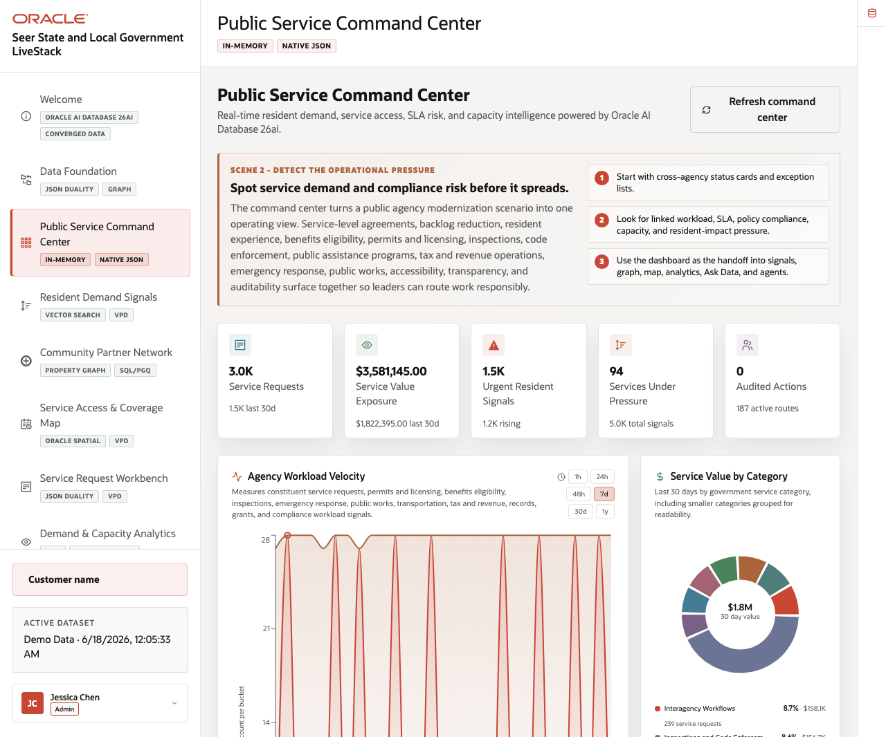
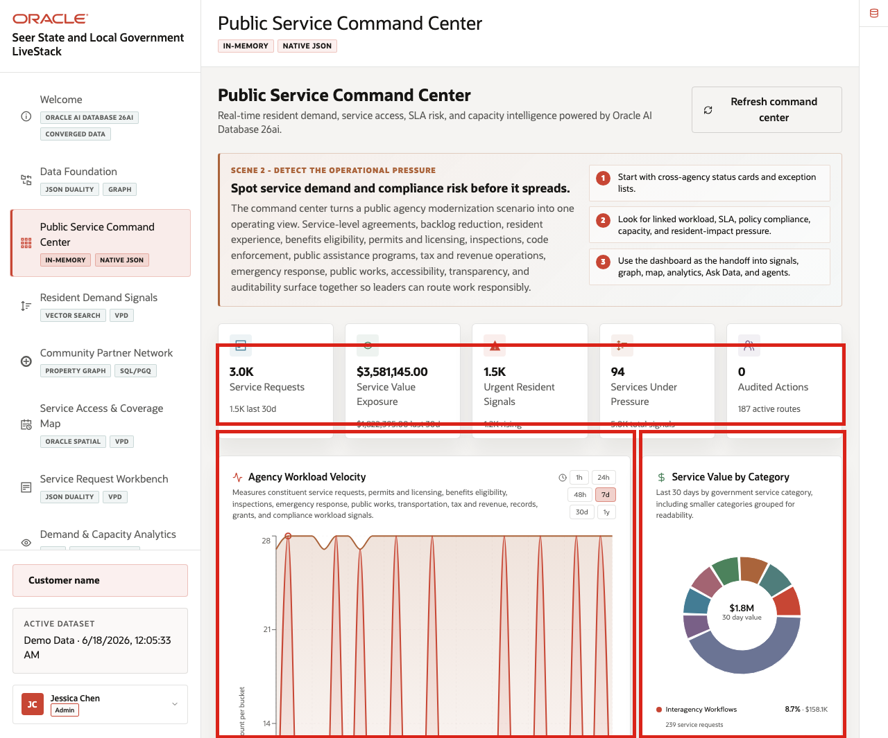
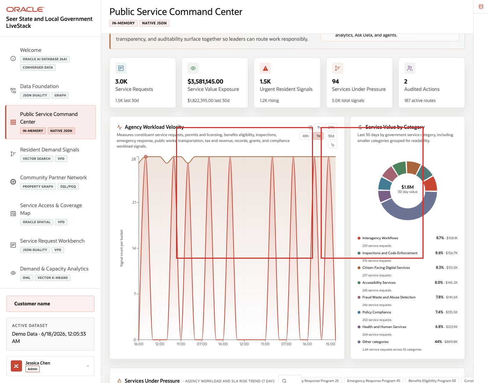
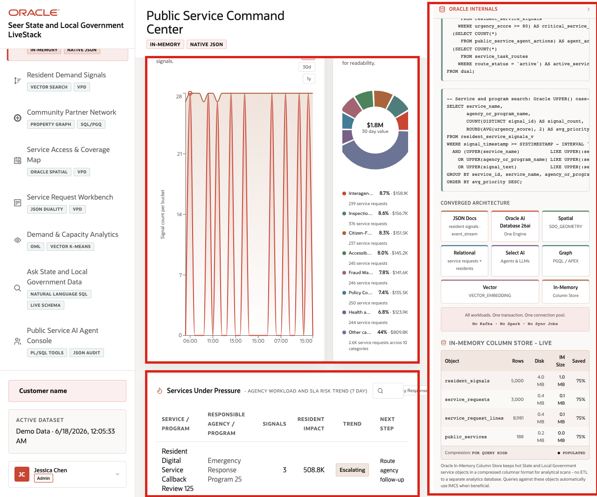

# Scene 3 Public Service Command Center

## Introduction

The command center gives Jessica the signal that starts the investigation: Colorado's **Medicaid Eligibility Error Rate is 2.7%**, within the stakeholder-provided **3.0% demo threshold** but close enough to be classified as **Approaching Threshold**. Jessica now needs to determine whether resident demand and service pressure justify intervention.

**Approaching Threshold** does not mean the threshold has been exceeded. The page separately confirms **Within 3.0% limit**. Rates above the stakeholder-provided threshold may create potential federal matching-fund exposure; this demo does not calculate a penalty or provide a legal determination.

Estimated Time: **10 minutes**

### Objectives

In this scene, you will interpret the eligibility-risk metric, connect it to statewide pressure, and choose the evidence thread that Jessica will investigate.

## Task 1: Read the eligibility-risk signal

1. Click **Public Service Command Center** in the sidebar.
2. Read **Current rate: 2.7%**, **Demo threshold: 3.0%**, **Approaching Threshold**, and **Within 3.0% limit**.
3. Review the explanatory copy or tooltip.
4. State that this is the demo's decision trigger, not a penalty calculation.

    

Jessica treats the metric as an early-warning indicator. Colorado is not above threshold, but waiting removes operating margin.

## Task 2: Connect risk to statewide operating pressure

1. Review Service Requests, Service Value Exposure, Urgent Resident Signals, Services Under Pressure, and Audited Actions.
2. Compare **Agency Workload Velocity** with **Service Value by Category**.
3. Look for benefits eligibility or adjacent health-and-human-services pressure without implying that every workload is Medicaid-related.

    

The dashboard connects the early-warning metric to the broader operating environment in which accuracy, timeliness, and service capacity are managed.

## Task 3: Choose the investigation thread

1. Search **Services Under Pressure** for `benefits` or `eligibility`.
2. Open a matching row when one is available.
3. Record the service or program, request volume, signal momentum, and capacity evidence to investigate in Scene 4.

    

Jessica leaves the executive view with a concrete hypothesis: eligibility-related demand or workflow pressure may be narrowing the state's remaining margin before the 3.0% threshold. The next scene tests that hypothesis against resident signals.

*You can move to the next scene.*

## Credits & Build Notes

- **Author** - Oracle LiveLabs Team
- **Last Updated By/Date** - Oracle LiveLabs Team, 2026-07-03
