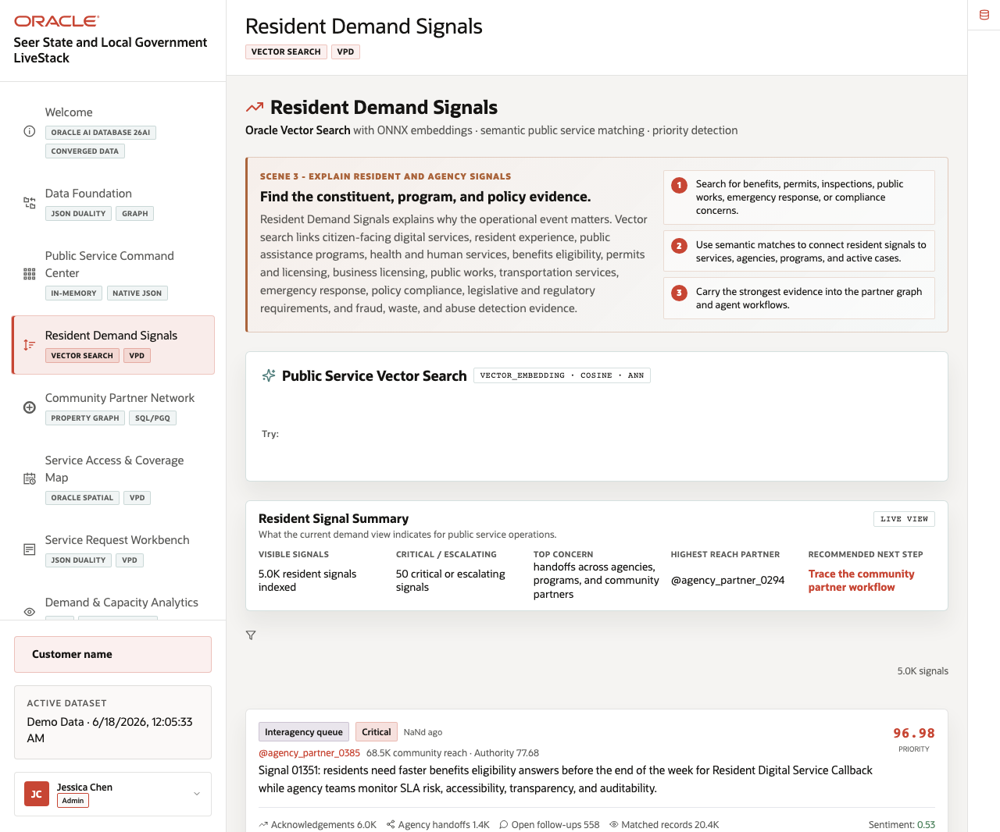
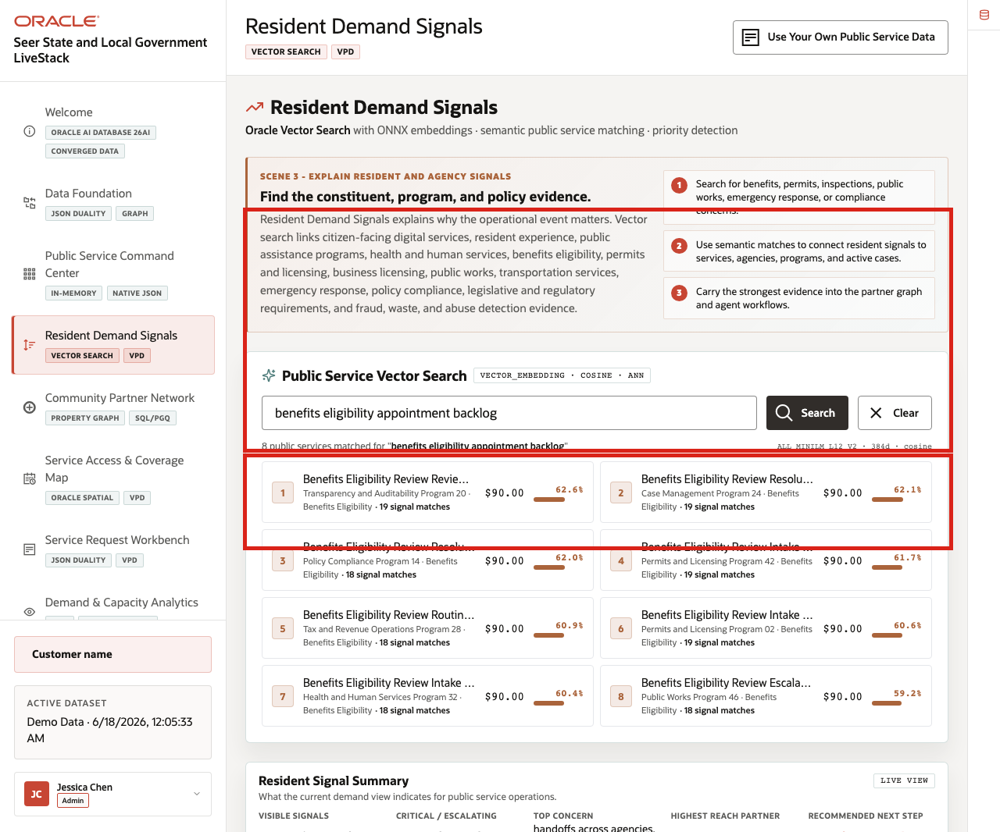
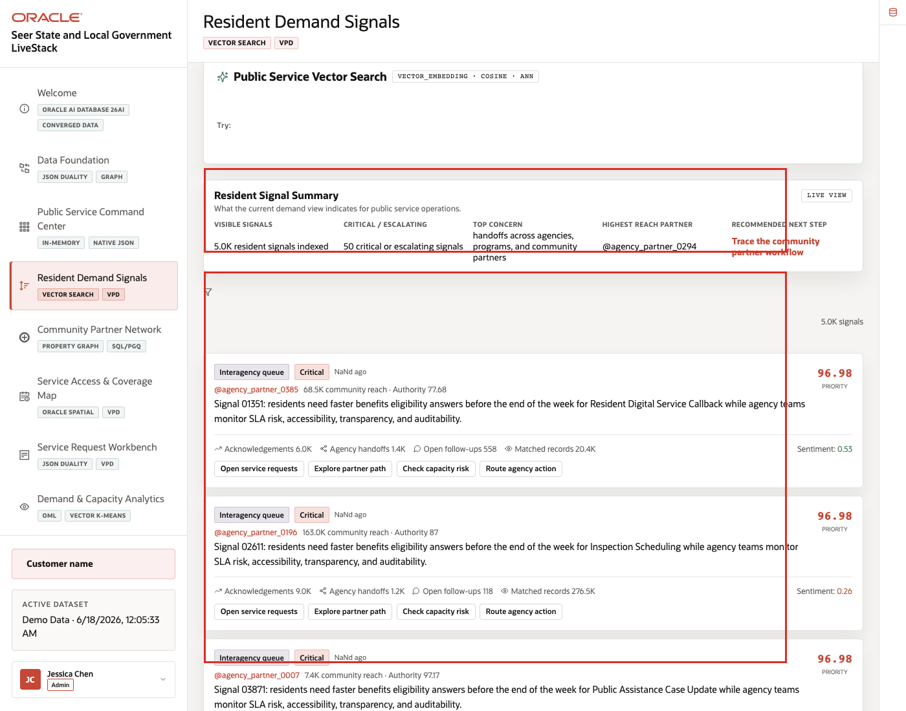
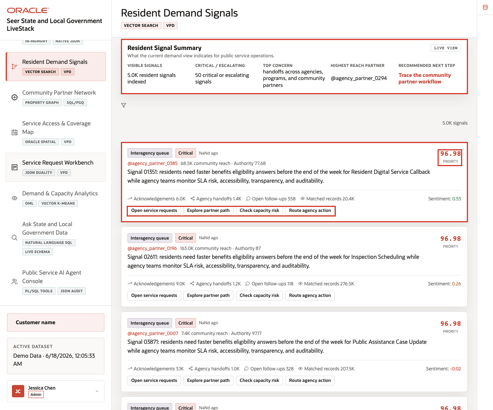

# Scene 4 Resident Demand Signals

## Introduction

**Resident Demand Signals** helps an agency analyst connect plain-language constituent concerns to the services and programs already governed in Oracle AI Database. A resident may describe the same issue as "rental help," "housing assistance," "eviction support," or "benefits intake." The application uses vector search so analysts can find related public services even when the wording is not exact.

This scene matters because demand often appears before a formal service request is created. Resident messages, contact-center notes, outreach summaries, community partner updates, and public feedback can all point to pressure that the agency should understand earlier.

Estimated Time: **10 minutes**

### Objectives

In this scene, you will learn how State and Local Government teams can use in-database embeddings to discover related public services, review resident signal momentum, and connect emerging demand to the operating response.

## Task 1: Run public service vector search

Perform the following set of steps when the audience wants to see semantic search instead of keyword matching.

1. Click **Resident Demand Signals** in the sidebar.
2. In **Public Service Vector Search**, enter a phrase such as `emergency rental assistance`, `permit intake`, or `food assistance`.
3. Click **Search**.
4. Review the ranked public services and similarity scores.

    

**Expected result:** The page returns semantically related services, not just exact keyword matches. The Oracle evidence connects the result to vector embeddings, vector distance, ONNX embeddings, and approximate nearest-neighbor search.

## Task 2: Review resident signal summary

Perform the following set of steps to connect the search result to the visible signal summary.

1. Review **Resident Signal Summary**.
2. Compare total resident signals, critical or escalating signals, top concerns, impact area, and recommended next step.
3. Explain how this summary gives the analyst a fast operating read before opening individual signal cards.

    

The summary turns many resident messages into a concise operating signal that a constituent-services team can use for triage.

## Task 3: Interpret resident signal cards

Perform the following set of steps to connect a plain-language resident concern to the signals that may require agency attention.

1. Review the resident signal feed.
2. Compare the highest-priority signal cards with the matched service results from Task 1.
3. Use the visible status labels to explain which resident needs should move into service intake, partner coordination, or follow-up.

    

The signal feed helps the agency understand where public demand is moving. Use this page to explain that constituent service teams can connect early resident concerns to service definitions and response paths already governed in Oracle.

*You can move to the next scene.*

## Credits & Build Notes
- **Author** - Oracle LiveLabs Team
- **Last Updated By/Date** - Oracle LiveLabs Team, 2026-06-17
