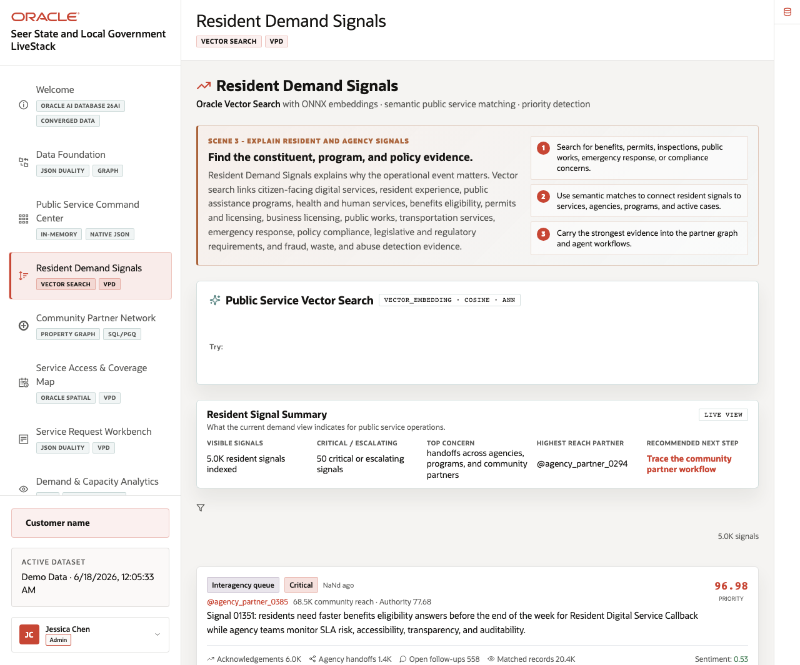
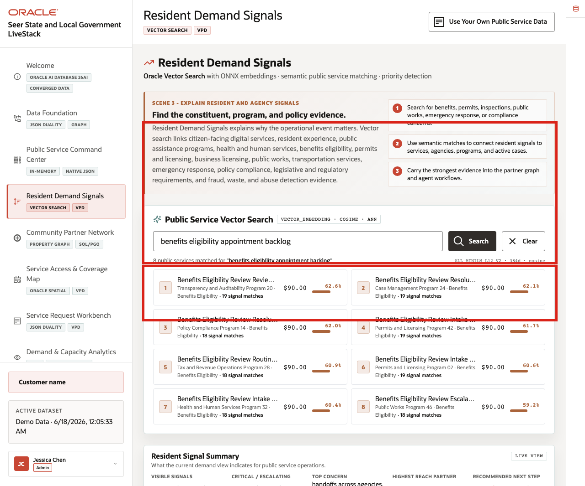
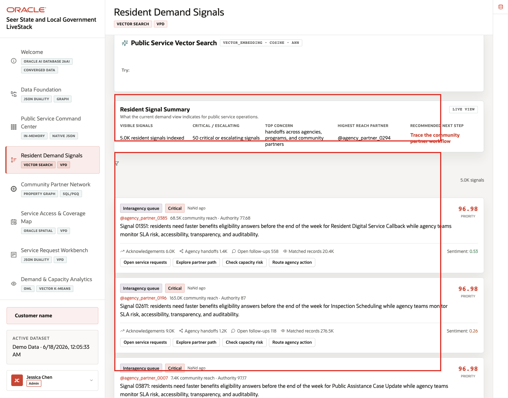
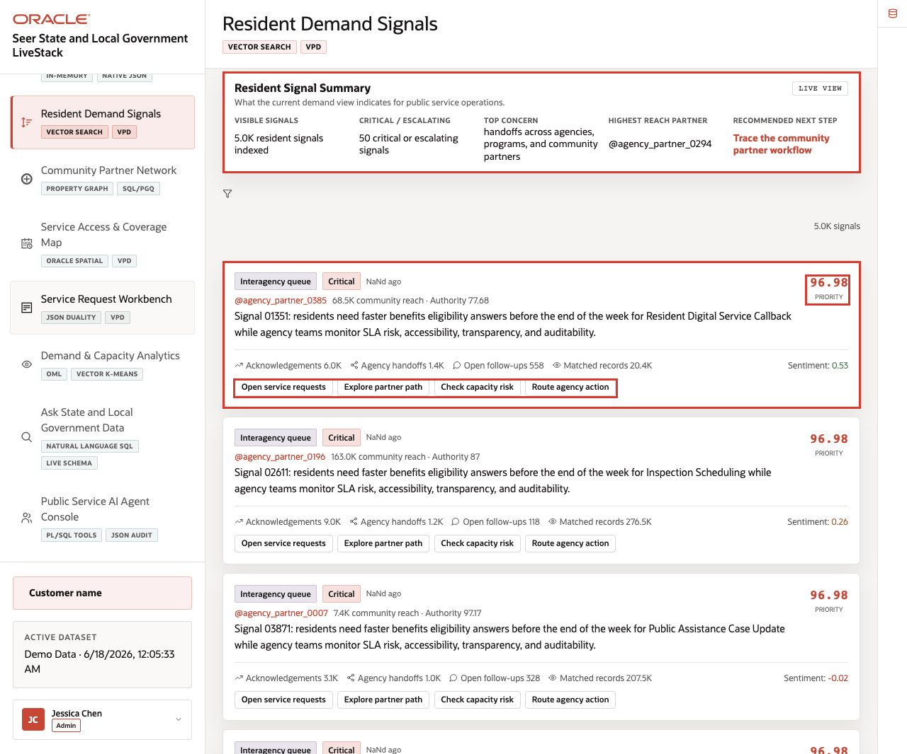

# Scene 4 Resident Demand Signals

## Introduction

Jessica now asks whether Colorado residents and caseworkers are signaling an eligibility-service problem before it becomes a larger backlog or accuracy issue. Vector search connects plain-language concerns to governed services even when the wording differs.

Estimated Time: **10 minutes**

### Objectives

In this scene, you will search for eligibility-related services, interpret the Colorado resident signal summary, and select evidence for partner coordination.

## Task 1: Search for eligibility-related services

1. Click **Resident Demand Signals** in the sidebar.
2. Enter `benefits eligibility appointment backlog` in Public Service Vector Search.
3. Click **Search**.
4. Review the ranked public services and similarity scores.
5. Explain that semantic similarity, rather than exact keyword matching, produced the list.

    

Jessica can connect an operating concern to relevant eligibility, assistance, and resident-service definitions without maintaining a separate keyword taxonomy.

## Task 2: Read the Colorado resident signal summary

1. Review **Resident Signal Summary**.
2. Compare total signals, critical or escalating signals, top concern, impact area, and recommended next step.
3. Keep the interpretation tied to Colorado residents and the active VPD identity.

    

The summary turns many resident and caseworker observations into a concise operating signal that Jessica can compare with the 2.7% eligibility-risk indicator.

## Task 3: Select evidence for partner coordination

1. Compare the highest-priority signal cards with the vector matches.
2. Note the source channel, priority label, partner, signal text, and follow-up activity.
3. Carry the strongest eligibility-related evidence into the Community Partner Network.

    

The risk signal now has resident context. Jessica has evidence of what people are experiencing and can identify which in-state organizations should coordinate next.

*You can move to the next scene.*

## Credits & Build Notes

- **Author** - Oracle LiveLabs Team
- **Last Updated By/Date** - Oracle LiveLabs Team, 2026-07-03
