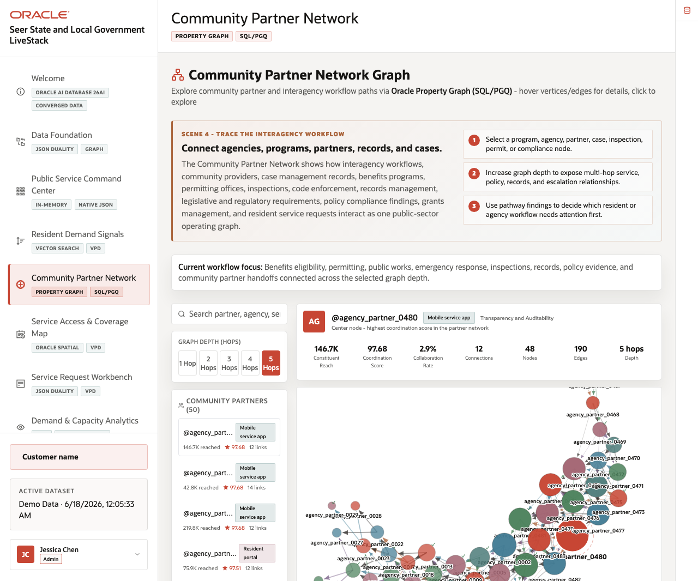
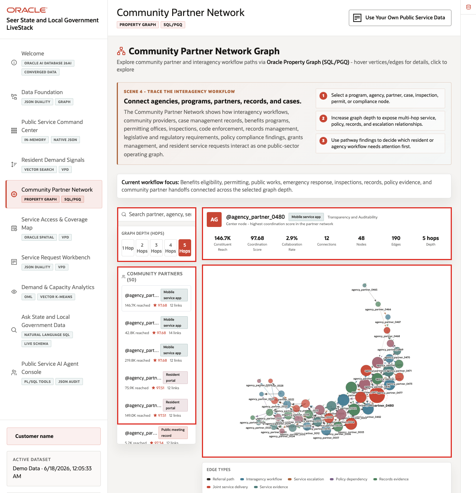
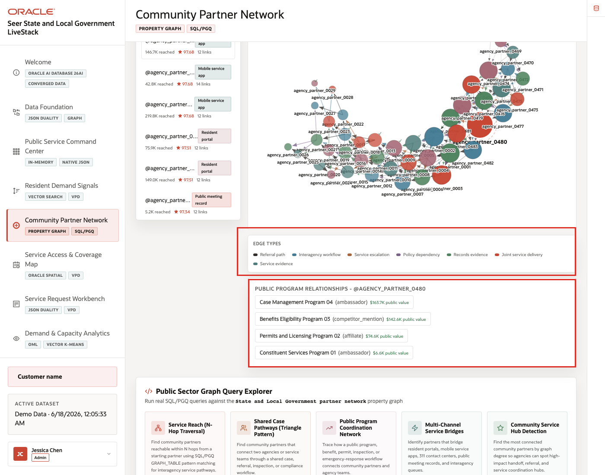
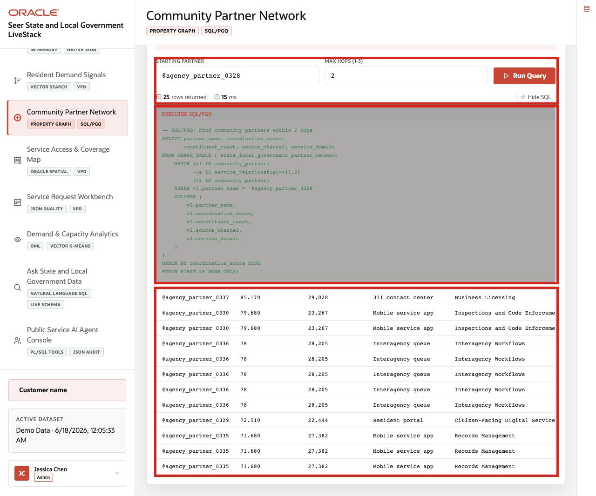

# Scene 5 Community Partner Network

## Introduction

The **Community Partner Network** uses graph relationships to show how agencies, departments, public programs, community partners, service domains, source channels, and resident signals are connected. It helps an operator understand which partners can support a response and why a service need may span several organizations.

Public-sector response is rarely linear. A constituent service issue can involve a city department, county benefits office, nonprofit partner, inspection team, public works crew, and emergency operations coordinator. Graph analysis helps the agency see those relationships without flattening them into a single table.

Estimated Time: **10 minutes**

### Objectives

In this scene, you will learn how graph relationships support partner coordination, how to inspect relationship depth, and how SQL/PGQ evidence makes the graph explainable.

## Task 1: Explore the partner graph

Perform the following set of steps to move from a service issue to the organizations and relationships that may help resolve it.

1. Click **Community Partner Network** in the sidebar.
2. Review the graph visualization and the partner list.
3. Select a partner, agency, service domain, or coordination node.
4. Increase or decrease relationship depth if the control is available.

    

**Expected result:** The graph updates around the selected node or relationship depth. The operator can identify connected organizations, public services, evidence links, and coordination paths.

## Task 2: Review partner relationship evidence

Perform the following set of steps to connect the graph visualization to the relationship evidence below it.

1. Review the selected partner summary.
2. Scroll to the public program relationship section.
3. Compare connected programs, inferred relationship paths, and edge types.
4. Explain how these relationships help identify which agency, partner, or program should coordinate next.

    

This step turns the graph from a visual network into an operational decision aid. The agency can see why a partner matters and which public-service relationships support that conclusion.

## Task 3: Run a graph query

Perform the following set of steps when the audience wants to see that the visual graph is backed by governed database evidence.

1. Open the example query explorer.
2. Select a provided SQL/PGQ or graph query.
3. Click **Run Query**.
4. Review the result rows and the expanded SQL/PGQ statement.

    

The query returns relationship evidence from the Oracle property graph. Use the visible SQL or SQL/PGQ to reinforce that the graph is backed by database tables and graph metadata, not an unmanaged diagram.

*You can move to the next scene.*

## Credits & Build Notes
- **Author** - Oracle LiveLabs Team
- **Last Updated By/Date** - Oracle LiveLabs Team, 2026-06-17
