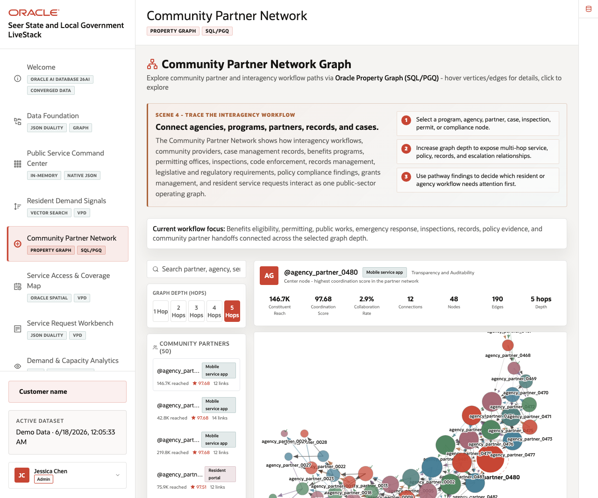
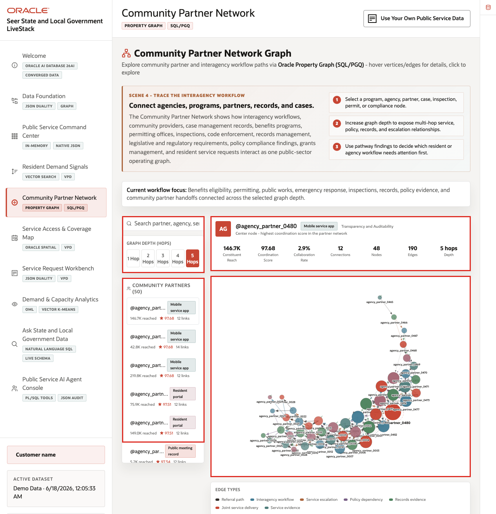
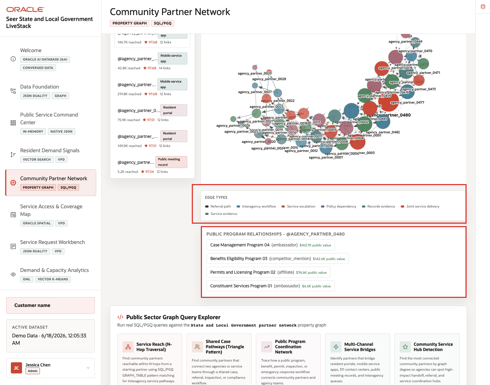
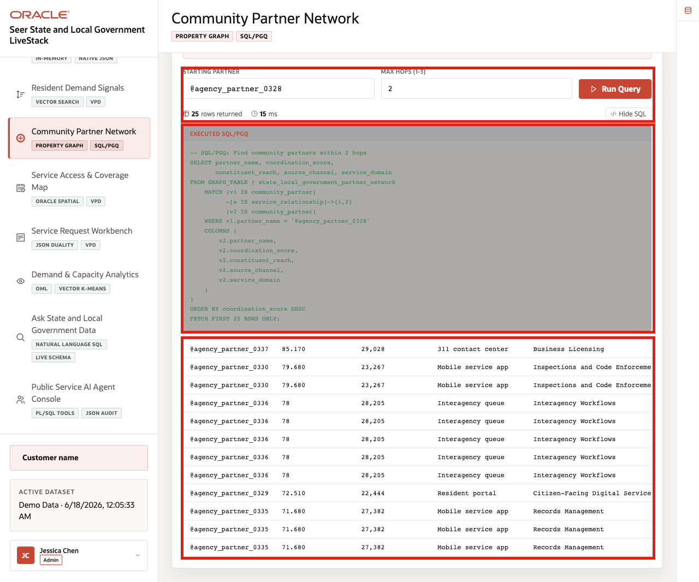

# Scene 5 Community Partner Network

## Introduction

Eligibility and resident-service resolution can cross program, county, partner, and case-management boundaries. **Jessica Chen** uses the **Community Partner Network** to identify which **Colorado** organizations and handoff paths can respond to the demand evidence from **Scene 4**.

Estimated Time: **10 minutes**

### Objectives

In this scene, you will use graph relationships to identify service partners, handoff paths, and query evidence for the resident-service response.

## Task 1: Trace the Colorado eligibility partner network

Perform the following set of steps to trace the **Colorado** eligibility partner network and show how graph relationships support coordination:

1. Click **Community Partner Network** in the sidebar.
2. Search for `Benefits Eligibility`.
3. Select a matching community partner from the current results.
4. Set graph depth to **2 Hops**.
5. Review connected Colorado partners, relationship types, coordination score, and constituent reach.

    

**Jessica Chen** can see an operational coordination path rather than an unstructured list of organizations. Two-hop evidence reveals where a resident issue may require more than one handoff.

## Task 2: Inspect program and handoff evidence

Perform the following set of steps to inspect the program and handoff evidence behind the selected graph node:

1. Select the center node or a connected node.
2. Review source channel, service domain, city, relationship types, and **Public Program Relationships**.
3. Identify the partner or program most relevant to the eligibility demand signal.

    

The relationship evidence explains why the selected organization is relevant and which governed service path connects it to the operating decision.

## Task 3: Validate the coordination path with SQL/PGQ

Perform the following set of steps to validate the coordination path with queryable **Oracle Property Graph** evidence:

1. Open **Public Sector Graph Query Explorer**.
2. Select **Community Service Hub Detection**.
3. Enter `Benefits Eligibility` for Service Domain.
4. Click **Run Query**.
5. Review returned rows, elapsed time, and the expanded SQL/PGQ statement.

    

**Jessica Chen** now has a defensible coordination candidate backed by graph relationships and query evidence. **Scene 6** tests whether the response is geographically and operationally feasible within **Colorado**.

*You can move to the next scene.*

## Credits & Build Notes

- **Author** - Oracle LiveLabs Team
- **Last Updated By/Date** - Oracle LiveLabs Team, 2026-07-03
