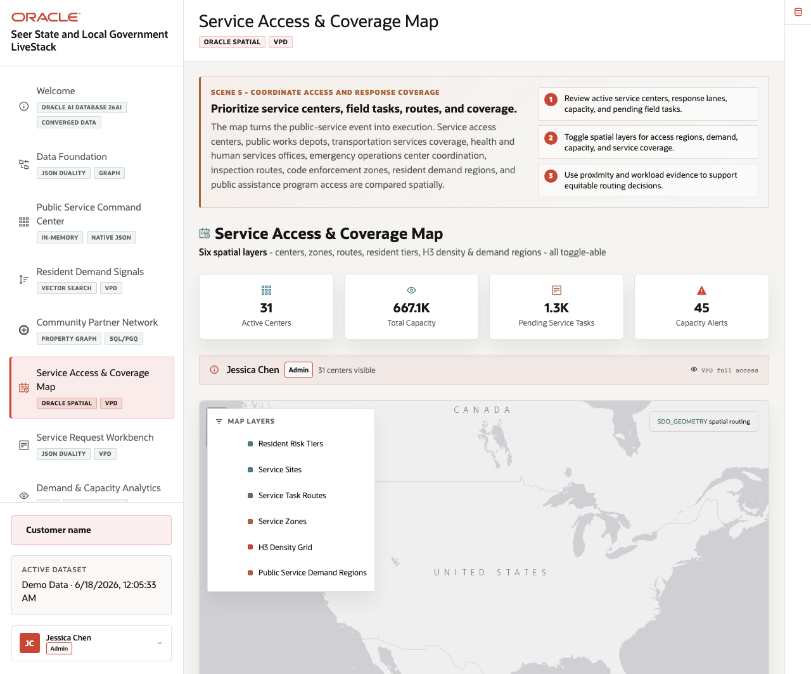
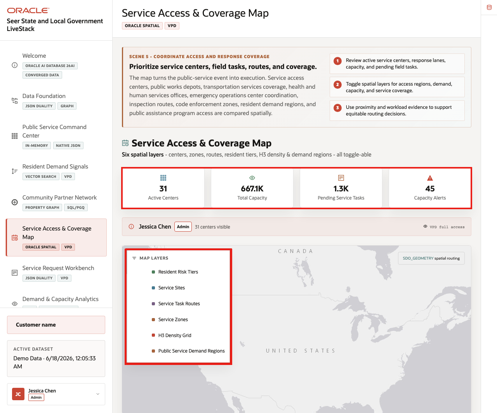
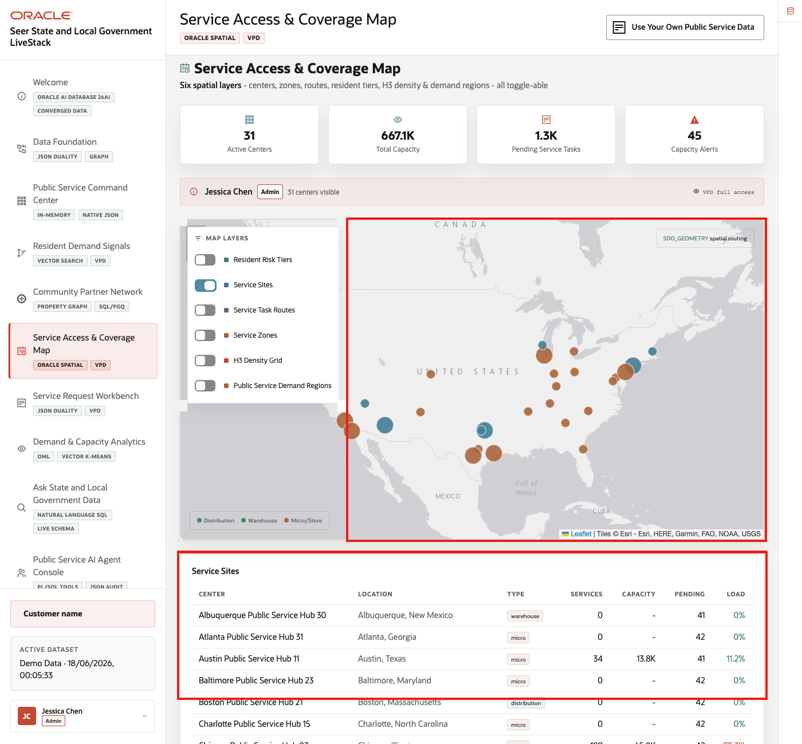
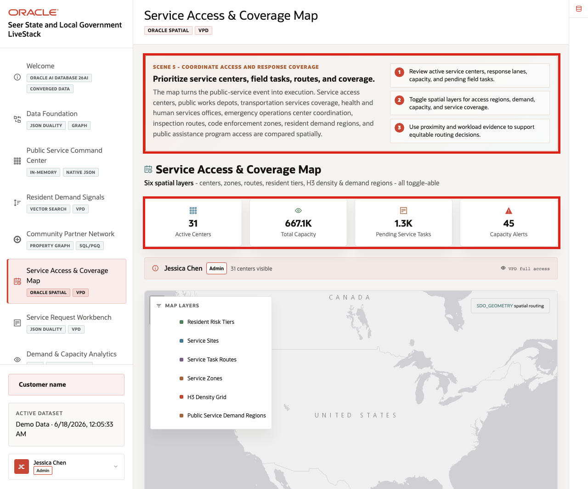

# Scene 6 Service Access and Coverage Map

## Introduction

**Service Access & Coverage Map** helps a state or local agency understand how geography changes the response. A high-demand service may require a different action depending on nearby service capacity, partner coverage, travel distance, neighborhood access tier, or emergency operations constraints.

This scene uses Oracle Spatial to keep location intelligence close to the same public-sector operating data used by the command center, service request workbench, and analytics pages.

Estimated Time: **10 minutes**

### Objectives

In this scene, you will inspect the service access map, compare capacity and access signals, and explain why spatial analysis is part of the operating workflow.

## Task 1: Inspect the service access map

Perform the following set of steps to show how the map organizes place-based service access evidence.

1. Click **Service Access & Coverage Map** in the sidebar.
2. Review the **Map Layers** panel and the active layer legend.
3. Note the available layer types for resident risk tiers, service sites, task routes, service zones, H3 density grid, and public service demand regions.
4. Connect the layer evidence to the active center count, total capacity, pending service tasks, and capacity alerts.

    

The map turns service demand into a place-based decision. In this task, the layer list is the proof point: it shows the spatial data the agency can combine with capacity and service-request evidence.

## Task 2: Compare service sites with the map

Perform the following set of steps to show how the map connects to service-site records.

1. Review the visible **Service Sites** table below the map.
2. Compare center, location, type, services, capacity, pending work, and load values.
3. Use the map and table together to explain which sites may need follow-up.

    

The table gives the map operational grounding. It lets the audience connect place-based coverage to the actual service centers and pending work the agency must manage.

## Task 3: Compare capacity and access signals

Perform the following set of steps to connect geography with service operations.

1. Review the capacity, alert, or access cards next to the map.
2. Compare the spatial context with services under pressure from the command center.
3. Use the active-center, total-capacity, pending-task, and capacity-alert cards to explain where the agency would investigate coverage next.

    

For State and Local Government teams, geography changes the decision. Oracle Spatial lets those signals stay close to the operational data instead of forcing users into a separate mapping system.

*You can move to the next scene.*

## Credits & Build Notes
- **Author** - Oracle LiveLabs Team
- **Last Updated By/Date** - Oracle LiveLabs Team, 2026-06-17
