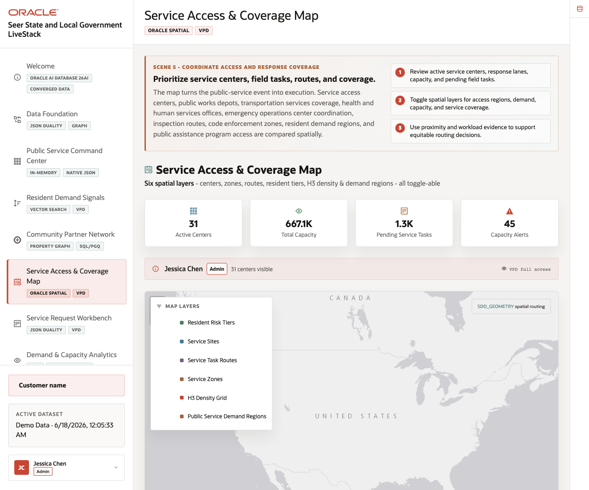
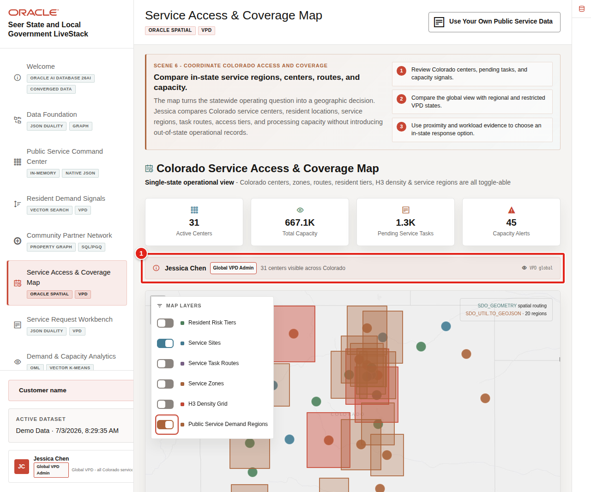
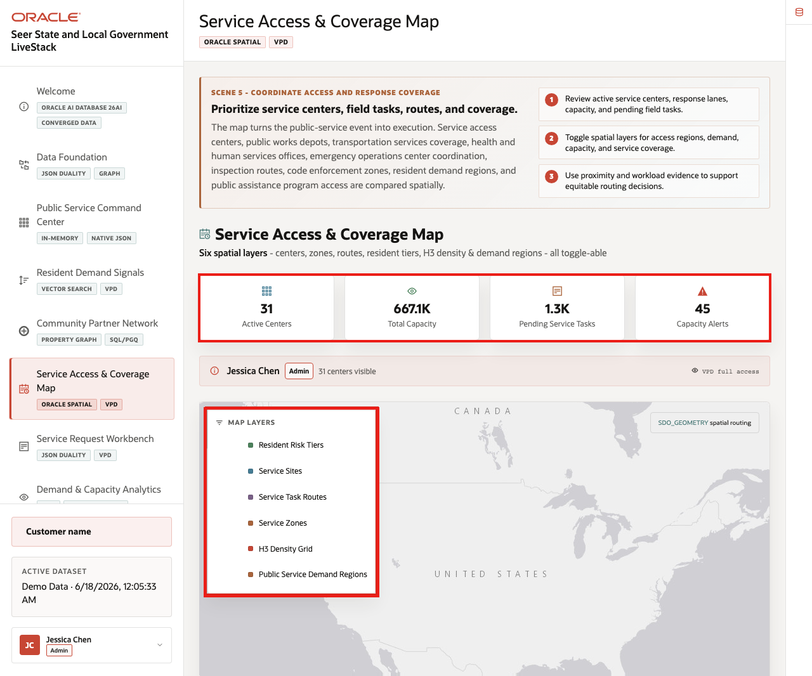
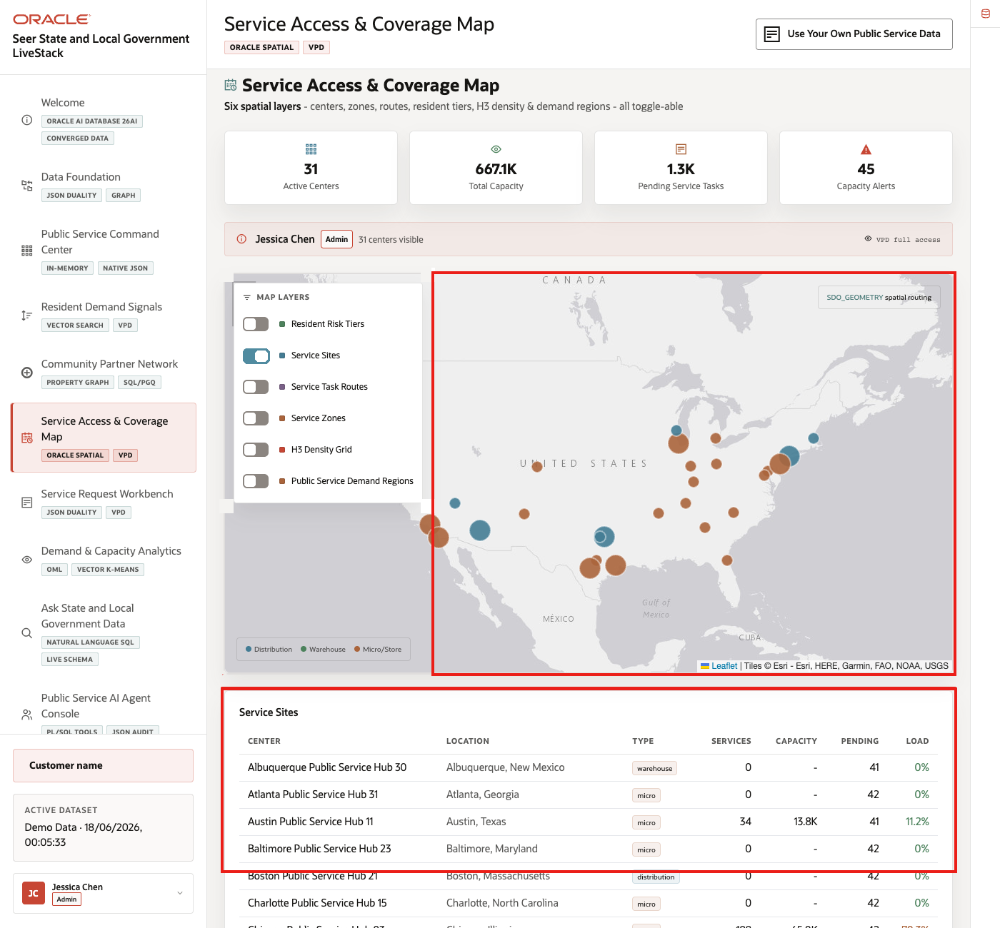
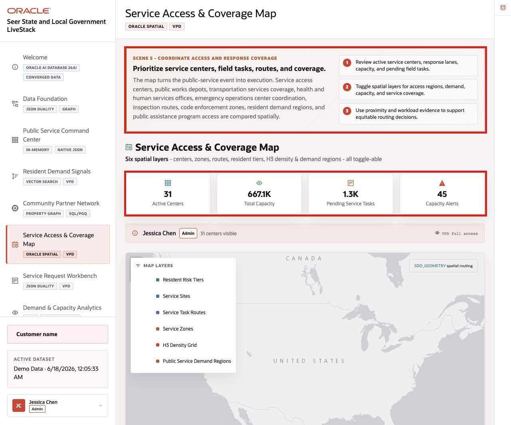
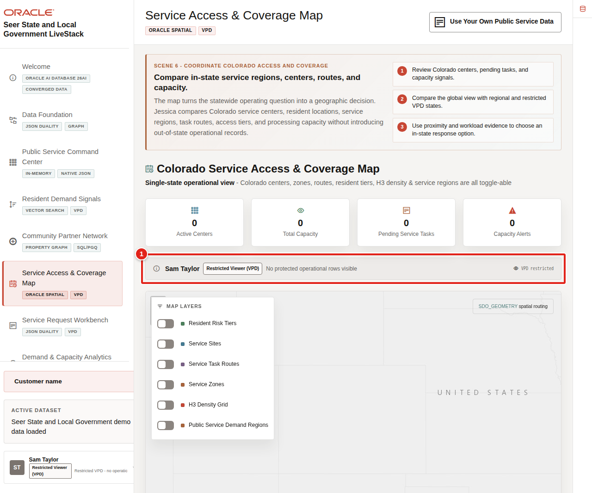

# Scene 6 Service Access and Coverage Map

## Introduction

**Jessica Chen** now determines whether the observed pressure is statewide or localized. The **Service Access and Coverage Map** compares in-state service regions, centers, capacity, resident access, and task routes while proving that the same map respects the active Oracle **VPD** identity.

Estimated Time: **10 minutes**

### Objectives

In this scene, you will compare statewide, regional, and restricted **VPD** views of **Colorado** service access and capacity.

## Task 1: Establish the statewide Colorado view

Perform the following set of steps to establish the statewide **Colorado** view under **Jessica Chen**'s global access:

1. Confirm Jessica Chen is selected.
2. Verify **Global VPD Admin** and access to all Colorado service regions.
3. Click **Service Access & Coverage Map** in the sidebar.
4. Enable **Service Sites** and **Public Service Demand Regions**.
5. Confirm that the visible residents, centers, routes, and regions are all in Colorado.

    

**Jessica Chen**'s global view is explicitly allowlisted for statewide operations. It is not the default for anonymous, unknown, or restricted identities.

## Task 2: Compare access and capacity

Perform the following set of steps to compare access, capacity, and route context across the **Colorado** operating area:

1. Review the map layers and the Colorado operating area.
2. Review the **Colorado Service Sites** table.
3. Compare center, location, center type, supported services, capacity, pending work, and load.
4. Review capacity alerts and identify candidate regions for deeper investigation without declaring a causal link to the Medicaid metric.

    

    

    

The map separates geographic feasibility from the eligibility-risk indicator. It helps **Jessica Chen** identify where workload and access deserve investigation; it does not claim that capacity caused the **2.7%** rate.

**Note:** Sample values may change after data refreshes or rebuilds. Verify live output before presenting, then explain the business takeaway.

## Task 3: Demonstrate regional and restricted VPD scope

Perform the following set of steps to demonstrate regional and restricted **VPD** scope before returning to the regional request investigation:

1. Switch to **Maria Santos**.
2. Re-enable **Service Sites** if the identity change resets map layers.
3. Confirm **Regional VPD** and **Western Slope**. Verify that only the assigned Colorado region is visible.

    

4. Switch to **Sam Taylor**.
5. Confirm **Restricted VPD** and **No protected operational rows visible**.

    

6. Return to Maria Santos for the regional request investigation in **Scene 7**.

The statewide lead can see all Colorado operations, the regional manager sees only the Western Slope, and the restricted viewer sees no protected operational rows. The change comes from database-enforced VPD context, not frontend filtering.

## Task 4: Connect the map to Oracle evidence

Perform the following set of steps to connect the map result to **Oracle Spatial** and **VPD** evidence:

1. Open **Oracle Internals**.
2. Review the Oracle Spatial and VPD evidence.
3. Explain that the application clears pooled context, derives identity and region from trusted Oracle data, and applies enabled `CONTEXT_SENSITIVE` policies.
4. Explain that missing or unsupported context fails closed.

Oracle Spatial supports the in-state geographic decision, while Oracle VPD controls which protected rows can participate in that decision.

*You can move to the next scene.*

## Credits & Build Notes

- **Author** - Oracle LiveLabs Team
- **Last Updated By/Date** - Oracle LiveLabs Team, 2026-07-03
