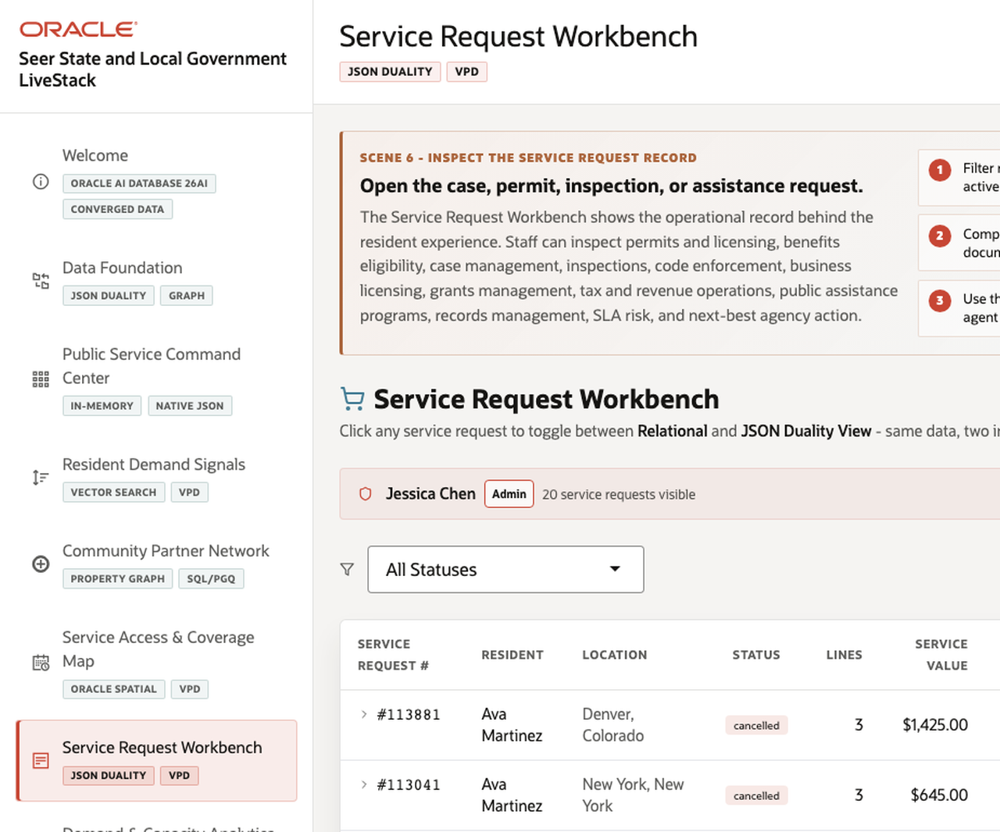
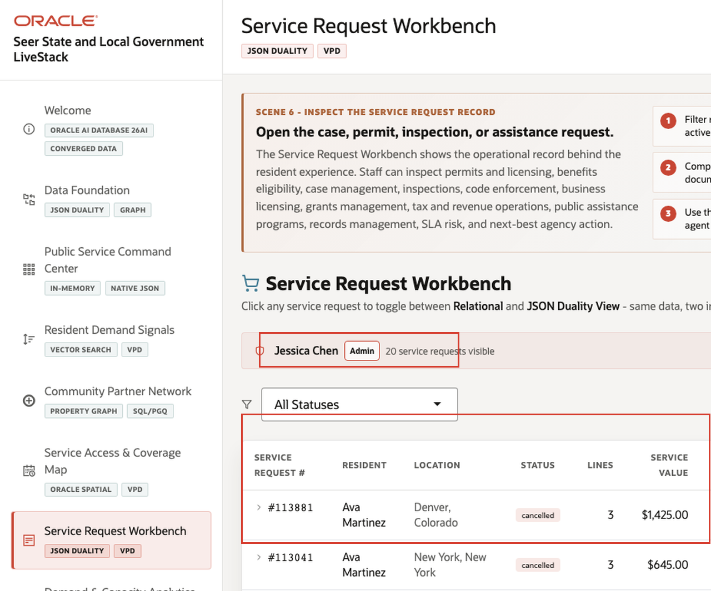
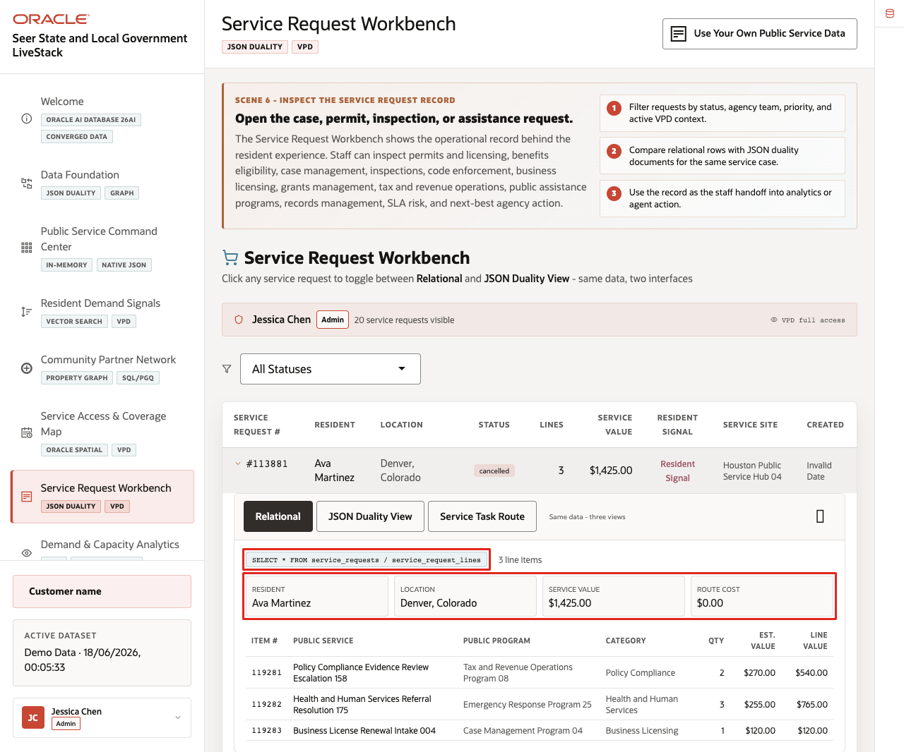
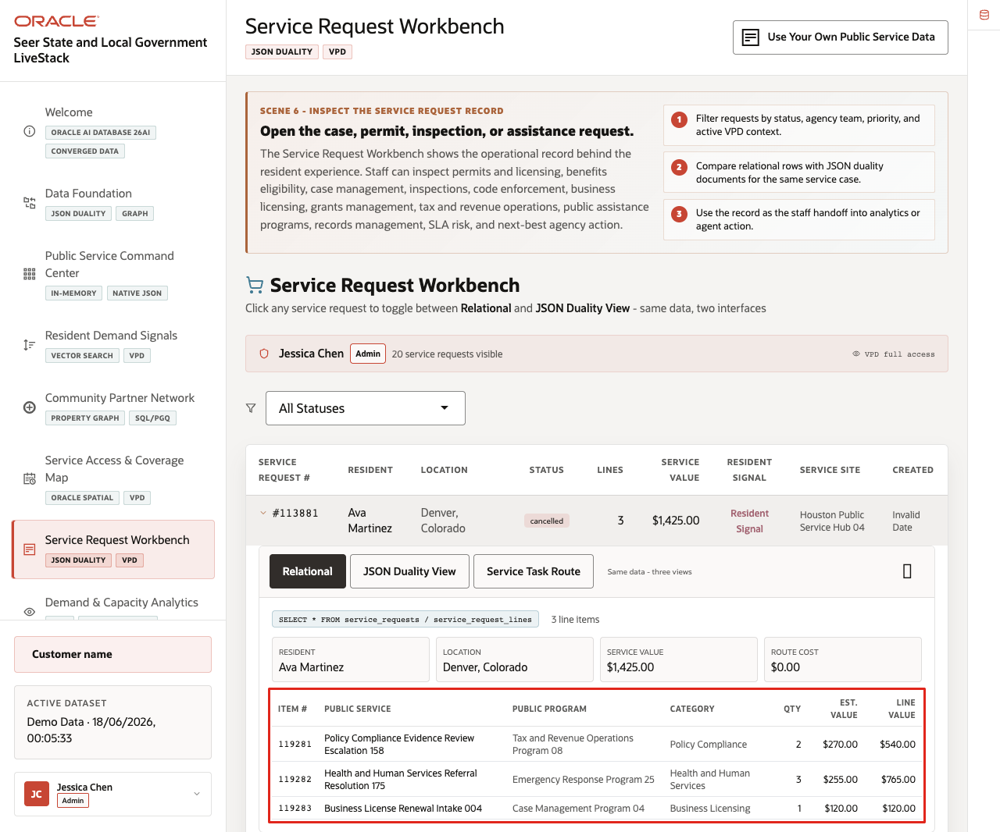
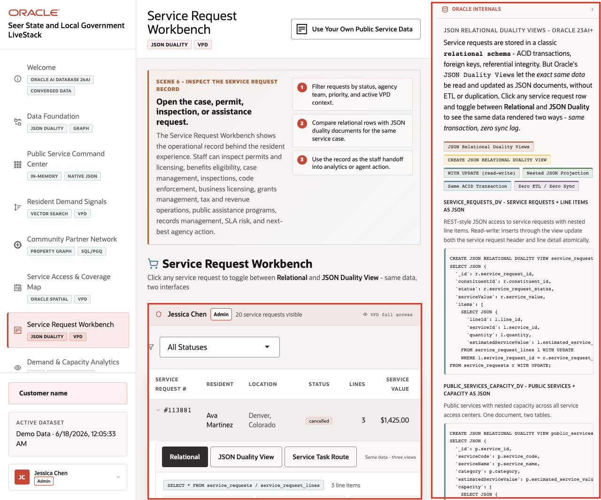

# Scene 7 Service Request Workbench

## Introduction

The **Service Request Workbench** shows how a public-service request moves from a table of operational records into a row-level case detail. The live page lets the agency review service request status, resident context, line count, service value, and line-level public program detail from the same governed dataset.

For a state or local agency, a service request may represent a resident contact, permit follow-up, benefits eligibility review, inspection task, public works issue, or emergency-response support item. Different users need different levels of evidence: an analyst may start with the request list, a supervisor may open the row-level detail, and a data steward may use Oracle Internals to explain how JSON Duality and VPD support the application pattern.

Estimated Time: **10 minutes**

### Objectives

In this scene, you will open a service request, review the expanded request detail, and connect the visible workflow to Oracle-backed JSON Duality and access-control evidence.

## Task 1: Review the request list

Perform the following set of steps to move from the service request list into a detailed public-sector case or task.

1. Click **Service Request Workbench** in the sidebar.
2. Review the visible request list, including request number, resident, location, status, line count, and service value.
3. Use **Prev** or **Next** if you need to move through the visible request pages.
4. Identify one request that should be opened for detail review.

    

The workbench helps the agency move from an aggregate service-pressure signal to the individual requests that need review.

## Task 2: Inspect the request detail

Perform the following set of steps to inspect the request-level evidence available on the page.

1. Click a service request row, such as **#113881**.
2. Review the expanded **Same data - three views** panel.
3. Compare resident, location, service value, route cost, and line-count context.

    

The request-level detail gives the staff member the basic context needed before they inspect line items, escalate, or route the request.

## Task 3: Compare line-level service evidence

Perform the following set of steps to inspect the public-service evidence attached to the request.

1. Keep the request expanded.
2. Review the line-level service table.
3. Compare public service, public program, category, quantity, estimated value, and line value fields.
4. Use the expanded detail to explain what a staff member would inspect before escalating or routing the request.

    

The expanded row connects the request table to line-level service evidence without sending the user to another application. This is the visible decision point in the scene: the staff member can inspect the request and the related service lines before choosing the next action.

## Task 4: Connect the row detail to Oracle evidence

Perform the following set of steps after the business workflow is clear.

1. Keep the request row expanded.
2. Click **Show Oracle Internals**.
3. Review the Oracle evidence for JSON Duality, VPD, SQL access, and the governed service request model.
4. Explain that Oracle keeps the operational record, document-oriented application pattern, and access control close to the same data foundation.

    

Public-service applications often need transactional integrity, document-style application access, and governed row-level permissions. This scene shows how one Oracle data model can support the staff workflow without duplicating or syncing separate databases.

*You can move to the next scene.*

## Credits & Build Notes
- **Author** - Oracle LiveLabs Team
- **Last Updated By/Date** - Oracle LiveLabs Team, 2026-06-18
