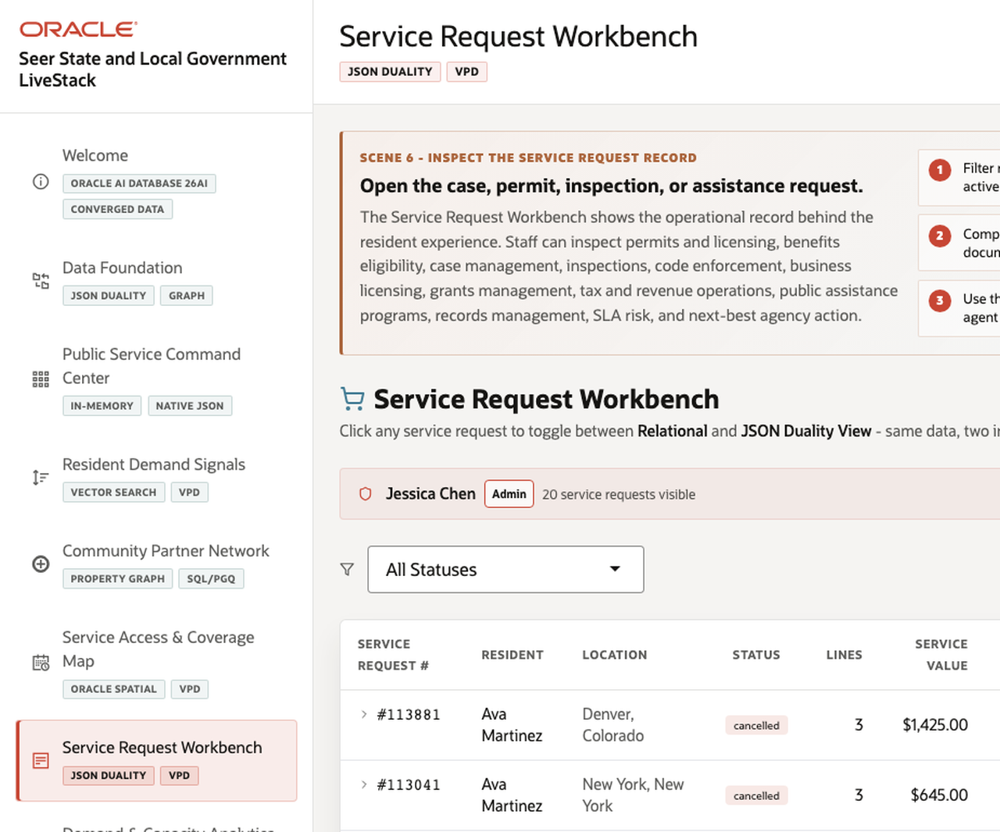
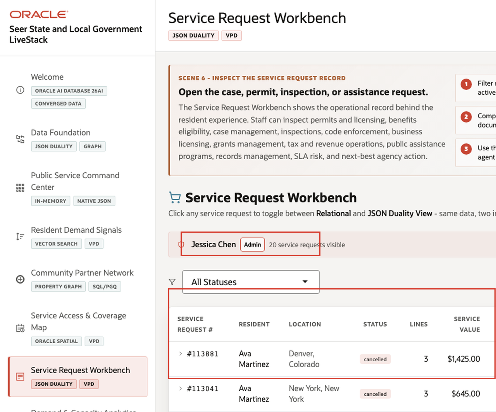
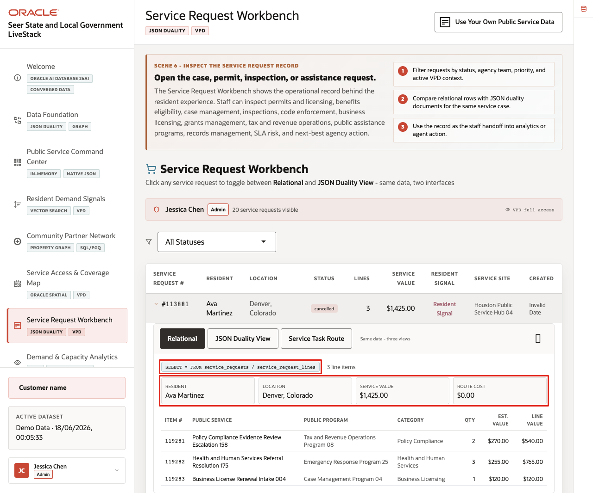
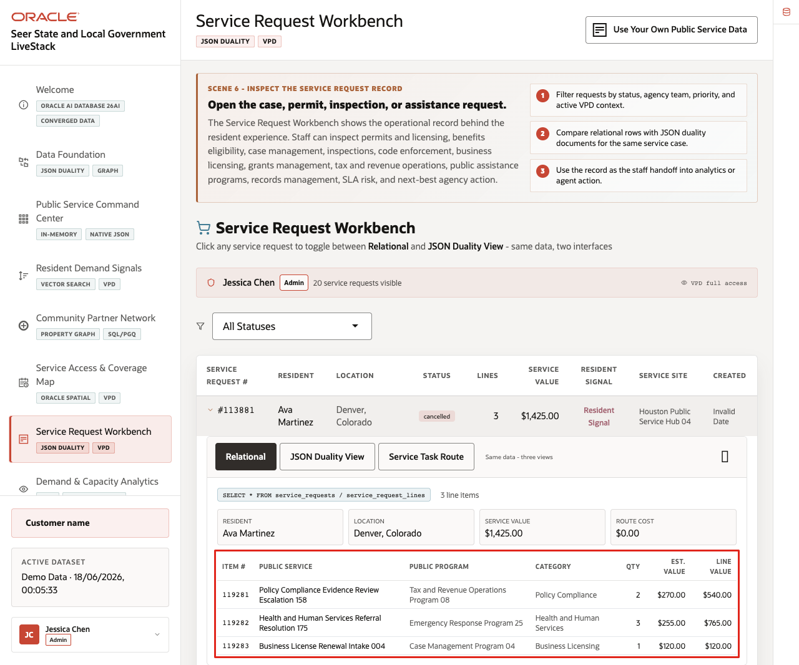
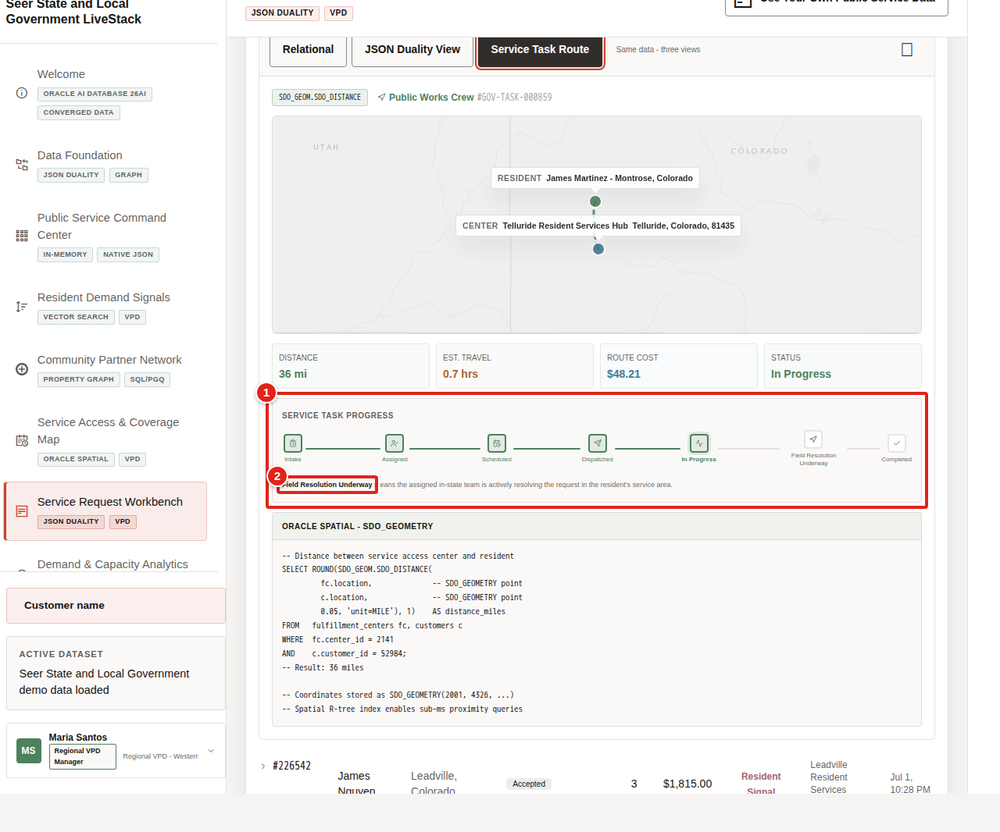
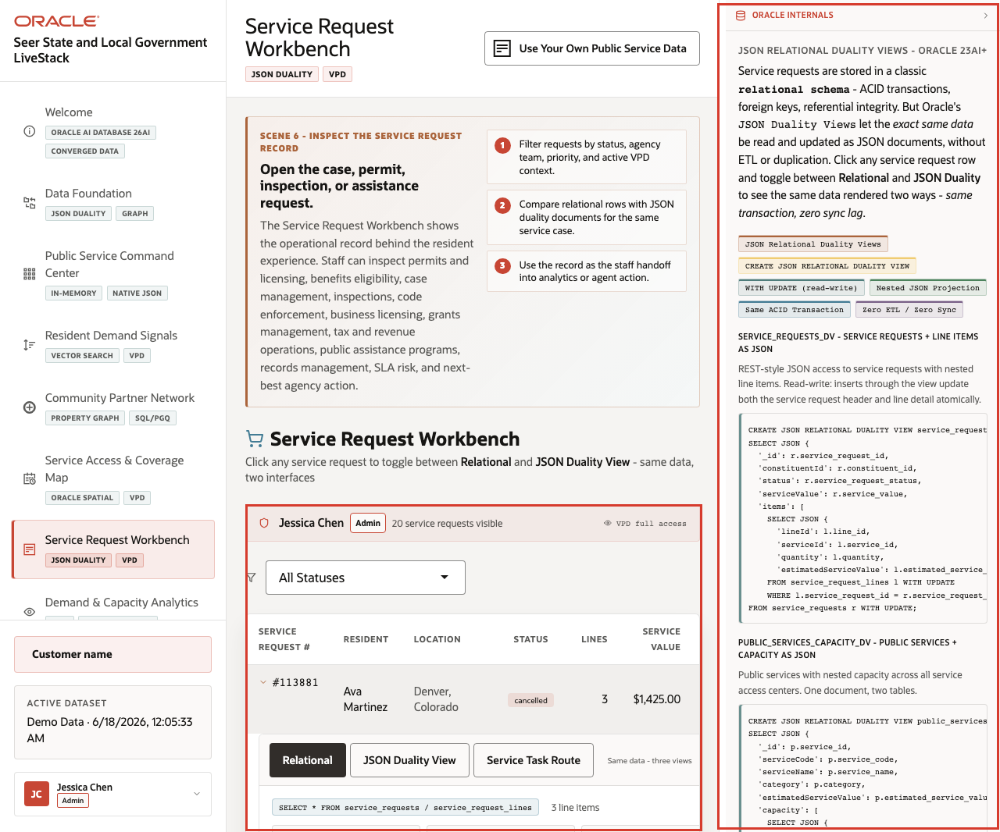

# Scene 7 Service Request Workbench

## Introduction

Maria Santos now moves from Western Slope pressure to one Colorado resident request. The **Service Request Workbench** connects the request, resident, in-state service center, Request Line Items, route evidence, JSON document, and active field task under the same Regional VPD context.

Estimated Time: **10 minutes**

### Objectives

In this scene, you will review Maria's regional queue, inspect one request in three governed views, distinguish request status from service-task status, and explain Field Resolution Underway.

## Task 1: Review the Western Slope request queue

1. Keep Maria Santos selected.
2. Click **Service Request Workbench** in the sidebar.
3. Confirm the **Regional VPD** banner and Western Slope scope.
4. Filter to **In Progress**.
5. Select the first visible In Progress request that has a populated Colorado service site and service task. Do not rely on a fixed request number.

    

The queue contains only requests Maria is authorized to see. Status filters use business-facing request language and do not expose internal compatibility enums.

## Task 2: Inspect the relational request evidence

1. Keep the selected request expanded.
2. Open **Relational**.
3. Compare the resident, Colorado location, in-state service center, service value, route cost, creation date, and Request Line Items.
4. Confirm that dates are valid and the resident and assigned center are geographically plausible.

    

**Request Line Items:** Number of individual service or eligibility items included in the resident request. They explain the work contained in the overall case; they are not a route or geographic count.

The request lifecycle describes the overall agency case:

**Submitted → Accepted → In Review → In Progress → Completed**

**Needs Follow-Up** and **Cancelled** are alternate request outcomes.

## Task 3: Compare the JSON Duality document

1. Click **JSON Duality View**.
2. Locate the same request header and nested Request Line Items.
3. Compare the public JSON names with the relational fields.
4. Explain that JSON Relational Duality exposes the same transaction without a duplicated document database or synchronization step.

    

The relational and document views represent the same governed request. Maria does not gain additional rows by changing the application interface.

## Task 4: Inspect the Service Task Route

1. Click **Service Task Route**.
2. Compare the Colorado resident and in-state center, distance, estimated travel time, route cost, and current task status.
3. Review the full service-task timeline.

    

The service-task lifecycle describes execution of the assigned work:

**Intake → Assigned → Scheduled → Dispatched → In Progress → Field Resolution Underway → Completed**

**Blocked** is the exception outcome.

**Field Resolution Underway** means the assigned in-state team is actively resolving the request in the resident's service area. The selected task may currently be In Progress while the complete timeline shows Field Resolution Underway as the next operational stage.

## Task 5: Connect the request to Oracle evidence

1. Click **Show Oracle Internals**.
2. Review JSON Duality, Spatial routing, and VPD evidence.
3. Explain that the request and protected child records remain governed under the same regional context.
4. Return to Jessica Chen before moving to statewide analytics.

    

Maria has moved from a regional pressure signal to an individual request and active field response without seeing another Colorado service region. Jessica can now return to the statewide view and decide where capacity should be monitored or rebalanced.

*You can move to the next scene.*

## Credits & Build Notes

- **Author** - Oracle LiveLabs Team
- **Last Updated By/Date** - Oracle LiveLabs Team, 2026-07-03
