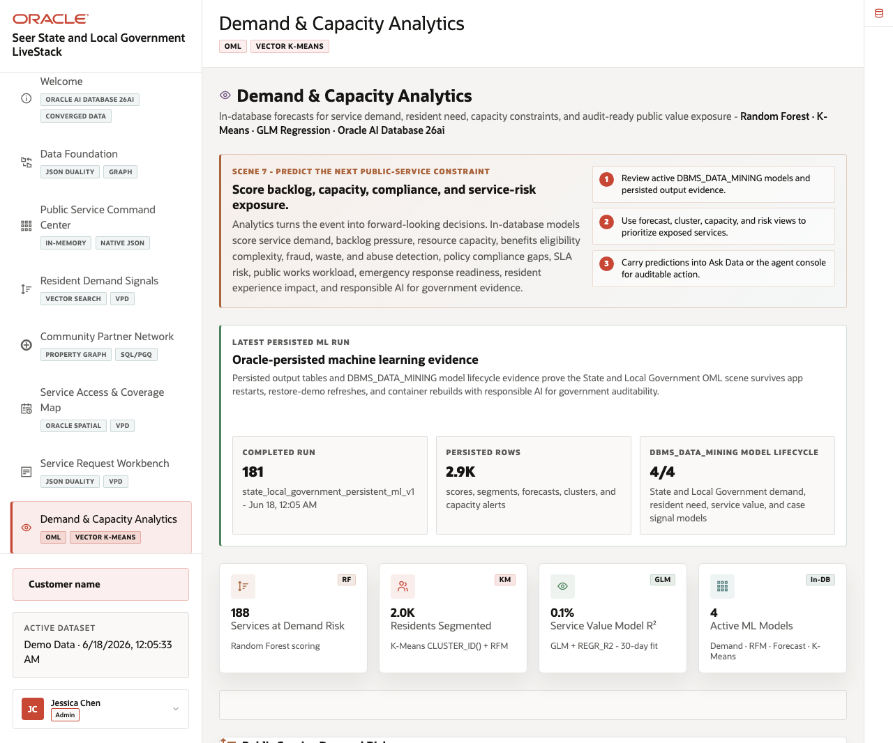
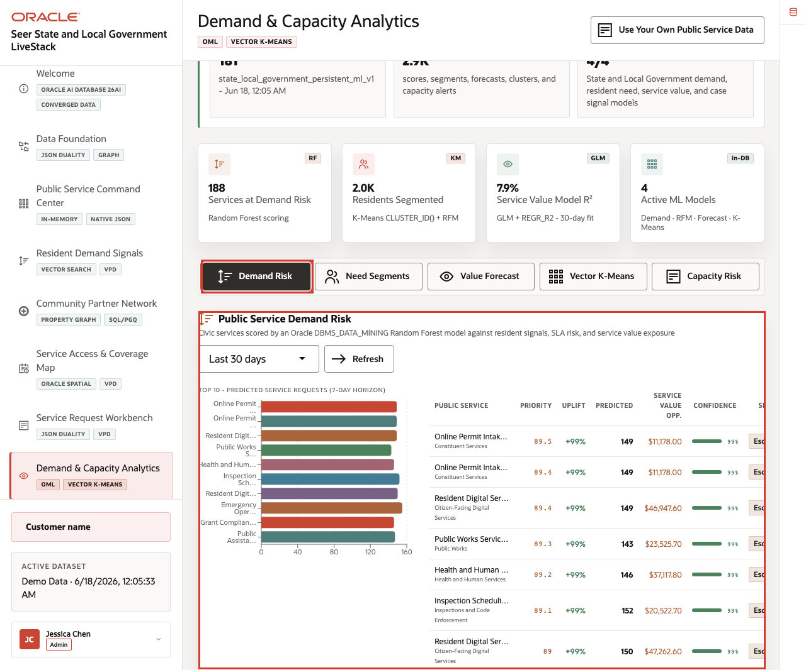
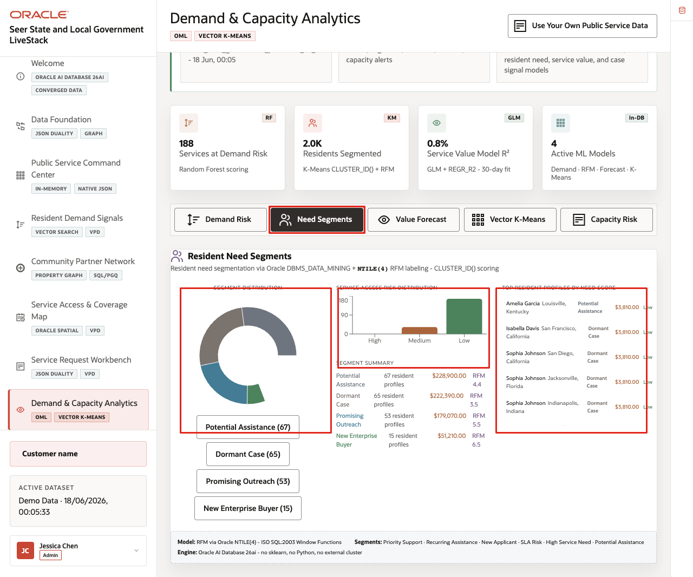
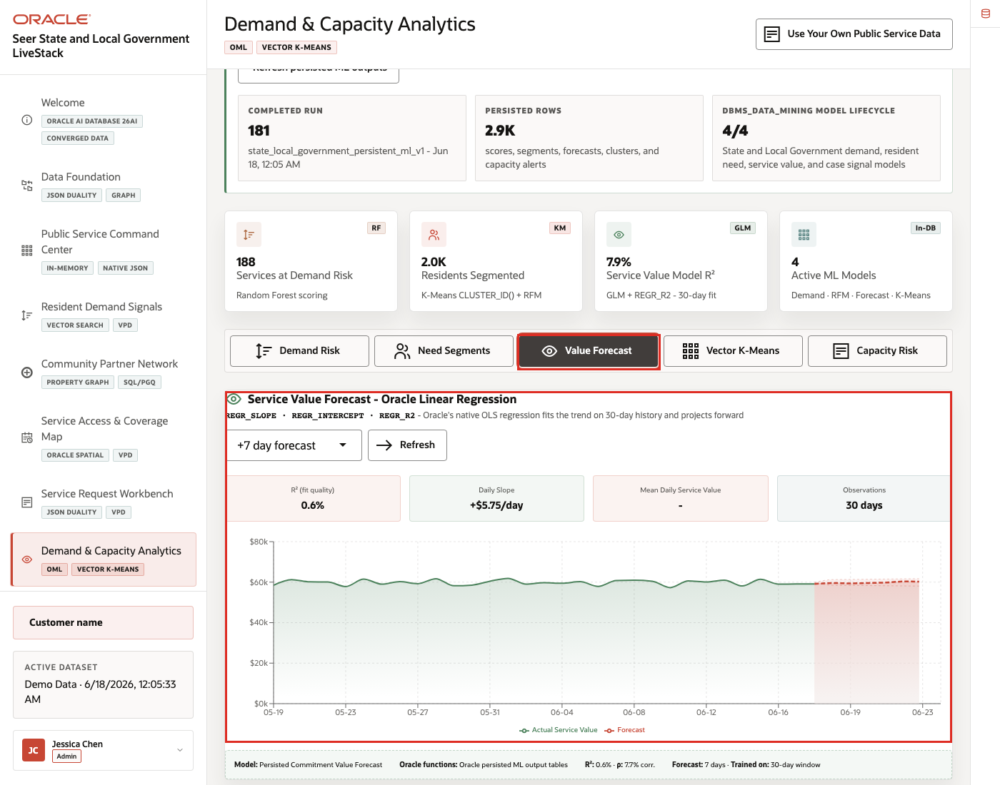
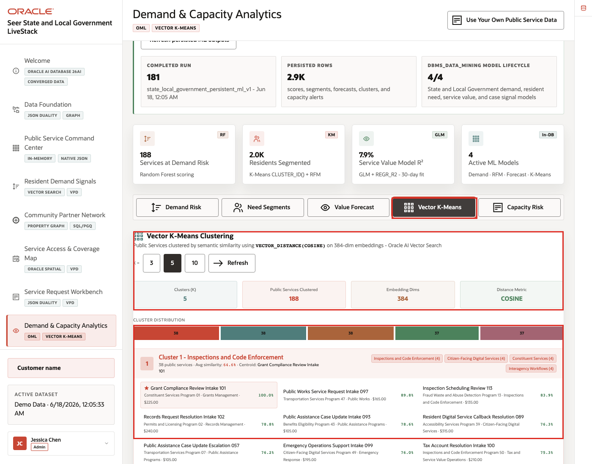
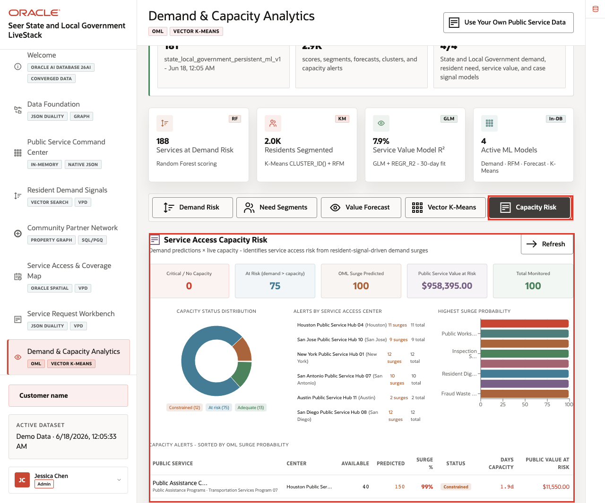

# Scene 8 Demand and Capacity Analytics

## Introduction

**Demand & Capacity Analytics** demonstrates Oracle Machine Learning over State and Local Government operations data. It includes demand surge prediction, resident need segmentation, service value forecasting, vector K-Means clustering, and capacity intelligence.

This scene is the planning checkpoint in the story. Jessica Chen has already seen which services are under pressure, which resident signals are rising, where service access may be constrained, and which requests require attention. Now the agency needs predictive evidence to plan staffing, partner coordination, field response, or program capacity.

Estimated Time: **12 minutes**

### Objectives

In this scene, you will review OML summary metrics, switch between analytics tabs, compare model outputs, and explain the operational meaning of the scores.

## Task 1: Review demand surge risk

Perform the following set of steps when the audience wants to see predictive demand scoring.

1. Click **Demand & Capacity Analytics** in the sidebar.
2. Review the summary cards for services with demand surge, residents segmented, model fit, and active ML models.
3. Click **Demand Risk**.
4. Review the demand window, score, service category, and risk context.

    

**Expected result:** The user sees OML scores directly in the application. The evidence panel identifies in-database model scoring and persisted outputs rather than offline analytics.

## Task 2: Inspect resident need segments

Perform the following set of steps to show how segmentation helps the agency tailor response.

1. Click **Need Segments**.
2. Review the resident segment mix.
3. Compare the segment mix, service-access risk chart, and top resident profiles.

    

Need segments help a state or local agency see patterns across residents, services, and operating regions. This can guide outreach, staffing, and partner coordination.

## Task 3: Interpret service value forecast

Perform the following set of steps to connect forecasted demand to public-service value.

1. Click **Value Forecast**.
2. Review the forecast horizon, trend line, forecast region, and model context.
3. Compare the forecast with the demand-risk and segment results from the prior tasks.

    

The forecast view helps the agency explain what may happen next, not just what has already happened. It is useful when leaders need to plan staffing, partner engagement, or service capacity before pressure becomes visible in the request queue.

## Task 4: Explore Vector K-Means clusters

Perform the following set of steps to show how clustering groups related demand and service patterns.

1. Click **Vector K-Means**.
2. Review the visible cluster controls and cluster distribution.
3. Compare cluster examples across public services, resident signals, service access, and capacity context.

    

Vector K-Means helps the audience see how similar operating patterns can be grouped for planning and follow-up. This is useful when many service signals look different individually but share similar response needs.

## Task 5: Compare capacity intelligence

Perform the following set of steps to connect forecasted demand to service capacity.

1. Click **Capacity Risk**.
2. Review capacity status, days of capacity, and public service value at risk.
3. Use **Refresh** in any tab if you need to rerun the visible scoring workflow.

    

Capacity intelligence connects forecasted demand to service access constraints. Use this view to explain how analytics become more useful when they are embedded in the operator workflow and run against governed Oracle data.

*You can move to the next scene.*

## Credits & Build Notes
- **Author** - Oracle LiveLabs Team
- **Last Updated By/Date** - Oracle LiveLabs Team, 2026-06-17
