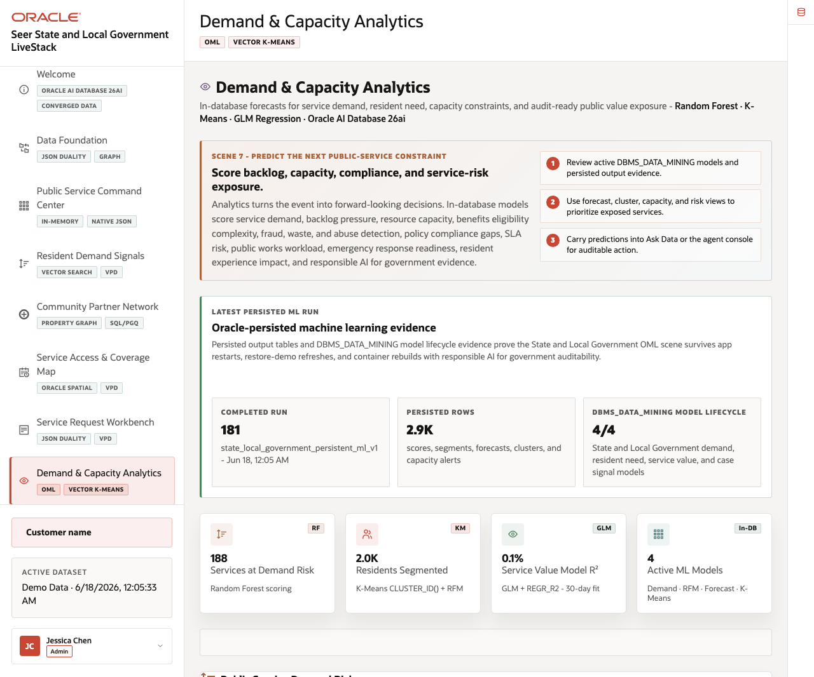
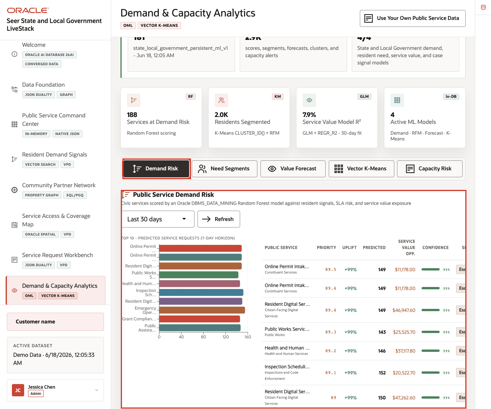
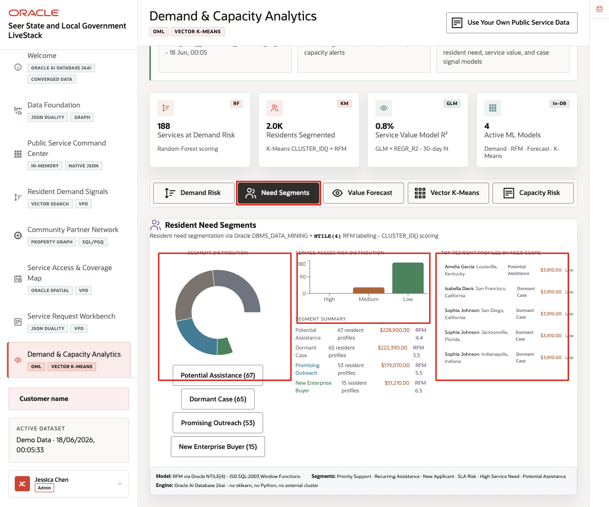
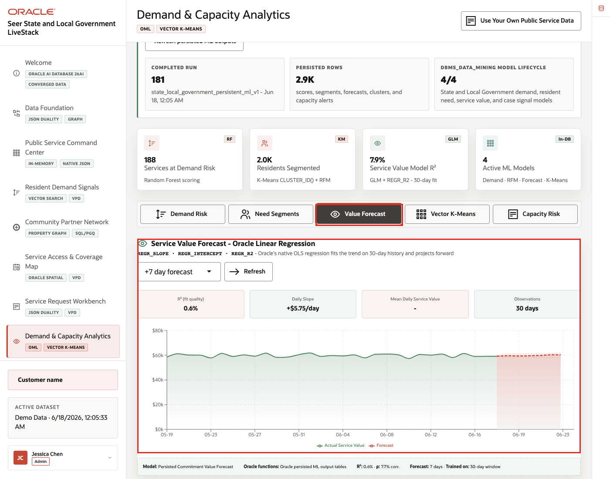
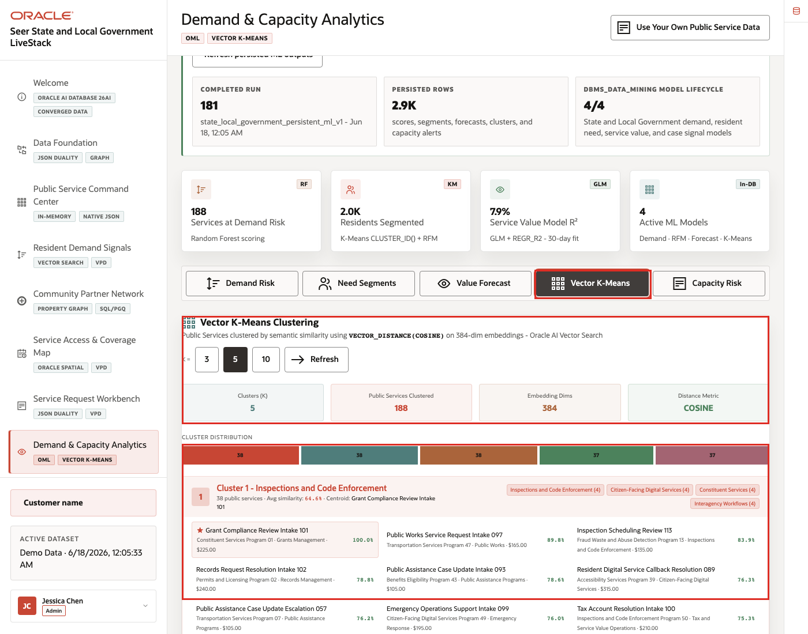
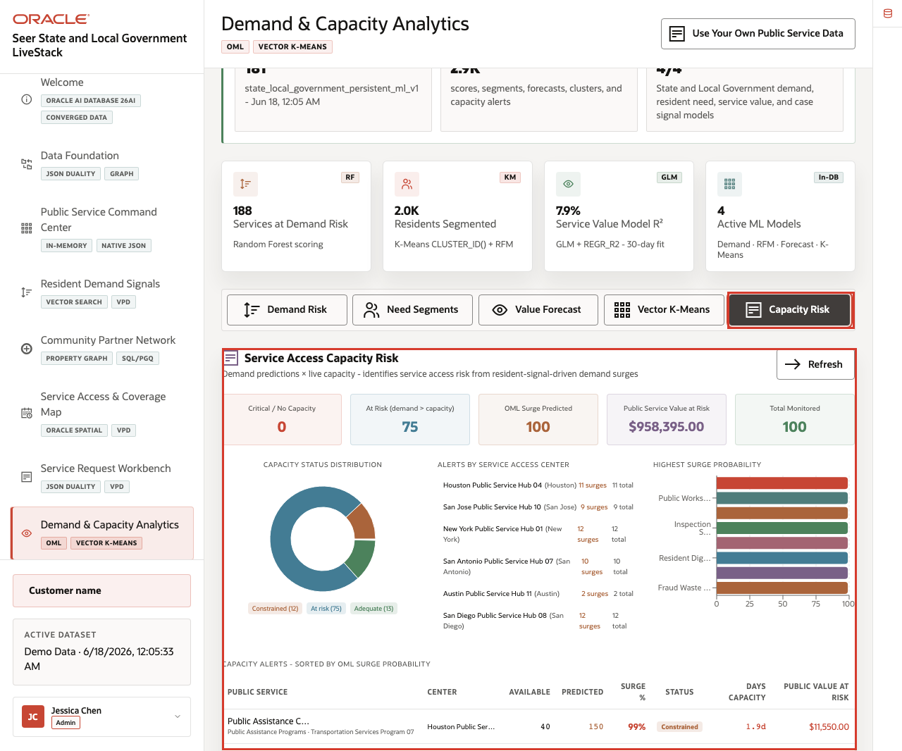

# Scene 8 Demand and Capacity Analytics

## Introduction

Jessica returns to the global view and scales back from one resident request to a statewide planning decision. **Demand & Capacity Analytics** compares demand risk, Colorado Resident Need Segments, service value forecasts, clusters, and Demand Capacity Across Colorado Service Centers.

The models help identify where service pressure deserves action. They do not prove that capacity caused the Medicaid eligibility error rate.

Estimated Time: **10 minutes**

### Objectives

In this scene, you will compare persisted model outputs and decide which Colorado service regions or service centers need monitoring or capacity rebalancing.

## Task 1: Review demand risk

1. Confirm Jessica Chen is selected.
2. Click **Demand & Capacity Analytics** in the sidebar.
3. Review the persisted model summary and active model count.
4. Click **Demand Risk**.
5. Compare demand window, predicted risk, service category, and supporting context.

    

Demand Risk identifies service categories with rising request pressure and gives Jessica evidence to compare with resident need and capacity.

## Task 2: Inspect Colorado Resident Need Segments

1. Click **Need Segments**.
2. Review the segment mix and service-access risk distribution.
3. Select one meaningful segment and inspect the top resident profiles.
4. Confirm that every displayed resident is in Colorado.

    

The segments help Colorado tailor outreach, case review, and staffing without introducing operational residents from another state.

## Task 3: Use the service value forecast as supporting evidence

1. Click **Value Forecast**.
2. Review the forecast horizon, trend line, forecast region, and model context.
3. Compare the forecast with the demand-risk and resident-segment evidence.

    

The forecast estimates future public-service value and demand context. It is supporting evidence rather than a federal funding-exposure calculation.

## Task 4: Compare related operating patterns

1. Click **Vector K-Means**.
2. Review cluster controls, distribution, and examples.
3. Compare patterns across Colorado services, resident signals, access, and capacity.

    

Clustering helps Jessica find operating patterns that may look different individually but require a similar response.

## Task 5: Make the capacity decision

1. Click **Capacity by Center**.
2. Review predicted demand, available capacity, days of capacity, status, and Public Service Value at Risk.
3. Compare in-state centers and service regions.
4. Identify the strongest supported intervention candidate without hardcoding a center or current score in the runbook.

    

**Public Service Value at Risk** estimates operating service exposure from constrained capacity. It is separate from potential federal matching-fund exposure associated with the 3.0% eligibility threshold.

Jessica has moved from one regional request to a statewide capacity decision. She now needs a governed answer she can inspect and defend.

*You can move to the next scene.*

## Credits & Build Notes

- **Author** - Oracle LiveLabs Team
- **Last Updated By/Date** - Oracle LiveLabs Team, 2026-07-03
