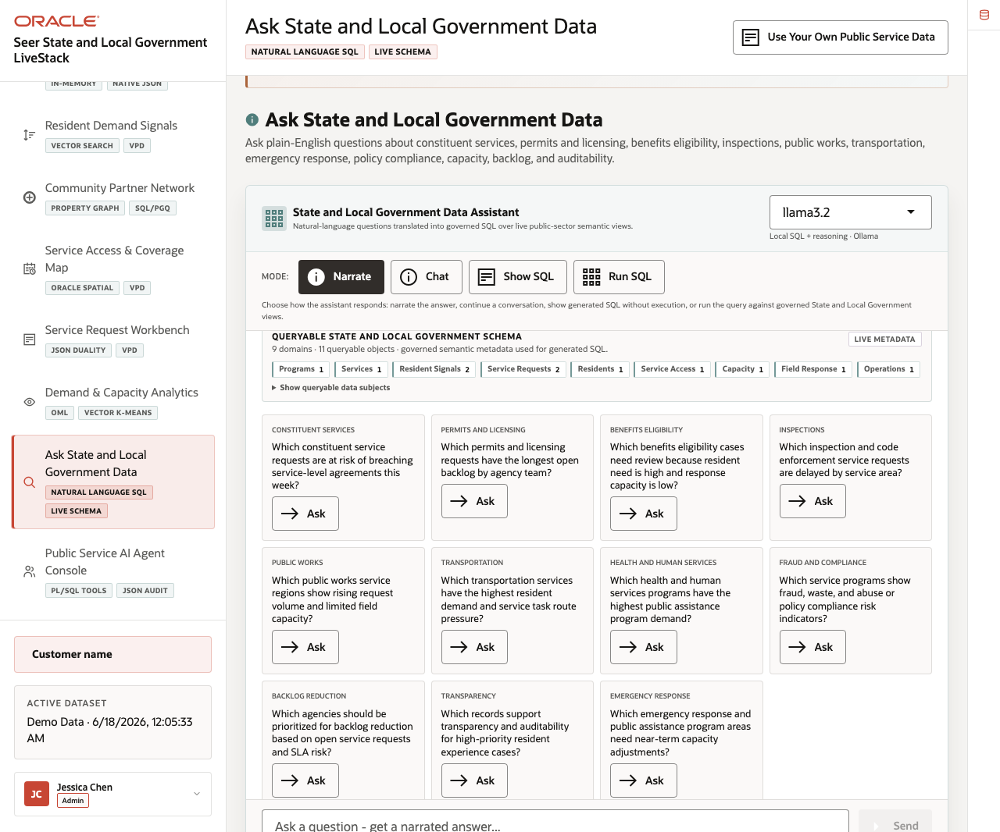
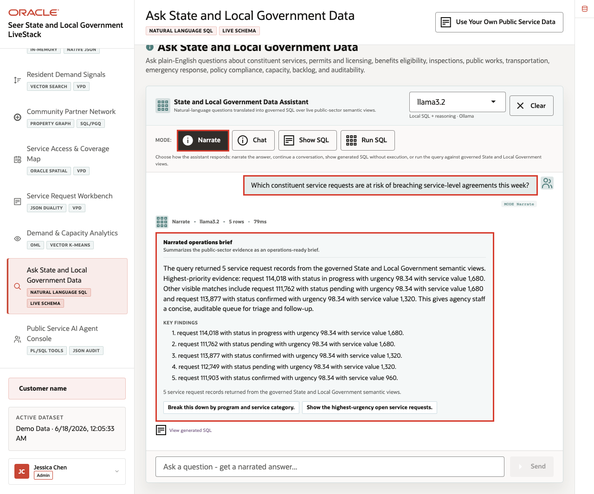
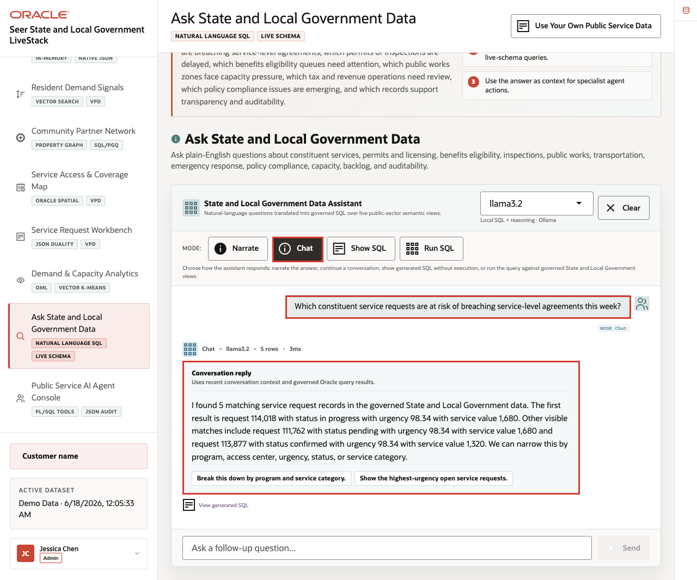
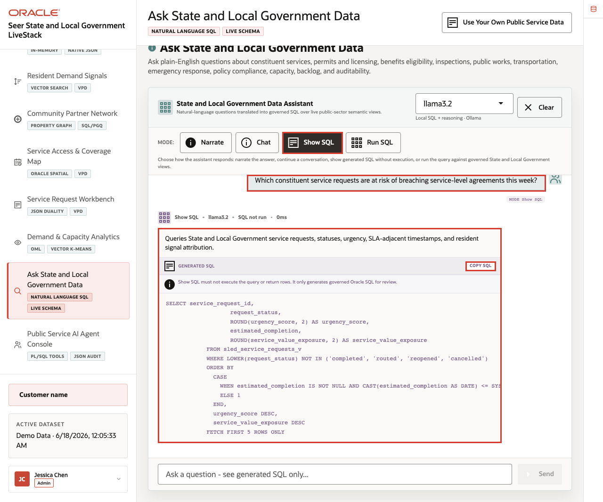
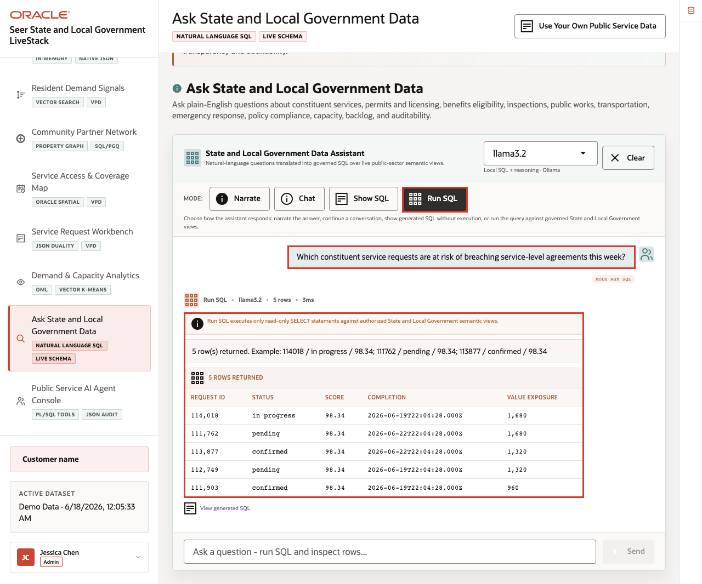

# Scene 9 Ask State and Local Government Data

## Introduction

**Ask State and Local Government Data** helps agency users ask operational questions in plain language while keeping the answer path visible. Users can compare narrated answers, conversational responses, generated SQL, and result rows, making self-service analytics faster and easier to trust.

Natural-language data access can create governance risk if the language model generates invalid SQL, references the wrong tables, hides the query path, or exposes more data than the user should see. Public-sector teams need self-service analytics, but data teams still need traceability, read-only execution, and a clear source of truth.

Oracle AI Database helps address these challenges by keeping query execution grounded in the live State and Local Government schema. In this LiveStack Demo, the app sends the question and schema context to the local Ollama runtime, validates the generated SQL path, and uses Oracle AI Database 26ai as the execution authority.

**Note:** Ollama provides the local AI runtime used for reasoning, while Oracle remains the governed source for data access and execution.

Estimated Time: **10 minutes**

### Objectives

In this scene, you will learn how public-sector users can ask operational questions, compare answer modes, inspect SQL evidence, and validate result rows.

## Task 1: Use Narrate mode for an operations brief

Perform the following set of steps when the user wants a business-readable answer first. The system still relies on governed SQL behind the scenes, but the response is shaped for agency operations users.

1. Click **Ask State and Local Government Data** in the sidebar.
2. Review the runtime profile in the assistant card.
3. Review the queryable schema summary.
4. Click **Narrate**.
5. Click **Ask** on the constituent-services example question: **Which constituent service requests are at risk of breaching service-level agreements this week?**

    

**Expected result:** The assistant returns an operations brief with key findings and follow-up prompts without making generated SQL the main artifact.

**Note:** Sample values may change after data refreshes or rebuilds. Verify live output before presenting, then explain the business takeaway.

## Task 2: Use Chat mode for a conversational answer

Perform the following set of steps when the user is exploring the data interactively and may want follow-up questions or a more conversational explanation.

1. Click **Clear** if the Narrate result is still visible.
2. Click **Chat**.
3. Click **Ask** on the same service request SLA risk question.

    

**Expected result:** The assistant returns a conversational response and follow-up prompts grounded in the live public-sector schema.

## Task 3: Use Show SQL mode to inspect the query path

Perform the following set of steps when a user, data steward, or agency leader needs to see the query path before rows appear. This keeps the answer traceable instead of hidden behind an AI response.

1. Click **Clear** if the Chat result is still visible.
2. Click **Show SQL**.
3. Click **Ask** on the same question.
4. Review the generated SQL.

    

The generated SQL is the governance moment: the user can inspect the query before asking the database to return rows.

## Task 4: Use Run SQL mode to inspect result rows

Perform the following set of steps to inspect the live rows behind the answer. This helps the user connect a plain-English question to specific services, categories, regions, demand, capacity, or risk factors.

1. Click **Clear** if the generated SQL result is still visible.
2. Click **Run SQL**.
3. Click **Ask** on the same question.
4. Review the result table.

    

Use the four completed mode examples to explain the governance pattern behind the page:

1. The user asks a public-sector question in plain English.
2. The app builds prompt and schema context for the selected runtime profile.
3. Ollama drafts SQL or a response plan.
4. Oracle AI Database executes authorized SQL against the live schema.
5. The UI returns visible SQL, rows, or a narrated answer depending on the selected mode.

This pattern matters because agency users want faster answers, but they also need governed access, visible query logic, and a trusted execution layer.

*You can move to the next scene.*

## Credits & Build Notes
- **Author** - Oracle LiveLabs Team
- **Last Updated By/Date** - Oracle LiveLabs Team, 2026-06-17
