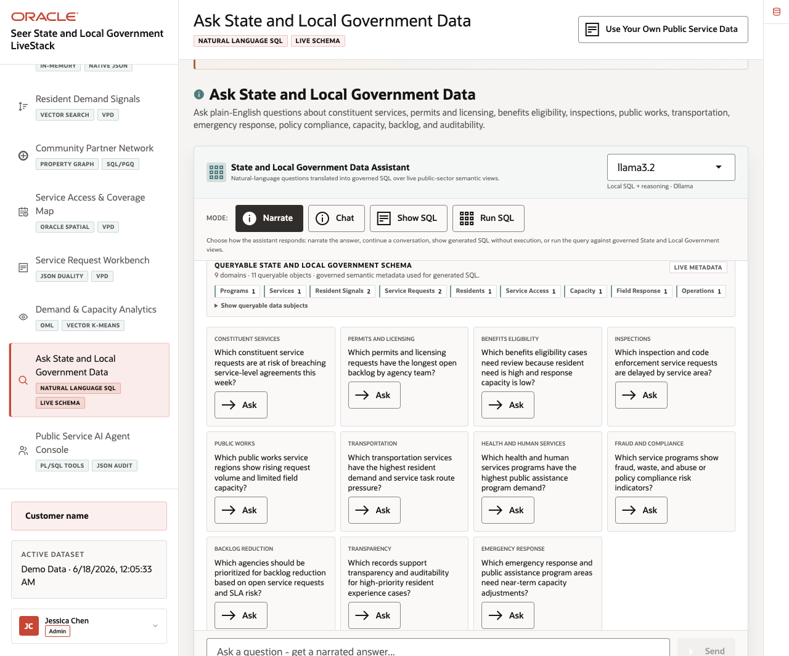
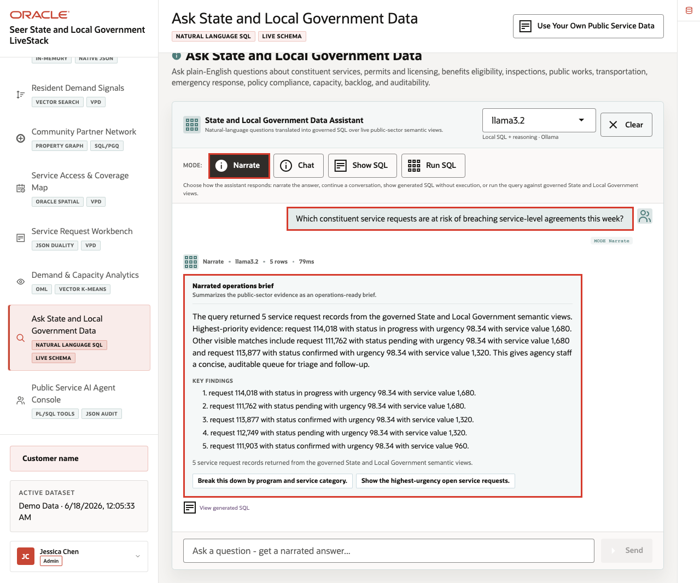
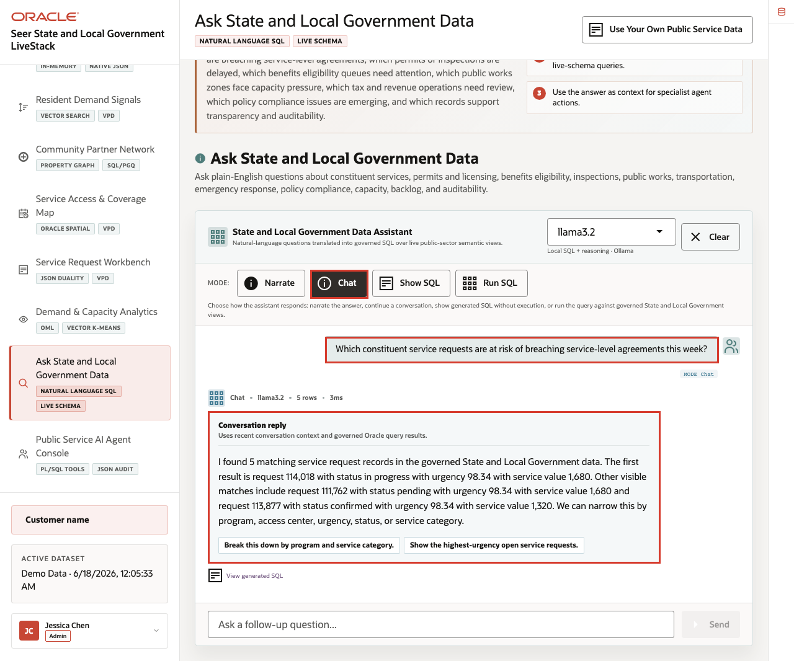
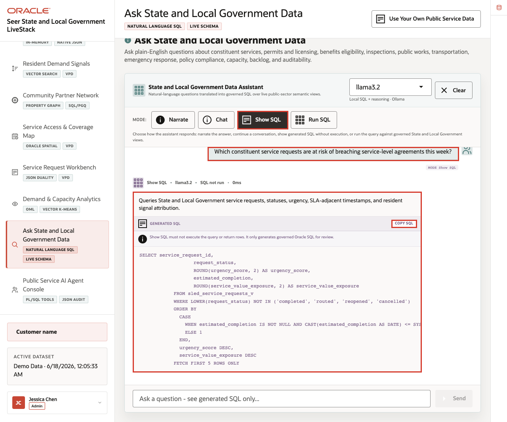
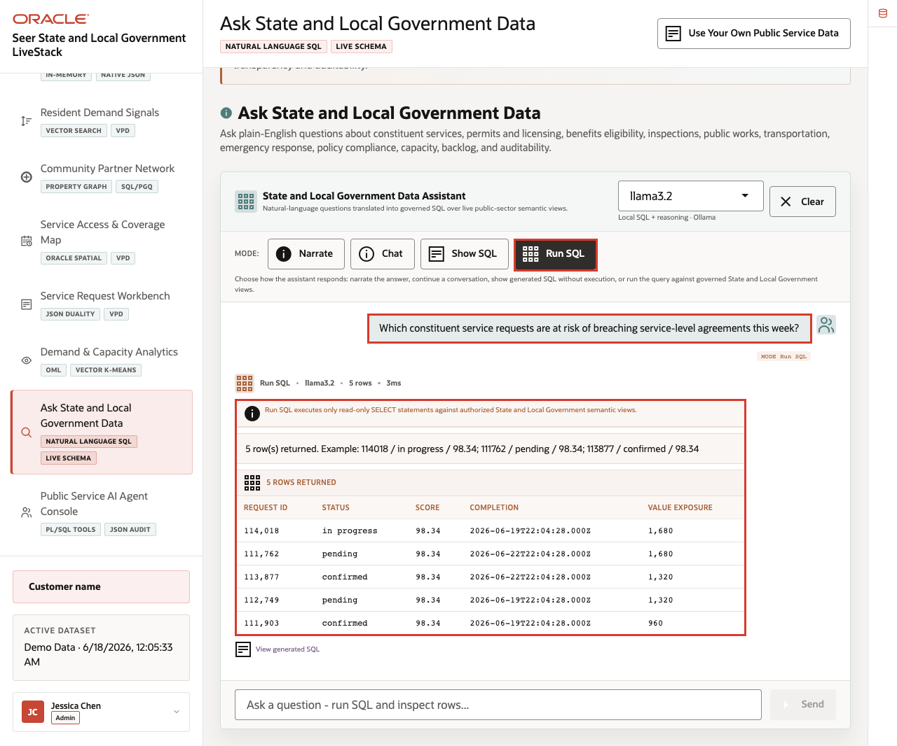

# Scene 9 Ask State and Local Government Data

## Introduction

Jessica now tests the same Colorado operating decision through natural-language data access. **Ask State and Local Government Data** lets her compare a narrated answer, conversational follow-up, generated SQL, and authorized result rows while Oracle remains the governed execution authority.

The active VPD identity continues to apply. Changing answer mode does not broaden the user's database access.

Estimated Time: **10 minutes**

### Objectives

In this scene, you will ask one eligibility-and-capacity question in four modes and inspect how each mode preserves traceability.

## Task 1: Use Narrate for the operating brief

1. Click **Ask State and Local Government Data** in the sidebar.
2. Confirm that Jessica Chen remains selected.
3. Click **Narrate**.
4. Ask: **Which benefits eligibility cases need review because resident need is high and response capacity is low?**
5. Review the business-readable findings and follow-up prompts.

    

Narrate gives Jessica an executive-ready summary while the answer remains grounded in authorized Oracle data.

## Task 2: Use Chat for a follow-up

1. Without changing the operating topic, click **Chat**.
2. Ask: **Which constituent service requests are at risk of breaching service-level agreements this week?** Jessica's global VPD context keeps the returned operating rows scoped to Colorado.
3. Review the conversational answer and suggested follow-up.

    

The follow-up keeps the same decision context while moving from cases needing review to near-term service-level risk.

## Task 3: Inspect generated SQL without executing it

1. Click **Clear**.
2. Click **Show SQL**.
3. Ask the original benefits eligibility question again.
4. Review the generated SQL.
5. Explain that Show SQL exposes the proposed read-only query path without returning result rows.

    

The SQL view is the governance checkpoint: a data steward can inspect the query before execution.

## Task 4: Run authorized SQL and inspect rows

1. Click **Clear**.
2. Click **Run SQL**.
3. Ask the original question again.
4. Inspect the result rows without relying on a permanent row count or generated SQL string.

    

Ollama drafts reasoning or query structure, while Oracle AI Database executes authorized, read-only SQL against governed semantic views. The returned rows remain constrained by Jessica's current VPD identity.

Jessica now has a defensible answer path. Scene 10 turns the evidence into a recommended action while preserving tool use and audit history.

*You can move to the next scene.*

## Credits & Build Notes

- **Author** - Oracle LiveLabs Team
- **Last Updated By/Date** - Oracle LiveLabs Team, 2026-07-03
