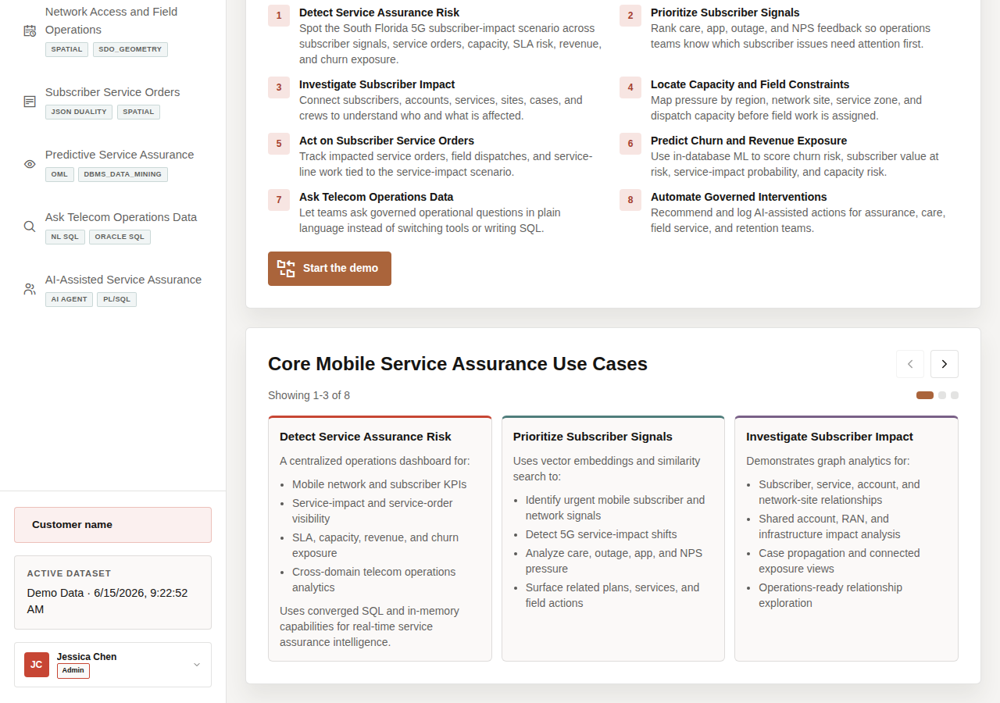
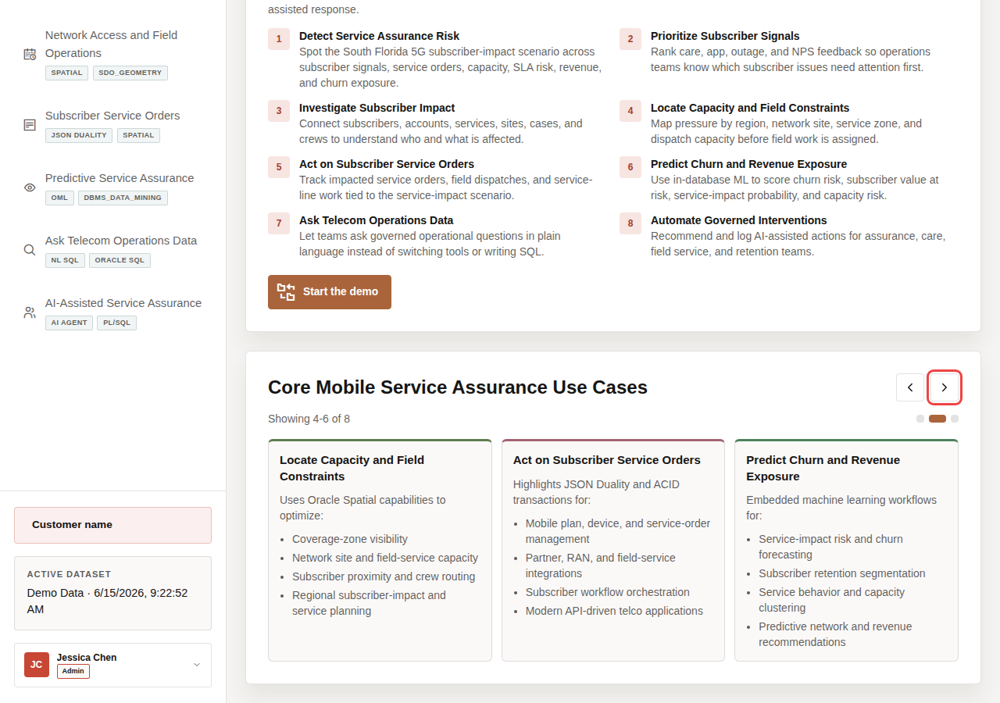
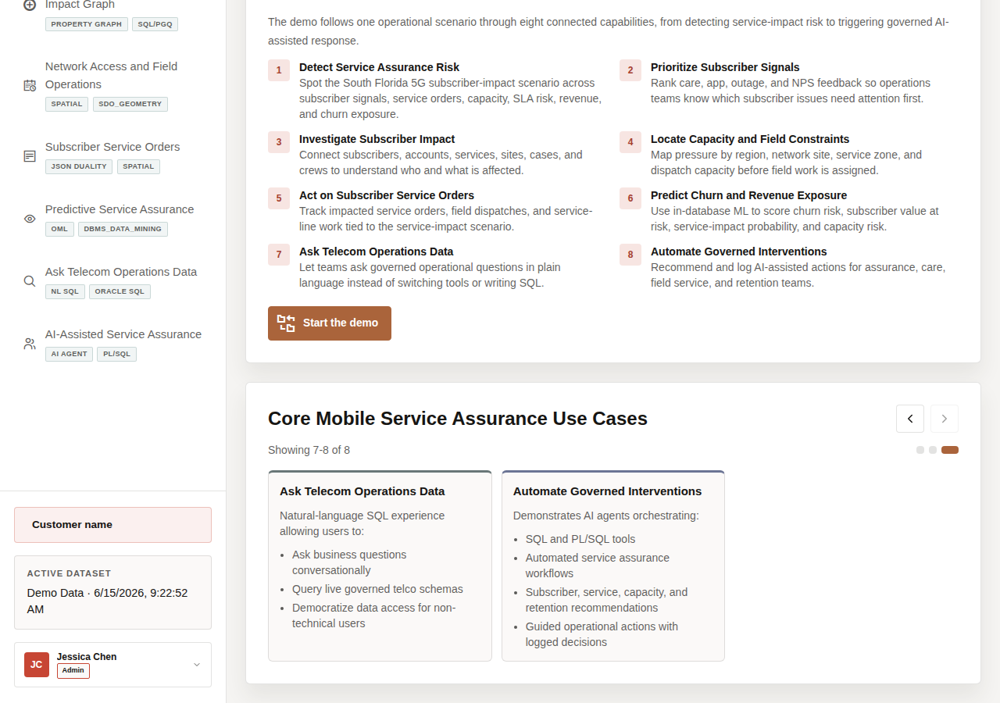
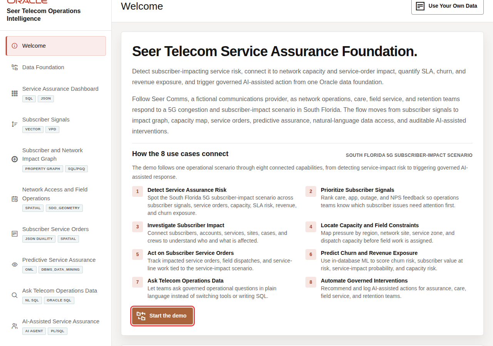

# Scene 1 Welcome and Demo Orientation

## Introduction

This opening scene frames the demo around a **South Florida 5G** subscriber-impact scenario. The top panel and carousel show how the use cases connect into one service-assurance journey: service pressure appears, subscriber signals explain urgency, network and field views show impact, service orders capture response, predictive assurance quantifies risk, and AI-assisted workflows recommend next actions.

Estimated Time: **5 minutes**

### Objectives

In this scene, you will learn what telecom decision the page supports, what evidence the user should inspect, and what action the team may take next.

## Task 1: Review the South Florida 5G subscriber-impact scenario

1. Review the **South Florida 5G** subscriber-impact scenario first so the audience understands the full service-assurance journey. The scenario connects service pressure, subscriber urgency, graph impact, field capacity, service orders, predictive risk, and AI-assisted action into one narrative.
2. Use the welcome page to make the demo feel like one connected telecom service-assurance story, not eight separate feature stops.
3. Read the three visible use case tiles in **Core Mobile Service Assurance Use Cases**.
4. Click the right carousel arrow to move forward.

5. Continue until you have reviewed all eight use cases.

6. Use the left carousel arrow if you want to return to earlier tiles.

## Task 2: Continue the demo

After the audience understands the **South Florida 5G** subscriber-impact storyline, continue to **Data Foundation** to prepare the governed telecom dataset that powers the rest of the demo.

1. Click **Start the demo**.
2. Confirm the demo moves to **Data Foundation**.

## Credits & Build Notes
- **Author** - Oracle LiveLabs Team
- **Last Updated By/Date** - Oracle LiveLabs Team, 2026-06-29
