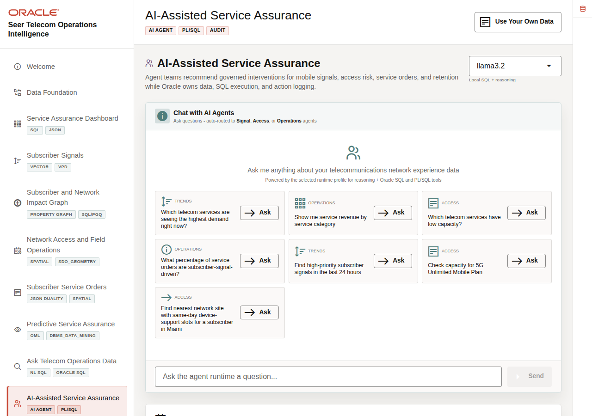
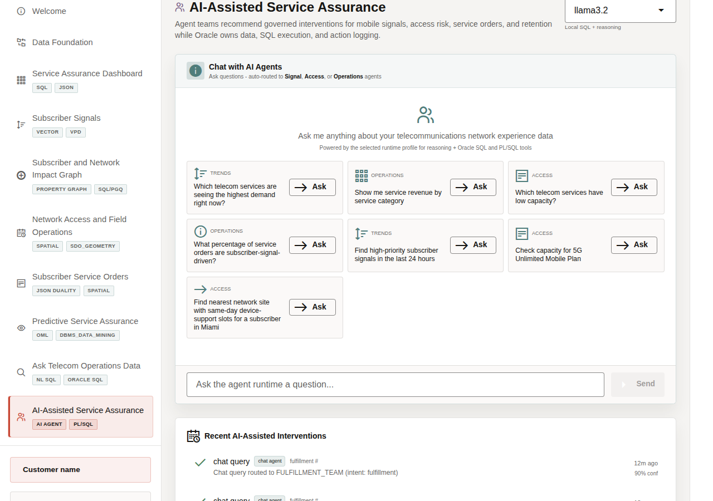
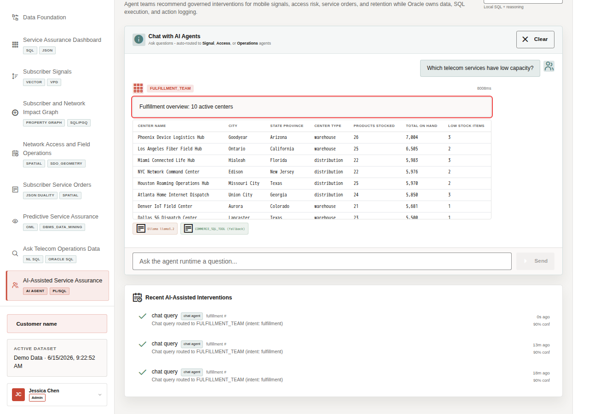

# Scene 10 AI-Assisted Service Assurance

## Introduction

**AI-Assisted Service Assurance** shows how an AI assistant can support telecom operations without becoming a black box. When an agent helps with network access, subscriber operations, signal analysis, or field capacity, users need to see the routing decision, tools used, data returned, confidence, and audit record.

Telecom teams struggle when the information needed for one service-assurance decision lives in separate OSS, BSS, care, NOC, field, and analytics tools. That separation slows action, increases reconciliation work, and makes it harder to trust the result.

Oracle AI Database helps address these challenges by keeping the source data, SQL execution, PL/SQL tools, and durable action logging in the database. In this LiveStack Demo, the app orchestrates the agent workflow, Ollama provides reasoning, and Oracle AI Database 26ai executes the governed data operations. Agent actions are written back to `agent_actions`, while the UI shows the response, tool badges, and recent audit trail.

Estimated Time: **10 minutes**

### Objectives

In this scene, you will learn what telecom decision the page supports, what evidence the user should inspect, and what action the team may take next.

## Task 1: Review the agent console workspace

Review the agent console as an operational workspace. Before running a task, the user can see the runtime profile, example questions, chat area, and any interventions logged by earlier demo runs. Specialist routing, tool badges, returned data, and confidence become visible after a query runs.

1. Click **AI-Assisted Service Assurance** in the sidebar.
2. Review the runtime profile selector in the top right. The current demo uses **llama3.2** through an Ollama-backed runtime profile.
3. Review the example questions in the chat panel.
4. Review **Recent AI-Assisted Interventions** below the chat panel if earlier demo runs are present.
5. Focus on a capacity example such as **Check capacity for 5G Unlimited Mobile Plan** or **Which telecom services have low capacity?**

Use this opening view to explain that the page is an operational agent console. The runtime profile and examples establish what can be asked; the next task shows routing, tools, returned data, confidence, and durable action history.

## Task 2: Run a low-capacity question

Run the low-capacity question to show how the agent routes the request, summarizes fulfillment-center inventory pressure, and exposes the governed tool path behind the result.

1. Click **Ask** on **Which telecom services have low capacity?**
2. Review the agent response at the top of the chat output.
3. Review the fulfillment-center inventory table returned by the agent.
4. Review the tool badges below the response.

After showing the response, explain what the business can decide: investigate low-stock exposure, prioritize replenishment, or coordinate the fulfillment centers that need attention first.

In the current demo dataset, the low-capacity question routes to **FULFILLMENT_TEAM** and returns a fulfillment overview for **10 active centers**. The table shows each center's location, center type, products stocked, total on hand, and low-stock item count. The response exposes **COMMERCE_SQL_TOOL (fallback)** as the governed Oracle data-access path used for the result.

**Note:** These are sample values from the current demo dataset and may change after a refresh, seed update, or custom dataset import. Treat these numbers as an example of the current operating pattern. Review the live values in the UI and connect them to the operational pattern: subscriber impact, capacity exposure, SLA risk, revenue exposure, dispatch load, or restoration status.

## Task 3: Interpret the operational story

Interpret the result as an operational visibility story: teams can compare center-level stock breadth, total on-hand capacity, and low-stock exposure before deciding where replenishment, field support, capacity relief, or customer communication may be needed.

1. The question asks for telecom services with low capacity.
2. The workflow routes the request to **FULFILLMENT_TEAM**.
3. Oracle data returns **10** active centers with products stocked, total on hand, and low-stock item counts.
4. The business user can compare where capacity or replenishment pressure is concentrated.
5. The audit trail records the specialist route and confidence after the query completes.

The important story is operational visibility: teams can see where inventory capacity is available, where low-stock exposure is concentrated, and which fulfillment centers may need replenishment or operational follow-up.

## Task 4: Review the agent action audit trail

Review the audit trail to show that AI-assisted actions do not disappear after the conversation. Operators, architects, and auditors can review what the agent did, which path it used, and how confident the system was.

1. Scroll to **Recent AI-Assisted Interventions**.
2. Review the top action row.
3. Confirm that the row shows a completed chat query routed to a specialist agent path.
4. Review the confidence value.

In the current demo dataset, the completed chat action is logged with **90%** confidence. This is the governance point of the scene: agent decisions should be observable after the conversation. The page shows that agent interactions are not just transient chat messages. They are written into the action history so an operator, architect, or auditor can understand what happened.

**Note:** These are sample values from the current demo dataset and may change after a refresh, seed update, or custom dataset import. Treat these numbers as an example of the current operating pattern. Review the live values in the UI and connect them to the operational pattern: subscriber impact, capacity exposure, SLA risk, revenue exposure, dispatch load, or restoration status.

The business value is that teams can make the decision from connected, governed data. Oracle AI Database provides the shared foundation that keeps operational data, analytics, and AI workflows aligned.

**Congratulations! You have completed the LiveStack demo!** 

The walkthrough showed how connected telecom data can support service-impact detection, subscriber signal triage, impact investigation, field capacity planning, service-order visibility, predictive assurance, governed data access, and AI-assisted action.

## Credits & Build Notes
- **Author** - Oracle LiveLabs Team
- **Last Updated By/Date** - Oracle LiveLabs Team, 2026-06-29
