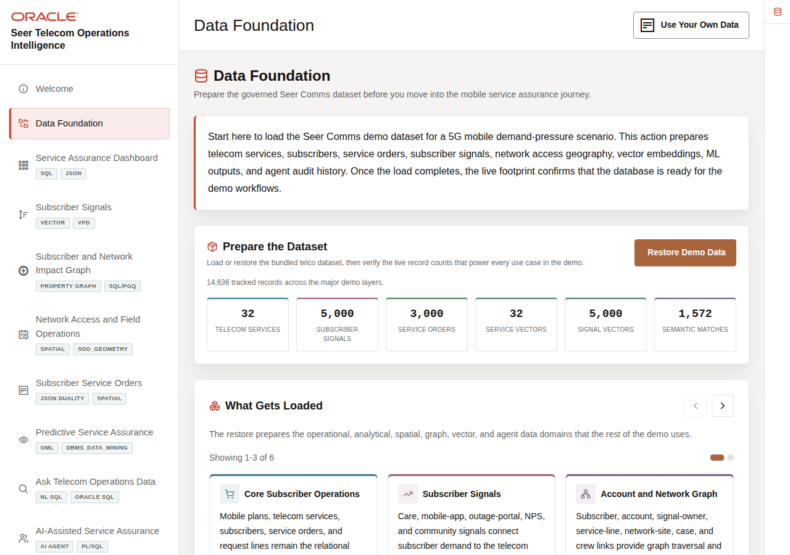
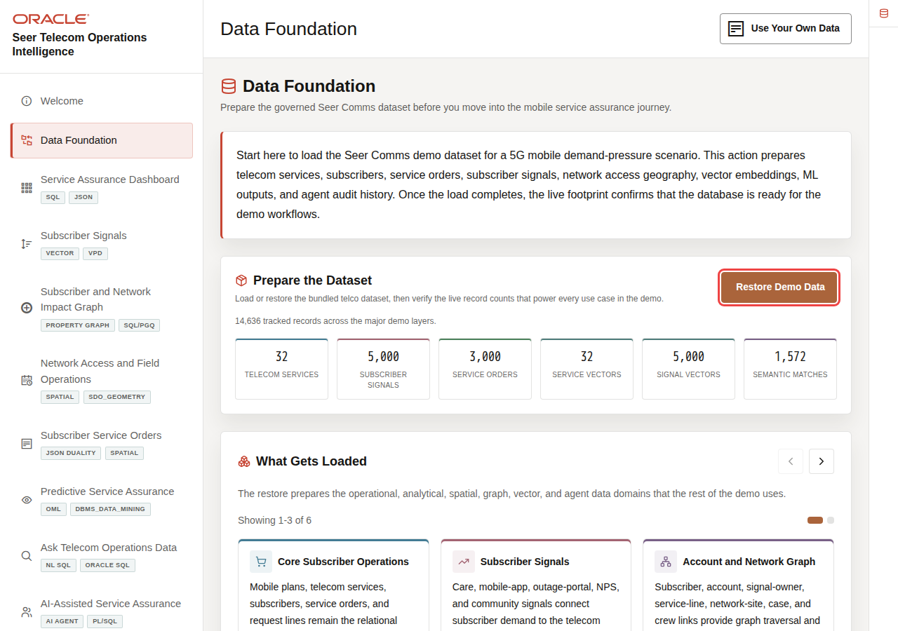
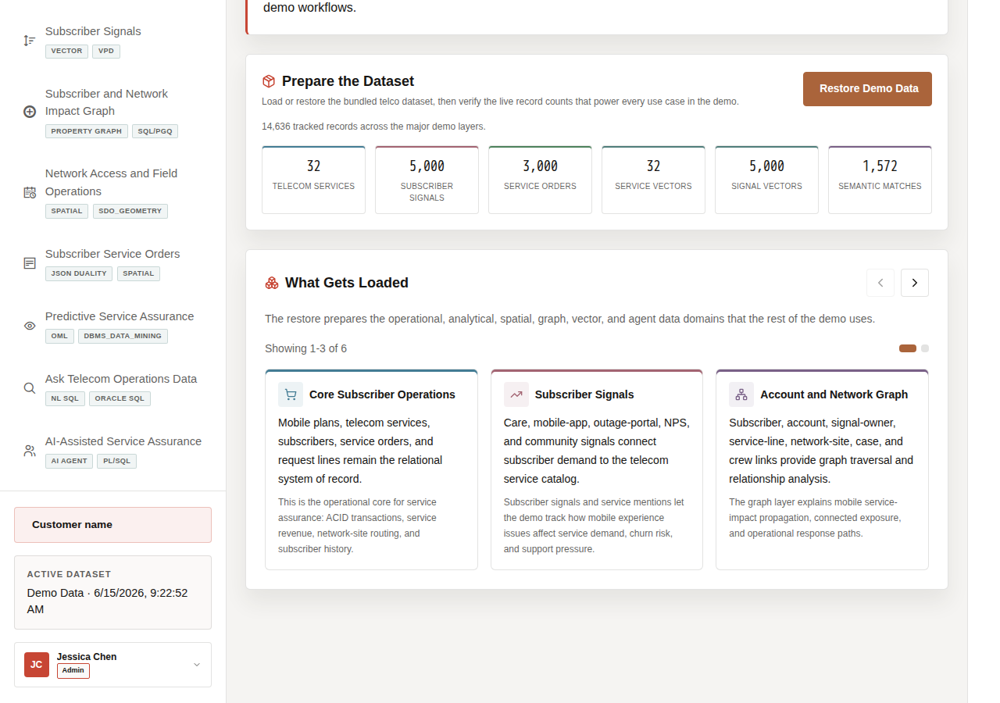
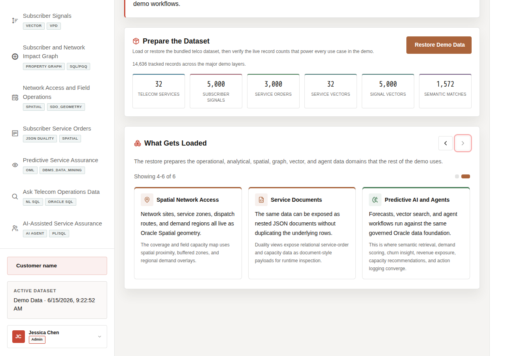

# Scene 2 Data Foundation

## Introduction

This scene prepares the trusted Seer Telecom dataset used throughout the demo. Loading or restoring the data gives every later screen the same governed starting point, so dashboards, signal search, graph analysis, field operations, service orders, predictive assurance, Ask Data, and AI-assisted workflows all reflect the same telecom data foundation.

Estimated Time: **5 minutes**

### Objectives

In this scene, you will learn what telecom decision the page supports, what evidence the user should inspect, and what action the team may take next.

## Task 1: Prepare the dataset

Prepare the dataset so every later scene starts from the same trusted telecom baseline. This makes the operations dashboard, signal search, impact graph, field operations map, service orders, predictive assurance, Ask Data, and AI agent results easier to compare and trust.

1. Click **Data Foundation** in the sidebar.
2. In **Prepare the Dataset**, click **Load Demo Data**.
3. If the dataset is already loaded, click **Restore Demo Data** to reset the demo data to a clean state.
4. Wait for the progress indicator to finish and review the refreshed record counts.

The load prepares telecom services, subscriber signals, service orders, network sites, demand regions, field dispatch context, vector embeddings, graph relationships, machine learning outputs, and agent audit history. The system compares subscriber and service text by meaning, with embeddings providing the representation that makes this possible.

In this example, the live data-foundation page shows **32 telecom services**, **5,000 subscriber signals**, **3,000 service orders**, **32 service vectors**, **5,000 signal vectors**, and **1,572 semantic matches**.

**Note:** These are sample values from the current demo dataset and may change after a refresh, seed update, or custom dataset import. Treat these numbers as an example of the current operating pattern. Review the live values in the UI and connect them to the operational pattern: subscriber impact, capacity exposure, SLA risk, revenue exposure, dispatch load, or restoration status.

## Task 2: Review what gets loaded

Review what gets loaded to show that the demo uses recognizable telecom data: services, subscriber signals, service orders, network sites, demand regions, field dispatch context, vectors, graph relationships, machine learning outputs, and agent action history.

1. Scroll to **What Gets Loaded**.
2. Read the three visible carousel tiles.
3. Use the right carousel arrow to review the remaining tiles.

4. Look for the major data types used in the demo: relational tables, JSON duality views, graph relationships, spatial geometry, vector embeddings, machine learning results, and agent audit records.

**Note:** The system compares subscriber and service text by meaning, with embeddings providing the representation that makes this possible.

You can move to the next scene.

## Credits & Build Notes
- **Author** - Oracle LiveLabs Team
- **Last Updated By/Date** - Oracle LiveLabs Team, 2026-06-29
