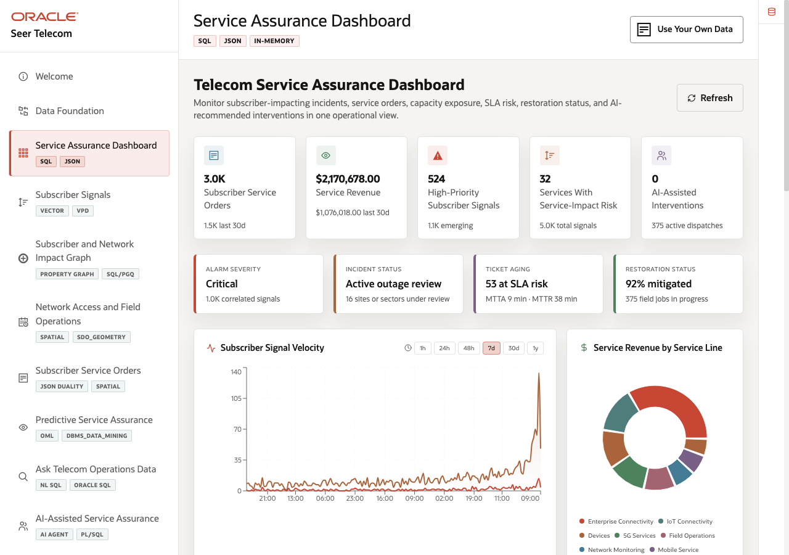
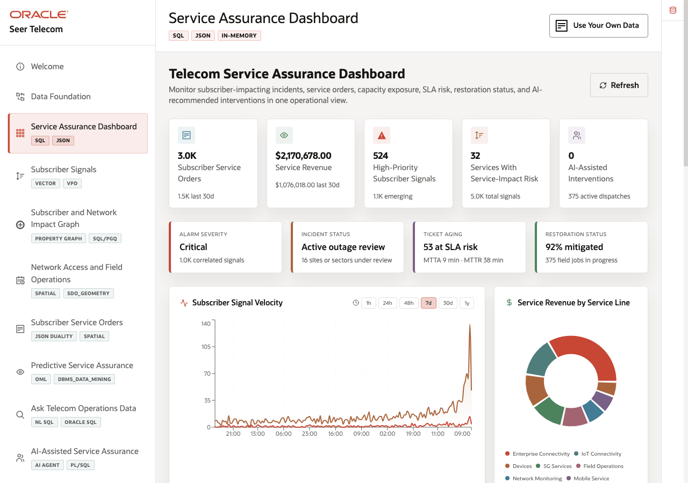
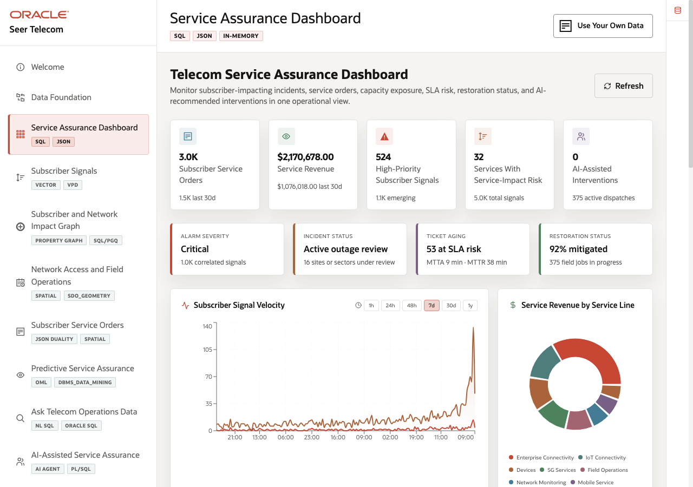

# Scene 3 Telecom Service Assurance Dashboard

## Introduction

The **Telecom Service Assurance Dashboard** helps telecom teams answer a daily service-assurance question: *which services are creating subscriber impact, SLA exposure, and operational response pressure right now?* The page brings together service orders, revenue exposure, subscriber signals, services with service-impact risk, dispatches, AI-assisted interventions, and assurance evidence markers so teams can decide where to investigate first.

Dashboards like this are difficult to implement when telecom data is split across OSS, BSS, NOC tools, care systems, outage portals, field dispatch systems, and analytics pipelines. Teams often need copied data, ETL jobs, separate search indexes, and reconciliation logic before a dashboard can show a trustworthy view.

Oracle AI Database helps address that challenge by keeping operational, analytical, JSON, in-memory, and AI-ready data close to the same governed data foundation. In this scene, the dashboard brings together live telecom KPIs, subscriber signal velocity, service revenue, service-impact risk, alarm severity, incident status, ticket aging, and restoration status without sending the user to a different application.

Use **Fixed Wireless Home Internet** as the running example for moving from service-impact risk to subscriber signals, service orders, capacity checks, SLA exposure, and predictive risk.

Estimated Time: **10 minutes**

### Objectives

In this scene, you will learn what telecom decision the page supports, what evidence the user should inspect, and what action the team may take next.

## Task 1: Review the service-assurance dashboard

Use the dashboard as a daily triage view. The goal is to see where subscriber impact, SLA exposure, revenue exposure, high-priority signals, field dispatches, restoration status, or AI-assisted interventions suggest that a service needs attention.

1. Click **Service Assurance Dashboard** in the sidebar.
2. Review the KPI cards across the top of the page. These summarize the current operating picture: subscriber service orders, service revenue, high-priority subscriber signals, services with service-impact risk, active dispatches, and AI-assisted interventions.
3. Review **Subscriber Signal Velocity**. This chart measures the rate and intensity of subscriber activity across care, app, outage, and NPS-style signal sources.
4. Review **Service Revenue by Service Line** to see which service categories are contributing most to revenue.
5. Review the assurance evidence row: alarm severity, incident status, ticket aging, and restoration status. These markers make the dashboard feel like a service-assurance view instead of a generic business dashboard.

Use the dashboard as a triage view. These are sample values from the current demo dataset and may change after a refresh, seed update, or custom dataset import. In this example, the guide mentions values such as **3,000 service orders**, **$2.17M in service revenue**, **524 high-priority subscriber signals**, **32 services with service-impact risk**, and **375 active dispatches**.

**Note:** These are sample values from the current demo dataset and may change after a refresh, seed update, or custom dataset import. Treat these numbers as an example of the current operating pattern. Review the live values in the UI and connect them to the operational pattern: subscriber impact, capacity exposure, SLA risk, revenue exposure, dispatch load, or restoration status.

## Task 2: Review services with service-impact risk

Review service-impact risk to identify which telecom services are carrying the strongest combination of subscriber signals, affected reach, urgency, SLA exposure, and operational risk.

1. Scroll to **Services With Service-Impact Risk**.
2. Review the service rows. The table ranks telecom services by signal count, affected subscriber reach, urgency score, and risk level.
3. Use the search field or service-line chips if you want to narrow the table.
4. Focus on **Fixed Wireless Home Internet**.

In this example, the guide mentions values such as **57 signal mentions**, **45M affected subscriber reach**, an urgency score of **77**, and **High risk**.

**Note:** These are sample values from the current demo dataset and may change after a refresh, seed update, or custom dataset import. Treat these numbers as an example of the current operating pattern. Review the live values in the UI and connect them to the operational pattern: subscriber impact, capacity exposure, SLA risk, revenue exposure, dispatch load, or restoration status.

## Task 3: Inspect the service detail modal

Open the service detail modal to move from dashboard-level pressure to service-level evidence, including capacity exposure, subscriber signals, service-line context, SLA risk, restoration status, and operational details that can guide the next action.

1. Click **Fixed Wireless Home Internet**.
2. Review the default details view.
3. Inspect available dispatch slots, service-line context, subscriber signals, SLA risk, restoration status, and operational evidence.

This view is useful for network operations and care because it moves from dashboard-level pressure to service-level evidence. The user can see which service is under pressure, which signals are driving it, and which operational data should be checked before acting.

## Task 4: Review the JSON Duality View

Review the **JSON Duality View** to show that the same trusted service data can support different users. Business users see operational details, while applications and APIs can use the same information as a structured document.

1. In the service modal, click **JSON Duality View**.
2. Review the JSON document generated for the same service and operational data.

The point of this view is to show that the same data can support different application needs. The **Details** tab presents the data as an operational user interface for business users. 

The **JSON Duality View** presents the same service and capacity information as a nested JSON document that is useful for APIs and application developers. Oracle JSON Relational Duality lets the application expose document-style access without copying the data into a separate document store.

You can move to the next scene.

## Credits & Build Notes
- **Author** - Oracle LiveLabs Team
- **Last Updated By/Date** - Oracle LiveLabs Team, 2026-05-28
