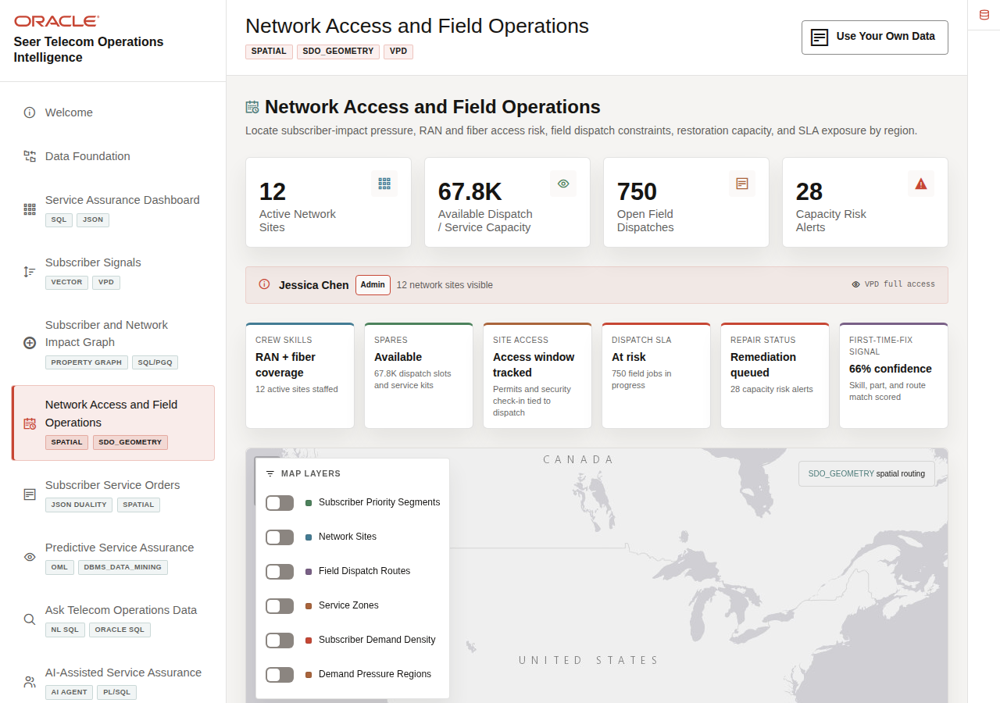
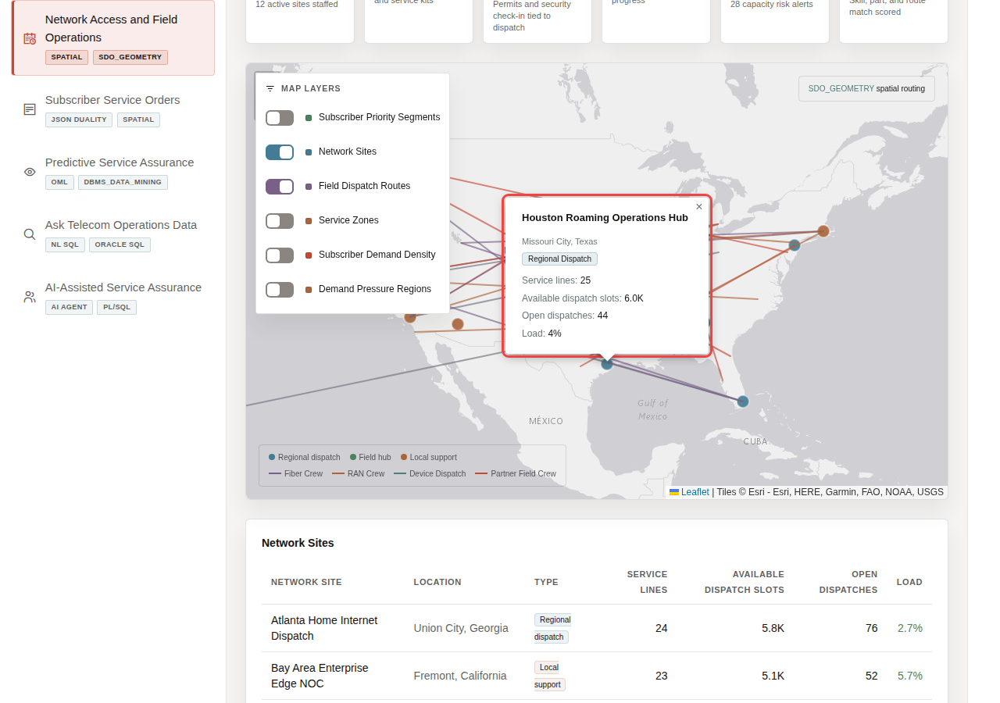
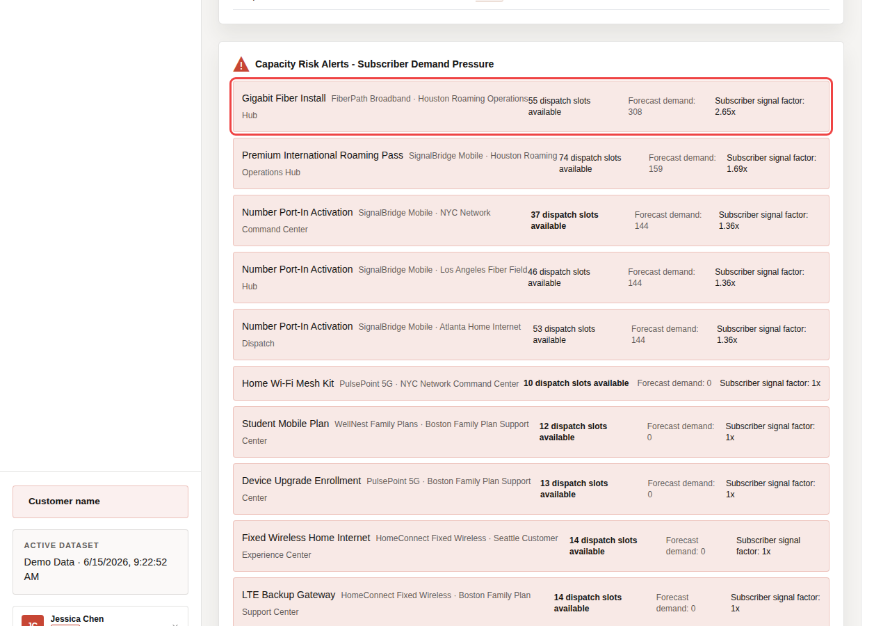

# Scene 6 Network Access and Field Operations

## Introduction

**Network Access and Field Operations** helps teams see where subscriber demand intersects with network sites, service zones, field dispatch routes, and capacity constraints. The map gives a geographic operating view so users can compare subscriber-impact pressure, site capacity, dispatch routes, field readiness, and subscriber priority in one place.

Telecom teams struggle when the information needed for one service-assurance decision lives in separate OSS, BSS, care, NOC, field, and analytics tools. That separation slows action, increases reconciliation work, and makes it harder to trust the result.

Oracle AI Database helps address these challenges by keeping spatial data, service orders, capacity forecasts, subscriber locations, and operational metrics together. In this scene, Oracle Spatial supports service-zone visualization, proximity analysis, demand density, and field dispatch routing from the same data foundation used by the rest of the LiveStack Demo.

Estimated Time: **10 minutes**

### Objectives

In this scene, you will learn what telecom decision the page supports, what evidence the user should inspect, and what action the team may take next.

## Task 1: Review the field operations map

Review the field operations map to understand where network access, subscriber demand, demand regions, field dispatch routes, field readiness, and capacity constraints intersect.

1. Click **Network Access and Field Operations** in the sidebar.
2. Review the top metric tiles: **Active Network Sites**, **Available Field / Service Capacity**, **Open Field Dispatches**, and **Capacity Risk Alerts**.
3. Review the map legend and layer controls. The map layers initialize off.
4. Toggle the controls if you want to isolate **Network Sites**, **Field Dispatch Routes**, **Service Zones**, **Subscriber Demand Density**, or **Demand Pressure Regions**.
5. Review the field readiness strip: crew skills, spares, site access, dispatch SLA, repair status, and first-time-fix signal.

The map is not just showing points; it connects subscriber-impact pressure, network access, field capacity, demand regions, field readiness, and subscriber density to the same service-assurance story.

## Task 2: Inspect network sites and field capacity

Inspect network sites and field capacity to compare current load, available dispatch slots, service readiness, and pending dispatches before deciding where field support or capacity relief may be needed.

1. Turn on **Network Sites** in **Map Layers**.
2. Turn on **Field Dispatch Routes**.
3. Select a network-site marker to open its detail popup.
4. Compare current load, available dispatch slots, service lines tracked, and open dispatches.
5. Review the **Network Sites** table below the map for the broader site comparison.

In the current demo dataset, the page uses **12** active network sites. The selected **Houston Roaming Operations Hub** example shows **25** service lines, about **6.0K** available dispatch slots, **44** open dispatches, and **4%** load. The table also supports comparison across sites such as **Atlanta Home Internet Dispatch**, **Dallas 5G Dispatch Center**, and **Chicago Midwest NOC**.

**Note:** These are sample values from the current demo dataset and may change after a refresh, seed update, or custom dataset import. Treat these numbers as an example of the current operating pattern. Review the live values in the UI and connect them to the operational pattern: subscriber impact, capacity exposure, SLA risk, revenue exposure, dispatch load, or restoration status.

## Task 3: Review capacity risk alerts

Review capacity risk alerts to identify where forecast demand exceeds available capacity and where field teams may need to rebalance resources, adjust dispatch, or prioritize service recovery.

1. Scroll to **Capacity Risk Alerts**.
2. Review the services, network sites, available capacity, forecast demand, and subscriber signal factor.
3. Focus on a service such as **Gigabit Fiber Install** at **Houston Roaming Operations Hub**.

Spatial context becomes operational action when teams can see where forecast demand, capacity, and field dispatch options are misaligned.

In the current demo dataset, **Gigabit Fiber Install** at **Houston Roaming Operations Hub** shows **55** dispatch slots available against **308** forecast demand and is marked low capacity. **Number Port-In Activation** appears as a critical example in the NYC Network Command Center, with **37** available dispatch slots and **144** predicted demand.

**Note:** These are sample values from the current demo dataset and may change after a refresh, seed update, or custom dataset import. Treat these numbers as an example of the current operating pattern. Review the live values in the UI and connect them to the operational pattern: subscriber impact, capacity exposure, SLA risk, revenue exposure, dispatch load, or restoration status.

## Task 4: Explain the spatial pattern

Explain the spatial pattern as field-aware service assurance: network sites, subscriber locations, demand forecasts, and dispatch routes stay connected to the same governed telecom data foundation.

1. Network site and subscriber locations are stored with spatial coordinates.
2. Demand forecasts and subscriber signals add operational pressure to geography.
3. Field dispatch routes show how the business responds.
4. Oracle Spatial keeps the map, proximity, route, and zone context connected to transactional service data.

You can move to the next scene.

## Credits & Build Notes
- **Author** - Oracle LiveLabs Team
- **Last Updated By/Date** - Oracle LiveLabs Team, 2026-06-29
