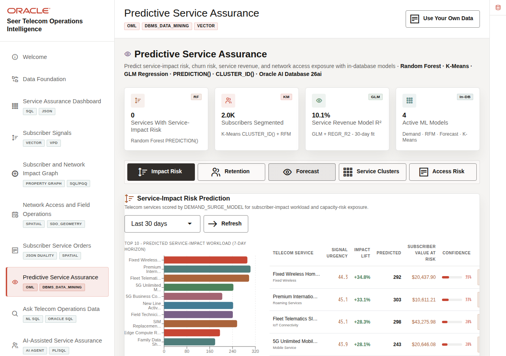
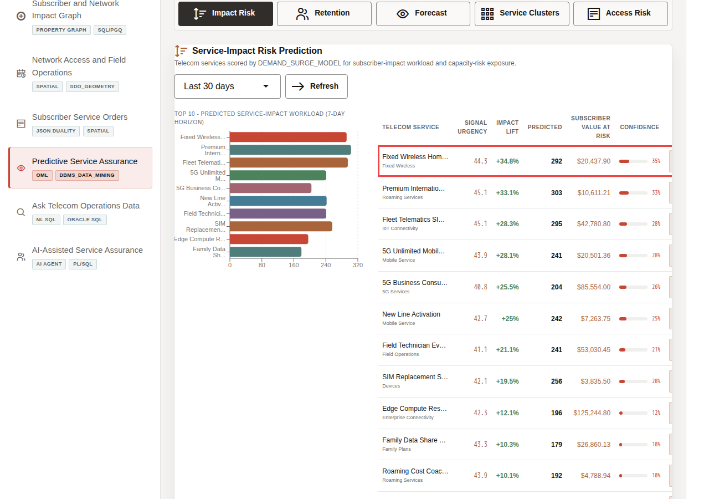
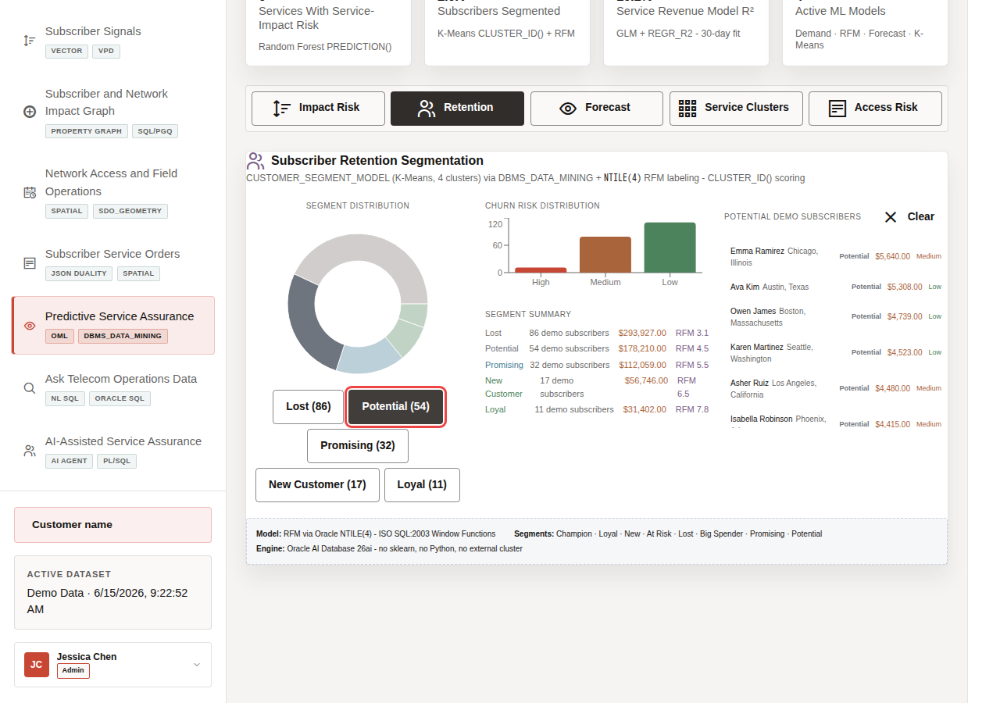
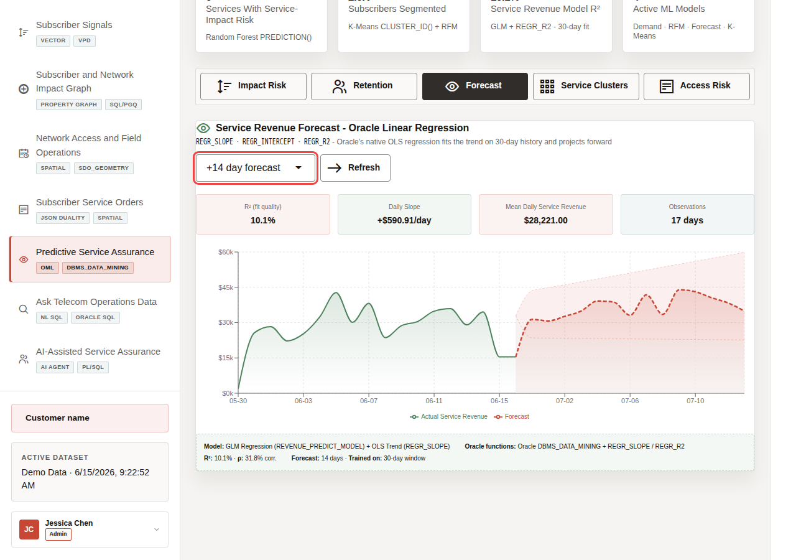
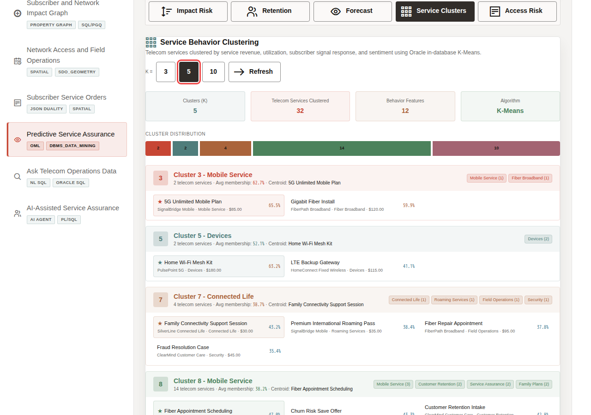
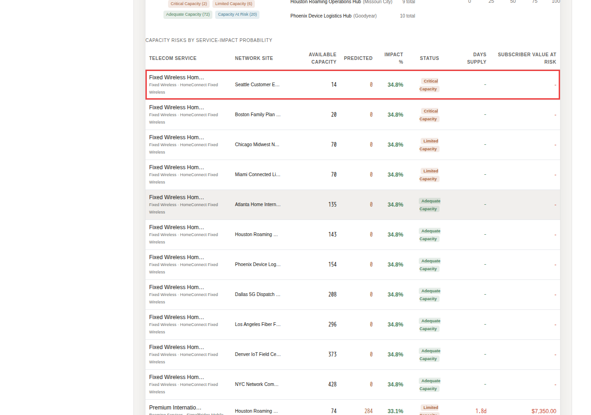

# Scene 8 Predictive Service Assurance

## Introduction

**Predictive Service Assurance** helps telecom teams decide which predictive signals should become action. The page brings together service-impact risk prediction, retention segments, service revenue forecasts, service behavior clusters, and network access risk so teams can plan capacity, outreach, dispatch, and care response before pressure turns into churn or SLA breach.

Telecom teams struggle when the information needed for one service-assurance decision lives in separate OSS, BSS, care, NOC, field, and analytics tools. That separation slows action, increases reconciliation work, and makes it harder to trust the result.

Oracle AI Database helps address these challenges by keeping machine learning close to governed telecom data. Oracle Machine Learning models can be trained, persisted, and scored in the database with `DBMS_DATA_MINING`, `PREDICTION()`, `PREDICTION_PROBABILITY()`, and `CLUSTER_ID()`. Service-impact risk prediction, retention segmentation, service revenue forecasting, service behavior clustering, and network access risk scoring can run from the same connected data foundation that powers the rest of the LiveStack Demo. The backend model name remains `DEMAND_SURGE_MODEL` for compatibility with the seed scripts, but the business interpretation in the demo is service-impact risk. The model uses governed telecom service features including subscriber signals, service-order activity, service value, and a service-pressure score.

Estimated Time: **10 minutes**

### Objectives

In this scene, you will learn what telecom decision the page supports, what evidence the user should inspect, and what action the team may take next.

## Task 1: Review the predictive assurance workspace

Review the predictive assurance workspace as a set of decision tools for service-impact risk, retention, revenue forecasting, service behavior grouping, and network access risk.

1. Click **Predictive Service Assurance** in the sidebar.
2. Review the four summary cards at the top of the page: services with service-impact risk, subscribers segmented, revenue model R2, and active ML models.
3. Review the mode tabs: **Impact Risk**, **Retention**, **Forecast**, **Service Clusters**, and **Access Risk**.

This page is a business-facing analytics surface, not a separate data science notebook. The predictions are shown next to the operational context needed to act on them.

## Task 2: Inspect service-impact risk prediction

Inspect service-impact risk prediction to identify services where predicted pressure may require capacity planning, field dispatch, care outreach, SLA management, or retention action.

1. Stay on the **Impact Risk** tab.
2. Use the scoring window selector if you want to change the time window, then click **Refresh**.
3. Review the bar chart and service table.
4. Focus on a top risk row, such as **Fixed Wireless Home Internet** or **Premium International Roaming Pass**.

In the current demo dataset, **Fixed Wireless Home Internet** shows signal urgency **44.3**, impact lift **+34.8%**, predicted workload **292**, subscriber value at risk of **$20,437.90**, and **35%** confidence. The same table also shows services such as **Premium International Roaming Pass**, **Fleet Telematics SIM Pack**, and **5G Unlimited Mobile Plan**.

This gives the service assurance user a concrete question to answer: should the provider add capacity, adjust field dispatch, prioritize outreach, prepare care teams, or protect an SLA before service pressure turns into churn?

**Note:** These are sample values from the current demo dataset and may change after a refresh, seed update, or custom dataset import. Treat these numbers as an example of the current operating pattern. Review the live values in the UI and connect them to the operational pattern: subscriber impact, capacity exposure, SLA risk, revenue exposure, dispatch load, or restoration status.

## Task 3: Filter retention segments

Filter retention segments to turn model output into groups of subscribers who may need outreach, plan optimization, retention action, or service follow-up.

1. Click **Retention**.
2. Review the segment distribution and segment summary.
3. Click **Loyal (11)**, **Potential (54)**, or another segment button.
4. Review the filtered subscriber list on the right.

Segmentation becomes operational when teams can turn subscriber groups into retention campaigns, plan optimization, service follow-up, or care outreach.

In the current demo dataset, the visible segment distribution includes **Lost (86)**, **Potential (54)**, **Promising (32)**, **New Customer (17)**, and **Loyal (11)**. Selecting a segment filters the subscriber list so the user can inspect the people behind that score, including spend, location, churn risk, and predicted lifetime value.

**Note:** These are sample values from the current demo dataset and may change after a refresh, seed update, or custom dataset import. Treat these numbers as an example of the current operating pattern. Review the live values in the UI and connect them to the operational pattern: subscriber impact, capacity exposure, SLA risk, revenue exposure, dispatch load, or restoration status.

## Task 4: Change the service revenue forecast horizon

Change the service revenue forecast horizon to understand both the projected revenue trend and how much confidence planners should place in it.

1. Click **Forecast**.
2. Change the forecast horizon to **+14 day forecast**.
3. Click **Refresh** if the page does not update automatically.
4. Review the model quality cards and the forecast chart.

A low model-quality score tells planners to treat the forecast as directional, not certain. This builds trust because the demo does not hide weak predictions.

In the current demo dataset, the 14-day forecast view shows a trend R2 of **10.1%**, a daily slope of **+$590.91/day**, mean daily service revenue of **$28,221**, and **17 days** of observations.

**Note:** These are sample values from the current demo dataset and may change after a refresh, seed update, or custom dataset import. Treat these numbers as an example of the current operating pattern. Review the live values in the UI and connect them to the operational pattern: subscriber impact, capacity exposure, SLA risk, revenue exposure, dispatch load, or restoration status.

## Task 5: Review service behavior clusters

Review service behavior clusters to see how related telecom services group together by usage and demand patterns, which can support bundling, recommendation design, plan optimization, and lookalike service analysis.

1. Click **Service Clusters**.
2. Change the **K =** control if you want to compare cluster counts.
3. Review the cluster summary cards and distribution bar.
4. Review one cluster card and its service assignments.

This helps a telecom analyst understand how AI-assisted grouping can support service bundling, plan optimization, recommendation design, and lookalike service exploration.

In the current demo dataset, **K = 5** clusters group **32** telecom services. The visible **Cluster 3** contains **5G Unlimited Mobile Plan** and **Gigabit Fiber Install**. **Premium International Roaming Pass** appears in **Cluster 7**.

**Note:** These are sample values from the current demo dataset and may change after a refresh, seed update, or custom dataset import. Treat these numbers as an example of the current operating pattern. Review the live values in the UI and connect them to the operational pattern: subscriber impact, capacity exposure, SLA risk, revenue exposure, dispatch load, or restoration status.

## Task 6: Review network access risk

Review network access risk to connect predicted demand with site capacity, available units, capacity status, and revenue or churn exposure.

1. Click **Access Risk**.
2. Review the access-risk summary cards.
3. Scroll to **Capacity Risks by Service-Impact Probability**.
4. Focus on a high-risk service and site combination.

The business value is that teams can make the decision from connected, governed data. Oracle AI Database provides the shared foundation that keeps operational data, analytics, and AI workflows aligned.

You can move to the next scene.

## Credits & Build Notes
- **Author** - Oracle LiveLabs Team
- **Last Updated By/Date** - Oracle LiveLabs Team, 2026-06-29
