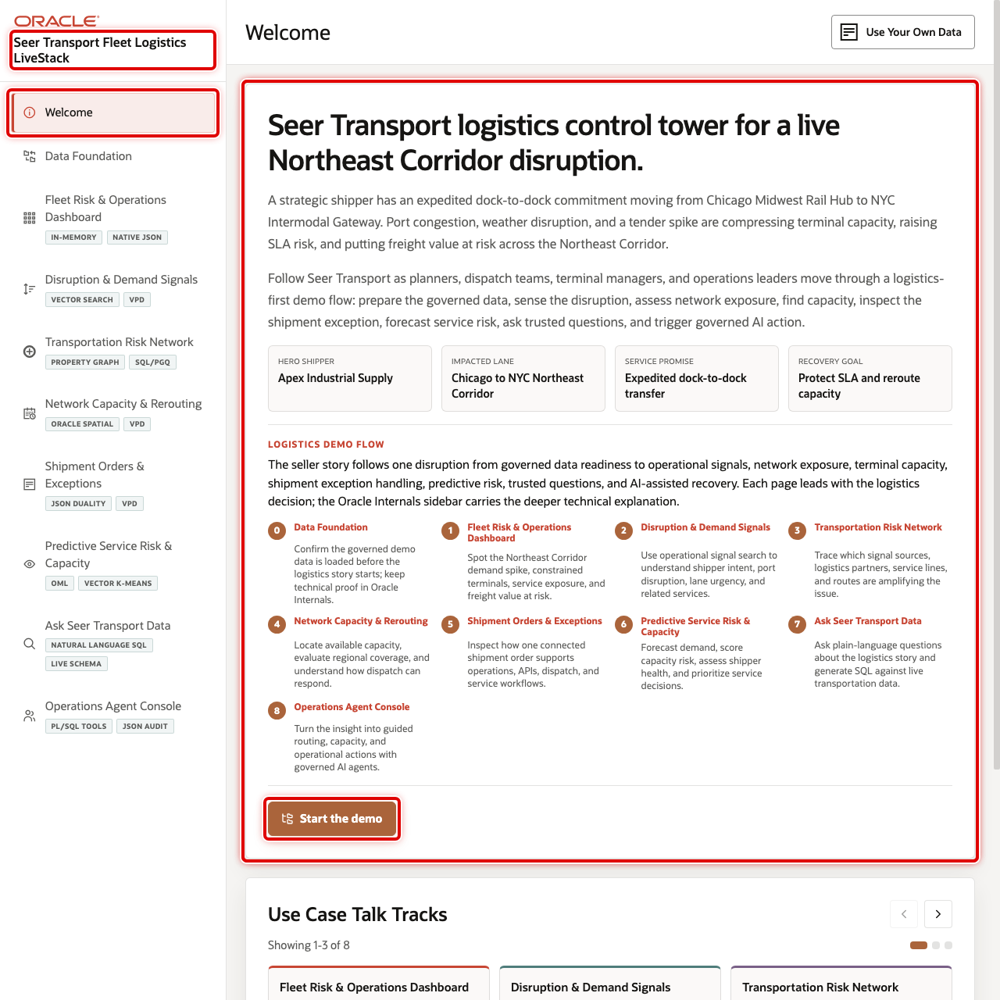

# Seer Transport Fleet Logistics LiveStack Guide

## Introduction

Transportation and logistics teams need to make faster decisions while shipment orders, terminal capacity, disruption signals, routes, service commitments, equipment constraints, and customer expectations are spread across many systems. The Seer Transport Fleet Logistics LiveStack shows how a transportation operator can bring those signals together, understand what needs attention, and move from insight to action with more confidence.

This runbook supports the Seer Transport Fleet Logistics LiveStack Demo. The demo shows how Oracle AI Database 26ai can help transportation teams bring those workloads together on one connected data foundation. Instead of splitting relational transactions, JSON documents, graph relationships, spatial analysis, vector search, machine learning, natural-language SQL, and AI agent workflows across separate systems, the LiveStack shows how those capabilities can work against the same governed Oracle data model.

In the demo, Seer Transport uses Oracle AI Database to connect transportation services, shipment orders, shippers, terminals, disruption and demand signals, risk networks, spatial routing, predictive analytics, conversational data access, and agent-assisted operations. The demo follows a logistics-first Northeast Corridor disruption thread: demand builds, shipper and port signals explain why, terminal capacity and shipment order views show how the business responds, and analytics, natural-language SQL, and AI agents help teams act from the same governed data foundation.

Estimated Demo Time: 90 minutes

Each scene is designed to take between 5 and 10 minutes.

### Objectives

In this LiveStack demo, you will see how a transportation operator can use connected data and AI-assisted workflows to identify disruption risk, protect shipment commitments, improve terminal and route decisions, and make analytics easier to use.

### Prerequisites

Before you begin, confirm that you can open the running Seer Transport Fleet Logistics LiveStack in a modern browser. No database or coding knowledge is required to follow the business workflow.

## Demo Flow

- Scene 1: Welcome and Demo Orientation.
- Scene 2: Data Foundation.
- Scene 3: Fleet Risk & Operations Dashboard.
- Scene 4: Disruption & Demand Signals.
- Scene 5: Transportation Risk Network.
- Scene 6: Network Capacity & Rerouting.
- Scene 7: Shipment Orders & Exceptions.
- Scene 8: Predictive Service Risk & Capacity.
- Scene 9: Ask Seer Transport Data.
- Scene 10: Operations Agent Console.

## Learn More

- [Oracle AI Database 26ai documentation](https://docs.oracle.com/en/database/oracle/oracle-database/26/index.html)
- [Oracle AI Agent Memory](https://www.oracle.com/database/ai-agent-memory/)
- [Oracle AI Vector Search](https://www.oracle.com/database/ai-vector-search/)
- Oracle Spatial and Graph documentation: [Oracle Spatial](https://docs.oracle.com/en/database/oracle/oracle-database/26/spatl/toc.htm) and [Oracle Property Graph](https://docs.oracle.com/en/database/oracle/property-graph/26.2/index.html)
- [Oracle Machine Learning for SQL documentation](https://docs.oracle.com/en/database/oracle/machine-learning/oml4sql/tasks.html)
- [Oracle REST Data Services documentation](https://docs.oracle.com/en/database/oracle/oracle-rest-data-services/25.4/orddg/index.html)
- [Oracle LiveLabs catalog](https://livelabs.oracle.com/)

## Credits & Build Notes
- **Author** - Oracle LiveLabs Team
- **Last Updated By/Date** - Oracle LiveLabs Team, 2026-05-29
