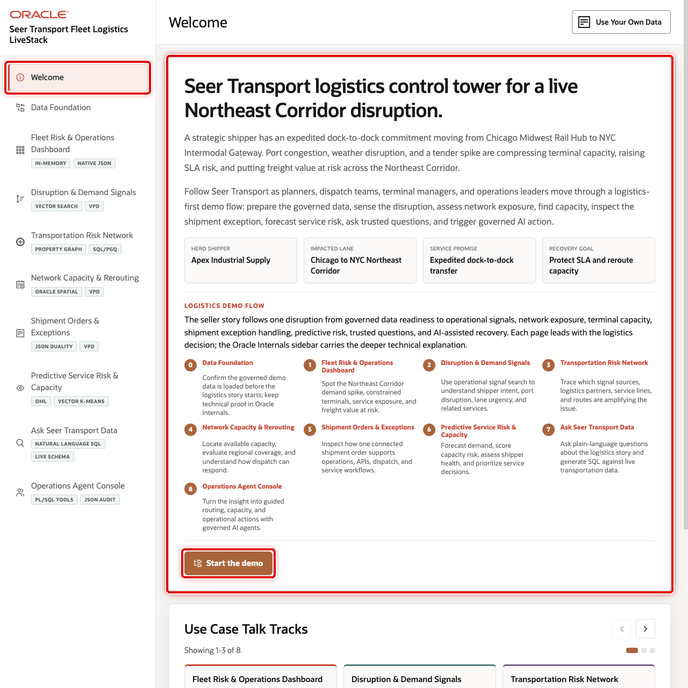

# Scene 1 Welcome and Demo Orientation

## Introduction

This opening scene orients users to the Seer Transport Fleet Logistics LiveStack Demo. The welcome page introduces the Northeast Corridor disruption story, identifies the hero shipper and impacted lane, and connects the left navigation to the operational journey that follows.

Estimated Time: 5 minutes

### Objectives

In this scene, you will learn what transportation decision the page supports, what evidence the user should inspect, and what action the business may take next.

## Task 1: Review the logistics story and demo journey

Review the welcome page first so the audience understands the full transportation journey. The page frames the demo around an expedited dock-to-dock commitment from Chicago Midwest Rail Hub to NYC Intermodal Gateway, with port congestion, weather disruption, and a tender spike compressing capacity.

1. Review the opening story at the top of the page.
2. Review the four scenario cards: **Hero shipper**, **Impacted lane**, **Service promise**, and **Recovery goal**.
3. Review the numbered demo journey. It connects the same disruption thread to data readiness, signals, network exposure, capacity, shipment exceptions, predictive risk, trusted questions, and AI-assisted action.
4. Review the visible use case tiles in **Use Case Talk Tracks**.
5. Click the right carousel arrow to move forward through the remaining use cases.
6. Use the left carousel arrow if you want to return to earlier tiles.

## Task 2: Continue the demo

1. Click **Start the demo**.
2. Confirm the demo moves to **Data Foundation**.

## Credits & Build Notes
- **Author** - Oracle LiveLabs Team
- **Last Updated By/Date** - Oracle LiveLabs Team, 2026-05-29
