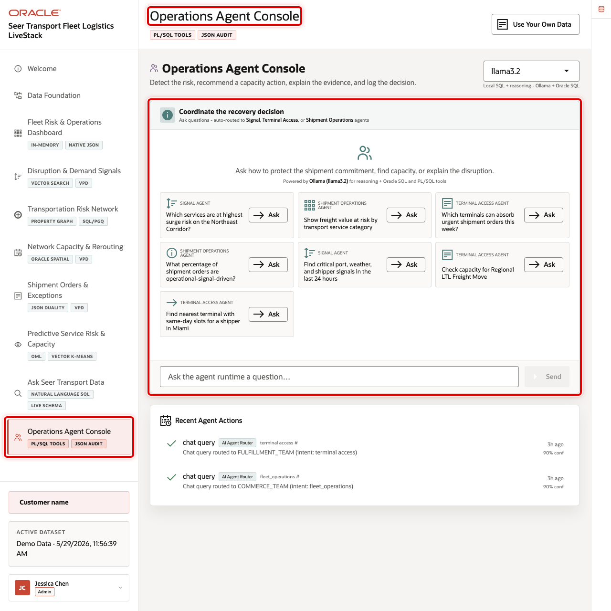
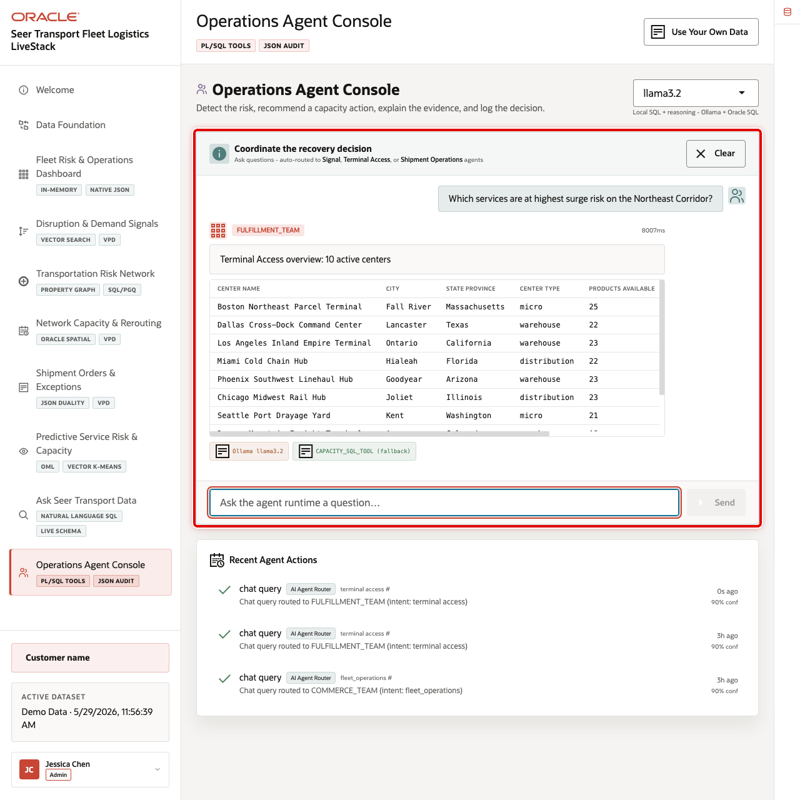
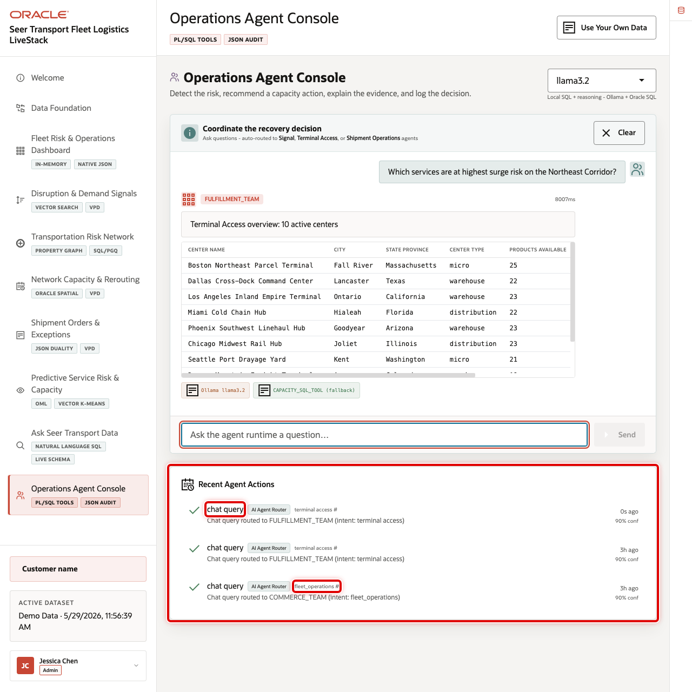

# Scene 10 Operations Agent Console

## Introduction

**Operations Agent Console** shows governed AI-assisted operations over the same transportation data foundation. It brings together runtime profile selection, example questions, chat responses, event history, action summaries, and auditable agent actions.

Transportation teams want AI assistance for capacity, route, and service decisions, but recommendations are useful only when they are grounded in trusted data and leave an audit trail. A chat answer that cannot be traced back to a workflow, data source, or action record is difficult to trust in a service-recovery decision.

Oracle AI Database helps by keeping operational data, SQL tools, PL/SQL actions, JSON audit records, and event history close to the same application workflow. In this scene, the user can ask an operational question, review the routed response, and inspect the action audit trail.

Estimated Time: 10 minutes

### Objectives

In this scene, you will learn what transportation decision the page supports, what evidence the user should inspect, and what action the business may take next.

## Task 1: Review the operations agent workspace

1. Click **Operations Agent Console** in the sidebar.
2. Review the active runtime profile selector.
3. Review the example questions for signal, terminal access, and shipment operations teams.
4. Review the action summary and recent action areas.

## Task 2: Run a logistics recovery question

Run an agent interaction to show how the console turns operational data into a recommendation or explanation.

1. Click the example question **Which services are at highest surge risk on the Northeast Corridor?**
2. Review the agent response, routed team, tool activity, and supporting data.
3. Use **Clear** if you want to reset the chat area before the next question.

The current demo has existing agent audit records for questions about Northeast Corridor surge risk and freight value at risk. Use those records to explain that the agent workflow is not only conversational; it also records work performed.

## Task 3: Interpret the operational story

Use the agent output as the final scene in the logistics journey.

1. Connect the response back to earlier scenes: dashboard KPIs, operational signals, capacity alerts, shipment orders, predictive demand, and Ask Data results.
2. Explain that a human operator can use the answer as a starting point, then open the source scene to inspect the underlying evidence.
3. Emphasize that the agent is part of the operational workflow, not a detached chatbot.

## Task 4: Review the agent action audit trail

1. Scroll to **Recent Agent Actions**.
2. Review the action type, routed team, confidence, status, and timestamp.
3. Focus on the **chat_query** rows for surge-risk or freight-value questions.
4. Explain that Oracle stores the action payload and execution status so the recommendation path remains reviewable.

## Credits & Build Notes
- **Author** - Oracle LiveLabs Team
- **Last Updated By/Date** - Oracle LiveLabs Team, 2026-05-29
