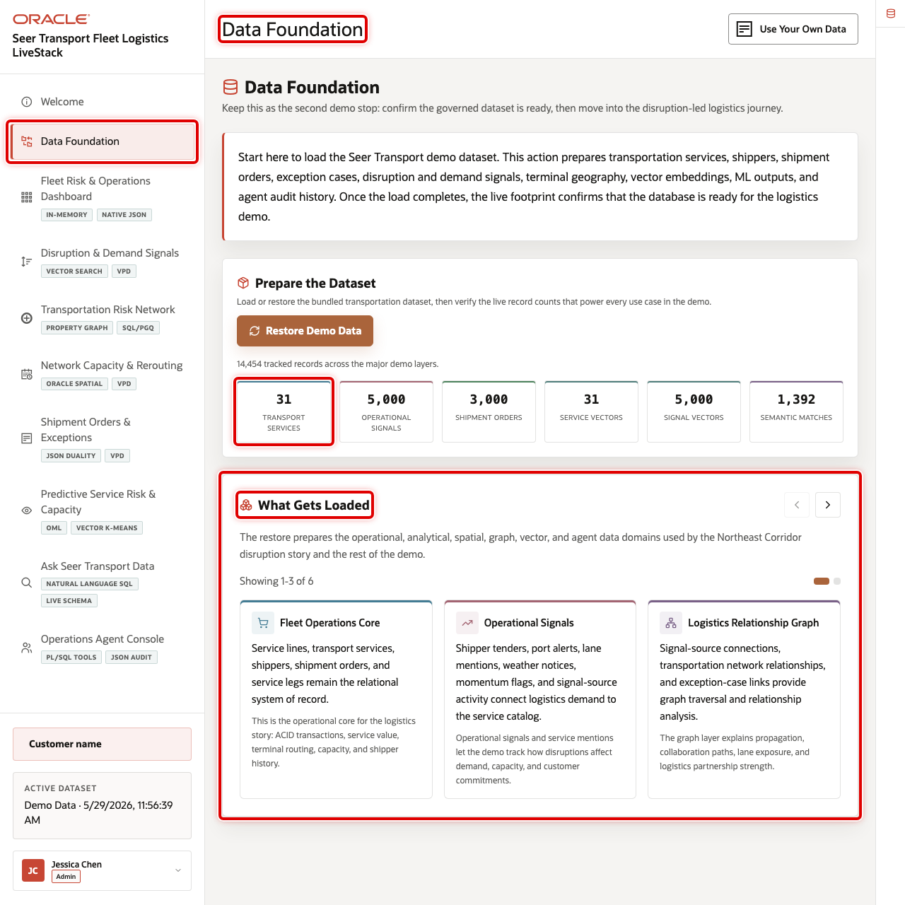

# Scene 2 Data Foundation

## Introduction

**Data Foundation** confirms that the governed demo dataset is loaded before the logistics story begins. It shows the transportation services, shippers, shipment orders, operational signals, terminal geography, vector embeddings, machine-learning outputs, and agent audit history that support every later scene.

Estimated Time: 5 minutes

### Objectives

In this scene, you will learn what transportation decision the page supports, what evidence the user should inspect, and what action the business may take next.

## Task 1: Prepare the dataset

Use this page to show that the demo is backed by live seeded data rather than static screenshots. In the current demo dataset, the live footprint includes **31** transportation services, **5,000** operational signals, **3,000** shipment orders, **12** logistics terminals, **360** demand forecasts, and **5,000** signal embeddings.

1. Click **Data Foundation** in the sidebar.
2. Review the dataset preparation panel.
3. Click **Load / Restore Demo Data** if the dataset needs to be refreshed.
4. Review the live footprint cards after the page finishes loading.

## Task 2: Review what gets loaded

1. Review the carousel of capability groups.
2. Use the right carousel arrow to move through fleet operations, operational signals, graph, spatial, JSON duality, predictive analytics, and agent capabilities.
3. Review the **How the Data Connects** section to show how each later scene uses the same governed Oracle data foundation.
4. Open Oracle Internals only after the business flow is clear. Use it to connect the visible logistics data to the database capabilities behind the page.

## Credits & Build Notes
- **Author** - Oracle LiveLabs Team
- **Last Updated By/Date** - Oracle LiveLabs Team, 2026-05-29
