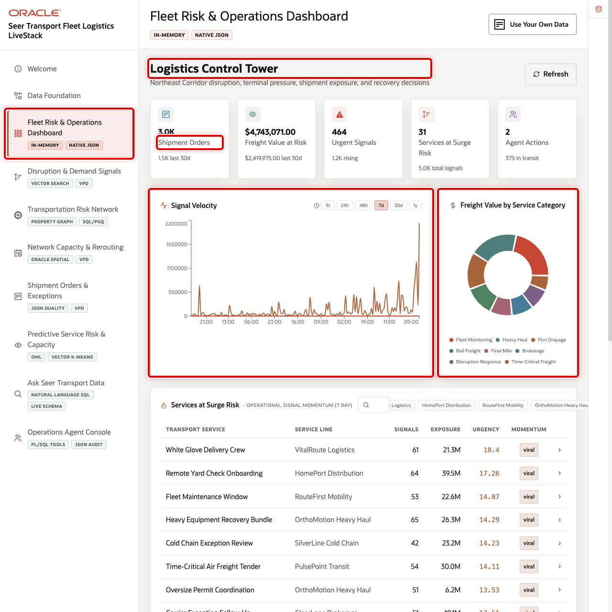
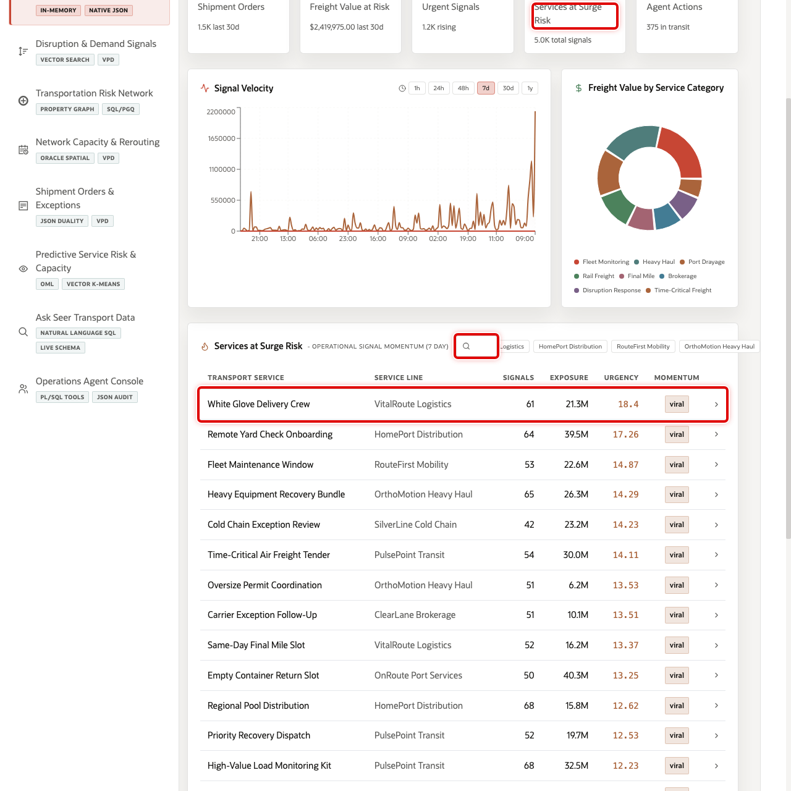
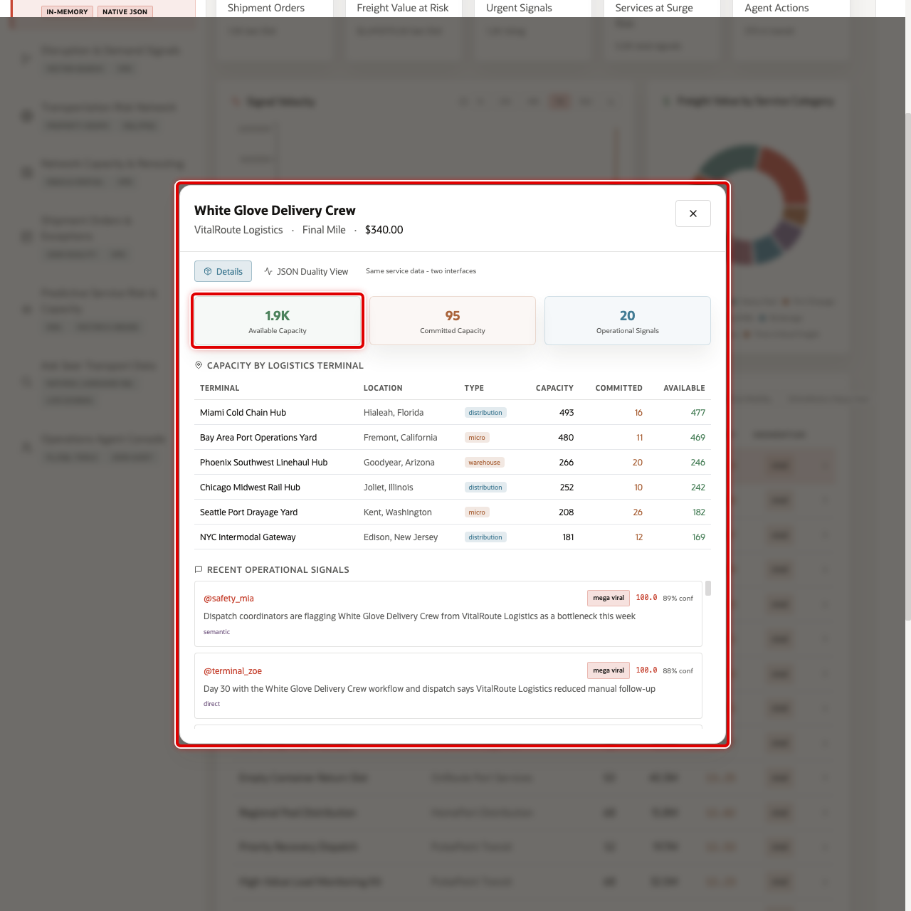
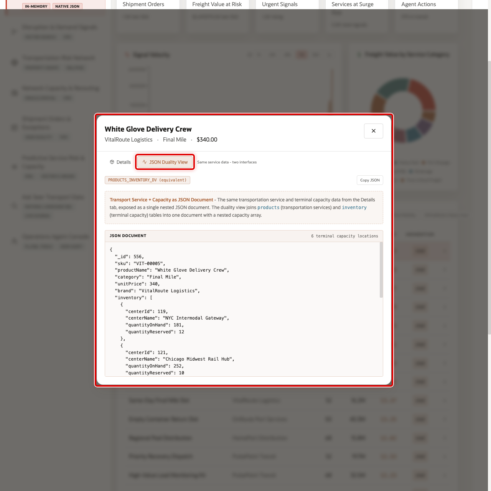

# Scene 3 Fleet Risk & Operations Dashboard

## Introduction

**Fleet Risk & Operations Dashboard** gives transportation leaders, dispatch planners, and service operations managers a daily view of the logistics network. It tracks shipment orders, freight value exposure, urgent operational signals, services at surge risk, in-transit shipments, signal velocity, category value, and service-level detail in one place.

This team must see shifts in demand, capacity, and service risk as they emerge, not after they become separate escalations. The dashboard helps leaders spot patterns early, act faster, and keep dispatch, terminal, and customer teams aligned around the same recovery decision.

Dashboards like this are difficult to implement when transportation data is split across order systems, fleet tools, terminal spreadsheets, social or partner signal feeds, and analytics pipelines. Oracle AI Database helps address that challenge by keeping operational, analytical, JSON, in-memory, and AI-ready data close to the same governed data foundation.

The **White Glove Delivery Crew** row gives the seller a clear opening example: demand is visible at the dashboard level and then traceable down to freight value, service category, signal exposure, and JSON application shape.

Estimated Time: 10 minutes

### Objectives

In this scene, you will learn what transportation decision the page supports, what evidence the user should inspect, and what action the business may take next.

## Task 1: Review the control tower dashboard

Use the dashboard as a triage view. In the current demo dataset, the opening KPI row shows **3,000** shipment orders, about **$4.7M** in freight value at risk, **464** urgent signals, **31** services at surge risk, and **375** shipments in transit.

1. Click **Fleet Risk & Operations Dashboard** in the sidebar.
2. Review the KPI cards across the top of the page.
3. Review **Signal Velocity** to see the rate and intensity of operational signals.
4. Review **Freight Value by Service Category** to see where value exposure is concentrated.
5. Review Oracle Internals after the business flow is clear. Use it to connect the visible logistics outcome to the database capabilities behind the page.

## Task 2: Review services at surge risk

The table helps the user move from dashboard-level signals to service-level evidence. In the current demo dataset, **White Glove Delivery Crew** appears as a leading VitalRoute Logistics service with **61** recent mentions, more than **21M** views, and **viral** peak momentum.

1. Scroll to **Services at Surge Risk**.
2. Review the service rows. The table ranks services by recent operational signal momentum and shows service name, service line, mentions, views, average urgency, and signal label.
3. Use the search field or service-line chips if you want to narrow the table.
4. Click the **White Glove Delivery Crew** row.

## Task 3: Inspect the service detail modal

Open the service detail modal to connect demand momentum with operational readiness. The user can see whether the selected service has enough terminal capacity and whether recent signals support further action.

After you click **White Glove Delivery Crew**, the detail modal opens. The default **Details** view shows the selected service, VitalRoute Logistics service line, Final Mile category, contract rate, terminal capacity locations, and operational signal evidence.

## Task 4: Review the JSON Duality View

Review the JSON Duality View to show that the same trusted service and capacity data can support different users. Business users see service details in the interface, while applications can use the same information as a structured document.

1. In the service modal, click **JSON Duality View**.
2. Review the JSON document that represents the selected transportation service and terminal capacity data.

You can move to the next scene.

## Credits & Build Notes
- **Author** - Oracle LiveLabs Team
- **Last Updated By/Date** - Oracle LiveLabs Team, 2026-05-29
