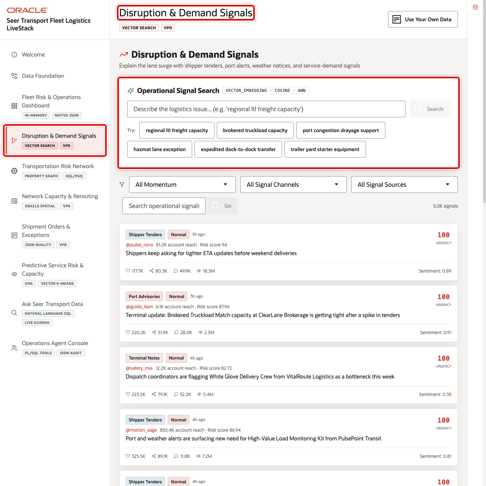
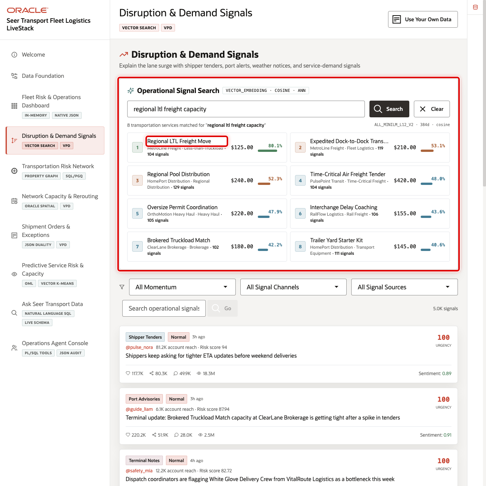
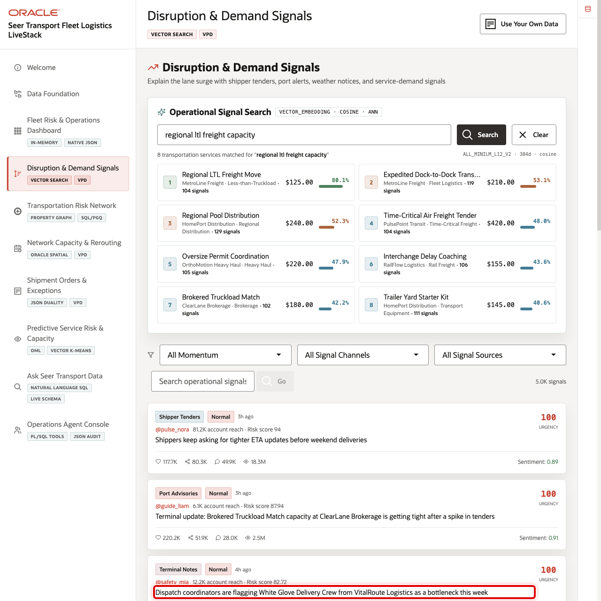
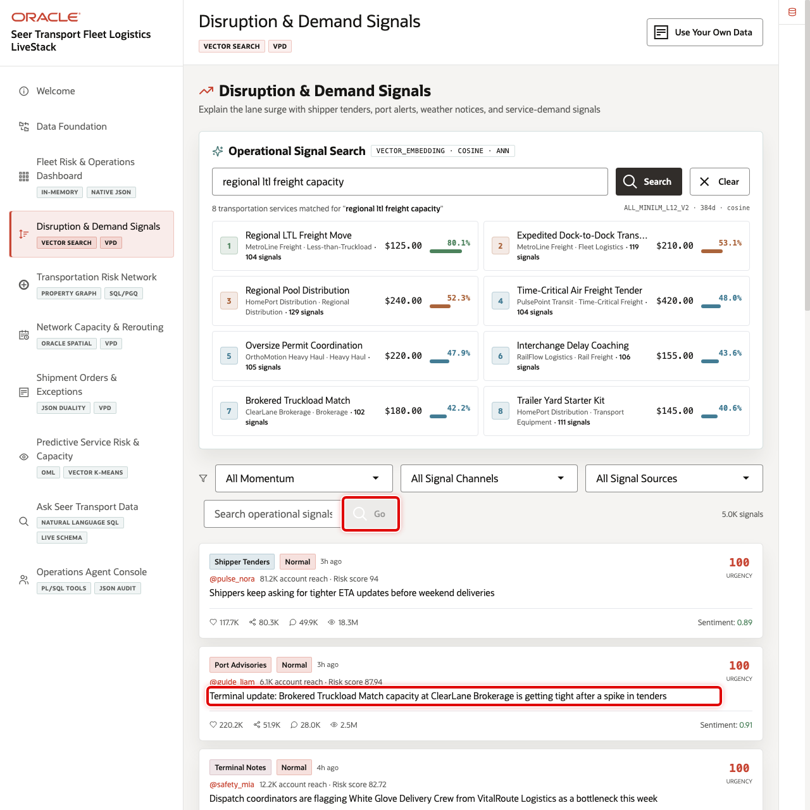

# Scene 4 Disruption & Demand Signals

## Introduction

**Disruption & Demand Signals** helps transportation planners explain why a surge is happening. The page combines semantic service discovery with operational signal intelligence from shipper tenders, port advisories, partner updates, weather notices, and lane-pressure indicators.

Transportation teams often receive signals faster than they can classify them. A terminal note, port advisory, or shipper tender may indicate real demand pressure, but it is difficult to connect that text to the affected services, regions, shippers, or terminals when signal data is outside the operational system.

Oracle AI Database helps by keeping vectors, signal text, service metadata, and row-level security close to the same governed data foundation. In this scene, operators can search in plain language, review ranked semantic matches, filter operational signals, and inspect the evidence that explains a service surge.

Estimated Time: 10 minutes

### Objectives

In this scene, you will learn what transportation decision the page supports, what evidence the user should inspect, and what action the business may take next.

## Task 1: Review the signal intelligence workspace

1. Click **Disruption & Demand Signals** in the sidebar.
2. Review **Operational Signal Search** and the available example query buttons.
3. Review the signal filters for momentum, channel, and signal source.
4. Review the operational signal feed.

## Task 2: Run operational service discovery

Use semantic search to show that planners can describe a logistics need without knowing the exact service name.

1. In **Operational Signal Search**, enter `regional ltl freight capacity`.
2. Click **Search**.
3. Review the ranked services, similarity percentages, service lines, categories, and contract rates.
4. Point out that Oracle AI Vector Search can return relevant transportation services even when the search phrase is not an exact product name.

## Task 3: Review operational signal evidence

Use the feed to connect demand movement to real signal evidence. In the current demo dataset, recent signals include tight ETA requests, terminal updates, and a **White Glove Delivery Crew** bottleneck alert.

1. Use the momentum filter to focus the feed on urgent or critical signals.
2. Use the signal channel filter to narrow the feed if needed.
3. Review signal text, urgency, reach, source, and affected service details.

## Task 4: Run a signal evidence query

Run a text search to show how the signal feed can answer a focused operational question.

1. In **Search posts by embedding**, enter `terminal capacity delay`.
2. Click **Go**.
3. Review the returned signal rows and match percentages.
4. Use the results to explain which operational signals should be investigated before they turn into missed service commitments.

You can move to the next scene.

## Credits & Build Notes
- **Author** - Oracle LiveLabs Team
- **Last Updated By/Date** - Oracle LiveLabs Team, 2026-05-29
