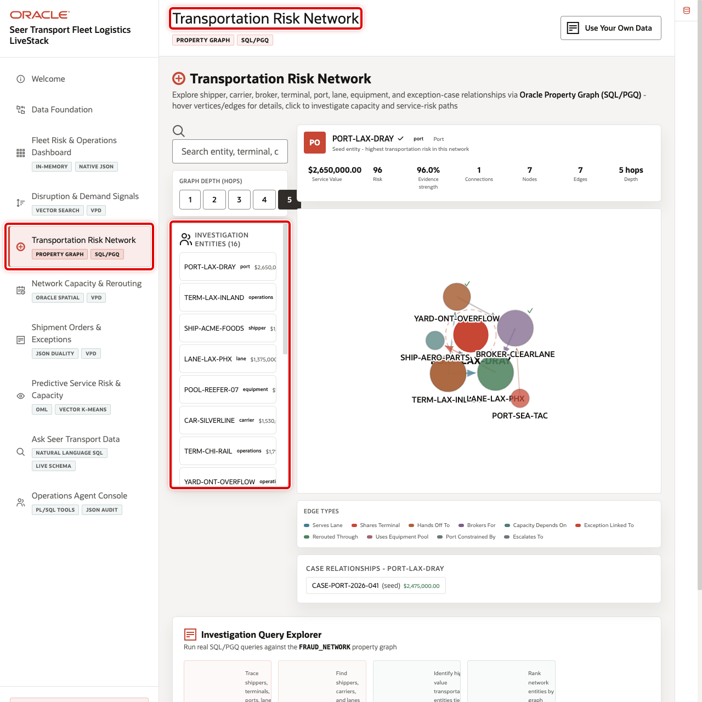
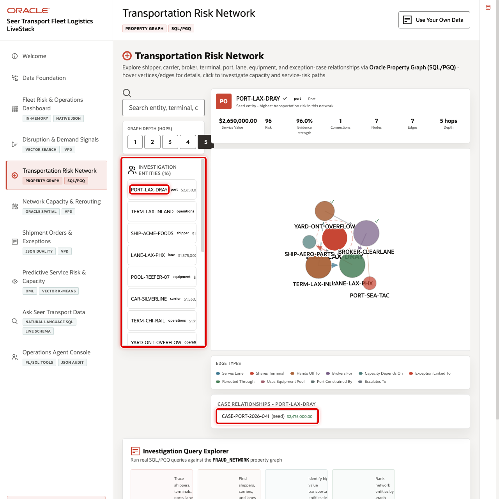
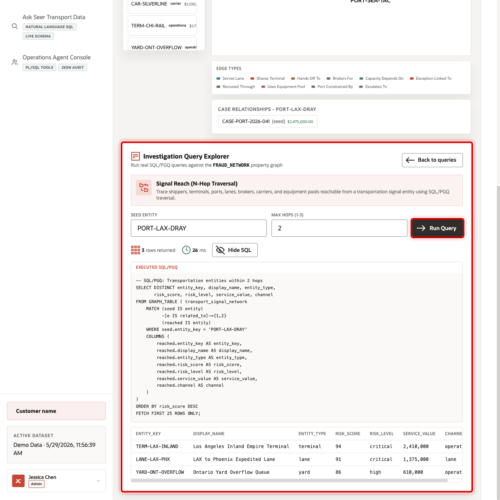

# Scene 5 Transportation Risk Network

## Introduction

**Transportation Risk Network** helps operations teams trace how disruption risk propagates across shippers, terminals, ports, carriers, routes, yards, equipment pools, and exception cases. It turns isolated signal evidence into a relationship view that can explain why one disruption affects multiple services.

Flat tables can show a delayed shipment or a constrained terminal, but they do not easily explain how that problem connects to carrier partners, shared terminals, lanes, equipment pools, or open exception cases. Transportation teams need a way to follow those relationships without rebuilding a network model outside the operational database.

Oracle AI Database helps by supporting graph-style relationship analysis against the same governed transportation data. In this scene, the user can inspect a default risk network, select a transportation entity, and run graph query examples that reveal influence, shared dependency, and exception propagation.

Estimated Time: 10 minutes

### Objectives

In this scene, you will learn what transportation decision the page supports, what evidence the user should inspect, and what action the business may take next.

## Task 1: Review the risk network workspace

1. Click **Transportation Risk Network** in the sidebar.
2. Review the graph visualization and the list of investigation entities.
3. Review the selected entity details. In the current demo dataset, **PORT-LAX-DRAY** is a critical port entity with a **96** risk score, **96%** evidence strength, and **$2.65M** in service value.
4. Change the graph depth control if you want to reveal more connected relationships.

## Task 2: Inspect the selected network data point

Use the selected entity details to make the graph concrete. The data point should show a named port, terminal, shipper, route, or carrier rather than a generic node.

1. Select **PORT-LAX-DRAY** or another visible critical entity.
2. Review its risk score, entity type, evidence strength, connection count, hop depth, and case relationships.
3. Explain how a constrained port or terminal can affect lanes, carriers, and shipment commitments downstream.

## Task 3: Run a graph query example

Run a graph query example to show that the visible network is backed by queryable relationship data rather than a static diagram.

1. Open the graph query examples area.
2. Select a query such as influence reach, mutual connections, or community hub detection.
3. Click the run action for the selected query.
4. Review the result table and connect the returned rows to the graph view.

You can move to the next scene.

## Credits & Build Notes
- **Author** - Oracle LiveLabs Team
- **Last Updated By/Date** - Oracle LiveLabs Team, 2026-05-29
