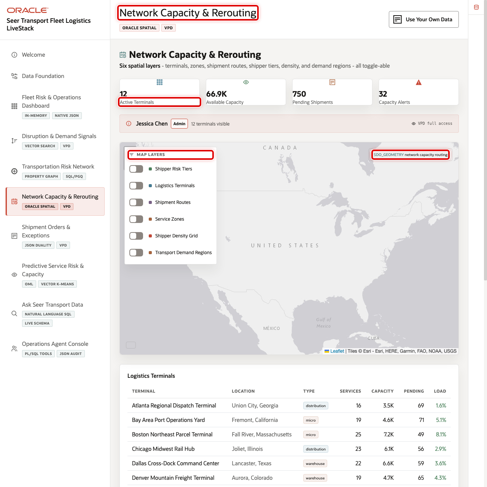
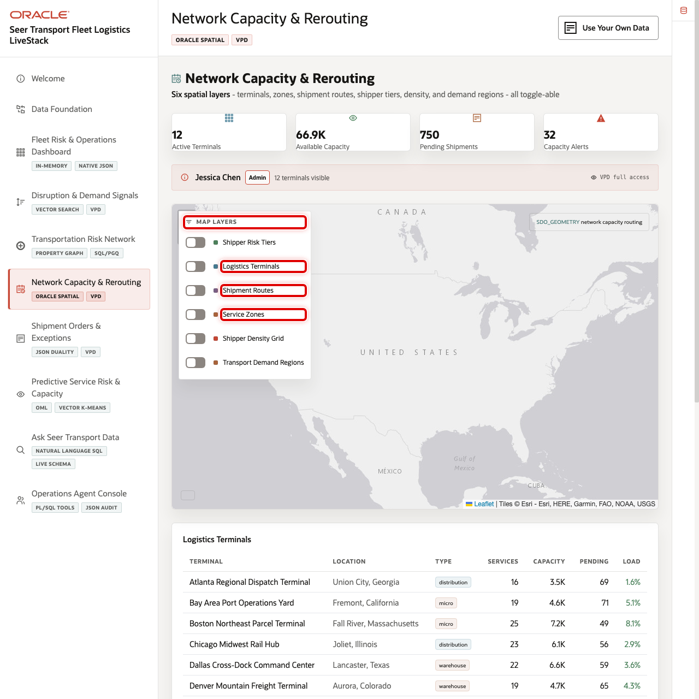
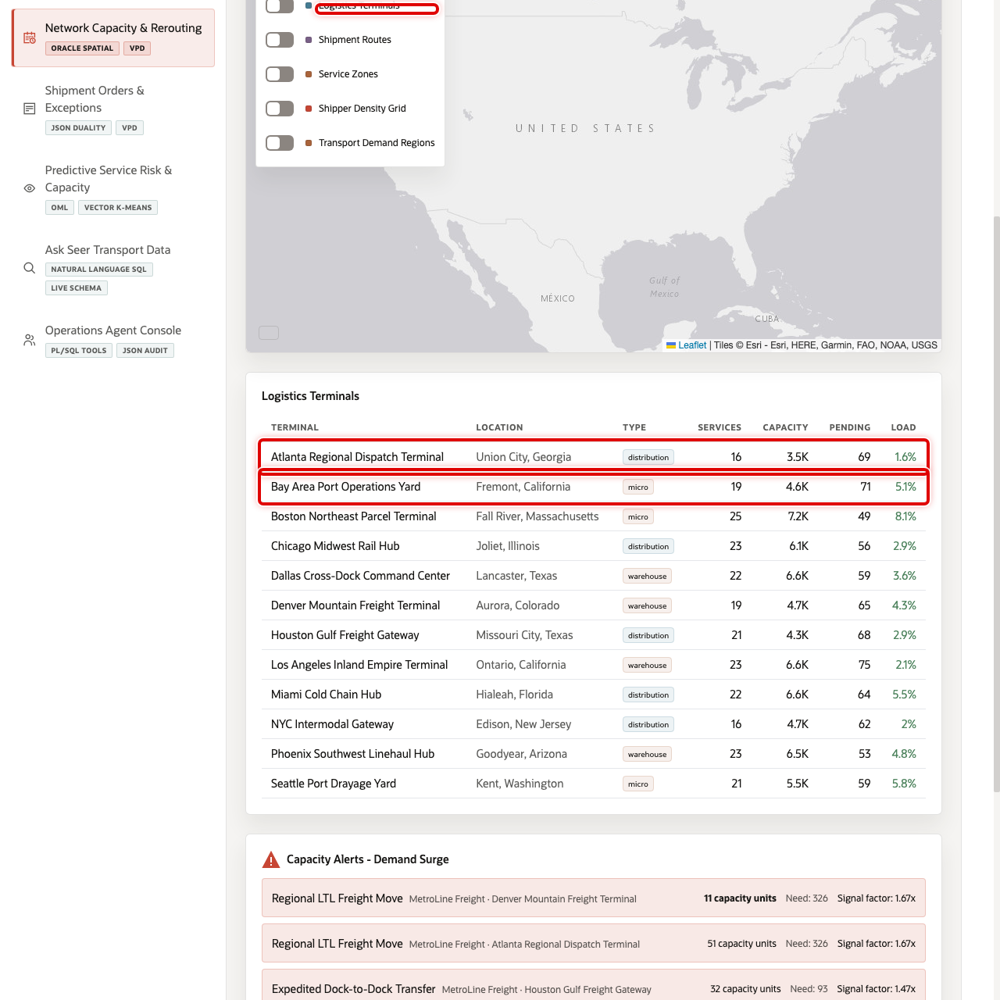
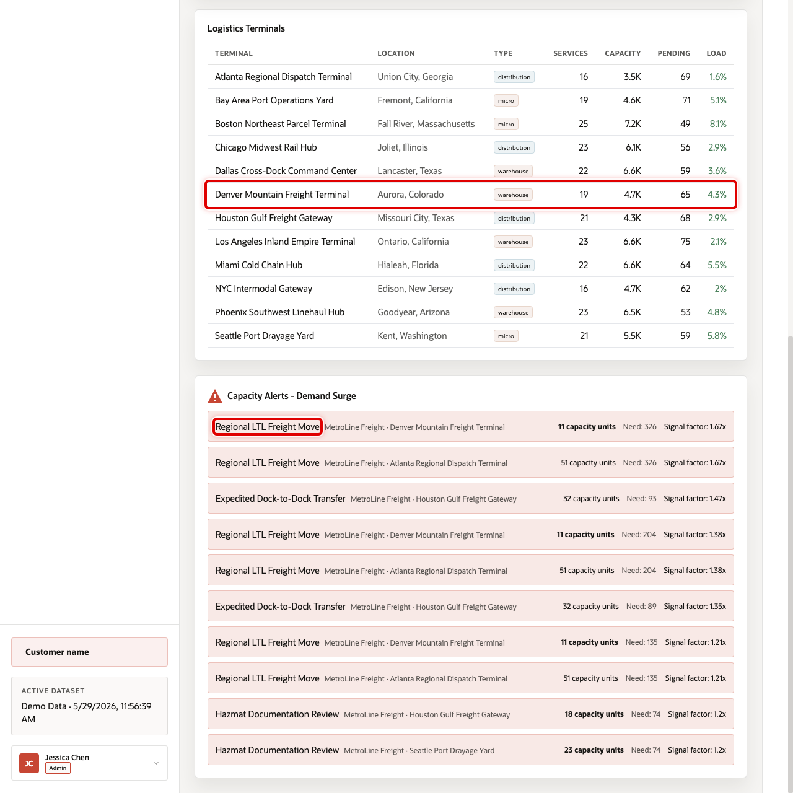

# Scene 6 Network Capacity & Rerouting

## Introduction

**Network Capacity & Rerouting** helps dispatch planners, terminal managers, and network operations teams decide where the logistics network can absorb overflow. It combines terminal coverage, service zones, shipment routes, shipper density, demand regions, capacity alerts, and spatial context in one map-driven workspace.

Transportation capacity decisions depend on geography. A planner needs to know which terminal is close enough, whether a service zone covers the affected customer, which lanes are under pressure, and whether a terminal has enough available capacity. These questions are difficult when maps, capacity tables, and demand forecasts live in separate systems.

Oracle AI Database helps by keeping spatial geometry, terminal capacity, shipment routes, demand forecasts, and operational tables together. In this scene, users can toggle spatial layers, isolate a single shipment route, inspect terminal load, and investigate capacity alerts without leaving the application.

Estimated Time: 10 minutes

### Objectives

In this scene, you will learn what transportation decision the page supports, what evidence the user should inspect, and what action the business may take next.

## Task 1: Review the network capacity context

1. Click **Network Capacity & Rerouting** in the sidebar.
2. Review the KPI cards for active terminals, available capacity, pending shipments, and capacity alerts.
3. Review the map and confirm that Oracle Internals is collapsed unless you are explaining the technical implementation.

## Task 2: Explore spatial demand and service coverage

Use the map layers to show that terminal routing decisions can combine coverage, demand, and route context.

1. Turn on **Logistics Terminals**.
2. Turn on **Service Zones** and compare coverage areas.
3. Turn on **Shipment Routes**. Use the **Shipment Route** selector in the map layer panel to isolate one route when overlapping lines make the full route set hard to read.
4. Turn on **Shipper Density Grid** and **Transport Demand Regions**.
5. Hover over or click a map item to inspect the operational details, including carrier, order, origin terminal, destination, distance, and status for a focused route.

## Task 3: Inspect terminal capacity rows

Use the terminal table to connect the map to operational capacity. In the current demo dataset, **Atlanta Regional Dispatch Terminal** shows **3,503** units, **69** pending shipments, and **1.6%** current load, while **Bay Area Port Operations Yard** shows **4,611** units and **71** pending shipments.

1. Scroll to **Logistics Terminals**.
2. Review terminal name, location, type, available capacity, pending shipments, and load percentage.
3. Compare at least two terminals before making a routing recommendation.

## Task 4: Investigate a capacity alert

Capacity alerts show where predicted demand may exceed available capacity. In the current demo dataset, **Regional LTL Freight Move** at **Denver Mountain Freight Terminal** is critical, with **11** units on hand, predicted demand above **300** in one forecast row, and freight value at risk.

1. Scroll to **Capacity Alerts**.
2. Review the affected service, terminal, capacity, predicted demand, signal factor, and value at risk.
3. Explain how a dispatcher could use the alert to reroute work, reserve capacity, or escalate the service commitment.

You can move to the next scene.

## Credits & Build Notes
- **Author** - Oracle LiveLabs Team
- **Last Updated By/Date** - Oracle LiveLabs Team, 2026-06-09
